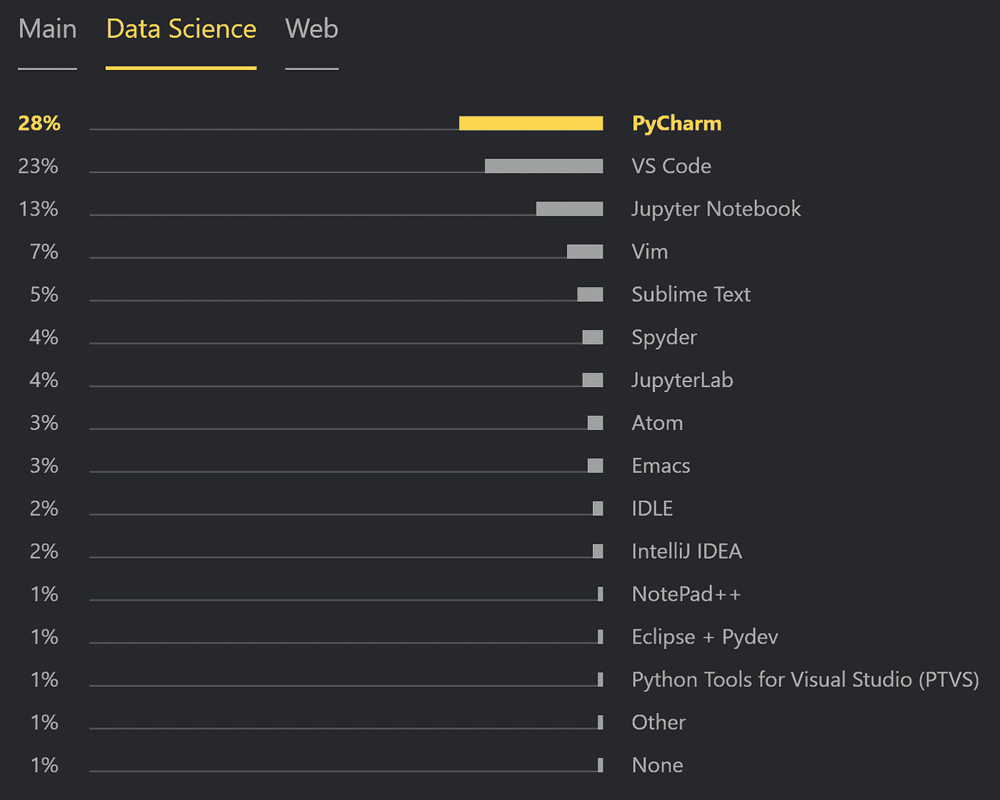
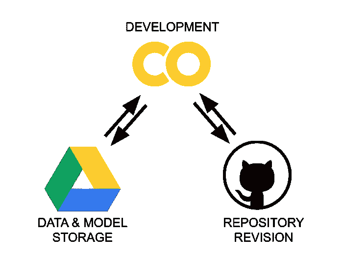
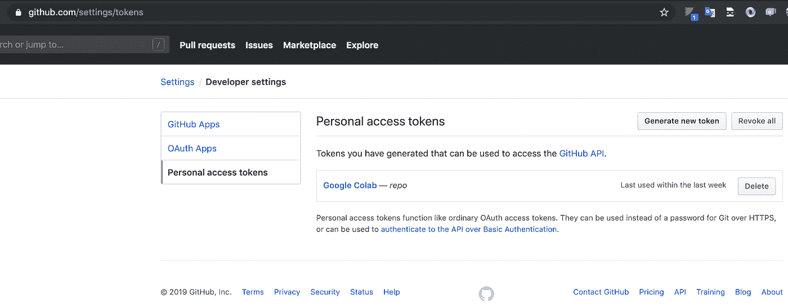
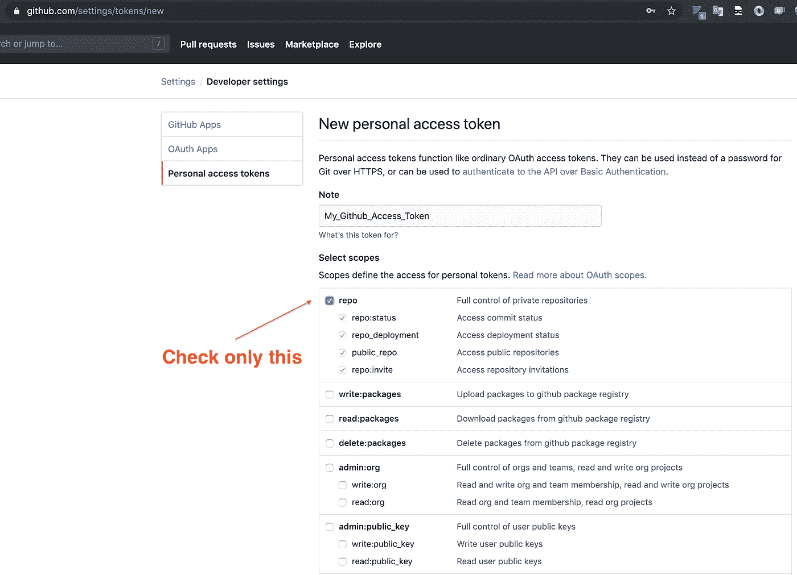
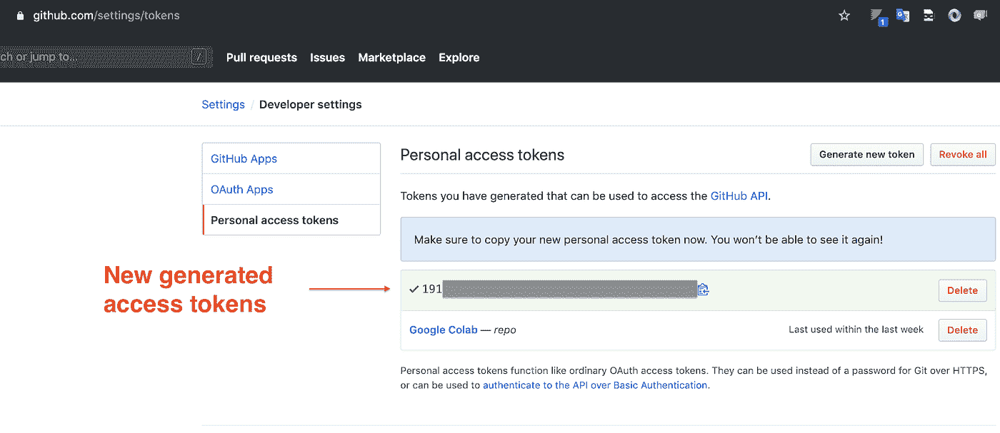

# 交互式项目的 Python 工作流(Colab + Github + Drive)。Kaggle 用例。

> 原文：<https://medium.com/analytics-vidhya/python-workflow-for-interactive-projects-colab-github-drive-kaggle-use-case-92252ce575e2?source=collection_archive---------13----------------------->

## 为您的 Jupyter 笔记本电脑利用免费的云资源

**Jupyter 笔记本**已经成为数据科学中 Python 开发最常用的工具之一[1]。由于其用户友好的界面和交互式计算环境，它们受到许多数据科学家的高度青睐。

图片来自 [JetBrains](https://www.jetbrains.com/lp/python-developers-survey-2019/)

自 2014 年以来，Project Jupyter 一直提供 100%开源软件，以便让每个人都能使用 Jupyter 笔记本电脑[2]。然而，这些笔记本电脑有局限性:

*   **Jupyter 笔记本运行在你的本地机器上**，让你的计算能力完全依赖于你电脑的 CPU/GPU/RAM/等。规格。虽然大多数笔记本电脑对于一个人在开始从事数据科学时遇到的基本任务来说绰绰有余，但一旦你开始在本地机器上执行机器学习任务(特别是深度学习)，你可能会很快遇到障碍。
*   Jupyter 笔记本本身没有版本控制。您可以将您的 Jupyter 笔记本升级到 JupyterLab，并从那里安装扩展@jupyterlab/github 和@jupyterlab/git。我以前也用过，但今天我将向您展示一个更好的选择。

# Google Drive + Google Colab + GitHub

为了克服上述限制，我们将使用以下组合:

*   **Google Colab:**co laboratory 是一个免费的 Jupyter 笔记本环境，运行在云中，将笔记本存储在 Google Drive 上。也就是说，我们将使用 Google Colab 来开发我们的 Jupyter 笔记本，而不依赖于我们笔记本电脑的计算能力。它还可以用作 shell 来运行 bash 和 git 命令。
*   **Google Drive:** 当我们使用 Google Colab 时，代码是在我们 Google 账户私有的虚拟机中执行的。这些虚拟机在空闲一段时间后会被删除，最长生存期为 12 小时。因此，把我们的作品存放在那里并不理想，因为它最终会丢失。我们在此提出的解决方案是将您的输出(重量、csvs)存储在云存储托管中。众所周知，Google Drive 是谷歌提供的云存储。它提供 15 GB 的免费存储空间，是使用 Colab 时的默认存储系统。
*   **GitHub:** 一个版本控制和协作的代码托管平台。即使在使用 Jupyter 笔记本时，使用版本控制和分支策略也是一个很好的实践。

我们基础设施的三个部分

## 其他基于云的笔记本服务

Google Colab 并不是 Jupyter 笔记本唯一的免费云服务。这些是与我最相关的:

*   谷歌联合实验室
*   Kaggle 内核
*   微软 Azure 笔记本电脑
*   数据资料
*   粘合剂
*   可可

所有这些都是完全免费的，它们不需要你在本地机器上安装任何东西，它们给你提供了一个类似 Jupyter 的环境。

我个人喜欢 Colab 是因为以下几点:

*   GPU 往往包括 Nvidia K80s，T4s，P4s，P100s。它们的可用性随时间而变化。[3]
*   TPU v2–8[4]
*   怠速切断 90 分钟
*   最多 12 小时

另一方面，我们也有 Kaggle 内核[5]:

*   英伟达特斯拉 P100 GPU
*   TPU v3–8
*   怠速停机 60 分钟
*   使用 GPU 最多 9 小时
*   使用 TPU 最多 3 小时

因为我是 Kaggle 竞赛的积极参与者，所以我总是将两者结合起来。这可以使用功能切换来轻松管理。稍后会详细介绍。

# 设置工作流

在本节中，我将指导您完成配置工作流必须完成的不同步骤。首先，我假设你已经有了一个 Goggle 和 Github 帐户，并且你对它们很熟悉。否则，您将无法完成该过程。如果您准备好了，只需使用您的 Google 帐户创建一个 Google 协作笔记本。您将不得不一步一步地复制以下代码片段作为单元格。

## 1.特征切换和路径

上面的代码片段定义了我们将根据用例激活或停用的特性切换。它有几个，因为我试图使它尽可能普遍。

如你所见，我将使用我的私人知识库 osic-肺纤维化-进展作为例子。您应该输入您感兴趣的公共或私有存储库的名称。文件名也是如此。

请注意，可以取消激活 COLAB 和 KAGGLE 切换。如果我们想使用我们的 IDE 或首选编辑器(例如 PyCharm)在本地运行笔记本，应该这样做。这在某些情况下是有益的。我会在文章的最后对此做更多的评论。

## 2.用 Google Colab 链接个人 Google Drive 存储

在这里，我们将 Google Drive 安装到 Colab。挂载是操作系统通过计算机的文件系统向用户提供存储服务(Google Drive)的文件和目录的过程。为此，我们需要验证我们的帐户。请注意，我们可以挂载一个不同于运行 Google Colab 的 Google 帐户的 Google Drive 帐户。

如果看到“挂载在/content/drive”，说明 Google Drive 挂载成功。之后，您应该能够在 Colab 文件浏览器中找到一个名为 gdrive 的新目录。

## 3.将 GitHub 存储库克隆到 Colab 运行时系统

这里，我们将 GitHub 存储库克隆到启动 Colab 会话时启动的个人虚拟机。请记住，它的最大生存期为 12 小时。

注意，如果要克隆的 GitHub 库是私有的，我们需要传递一些凭证。为了保证凭证对公众安全(我们不希望每个人都能访问我们的私有存储库)，我们将把它们存储在我们的私有 Google Drive 帐户的一个文件(git.json)中。这样，如果您可以访问 Google Drive 帐户，则只有在 Colab 会话期间才能访问凭据。

**如何生成我们的凭证文件**

转到您的 Google Drive 帐户。创建名为 Git 的目录。在该目录中创建一个名为 git.json 的文件。该文件需要如下所示:

如果您没有 GitHub 访问令牌，请按如下方式生成它:

进入右上角的用户资料→点击设置→然后选择开发者设置。

将凭证替换到 git.json 文件中。

准备好凭证后，您应该能够成功地克隆存储库。如果是这样的话，一旦您执行了这个单元，您将会在 Colab 文件浏览器中找到一个以存储库名称命名的新目录。

我们还可以在 Google Drive 上克隆我们的存储库。如果您愿意这样做，只需取消特性切换片段中提到的代码行的注释即可。按照第二个选项，你可以同步保存你的修改。然而，我更喜欢将我的更改推送到 GitHub，并在每个会话中克隆存储库。如果您还使用 IDE 在本地运行笔记本，这将变得更加实用。

如果您想在本地运行笔记本，您需要复制我们在您的主目录中生成的 git.json 文件。

## 4.Kaggle API 设置

(如果不打算使用 Kaggle，则没有必要)

与上一步类似，这里我们传递 Kaggle 的凭证，以便使用它的 API。

转到您的 Google Drive 帐户。创建一个名为 Kaggle 的目录。在这个目录中创建一个名为 kaggle.json 的文件。

如果您没有 Kaggle API 令牌，请按如下方式生成它[6]:

登录您的 Kaggle 帐户。在网站标题中，点击您的用户资料图片，然后在下拉菜单中点击“我的帐户”。这将带你到你在 https://www.kaggle.com/account 的[账户设置。向下滚动到页面中标有 API 的部分。要创建新令牌，请单击“创建新 API 令牌”按钮。这将下载一个新的认证令牌到您的机器上。](https://www.kaggle.com/)

将凭证替换到 kaggle.json 文件中。

如果您想在本地运行笔记本，您需要复制我们在您的主目录中生成的 kaggle.json 文件。

## 5.使用 Kaggle API 下载比赛数据

(如果不打算使用 Kaggle，则没有必要)

这里，我们在 VM 内部创建一个名为 input 的新目录，并下载所请求的比赛数据。请注意，数据存储在 Colab 运行时系统中，因此它不会占用您的驱动器空间。

如您所见，这里我重用了 GIT_REPOSITORY 名称来下载数据。这是因为我的知识库被称为“osic-肺纤维化-进展”。如果不是这种情况，只需用竞赛网页上的原始 Kaggle API 命令替换这些行。

如果成功，我们应该会在克隆的存储库中看到一个名为 input 的新目录，以及存储在其中的所有数据。

请记住，您不希望将输入文件夹推入 GitHub，所以您应该有一个包含 input/的. gitignore 文件。

## 6.将更改保存到 GitHub

请记住，我们可以从这里运行所有 git 命令。因此，我们可以将保存到 GitHub 的过程自动化。

请注意，文件名应该与笔记本的名称一致。尽管这很有用，但我通常不使用它，除非我需要让我的整个管道运行，并希望在运行后保存更改。另一种方法是使用 Colab 中的工具直接保存它:转到文件，然后在 GitHub 中保存一个副本。这将提交并将您的更改推送到 GitHub。

# 工作流程

现在我们已经设置好了一切，让我简单描述一下我的工作流通常是什么样子:

*   创建存储库。
*   从 Colab 开始一个新笔记本。
*   复制粘贴所有提到的单元格。
*   配置功能开关和常量。
*   在笔记本上工作。
*   持续保存对 GitHub 的更改。

在那之后，

*   一旦我再次开始一个会话，使用 Colab 工具栏从 GitHub 上传笔记本。
*   如果我需要调试，我在本地克隆 repo，用我喜欢的 IDE (PyCharm)打开笔记本。

# 参考

[1]《Python 开发者调查 2019 结果》。喷气大脑。[https://www.jetbrains.com/lp/python-developers-survey-2019/](https://www.jetbrains.com/lp/python-developers-survey-2019/)。

[2]朱庇特项目。https://jupyter.org/about[。](https://jupyter.org/about)

[3]谷歌。[https://research . Google . com/co laboratory/FAQ . html # GPU-可用性](https://research.google.com/colaboratory/faq.html#gpu-availability)。

[4]谷歌。[https://cloud.google.com/tpu/docs/tpus](https://cloud.google.com/tpu/docs/tpus)。

[5]卡格尔。[https://www.kaggle.com/docs/notebooks](https://www.kaggle.com/docs/notebooks)。

[6]卡格尔。[https://www.kaggle.com/docs/api](https://www.kaggle.com/docs/api)。