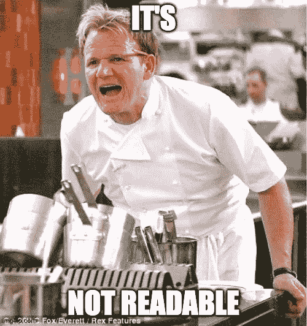

# 6 很多人可能不知道的 Python3“秘密”

> 原文：<https://medium.com/analytics-vidhya/python3-secrets-not-many-know-about-34899f54b23d?source=collection_archive---------23----------------------->

## 你真的了解 python 吗？


克里斯里德在 [Unsplash](https://unsplash.com?utm_source=medium&utm_medium=referral) 上的照片

Python 是一种很棒的编程语言。很多人用它来自动化任务、编写应用、制作机器学习模型、解析 JSON 等。它很受欢迎，因为它容易阅读和理解。

> **Python**是一种[解释的](https://en.wikipedia.org/wiki/Interpreted_language)、[高级](https://en.wikipedia.org/wiki/High-level_programming_language)、[通用](https://en.wikipedia.org/wiki/General-purpose_programming_language)、[编程语言](https://en.wikipedia.org/wiki/Programming_language)。由[吉多·范·罗苏姆](https://en.wikipedia.org/wiki/Guido_van_Rossum)创建并于 1991 年首次发布，Python 的设计理念强调[代码可读性](https://en.wikipedia.org/wiki/Code_readability)，并显著使用了[重要空格](https://en.wikipedia.org/wiki/Off-side_rule)。它的[语言结构](https://en.wikipedia.org/wiki/Language_construct)和[面向对象](https://en.wikipedia.org/wiki/Object-oriented_programming)方法旨在帮助[程序员](https://en.wikipedia.org/wiki/Programmers)为小型和大型项目编写清晰、有逻辑的代码。”
> 
> —维基百科

但是你以为你了解 python 的一切吗？你认为你知道所有的语法吗？你以为没有别的会让你惊讶吗？

**在这篇文章**(我的第一篇文章🥳)中，我将谈论一些 python，具体来说是 [*CPython3.8*](https://www.python.org/downloads/) ，‘秘密’连我以前都不知道。其中一些可能会使你的程序更具可读性；其中一些可能**会**你的程序**更快**；他们中的一些人**可能没有那么神秘**；他们中的一些人很傻🤪。

所以，事不宜迟，让我们开始吧！

## 1:海象运营商


照片由[杰伊·鲁泽斯基](https://unsplash.com/@wolsenburg?utm_source=medium&utm_medium=referral)在 [Unsplash](https://unsplash.com?utm_source=medium&utm_medium=referral) 拍摄

在 python3.8 中引入的 walrus 操作符是我最喜欢的 python“秘密”之一。大概是这样的:`:=`。这是另一个赋值操作符，但是*有点变形*:你可以在任何表达式中使用它们，而不仅仅是在它自己的行中。

> “Guido 发现了几个程序员重复一个子表达式的例子，为了节省一行代码，减慢了程序的速度…”—[PEP 572:赋值表达式](https://www.python.org/dev/peps/pep-0572/)

“谁会这么做？”你可能会想。以此为例:

```
group = re.match(data).group(1) if re.match(data) else None
```



用 Imgflip 制成

等等，怎么了？这是一个大禁忌。第一:它不是那么可读。我的意思是，我个人可以理解，但少于 10 个脑细胞的人可能不理解。

第二:效率低下。我知道你不应该过多地优化你的 python 代码，但是这是一个糟糕的做法:你调用函数`re.match`两次！我们都知道[函数调用是昂贵的](https://stackoverflow.com/questions/22893139/why-is-a-function-method-call-in-python-expensive)。但是，像这样的情况是相关的:我不认为很多人会想打这个:

```
match = re.match(data)
group = match.group(1) if match else None
```

> 另一个例子说明程序员有时会做更多的工作来节省额外的缩进量:
> 
> match1 =模式 1.match(数据)
> match2 =模式 2.match(数据)
> if match 1:
> result = match 1 . group(1)
> elif match 2:
> result = match 2 . group(2)
> else:
> result = None
> 
> 更有效的重写应该是:
> 
> match1 =模式 1.match(数据)
> if match 1:
> result = match 1 . group(1)
> else:
> match 2 =模式 2.match(数据)
> if match 2:
> result = match 2 . group(2)
> else:
> result = None
> 
> ”—人教版 572

圭多也不这么认为。所以圭多决定这样做:

```
# Handle a matched regex
if (match := pattern.search(data)) is not None:
    # Do something with match
```

这比调用两次`pattern.search(data)`要快得多。可爱的 walrus 运算符(`:=`)用于内联赋值变量。这是另一个例子:

```
[y := f(x), y**2, y**3]
```

因为函数调用是昂贵的(比如内存使用)，我们将变量`y`赋给返回的表达式`f(x)`。这样，我们就不用给`f()`打三次电话了。

只要记住:**你几乎总是需要在操作符**两边加括号(是的，你可以这样做:`(some_var := 'foo')`在它自己的行上！).别说海象了，其他的呢？

## 2.for/else 语法

这个很奇怪。但是相信我，网上没多少人跟你说这个。

当您编写 python 代码时，在某些时候您会做类似这样的事情:

```
for thing in some_list:
    if thing == "foo":
        break
```

但是你知道你可以做这样的事情吗？：

```
for thing in some_list:
    if thing == "foo":
        break
else:
    print("The for loop never exited abnormally")
    print("'thing' was never 'foo'")
```

虽然我个人从来没有用过这个，但它可能对其他人有用！

## 3.尝试/except > if/else

很棒:它们可以帮助你捕捉、处理和消除各种错误。如果代码没问题，它就没问题，python 就会继续运行。问题是，与 LBYL 相比，这也是一种更狡猾的方式。实际上我从来不知道，直到我在 StackOverflow 上问了这个问题。


照片由[莱恩·史密斯](https://unsplash.com/@lanesmith?utm_source=medium&utm_medium=referral)在 [Unsplash](https://unsplash.com?utm_source=medium&utm_medium=referral) 上拍摄

LBYL(**L**ook**B**before**Y**ou**L**EAP)风格意味着您检查`if`一个语句是否是您期望的语句，或者`else`您将相应地处理该语句(许多语言，如 C，都使用这种方式)。

以此为例(这个例子来自 [StackOverflow](https://stackoverflow.com/questions/11360858/what-is-the-eafp-principle-in-python) 的一个回答):

```
if "key" in my_dict:
    x = my_dict["key"]
else:
    # handle missing key
```

这个问题，[斯文·马纳赫](https://stackoverflow.com/users/279627/sven-marnach)从[同样的回答](https://stackoverflow.com/questions/11360858/what-is-the-eafp-principle-in-python)中说，就是

> “LBYL 版本必须在字典中搜索关键字两次，也可能被认为可读性稍差。”

现在，把它与 EAFP(它是 **E** 比 **A** sk 更容易获得 **F** 的权限，而不是 **P** 的权限)相比，在这里你会使用`try` / `except`:

```
try:
    x = my_dict["key"]
except KeyError:
    # handle missing key
```

它和之前的例子做了同样的事情，除了如果键`'key'`存在，我们就继续下去。如果没有，我们会处理。

这可能不是最大的秘密，然而，许多人可能不知道这一点。

## 4.列表/字典理解

我真的不敢相信很多人不知道这个。这是我用的一个 **lot** 的东西。但仍然没有多少人知道这一点。

列表理解基本上是创建一个`list`的压缩`for`循环。以此为例:

```
my_list = []
for x in range(100):
    my_list.append(chr(x))
```

与可读性更好、速度更快、字节数更小的替代方案相比:

```
my_list = [chr(x) for x in range(100)]
```

即使你能做到……

```
my_list = map(chr, range(100))
```

我更喜欢使用列表压缩，因为它看起来更好(在我看来)。而且，它返回一个`list`，而不是一个`map`对象。

但是，使用列表理解的另一个原因是它更快:列表理解中的循环将被转换成 C 循环，这是你能得到的最快的速度。

要了解更多关于列表理解的内容，请查看由 James Timmins 撰写的这篇真正的 Python 文章。

另一方面，字典理解是非常相似的。我个人使用它们将数据解析成 JSON。

这里有一个例子:

```
ASCII_CHAR_SET = {
    chr(Char):ASCII_repr
    for Char in range(100)
    for ASCII_repr in range(100)}
```

首先，确定密钥对。这种情况下是`Char`和`ASCII_repr`。但是我们用函数`chr()`修改`Char`来将整数转换成字符。

我们只要求修改`Char`。然后我们通过`range()`迭代器/对象将`Char`描述为一个项目。我们对`ASCII_repr`做同样的事情。(如果我听起来有点啰嗦，抱歉！这是我的第一篇媒体文章！)

当然，我们本来可以做`ASCII_CHAR_SET = dict(zip(map(chr, range(100)), range(100))`，但那不会太可读，不是吗？

## 5.Python2: range < xrange V.s. Python3: range > xrange

如果之前编过 python，应该知道`range`函数/对象。它主要用于为 for 循环迭代生成一个数字列表。

在 python2 中，[是一个函数](https://docs.python.org/2.7/library/functions.html#range)。但是在 python2 中，效率较低。这就是为什么大多数 python2 自动完成告诉你使用`xrange`，一个生成器函数。

但是在现代的 python3 中，`range`现在是一个不可变的对象，比现在已经废弃的`xrange`更有效。

Guido [之所以决定去掉](https://www.python.org/dev/peps/pep-0260/) `xrange`是因为它只有一个明显的用途。

> xrange()函数有一个习惯用法:
> 
> 对于 xrange 中的 I(...): ...
> 
> 然而，xrange()对象有一些很少使用的行为，试图使它更像序列。这些很少被使用，以至于历史上它们有严重的错误(例如，一个错误)在几个版本中都没有被发现。
> 
> 我认为最好放弃这些不用的功能。这将简化实现、测试和文档，并减少维护和代码量。”—人教版 260

所以，嘣，它被移除了。从那时起，这是一件好事，唯一明显的方法是使用`range`对象。

## 6.Python 的禅

这很难解释，但很容易说明。这是一个交互式 shell 会话，展示了以下内容:

```
>>> import this
The Zen of Python, by Tim Peters
Beautiful is better than ugly.
Explicit is better than implicit.
Simple is better than complex.
Complex is better than complicated.
Flat is better than nested.
Sparse is better than dense.
Readability counts.
Special cases aren't special enough to break the rules.
Although practicality beats purity.
Errors should never pass silently.
Unless explicitly silenced.
In the face of ambiguity, refuse the temptation to guess.
There should be one-- and preferably only one --obvious way to do it.
Although that way may not be obvious at first unless you're Dutch.
Now is better than never.
Although never is often better than *right* now.
If the implementation is hard to explain, it's a bad idea.
If the implementation is easy to explain, it may be a good idea.
Namespaces are one honking great idea -- let's do more of those!
>>>
```

这就是 Python 的禅。

## 结论:

Python 是一门美丽的语言。它注重可读性和简洁性。我希望这篇文章已经向您展示了 python 的一些您以前可能不知道的部分。反馈将不胜感激，因为这是我的第一篇媒体文章。再见！