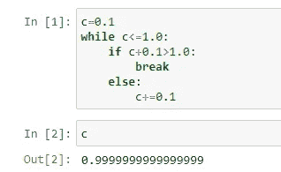
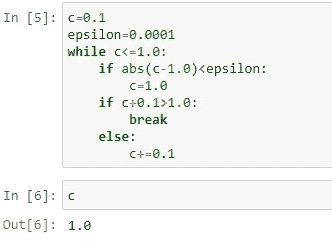
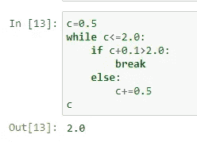

# Python 的浮动类型很灵活，但也很糟糕！

> 原文：<https://medium.com/analytics-vidhya/pythons-float-type-is-flexible-but-nasty-too-9bd3de80a1f0?source=collection_archive---------33----------------------->

Python 的 float 类型实现给了我们比你可能已经知道的更多的准确性。尽管如此，它也有典型的黑暗面，这是一个值得任何程序员关注的问题。

这个问题的出现是因为我们使用的十进制记数法的数字范围是 0-9，而计算机理解的是基于数字开关的 0-1 组合。

例如，十进制的 15 应作为 1111 输入 CPU，而 76 应作为 1001100。虽然它似乎对整数工作得很好(我们很快就会看到为什么)，但高精度浮点在表示分数和无理数时会遇到问题。

以下代码将更好地说明这一点:

Python 是不是没有能力只把两个数相加？

刚刚发生了什么？在 while 循环中，我给 c 加了 0.1，直到它达到 1，但是 Python 给了我们一个错误的结果。这是个 bug 吗？

好吧，没必要害怕。这正是我所说的编程障碍。**将十进制转换成二进制与用 sig*2^exp** 表示 sig*10^x 是一样的(sig =有效数字，exp =指数数字)。

对于分数，通常的二进制存储形式是(sig，-exp)。所以， ***0.25*** 馈为 ***(1，-10)*** 也就是*。*

*甚至我们在代码中使用的数字 0.1 也不能被唯一地定义。如果你只用 4 个二进制数，你能得出的最接近的是 ***(0011，-101)*** 。这相当于 3/32，即 0.09375。*

*同样，用五个有效二进制数，我们可以把 0.1 表示为 ***(11001，-1000)*** ，相当于 25/256，即 0.09765625。*

*Python 的 float 数据类型给你的是*53 位的精度，所以 0.1 存储为****11001100110011001100110011001100110011001100110011001100110011001**。十进制的话这就是**0.100000000000005551151231257827021181583404541015625。******

**是啊！太近但又太远:(**

**这可能看起来很可怕，真的！但是如果一个人制作了 Python，那么他也做了一些技巧来逃避这样的场景:**

****

**正确的做法！**

**哇哦。这次我们做对了。但是这里发生了什么？**

**不可否认的是，我们得到了 1.0，尽管重复地增加了 0.1，但这是有代价的。我们已经定义了一个“ε”作为精度度量:如果 c 和 1 之间的差小于这个ε，那么我们给 c 赋值 1。**

**您可以根据自己的要求将ε变小或变大。但是让我们再看一个例子。**

****

**但是 Python 在 0.5 的情况下工作正常(如预期)。而且应该，因为 0.5 可以准确地用二进制表示为(1，-1)。**

**仔细观察，你现在可以直观地理解为什么二进制对整数如此有效: ***任何整数都是 0.5 的倍数，因此可以写成 sig*2^(exp).*****

**再来一个来自上面的直觉: ***分母为 2 的幂的每一个分数，比如 1/16，5/64，19/1024 等等。可以在双星系统*** 中精确确定。但是，对于其他人，我们必须更加努力！**

**这是大多数处理浮点数的 Python 方法的内置特性。我们已经明确定义了这个度量来说明 Python 如何处理这样的计算限制。**

**因此，所有的小数点都不能用 2 的幂来唯一定义，除非你用无限多的二进制数字来表示。**

**使用浮点数据类型时，建议使用精度范围***ε***，而不是使用 **"=="** 检查，以避免我们在第一个代码中得到的不幸答案。**

**我写了这篇文章，因为我觉得在一个更关注快速算法和优化的世界里，我们错过了一些基本的计算属性。我希望这个博客对你的计算机科学之旅有所帮助，并让你对预期的事情有最好的理解。**