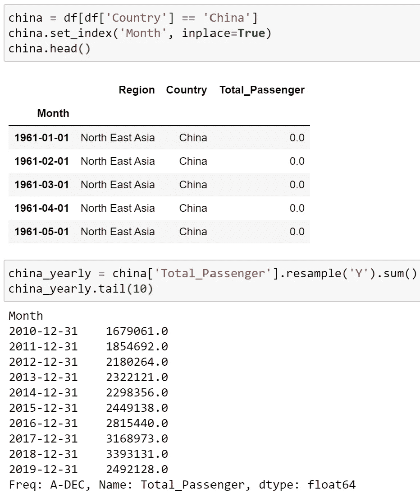
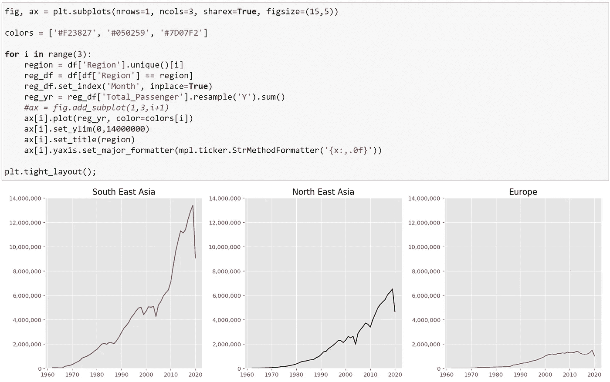

# Python 的 Matplotlib:如何创建图形和情节

> 原文：<https://medium.com/analytics-vidhya/pythons-matplotlib-how-to-create-figures-and-plots-c9b1ccbff5f5?source=collection_archive---------9----------------------->

各种形式的数据以前所未有的速度和数量涌入企业。商业格局的动态性促使大大小小的公司考虑利用内部和外部收集的数据，希望通过了解客户行为来保持竞争力。“数据理解”是 CRISP-DM 和数据科学流程的一部分，它允许企业在相应地解决业务问题之前获得对其数据的初步理解。

[https://pix abay . com/photos/books-图书馆-教育-文学-768426/](https://pixabay.com/photos/books-library-education-literature-768426/)

# 数据分析过程

CRISP-DM，代表“数据挖掘的跨行业标准过程”,规定了数据分析的数据挖掘的 6 个主要阶段；

*   商业理解
*   ***数据理解***
*   数据准备
*   建模
*   估价
*   部署

 [## CRISP-DM 工艺 Diagram.png

### 来自维基共享，自由媒体仓库

commons.wikimedia.org](https://commons.wikimedia.org/wiki/File:CRISP-DM_Process_Diagram.png#/media/File:CRISP-DM_Process_Diagram.png) 

根据 Packt 提供的 ***数据科学研讨会*** 的说法，使用大数据运行业务项目通常涉及数据科学应用的多个步骤。

*   定义业务问题
*   ***收集现有数据***
*   ***分析/可视化/准备数据***
*   培训模式
*   评估模型的性能
*   交流发现并获得见解
*   部署模型

我们可以看到这两篇参考文献之间的共同步骤，即' ***'数据理解*** '是解决业务问题的重要途径。为了快速获得手头数据的基本知识，可视化数据扮演着重要的角色。

# 用于数据可视化的 Python

如前所述，在这个时代，数据以前所未有的速度以各种各样的结构产生。因此， ***数据技巧*** 必不可少。现在我们将使用 Python 的 [Matplotlib](https://matplotlib.org/index.html) 来创建和定制数据的绘图。

***本部分将重点介绍如何创建用于绘图的图形以及如何生成多个绘图。***

# Matplotlib 模块

*   截至今日，Matplotlib 的[最新版本](https://pypi.org/project/matplotlib/)为 3.2.1，发布于 2020 年 3 月 19 日。
*   在开始使用 Matplotlib 之前，我们需要导入模块。然而，在 Matplotlib 中， [Pyplot](https://matplotlib.org/api/pyplot_summary.html) [子模块](https://matplotlib.org/api/index.html#modules)允许绘制不同用途的各种类型的图形。Pyplot 可以用别名 as 导入；

> **从** matplotlib **导入** pyplot **作为** plt

## 可用的图表类型

Matplotlib 提供了理解数据所需的各种图表。一般来说，有 4 个主要类别需要考虑；

*   **比较**:用于比较一段时间内的多个变量，如折线图、条形图(垂直/水平)、雷达图
*   **关系**:用于显示散点图、气泡图或热图等变量之间的关系
*   **组合**:用于可视化作为整体一部分的变量，如饼图、堆积条形图/面积图
*   **分布**:显示直方图、密度图、箱线图、小提琴图等数据的分布

# Matplotlib 绘图方法

基本上，我们可以用两种主要方式绘图，面向对象的方式和 Pyplot 方式，我们稍后将看到不同的方式应用于实际数据。

> **面向对象风格(OO Style)**
> 显式创建对象，这些对象是图&的坐标轴，是绘制绘图所必需的。
> 
> **Pyplot 样式** 让 Pyplot 自动处理剧情。

# 创建单一地块

根据我们想要创建的情节类型，我们可以从简单的开始:

> **#绘制 x 的线图& y 坐标**
> plt.plot(x，y)
> 
> **#显示地块** plt.show()

使用上面的语法，Matplotlib 自动为您生成包含单个 ***线*** 的单个图形。

或者，我们可能希望显式地创建 figure 对象作为内部绘图的容器。这允许您指定用于设置图形的运行命令参数(rcParams)。

> **#创建包含单个地块的图形对象**
> fig = plt.figure()
> 
> **#显示绘图** plt.show()

创建图形对象作为绘图容器

**plt.figure()** 的关键字参数可以在括号内指定，尽管如果我们什么也不指定，则执行默认值；

> **num** :设置图号
> **figsize** :设置图尺寸英寸
> **dpi** :设置图分辨率
> **facecolor** :背景色
> **等。**

让我们用从[www.data.gov.sg](http://www.data.gov.sg)到 [*航空旅客到达的数据集绘制一个折线图:按地区和所选登机国家*](https://data.gov.sg/dataset/air-passenger-arrivals-total-by-region-and-selected-country-of-embarkation?resource_id=efd7b75b-992e-4221-aff3-c57140af1f67) 的总数，这是一个时间序列数据。这对于折线图来说是完美的，因为它是 1960 年至 2019 年期间到达新加坡的航空旅客人数的比较。

数据概述

假设我想比较同一时期来自中国和泰国的乘客数量。在从 csv 文件中读取数据并稍加处理后，这两条线出现在一个数字中，用于比较 1960 年至 2019 年期间两国航空乘客如何前往新加坡。

## 操纵数据

中国航空客运数据

使用 Python 的 Pandas，数据基于已经设置为索引的“月”列进行重采样，以便合计每年的航空乘客数量。

泰国航空乘客数据

## 绘图数据

从上面，我们已经从整个数据框架中提取了泰国和中国的数据，并准备绘图。用 Pyplot， **plt.plot([x]，y)** 会画一个折线图，其中[x]是可选的。在这种情况下，我们的 y 值来自 thailand_yearly 和 china_yearly 数据，因此，我们将它们作为参数输入到泰国的 plt.plot(thailand_yearly)和中国的 plt.plot(china_yearly ),如下所示；

资料来源:Data.gov.sg

# 创建多个地块

有多种图形绘制选项，这取决于您是否选择哪个更适合您的条件。

## **1。逐个添加单个地块**

就像我们在创建一个单一的情节，我们开始创建新的图形对象:

> **图= plt.figure()**

创建一个新的人物后，再将支线剧情逐个添加到用 ***add_subplot*** 方法创建的人物中:

> **# a 图包含 2 行& 1 列，ax1 是第 1 个子图**
> ax1 = fig.add_subplot(2，1，1)
> 
> **# a 图包含 2 行& 1 列，ax2 是第二个子图** ax2 = fig.add_subplot(2，1，2)
> 
> **#显示绘图** plt.show()

这将返回两个相互垂直对齐的图形。

让我们从数据中创建多条线图。这次，我想按地区查看飞往新加坡的乘客总数。该数据汇集了东南亚、东北亚和欧洲 3 个不同地区的乘客。

查找区域列的唯一值

通过一些操作，我可以用之前在单个图中使用的相同方法合计每个区域的乘客总数。然而，我们可以完成任务，而不必像以前那样为每个区域重新生成新的数据帧。我将遍历每个地区乘客人数的原始数据。然后用重新取样法每年汇总数字。每次循环时，将为每个区域生成数据，这允许我们分别绘制每个区域的线图。

逐个添加单个地块

从上面的代码中，使用 for-loop，我创建了三个分别绘制的线图，使用 **add_subplot()** 方法将它们逐个添加到 Figure 对象中。

## 2.指定地块数量和布局

这一次 2 个对象，图形对象和轴对象，是使用 Pyplot 子模块的 ***支线剧情*** 方法同时创建的:

> **# a 图包含 2 行& 1 列
> # ax1 是第一个子情节& ax2 是第二个子情节**
> fig，(ax1，ax2) = plt.subplots(nrows=2，ncols=1)
> 
> **#显示绘图** plt.show()

用 plt.subplots()创建图形和轴对象的 OO 风格

这将返回两个相互垂直对齐的图形，就像我们通过前面的代码所做的那样。

让我们重温一下之前生成多个图的代码。唯一不同的是 Axes 对象是用 plt.subplots()显式创建的，如下图的第一行代码所示。通过 for-loop，为每个区域绘制线图，并通过我们的配置并排显示。

> 图，ax = PLT . subplot(nrows = 1，ncols=3)

在 for 循环中，当我们显式设置 Axes 对象时，您可能会发现不同的绘图代码。我们需要指定哪个轴来绘制特定的区域数据，如代码中的 ***ax[i]所示。*剧情(……)**。

使用 plt.subplots()创建多个图形

如您所见，绘图布局与前一个相同，都是 1 行 3 列。虽然您可以像我一样设置不同布局，例如 nrows=3 和 ncols=1。这种配置将垂直设置绘图。

带有支线剧情的垂直绘图()

# 加号++

除了本文中提到的创建图表的方法之外，还有其他方法可以用于您的项目，例如您可以选择使用 Pyplot 的 ***subplot2grid*** 方法在规则网格内的特定位置创建一个轴。这可以增加更多的控制和灵活性，以创造你的阴谋。

感谢大家一直读到最后！

密谋愉快！！