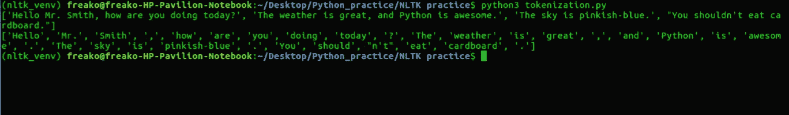

# Python 的自然语言工具包(NLTK)教程:第 1 部分

> 原文：<https://medium.com/analytics-vidhya/pythons-natural-language-tool-kit-nltk-tutorial-part-1-645688219a91?source=collection_archive---------0----------------------->


照片由 [Unsplash](https://unsplash.com?utm_source=medium&utm_medium=referral) 上的 [Soner Eker](https://unsplash.com/@sonereker?utm_source=medium&utm_medium=referral) 拍摄

你很可能听说过术语“自然语言处理”或 NLP(缩写)。自然语言处理是人工智能领域，尤其是机器学习领域的一个热门话题。原因是它在日常生活中的巨大应用。

这些应用包括聊天机器人、语言翻译、文本分类、段落摘要、垃圾邮件过滤等等。有一些开源的 NLP 库，做处理文本的工作，比如 NLTK，Stanford NLP suite，Apache Open NLP 等等。NLTK 是最受欢迎也是最容易理解的库。

好的。闲聊够了。让我们从一些基本的脚本开始，以便熟练掌握 NLTK。

***记号化***——将较大的部分分割成较小的部分。我们可以把段落标记成句子，把句子标记成单词。将普通文本字符串转换成一系列标记(我们实际需要的单词)的过程。

```
**#TOKENISATION**from nltk.tokenize import sent_tokenize, word_tokenizeEXAMPLE_TEXT = "An an valley indeed so no wonder future nature vanity. Debating all she mistaken indulged believed provided declared. He many kept on draw lain song as same. Whether at dearest certain spirits is entered in to. Rich fine bred real use too many good. She compliment unaffected expression favorable any. Unknown chiefly showing to conduct no."

tokened_sent = sent_tokenize(EXAMPLE_TEXT)tokened_word = word_tokenize(EXAMPLE_TEXT)print(tokened_sent)
print(tokened_word)
```

上述程序的输出将是这样的。



***词干*** *-* 去除单词中的词缀，返回词根。(单词' **working** 的词干会是' ***work)。*** )

```
**#STEMMING**from nltk.stem import PorterStemmerps = PorterStemmer()example_words = ["python","pythoner","pythoning","pythoned","pythonly"]for w in example_words:
 print(ps.stem(w))'''
THERE ARE A LOT MANY STEMMERS AVAILABLE IN IN THE NLTK LIBRARY:
1)PorterStemmer
2)SnowballStemmer
3)LancasterStemmer
4)RegexpStemmer
5)RSLPStemmer
'''
```

输出:


***词汇化***——单词词汇化类似于词干化，区别在于输出。词汇化的输出是一个真实的单词，而不仅仅是一个经过修饰的单词。为了让这段代码工作，您必须下载 nltk 的 wordnet 包。

```
**#LEMMATIZATION**from nltk.stem import WordNetLemmatizerlemmatizer = WordNetLemmatizer()print(lemmatizer.lemmatize('increases'))
print(lemmatizer.lemmatize('playing', pos="v"))
print(lemmatizer.lemmatize('playing', pos="v")) 
print(lemmatizer.lemmatize('playing', pos="n")) 
print(lemmatizer.lemmatize('playing', pos="a")) 
print(lemmatizer.lemmatize('playing', pos="r"))
print(lemmatizer.lemmatize("cats"))
print(lemmatizer.lemmatize("cacti"))
print(lemmatizer.lemmatize("geese"))
print(lemmatizer.lemmatize("rocks"))
print(lemmatizer.lemmatize("python"))
print(lemmatizer.lemmatize("better", pos="a"))
print(lemmatizer.lemmatize("best", pos="a"))
print(lemmatizer.lemmatize("run"))
print(lemmatizer.lemmatize("run",'v'))
```

输出:


现在我们对如何使用 NLTK 有了一点清楚的了解，让我们把事情提高一个档次。

***停用词*** :英语中有一些词，像“the”、“of”、“a”、“an”等等。这些是“停止词”。停用词因语言而异。这些停用词可能会影响结果，因此删除它们是必要的。

```
**#FILTERING ALL THE STOPWORDS**from nltk.corpus import stopwords
from nltk.tokenize import word_tokenize
example_sent = "This is a sample sentence, showing off the stop words filtration. Here you can write whatever you want to. You can also add a very big text file and see how this technique works"#STOP WORDS ARE PARTICULAR TO RESPECTIVE LANGUAGES(english, spanish, french Et cetera)
stop_words = set(stopwords.words('english'))word_tokens = word_tokenize(example_sent)filtered_sentence = [w for w in word_tokens if not in stop_words]print(filtered_sentence)
```

输出:


***统计词频****-**统计一个词的出现频率是语言分析中至关重要的一环。NLTK 附带了一个词频计数器，用于计算单词在特定数据集中重复的次数。*

```
***#COUNTING THE FREQUENCY OF THE WORDS USED**import nltkEXAMPLE_TEXT = "An an valley indeed so no wonder future nature vanity. Debating all she mistaken indulged believed provided declared. He many kept on draw lain song as same. Whether at dearest certain spirits is entered in to. Rich fine bred real use too many good. She compliment unaffected expression favourable any. Unknown chiefly showing to conduct no."frequency = nltk.FreqDist(EXAMPLE_TEXT) 
for key,val in frequency.items(): 
    print (str(key) + ':' + str(val))*
```

*输出:*

**

****同义词/反义词***——最后，我们还可以找到任何我们想要的英语单词的同义词和反义词。*

```
*from nltk.corpus import wordnetsynonyms = []
for syns in wordnet.synsets('dog'):
 synonyms.append(syns.name())print ("synonyms", synonyms)**#FINDING ANTONYMS FROM WORDNETS** from nltk.corpus import wordnetantonyms = []
for syn in wordnet.synsets("good"):
 for l in syn.lemmas():
  if l.antonyms():
   antonyms.append(l.antonyms()[0].name())print(antonyms)*
```

***同义词**的输出将是:*

**

*并且**反义词**的输出将是:*

**

****奖励:*** 使用**正则表达式**从任何给定的句子中提取电子邮件。*

```
*import re
text = "Please contact us at contact@blahblah.com for further information."+\
        " You can also give feedback at feedback@blah.com"

emails = re.findall(r"[a-z0-9\.\-+_]+@[a-z0-9\.\-+_]+\.[a-z]+", text)
print (emails)*
```

**

*在这里，我们结束了本教程系列的第一部分。在下一部分，我们将讨论更高级的话题，如组块、词性标注等。*

*我有一个 [Github 库](https://github.com/Ishan3333/Python_NLTK)，它包含了上面解释的所有代码，结构注释良好。随着这一系列文章的进展，我会确保更新它。*

*敬请关注。下次见…！*