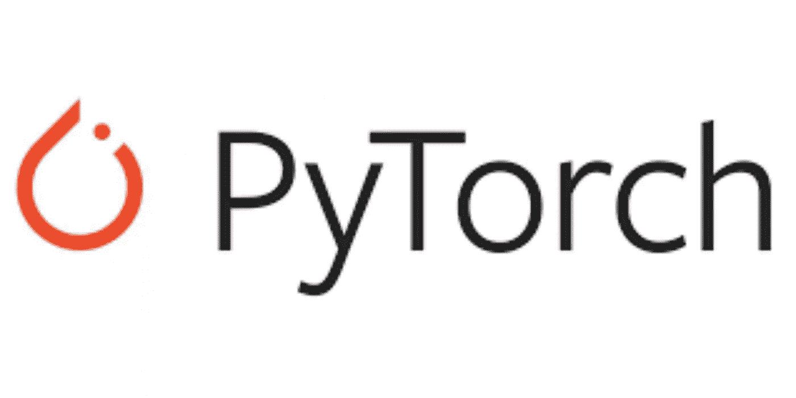

# py torch——深度学习框架

> 原文：<https://medium.com/analytics-vidhya/pytorch-a-framework-for-deep-learning-4abc10c88db8?source=collection_archive---------10----------------------->

**深度学习**是机器学习的一个子集，人工**神经网络**，受人脑启发的算法，从大量数据中学习。每隔一段时间，就会有一个库或框架为我们提供深度学习领域的新见解，从而实现显著的进步。

## PyTorch 是什么？🤔

PyTorch 是由脸书开发的人工智能框架。这是一个基于 Python 的包，用于替代 Numpy，以利用 GPU 的能力，并作为深度学习开发平台提供灵活性。



这无疑是一个值得学习的框架。在这里，我讨论它的一些属性来开始。

## 如何安装 PyTorch？

最初安装 python 和所有基本库来使用 PyTorch。

现在，你必须去 https://pytorch.org/的[才能得到 PyTorch 的安装命令。](https://pytorch.org/)

在这里，您必须选择您喜欢的 PyTorch 版本、操作系统、包、语言和 CUDA。它为您提供了在 windows 中安装 PyTorch 并在命令提示符下运行该命令的命令。


## 张量

张量是多维数组。Pytorch 张量类似于 NumPy 数组，另外，张量也可以在 GPU 上使用，以加速计算。

```
#initializing a tensora = torch.tensor(x,y)
```

PyTorch 支持像 NumPy 这样的不同操作的各种张量函数。

## 数组和张量的数字桥


将 torch 张量转换为 NumPy 数组，反之亦然。

将 Numpy 数组转换为张量:

```
import torch
import numpy as np
a = np.ones(5)
b = torch.from_numpy(a)
print(b)
```

张量到数字:

```
a = torch.ones(5)
b = a.numpy()
```

所以，事情就像你看到的那么简单。

## PyTorch 模块

## 自动签名模块

PyTorch 提供**亲笔签名的**包，该包为张量上的所有操作提供**自动微分**。它是一个由运行定义的框架，这意味着你的背景是由你的代码如何运行来定义的，并且每一次迭代都可能是不同的。它的工作原理是记录我们执行的所有操作，并回放以计算梯度。

```
x = torch.tensor([5],dtype=torch.float32,requires_grad=True)
y = torch.tensor([6],dtype=torch.float32,requires_grad=True)
z = ((x**2)*y) + (x*y)*#Using autograd*total = torch.sum(z)
print(x.grad,y.grad)
total.backward()
```

## Optim 模块

我们没有像以前那样手动更新模型的权重，而是使用 **optim** 包来定义一个**优化器**，它将为我们更新权重。

```
from torch import optim#adam optimizeroptimizer_adam = optim.Adam(model.parameters(),lr = learning_rate)#SGDoptimizer_sgd = optim.SGD(model.parameters(),lr = learning_rate)
```

以上是使用 adam 和 sgd 优化器的例子。PyTorch 有许多常用的优化器，减少了我们从头开始编写它们的时间。

一些优化器是，

*   签名于
*   圣经》和《古兰经》传统中）亚当（人类第一人的名字
*   阿达格拉德
*   阿达姆
*   阿达马克斯
*   阿达德尔塔
*   ASGD 等。

## 神经网络模块-定义网络

上述模块帮助我们在使用模型网络时定义计算图。为了开发复杂的神经网络，使用了 nn 模块。

PyTorch 有一个标准的方法让你创建自己的模型。整个定义应该留在一个对象中，这个对象是类 **nn 的子对象。模块** *。在这个类中，只有两个方法必须实现。这些方法分别是 ***__init__*** 和 ***forward。****

```
class nnet(nn.Module): def __init__(self): super(nnet, self).__init__() self.net = nn.Sequential( nn.Flatten(), nn.Linear(10, 32), nn.ReLU(), nn.Linear(32, 64), nn.ReLU(), nn.Linear(64,32), nn.ReLU(), nn.Linear(64,2), nn.LogSoftmax(1) ) def forward(self, X): outs = self.net(X) return outs
```

*   与其他 python 类一样， **__init__** 方法用于定义类属性，并在实例化时填充您想要的任何值。并且在 PyTorch 上下文中，您应该总是调用 **super()** 方法来初始化父类。
*   **forward** 函数根据输入张量计算输出张量。然后，我们可以通过构造一个实例并像调用函数一样调用它，传递包含输入数据的张量，来使用我们新的自动签名的操作符。

此外，torchvision 包中有预先训练好的模型，可以直接导入并使用。

## 在 PyTorch 中加载数据

**数据集**和**数据加载器**是 PyTorch 中可以定义如何访问数据的工具。

```
from torch.utils.data import Dataset, DataLoader
```

Torchvision 包由流行的数据集、模型架构和计算机视觉的通用图像转换组成。要安装火炬视觉，

```
pip install torchvision
```

*   torchvision.datasets 由许多数据集组成，如 MNIST、CIFAR10 等。
*   torchvision.models 由许多可以导入和使用的预训练模型组成。
*   torchvision.transforms 包含许多函数来构建更复杂的转换管道。

在本文中，我们已经看到了 PyTorch 中函数的基础知识。我建议您在任何数据集上使用任何 PyTorch，并实践它以更好地理解它的功能。