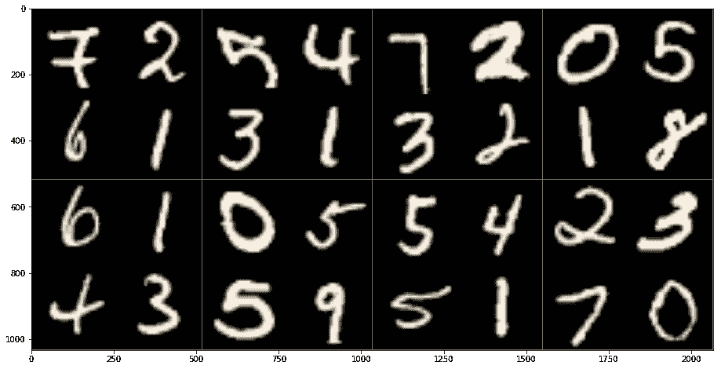
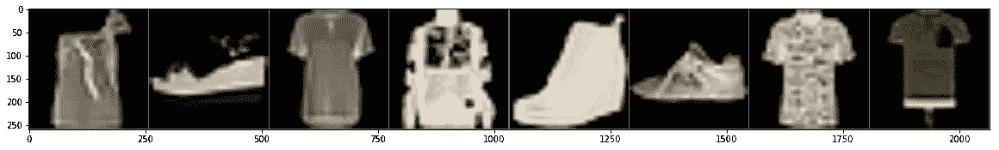
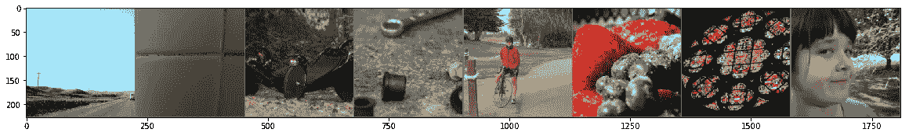

# PYTORCH 数据加载器— 4 种类型

> 原文：<https://medium.com/analytics-vidhya/pytorch-data-loaders-4-types-6cd05074256b?source=collection_archive---------15----------------------->

在本文中，我将向您展示如何在 Pytorch 中设置数据加载器和转换器，您需要导入以下内容来完成相同的练习

*导入火炬视觉
导入火炬
导入 os
导入 matplotlib.pyplot 为 plt
导入 numpy 为 np*

# MNIST 数据集


MNIST 数据集(图像源维基)

# **1。定义转换**

图像调整大小(256，256)或任何其他大小
转换为 Pytorch 张量
通过调用 torch vision . transform . Normalize 来规格化图像

*transform _ img = torch vision . transforms . compose([torch vision . transforms . resize((256，256))，
torch vision . transforms . totensor()，
torch vision . transforms . normalize(mean =[0.485]，STD =[0.229]))])*

# 2.从 torchvision.datasets 创建数据集

设置一些目录路径，download = True 将数据下载到指定的目录中，transform 应该设置为上面定义的 transform

*dir _ path = ' C:\ \ Users \ \ Asus \ \ py torch-basics-part 2 '*

*dataset _ Mn ist _ train = torch vision . datasets . Mn ist(dir _ path，train=True，transform=transform_img，
target_transform=None，download=True)*

可以索引这个数据集，dataset_mnist_train[i]将包含(Image，Label)的元组。

# 3.创建数据加载器

这里重要的是，batch_size 应根据应用设置为 8、16 或 32，Batch_size=1 将使模型非常慢，因为较高的批处理大小将需要更多的 GPU 内存。设置 Shuffle = True。

*data loader _ mnist _ train = torch . utils . data . data loader(dataset _ mnist _ train，batch_size=32，
shuffle=True，num_workers=1)*

# **4。检查数据**

现在，您可以按如下方式使用此数据加载器

*images，classes = next(ITER(data loader _ mnist _ train))*

运筹学

*对于图像，dataloader_mnist_train 中的类:
print(image . shape)
print(class)*

请注意，图像的批量大小为 32，因为我们创建了 32 个批量大小的数据加载器，同时请注意，每个图像的标签将有 32 个值

```
torch.Size([32, 1, 256, 256])
tensor([7, 0, 9, 6, 2, 5, 6, 3, 3, 2, 7, 6, 7, 9, 2, 6, 0, 2, 1, 6, 8, 0, 0, 8,
        3, 4, 3, 8, 5, 0, 8, 9])
torch.Size([32, 1, 256, 256])
tensor([9, 8, 0, 5, 4, 4, 0, 1, 4, 0, 2, 6, 3, 0, 4, 0, 2, 0, 1, 6, 0, 8, 6, 1,
        2, 4, 0, 7, 3, 5, 1, 0])
torch.Size([32, 1, 256, 256])
tensor([1, 2, 4, 5, 6, 3, 5, 1, 8, 5, 9, 6, 9, 2, 5, 5, 1, 1, 8, 2, 2, 1, 3, 3,
        1, 1, 0, 3, 4, 2, 7, 2])
torch.Size([32, 1, 256, 256])
tensor([5, 8, 7, 2, 8, 1, 7, 4, 1, 0, 8, 3, 1, 1, 5, 1, 1, 4, 0, 1, 0, 2, 6, 1,
        2, 6, 9, 9, 5, 1, 4, 4])
```

# **打印图像**

定义一个小函数将 Torch 张量转换为 numpy 数组

*def*T34*convert _ to _ numpy(InP)**:
InP = InP . numpy()。transpose((1，2，0))
mean = np.array([0.485，0.456，0.406])
STD = NP . array([0.229，0.224，0.225])
InP = STD * InP+mean
InP = NP . clip(InP，0，1)
return inp*

**批量制作 32 幅图像的网格**

*images，classes = next(ITER(data loader _ mnist _ train))
images . shape*

```
torch.Size([32, 1, 256, 256])
```

*grid _ image = torch vision . utils . make _ grid(images)
out . shape*

```
torch.Size([3, 1034, 2066])
```

images _ numpy = convert _ to _ numpy(out) *PLT . im show(images _ numpy)*



# **时尚达人数据集**

与 MNIST 数据非常相似的程序，(1)创建图像转换器(2)从 torch vision . datasets . fashion mnist 创建时尚 mnist 数据(3)创建数据加载器。这一次，我们选择了批量大小为 8

***transform _ img****= torch vision . transforms . compose([torch vision . transforms . resize((256，256))，
torch vision . transforms . totensor()，
torch vision . transforms . normalize(****mean =[0.485]，STD =[0.229]****))*

***dataset _ fashion _ mnist _ train****= torch vision . datasets .****fashion mnist****(dir _ path，train=True，transform=transform_img，
target_transform=None，download=True)*

***data loader _ fashion mnist _ train****= torch . utils . data . data loader(dataset _ fashion _ mnist _ train，batch_size=8，
shuffle=True，num_workers=4)*

**打印样本图像**

***图片，类****= next(ITER(****data loader _ fashion mnist _ train****)* ***grid _ images****= torch vision . utils . make _ grid(****图片*** *)* 



# **SBU 数据集**

SBU 数据集包含以目标/标注作为图像标题(文本)的图像

数据下载/转换和数据加载器创建非常类似于 MNIST 和时尚 MNIST，唯一的区别是 SBU 数据有彩色图像，每个图像将有 3 个通道(R，G，B)

***dir _ path****= ' C:\ \ Users \ \ Asus \ \ py torch-basics-part 2 '* ***transform _ img****= torch vision . transforms . compose([
torch vision . transforms . resize(256)，
torch vision . transforms . center crop(224)，
torchvision*

***dataset _ sbu _ train****=****torch vision . datasets . sbu****(****dir _ path****，transform =****transform _ img****，target_transform=None，download=True)*

***data loader _ sbu _ train****=****torch . utils . data . data loader****(****dataset _ sbu _ train****，batch_size=8，
shuffle=True，num_workers=4)*

**检查数据并打印图像**

*images，classes = next(ITER(data loader _ sbu _ train))* ***grid _ images****= torch vision . utils .****make _ grid****【images】
images _ numpy = convert _ to _ numpy(****grid _ images***



*打印(类)###* ***这些都是图片说明文字***

```
(' I love that little white hippie van in front of us.', " The first-floor women's bathroom in Canaday library is covered with pun-filled graffiti like this.  I cannot resist a pun!", ' There is a black cat in my back yard', ' Tools and bearings all over the floor a sure sign of work being done!', ' we stopped to check on the geese (who are off in the lake to the left of the frame) on our morning bike ride.', ' bowl of fruit (that was consumed by me soon after this was taken)', ' Stained glass window in the Ridderzaal', ' Rachel up in the tree house that is still being built.')
```

**你可以观看我的 Youtube 视频，了解这些数据加载器的详细说明**

Youtube 频道:[https://www.youtube.com/c/nagarajbmachinelearning](https://www.youtube.com/c/nagarajbmachinelearning)