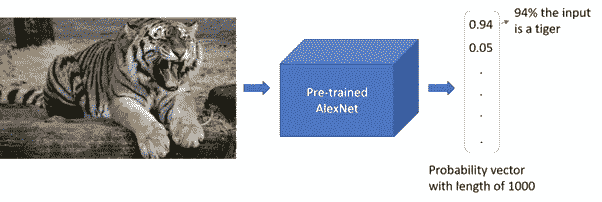
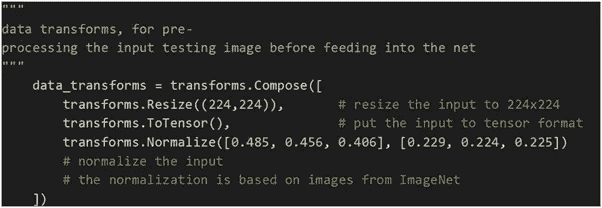
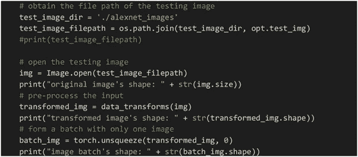
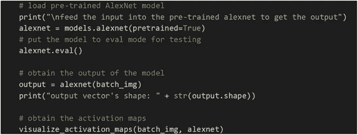
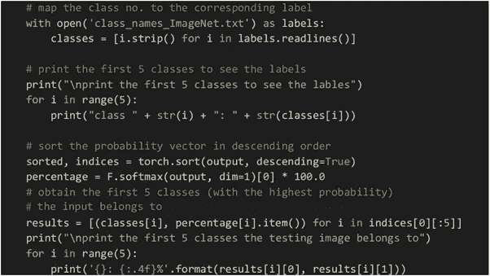
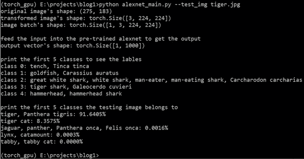
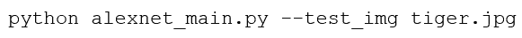
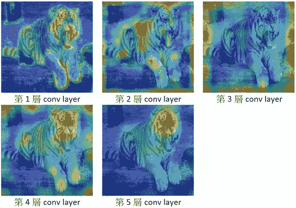
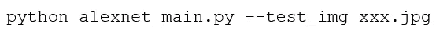

# PyTorch:直接使用预先训练的 AlexNet 进行图像分类和激活图的可视化

> 原文：<https://medium.com/analytics-vidhya/pytorch-directly-use-pre-trained-alexnet-for-image-classification-and-visualization-of-the-dea0de3eade9?source=collection_archive---------3----------------------->

老虎信用图片:[https://phys . org/news/2019-11-Indian-authorities-夸张-tiger.html](https://phys.org/news/2019-11-indian-authorities-exaggerated-tiger.html) (CC0 公共领域)

大家好。今天我要介绍最经典的卷积神经网络(CNN)，AlexNet [1]，这是第一个数据驱动的基于 CNN(基于深度学习)的方法，赢得了 2012 年 ImageNet 对象分类。在这篇博客中，你将了解到:

1.  直接用一个预先训练好的 AlexNet 进行类别预测(原来的 AlexNet 是能够分类 1000 个类别如老虎，自行车，鲨鱼等。)
2.  可视化在 AlexNet 中选择哪些特征进行分类(我们将看到每一层的特征选择，并知道哪些特征被传递到下一层)

本博客的源代码:[https://git lab . com/ronctli 1012/blog 1-pre trained-Alex net-and-visualization](https://gitlab.com/ronctli1012/blog1-pretrained-alexnet-and-visualization)

# 准备

*   你应该对 CNN 有基本的了解(例如，你以前听说过 AlexNet，知道一点它的结构)
*   Anaconda (anaconda.com): 1。)我们通常使用 Anaconda 来创建开发环境；2.)所有需要的包都已经写在“requirement.txt”里和/或你可以使用提供的“torch_gpu.yml”直接为这个博客创建环境。详见我们的源代码
*   Pytorch (pytorch.org): 1。)Pytorch 是常用框架之一(p.s .我们还有 TensorFlow，Keras 等。)用于实现 CNN2.)如果你没有 GPU，你也可以通过安装 Pytorch CPU 版本来关注这个博客

# 预处理输入

**数据转换:**用于在输入到预先训练好的 AlexNet 之前对输入进行预处理。

1.  **变换。Resize((224，224)) :** 输入的大小调整为 224x224
2.  **变身。ToTensor() :** 将输入转换为张量格式，以便使用 torch
3.  **变换。标准化([平均值]，[标准偏差]) :** 使用[平均值]和[标准偏差]标准化输入

# 读取和转换输入

**opt.test_img** 是输入参数，表示测试图像的文件名。请注意，测试图像应该存储在“alexnet_images”文件夹中。

# 定义网络

在预处理输入之后，我们必须定义我们的模型。你可以看到我们只需要一行代码就可以得到预先训练好的 AlexNet。由于我们只是在这个博客中进行测试，我们可以直接将模型移动到评估模式(即 **alexnet.eval()** )。然后，我们可以将预处理后的输入输入到模型中，并获得预测结果。

**visualize _ activation _ maps(batch _ img，alexnet)** 是将 alexnet 内部各层的特征选择可视化的函数。由于 AlexNet 内部有 5 层，因此该功能将生成 5 幅图像，这些图像将存储在您当前的工作目录中。

# 了解预测结果

正如我在最开始提到的，最初的 AlexNet 可以对 1000 类对象进行分类。因此，我们首先将类别与其对应的标签进行匹配，并尝试显示前 5 个类别标签。

注意，AlexNet 的输出应该是一个长度为 1000 的向量。首先，我们将根据输出向量中每个元素的值对输出进行排序。然后，我们使用 softmax 函数将这个 1000 长度的向量归一化为概率向量。该概率向量中的每个元素表示类别概率(即输入属于该类别的可能性)。

最后，我们显示概率最高的前 5 个类。

# 直接使用

示例:使用“tiger.jpg”输入图像运行“alexnet_main.py”脚本的输出

又来了！所有材料均可在[https://git lab . com/ronctli 1012/blog 1-pre trained-Alex net-and-visualization](https://gitlab.com/ronctli1012/blog1-pretrained-alexnet-and-visualization)找到

对于窗口用户，您可以通过在命令窗口中键入以下一行代码(即 cmd)来运行脚本:

你可以看到预测的结果(91.6405%属于类“老虎，Panthera tigris”)和可视化的特征在 AlexNet 之间传递。

在你当前的工作目录中应该有 5 张图片。红色表示该层最重要的特征。

从左到右和从上到下:第一层、第二层、第三层、第四层和第五层最重要的特征

显然，简单的边缘特征在像层 1 这样的早期层被高度激活(即更重要)。在第 5 层，你可以看到老虎的头部被突出显示。这意味着模型(或 AlexNet)认为这是将这个物体归类为老虎的重要特征。

希望下次我们能深入讨论模型内部的特征选择。特征表示是当今深度学习发展中一个非常重要的课题。

现在，你可以尝试从网上下载一些图片，保存在“alexnet_images”文件夹内。然后，您可以在命令窗口中键入以下命令，

请注意，xxx.jpg 是您的图像的文件名。让我们试试看你会得到什么样的预测结果！:)

# 参考

[1][https://papers . nips . cc/paper/4824-imagenet-class ification-with-deep-convolutionary-neural-networks](https://papers.nips.cc/paper/4824-imagenet-classification-with-deep-convolutional-neural-networks)

这是我第一次写博客来分享我所学到的东西。为什么我想这么做？因为我想改变一些事情。希望写作可以改变我的想法，在未来的日子里，我可以做我自己。

如果你喜欢，请在这里留下评论，告诉我你的想法！:)感谢您的关注，希望您喜欢这篇分享。回头见！