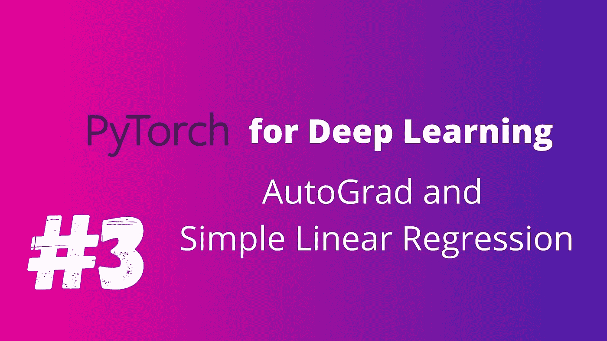
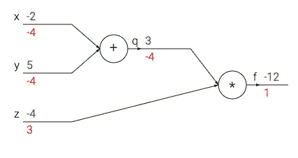

# 用于深度学习的 PyTorch 自动签名和简单线性回归

> 原文：<https://medium.com/analytics-vidhya/pytorch-for-deep-learning-autograd-and-simple-linear-regression-954f999316b1?source=collection_archive---------8----------------------->

# PyTorch 的亲笔签名

PyTorch 的亲笔签名是一个非常强大的功能，我们可以很容易地找到一个变量相对于另一个变量的差异。这很方便…