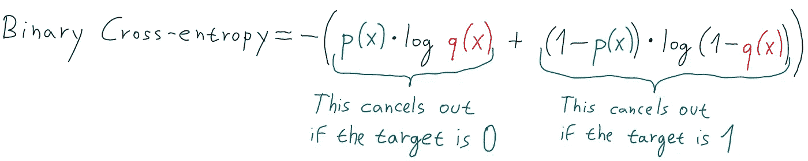
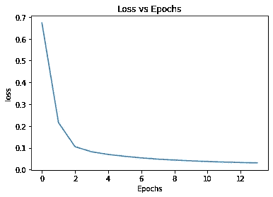
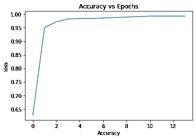

# 用于深度学习的 PyTorch 二元分类(逻辑回归)

> 原文：<https://medium.com/analytics-vidhya/pytorch-for-deep-learning-binary-classification-logistic-regression-382abd97fb43?source=collection_archive---------0----------------------->


这篇博文是关于如何用 PyTorch 创建一个分类神经网络。
*注:本帖中的神经网络包含 2 层，神经元很多。但是，如果输出特征的数量和层数减少到 1，这将只是一个普通的逻辑回归*

说到这里，让我们进入代码

1.  **导入库**

```
#importing the librariesimport torch
import numpy as np
import matplotlib.pyplot as plt
```

**2。数据集**

在这篇文章中，我们将使用 sklearn 著名的乳腺癌数据集

```
#importing the datasetfrom sklearn.datasets import load_breast_cancer
data = load_breast_cancer()
x = data['data']
y = data['target']
print("shape of x: {}\nshape of y: {}".format(x.shape,y.shape))**output:**
shape of x: (569, 30) 
shape of y: (569,)
```

**3。特征缩放**

在将特征发送到神经网络之前，将特征缩放到标准法线是很重要的。

基本上，这将减去列的平均值，并除以列中每个值(自变量)的标准偏差

```
#feature scalingfrom sklearn.preprocessing import StandardScaler
sc = StandardScaler()
x = sc.fit_transform(x)
```

**4。数据集和数据加载器**

pytorch 中的 Dataset 类基本上覆盖了一个元组中的数据，并使我们能够访问每个数据的索引。这对于创建可用于混洗、应用小批量梯度下降等的 dataloader 类是必要的。

查看之前的帖子，了解更多关于这种工作方式的例子

```
#defining dataset classfrom torch.utils.data import Dataset, DataLoaderclass dataset(Dataset):
  def __init__(self,x,y):
    self.x = torch.tensor(x,dtype=torch.float32)
    self.y = torch.tensor(y,dtype=torch.float32)
    self.length = self.x.shape[0]

  def __getitem__(self,idx):
    return self.x[idx],self.y[idx] def __len__(self):
    return self.lengthtrainset = dataset(x,y)#DataLoader
trainloader = DataLoader(trainset,batch_size=64,shuffle=False)
```

**5。用于分类的神经网络**

在 Pytorch 中，神经网络是使用面向对象编程创建的。这些层是在 init 函数中定义的，向前传递是在 forward 函数中定义的，当调用该类时会自动调用该函数。

由于 nn 类，这些函数是可能的。从 torch 继承的模块。

神经网络的输出在 0 和 1 之间，因为 sigmoid 函数被应用于输出，这使得网络适合于二进制分类。

```
#defining the networkfrom torch import nn
from torch.nn import functional as Fclass Net(nn.Module):
  def __init__(self,input_shape):
    super(Net,self).__init__()
    self.fc1 = nn.Linear(input_shape,32)
    self.fc2 = nn.Linear(32,64)
    self.fc3 = nn.Linear(64,1) def forward(self,x):
    x = torch.relu(self.fc1(x))
    x = torch.relu(self.fc2(x))
    x = torch.sigmoid(self.fc3(x))
    return x
```

*如果简单的逻辑回归就足够了，fc2 和 fc3 层可以去掉。*

**6。更多参数**

选择各种参数，如时期数、损失函数、学习率等

```
#hyper parameterslearning_rate = 0.01
epochs = 700# Model , Optimizer, Lossmodel = Net(input_shape=x.shape[1])
optimizer = torch.optim.SGD(model.parameters(),lr=learning_rate)
loss_fn = nn.BCELoss()
```

BCELoss 是用于二进制交叉熵损失的 pytorch 类，它是用于二进制分类的标准损失函数。



# 培养

从损失函数中找到的梯度被用于改变权重值，并且该过程被重复几次。

这样做是为了最小化损失函数并提高精度

此外，数据集没有划分为训练集和测试集，因为数据量已经很低

```
#forward looplosses = []
accur = []for i in range(epochs):
  for j,(x_train,y_train) in enumerate(trainloader):

    #calculate output
    output = model(x_train)

    #calculate loss
    loss = loss_fn(output,y_train.reshape(-1,1))

    #accuracy
    predicted = model(torch.tensor(x,dtype=torch.float32))
    acc = (predicted.reshape(-1).detach().numpy().round() == y).mean() #backprop
    optimizer.zero_grad()
    loss.backward()
    optimizer.step() if i%50 == 0:
    losses.append(loss)
    accur.append(acc)
    print("epoch {}\tloss : {}\t accuracy : {}".format(i,loss,acc))**output:** *epoch 0 loss : 0.6731628775596619  accuracy : 0.6274165202108963 epoch 50 loss : 0.2154722362756729  accuracy : 0.9507908611599297 epoch 100 loss : 0.1049698144197464  accuracy : 0.9718804920913884 epoch 150 loss : 0.08159173280000687  accuracy : 0.9824253075571178 epoch 200 loss : 0.06935682147741318  accuracy : 0.984182776801406 epoch 250 loss : 0.0607854388654232  accuracy : 0.984182776801406 epoch 300 loss : 0.053541962057352066  accuracy : 0.9859402460456942 epoch 350 loss : 0.047878947108983994  accuracy : 0.9876977152899824 epoch 400 loss : 0.043598778545856476  accuracy : 0.9894551845342706 epoch 450 loss : 0.039949361234903336  accuracy : 0.9912126537785588 epoch 500 loss : 0.036903925240039825  accuracy : 0.9929701230228472 epoch 550 loss : 0.03445163369178772  accuracy : 0.9929701230228472 epoch 600 loss : 0.032331496477127075  accuracy : 0.9929701230228472 epoch 650 loss : 0.030418962240219116  accuracy : 0.9929701230228472*
```

detach()函数从张量中删除 requires_grad，以便可以将其转换为 numpy，accuracy 是一个存储每个历元精度的列表。除此之外，如果所有以前的帖子都已阅读，这里的一切都是不言自明的。

**模型分析**

绘制各个时期的损失和准确性，看它如何随着训练而变化

```
#plotting the lossplt.plot(losses)
plt.title('Loss vs Epochs')
plt.xlabel('Epochs')
plt.ylabel('loss')
```



```
#printing the accuracyplt.plot(accur)
plt.title('Accuracy vs Epochs')
plt.xlabel('Accuracy')
plt.ylabel('loss')
```



这个损失和准确度图证明了我们的模型学习得很好。

# 谢谢你