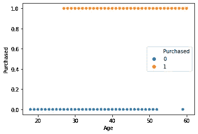

# 深度学习的 PyTorch 混淆矩阵

> 原文：<https://medium.com/analytics-vidhya/pytorch-for-deep-learning-confusion-matrix-e73163277c95?source=collection_archive---------3----------------------->


*注意:这是 PyTorch 的一个常规分类问题，与“深度学习 PyTorch”系列的前一篇文章中的问题一模一样。写这篇文章的原因是为了更多的参考分类问题和更好的理解。如果你对神经网络分类已经足够好了，跳到混淆矩阵出现的部分。*

# 跳到代码部分

1.  **导入所需的库**

```
#importing the librariesimport torch
import numpy as np
import pandas as pd
import matplotlib.pyplot as plt
import seaborn as sns
```

**2。数据**

数据集可在卡格尔获得:[https://www.kaggle.com/dragonheir/logistic-regression](https://www.kaggle.com/dragonheir/logistic-regression)

```
#importing the dataset
df = pd.read_csv('Social_Network_Ads.csv')
df.head()
```

**3。删除用户 Id，因为它与广告点击无关**

```
#droping insignificant columnsdf.drop(['User ID'],inplace=True,axis=1)
```

**4。移除性别栏**

经过一些探索性的数据分析，决定删除性别列，因为在这种情况下没有太大的意义。
女性点击广告的次数往往略多于男性。但是，数量不是很大

```
#removing the gender column as there is not much effect on the adclicksdf.drop(['Gender'],axis=1,inplace=True)
```

**5。分析年龄与广告点击的关系，以及工资与广告点击的关系**

从下面的图表中可以明显看出，年龄和工资会影响一个人是否购买该产品。

```
#plotting age vs purchasedsns.scatterplot(df['Age'],df['Purchased'],hue=df['Purchased'])
```



```
#salary vs purchasedsns.scatterplot(df['EstimatedSalary'],df['Purchased'],hue=df['Purchased'])
```


**6。列车试运行**

```
x = np.array(df.iloc[:,:2])
y = np.array(df.iloc[:,2])from sklearn.model_selection import train_test_split
x_train, x_test, y_train, y_test =
train_test_split(x,y,test_size=0.2)print('shape of the x_train: ',x_train.shape)
print('shape of the x_test : ',x_test.shape)
print('shape of the y_train: ',y_train.shape)
print('shape of the x_test: ',y_test.shape)**output:**shape of the x_train:  (320, 2) 
shape of the x_test :  (80, 2) 
shape of the y_train:  (320,) 
shape of the x_test:  (80,)
```

**7。特征缩放**

```
#feature scalingfrom sklearn.preprocessing import StandardScaler
sc = StandardScaler()
x_train = sc.fit_transform(x_train)
x_test = sc.transform(x_test)
```

8。数据集

```
#dataset classfrom torch.utils.data import Datasetclass dataset(Dataset):
  def __init__(self,x,y):
    self.x = torch.tensor(x,dtype=torch.float32)
    self.y = torch.tensor(y,dtype=torch.float32)
    self.length = self.x.shape[0]

  def __getitem__(self,idx):
    return self.x[idx],self.y[idx] def __len__(self):
    return self.length#training and testing tensorstrain_set = dataset(x_train,y_train)
test_set = dataset(x_test,y_test)
```

9。神经网络

这是一个简单的神经网络，在最后一层有 sigmoid 激活

```
#defining the networkfrom torch import nn
from torch.nn import functional as Fclass LogisticRegression(nn.Module):
  def __init__(self):
    super(LogisticRegression,self).__init__()
    self.fc1 = nn.Linear(2,1)

  def forward(self,x):
    x = torch.sigmoid(self.fc1(x))
    return x #some parametersmodel = LogisticRegression()
learning_rate = 0.007
optimizer = torch.optim.Adam(model.parameters(),lr=learning_rate)
epochs = 1000
criterion = nn.BCELoss()
```

10。数据加载器

dataloader 使向前传递变得更容易，在这种情况下，我通过指定批量大小等于训练集的大小来执行批量梯度下降

```
#data loaderfrom torch.utils.data import DataLoader
train_loader = DataLoader(train_set,shuffle=True,batch_size=train_set.__len__())test_loader = DataLoader(test_set,batch_size=test_set.__len__())
```

11。前进和后退道具

```
#forward passlosses = []for i in range(epochs):
  for j,(x_train,y_train) in enumerate(train_loader):
    #get the prediction
    y_pred = model(x_train)

    #losses
    loss = criterion(y_pred,y_train.reshape(-1,1))
    losses.append(loss) #backprop
    optimizer.zero_grad() loss.backward()
    optimizer.step() #print loss
  if i%100 == 0:
    print("epoch : {} loss: {}".format(i,loss))**Output:** epoch : 0 loss: 0.6956004500389099 
epoch : 100 loss: 0.47631335258483887 
epoch : 200 loss: 0.41070833802223206 
epoch : 300 loss: 0.38835814595222473 
epoch : 400 loss: 0.37939146161079407 
epoch : 500 loss: 0.3754518926143646 
epoch : 600 loss: 0.3736688494682312 
epoch : 700 loss: 0.37286680936813354 
epoch : 800 loss: 0.37251609563827515 
epoch : 900 loss: 0.3723692297935486
```

12。模型分析

绘制训练集中各时期的损失，并计算模型对测试集预测的准确性

混淆矩阵也显示在下面

```
plt.plot(losses)
plt.title('loss vs epochs')
plt.xlabel('epochs')
plt.ylabel('loss')
```


```
#testsetx_test,y_test = next(iter(train_loader))
y_pred = model(x_test)
print('accuracy of the model on test set : ',(((y_pred.round().reshape(-1) == y_test).sum())/float(y_pred.shape[0])).item(),"%")**output:** accuracy of the model on test set :  0.8374999761581421 %
```

**13。混乱矩阵**


它返回 4 个值:
第一个值代表:真阳性
第二个值代表:假阳性
第三个值代表:假阴性
第四个值代表:真阴性

```
from sklearn.metrics import confusion_matrix
print("Confusion Matrix : ")
confusion_matrix(y_pred.round().reshape(-1).detach(),y_test)**output:** Confusion Matrix :array([[184,  34],
       [ 18,  84]])
```

**结论:**

这篇博客文章快速回顾了之前文章和混淆矩阵
中的内容。从上面的混淆矩阵中，我们可以得出结论，这个模型做得很好，尽管它给出了一些错误。但是，现在没事了。

# **谢谢**