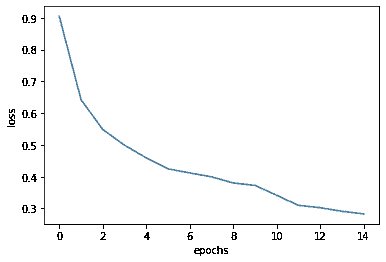
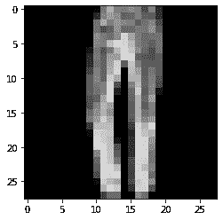

# 深度学习 PyTorch 卷积神经网络(时尚-MNIST)

> 原文：<https://medium.com/analytics-vidhya/pytorch-for-deep-learning-convolutional-neural-networks-fashion-mnist-f7bff7b4e724?source=collection_archive---------1----------------------->


# 时尚 MNIST

时尚 Mnist 是 Zolando Fashion Wear 创建的一个数据集，用来代替原来的 Mnist，同时增加难度。这篇博文讲述了如何创建一个模型来预测时尚 mnist 图像，并展示了如何在网络中实现卷积层

让我们看看代码

1.  **导入库**

```
#importing the librariesimport torch
import torchvision
import torchvision.transforms as transforms
import matplotlib.pyplot as plt
import numpy as np
```

2.**导入数据**

Pytorch 的 torchvision 包含用于实践的内置数据集，如 MNIST、FashionMnist 等

```
#datatsettrain_set = torchvision.datasets.FashionMNIST(
root = './data/FashionMNIST',
download = True,
train = True,
transform = transforms.Compose([
transforms.ToTensor(),
])
)test_set = torchvision.datasets.FashionMNIST(
root = './data/FashionMNIST',
download=True,
train=False,
transform = transforms.Compose([transforms.ToTensor()])
)
```

作为预处理的一部分，需要在输入图像上完成的变换列表可以使用 transforms.compose 实现

**3。数据加载器**

pytorch 中的 Dataset 类基本上覆盖了一个元组中的数据，并使我们能够访问每个数据的索引。这对于创建可用于混洗、应用小批量梯度下降等的 dataloader 类是必要的

```
#data loadertrain_loader = torch.utils.data.DataLoader(train_set,batch_size=20)
test_loader = torch.utils.data.DataLoader(test_set,batch_size=60000)images, labels = next(iter(train_loader))#used to create a grid of images
grid = torchvision.utils.make_grid(images,nrow=20)
plt.figure(figsize=(15,15))
plt.imshow(np.transpose(grid,(1,2,0)),cmap='gray')
```

**4。卷积神经网络**

具有卷积层的神经网络称为卷积神经网络。这篇博文并没有涉及卷积神经网络是什么的理论。这仅适用于 PyTorch 实现。

```
import torch.nn as nn
import torch.nn.functional as F class Network(nn.Module):
  def __init__(self):
    super(Network,self).__init__()
    self.conv1 = nn.Conv2d(in_channels=1,out_channels=6,kernel_size=5) self.conv2 = nn.Conv2d(in_channels=6,out_channels=12,kernel_size=5) self.fc1 = nn.Linear(in_features=12*4*4,out_features=120) self.fc2 = nn.Linear(in_features=120,out_features=60) self.fc3 = nn.Linear(in_features=60,out_features=40) self.out = nn.Linear(in_features=40,out_features=10) def forward(self,x): #input layer
    x = x #first hidden layer
    x = self.conv1(x)
    x = F.relu(x)
    x = F.max_pool2d(x,kernel_size=2,stride=2) #second hidden layer
    x = self.conv2(x)
    x = F.relu(x)
    x = F.max_pool2d(x,kernel_size=2,stride=2) #third hidden layer
    x = x.reshape(-1,12*4*4)
    x = self.fc1(x)
    x = F.relu(x) #fourth hidden layer
    x = self.fc2(x)
    x = F.relu(x) #fifth hidden layer
    x = self.fc3(x)
    x = F.relu(x) #output layer
    x = self.out(x)
    return x
```

借助 nn.conv2d 层，可以在 pytorch 中实现卷积神经网络

**5。参数调谐**

选择各种参数，如时期数、损失函数、学习率等

```
#defining few parametersmodel = Network()
learning_rate = 0.005
optimizer = torch.optim.SGD(model.parameters(),lr=learning_rate)
criterion = nn.CrossEntropyLoss()
epochs = 15
```

**6。培训**

从损失函数中找到的梯度被用于改变权重值，并且该过程被重复几次。
这样做是为了最小化损失函数并提高精度

```
#training loop
losses = []
for i in range(epochs):
  for j,(images,targets) in enumerate(train_loader):

    #making predictions
    y_pred = model(images)

    #calculating loss
    loss = criterion(y_pred,targets.reshape(-1)) #backprop
    optimizer.zero_grad()
    loss.backward()
    optimizer.step() if i>10:
    optimizer.lr = 0.0005 print(loss)
  losses.append(loss)**Output:** tensor(0.9046, grad_fn=<NllLossBackward>) 
tensor(0.6423, grad_fn=<NllLossBackward>) 
tensor(0.5484, grad_fn=<NllLossBackward>) 
tensor(0.4991, grad_fn=<NllLossBackward>) 
tensor(0.4591, grad_fn=<NllLossBackward>) 
tensor(0.4245, grad_fn=<NllLossBackward>) 
tensor(0.4117, grad_fn=<NllLossBackward>) 
tensor(0.3995, grad_fn=<NllLossBackward>) 
tensor(0.3803, grad_fn=<NllLossBackward>) 
tensor(0.3726, grad_fn=<NllLossBackward>) 
tensor(0.3416, grad_fn=<NllLossBackward>) 
tensor(0.3100, grad_fn=<NllLossBackward>) 
tensor(0.3024, grad_fn=<NllLossBackward>) 
tensor(0.2911, grad_fn=<NllLossBackward>) 
tensor(0.2829, grad_fn=<NllLossBackward>)
```

**7。模型性能分析**

该模型在测试集上的准确率为:86.04%

```
#accuracy of the modelx_test,y_test = next(iter(test_loader))
y_pred = (model(x_test).argmax(dim=1))print("Accuracy is : ",(y_pred.eq(y_test).sum()/10000.).item()*100,"%")**output:** 
Accuracy is :  86.04000210762024 %
```

**8。绘图**

```
#plotting lossplt.plot(losses)
plt.xlabel('epochs')
plt.ylabel('loss')
```



**9。从测试集进行随机预测**

```
#random predictionimport random
rand_no = random.randint(0,10000)order_list = "T-shirt/Top Trouser PullOver Dress Coat Sandal Shirt Sneaker Bag AnkleBoot".split()plt.imshow(x_test[rand_no].reshape(28,28),cmap='gray')
pred = model(x_test[rand_no].reshape(-1,1,28,28)).argmax()
print("This is a/an {}".format(order_list[pred]))**output:** This is a/an Trouser
```



# **结论**

在测试集上，该模型的准确率为 86%。这证明了卷积网络在预测图像方面有多强。这是因为卷积层的参数共享能力和边缘检测能力。

# 谢谢你