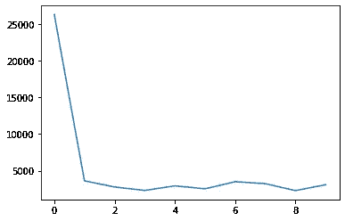
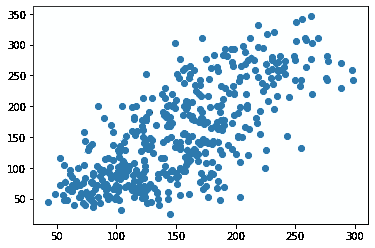

# 用于深度学习的 PyTorch 前馈神经网络

> 原文：<https://medium.com/analytics-vidhya/pytorch-for-deep-learning-feed-forward-neural-network-d24f5870c18?source=collection_archive---------2----------------------->


*注意:神经网络理论不会在这篇博文中讨论。这纯粹是为了 PyTorch 的实现，你需要知道他们如何工作背后的理论。*

# 用 PyTorch 实现人工神经网络


让我们直接看代码。对于这段代码，我们将使用来自 sklearn 的著名糖尿病数据集。

我们将要遵循的流水线:
→导入数据
→创建数据加载器
→创建神经网络
→训练模型

1.  **导入所需的库**

```
#importing the libraries
import torch
import numpy as np
import matplotlib.pyplot as plt
```

**2。导入数据集**

```
#importing the datasetfrom sklearn.datasets import load_diabetes
data = load_diabetes()
x = data['data']
y = data['target']#shape
print('shape of x is : ',x.shape)
print('shape of y is : ',y.shape)**Output:** shape of x is :  (442, 10)
shape of y is :  (442,)
```

**3。数据集和数据加载器**

pytorch 中的 Dataset 类基本上覆盖了一个元组中的数据，并使我们能够访问每个数据的索引。这对于创建可用于混洗、应用小批量梯度下降等的 dataloader 类是必要的。

```
#dataset
from torch.utils.data import Dataset, DataLoader
class diabetesdataset(Dataset):
  def __init__(self,x,y):
    self.x = torch.tensor(x,dtype=torch.float32)
    self.y = torch.tensor(y,dtype=torch.float32)
    self.length = self.x.shape[0] def __getitem__(self,idx):
    return self.x[idx],self.y[idx] def __len__(self):
    return self.length dataset = diabetesdataset(x,y)
```

*   init 函数用于初始化数据集的 x 和 y，并在需要时将它们转换为张量。
*   getitem 函数用于返回数据集中的特定索引。它返回 x 和 y 值。
*   len 函数返回数据集的大小。

下面将展示如何使用这个类。如果你还不明白，不要担心。

现在，转到数据加载器

```
#dataloader
dataloader = DataLoader(dataset=dataset,shuffle=True,batch_size=100)
```

DataLoader 用作迭代函数，用于执行微型批处理或随机梯度下降。有关数据集和数据加载器的更多详细信息，请查看 pytorch 文档。

**4。神经网络**

```
#creeating the networkfrom torch import nnclass net(nn.Module):
  def __init__(self,input_size,output_size):
  super(net,self).__init__()
    self.l1 = nn.Linear(input_size,5)
    self.relu = nn.ReLU()
    self.l2 = nn.Linear(5,output_size) def forward(self,x):
    output = self.l1(x) 
    output = self.relu(output)
    output = self.l2(output)
    return output
```

在 PyTorch 中，神经网络是使用面向对象编程创建的。这些层是在 init 函数中定义的，向前传递是在 forward 函数中定义的，当调用该类时会自动调用该函数。
由于有了 **nn 类，这些功能是可能的。从 torch 继承的模块**。如图所示，我使用了 2 L 线性 T21 隐藏层和一个激活函数

线性图层接受输入形状和输出形状，并为指定形状生成权重和偏差项。

**5。一些参数**

```
model = net(x.shape[1],1)
criterion = nn.MSELoss()
optimizer = torch.optim.SGD(model.parameters(),lr=0.001)
epochs = 1500
```

我们通过指定输入和输出大小创建了一个 net 类的对象。
只要这个对象在数据上被调用，网络中的转发功能就会被调用。

损失函数是均方损失，因为这是一个回归问题。


均方误差损失

`torch.optim.SGD`接受网络的权重和偏差以及学习率。在为此类的对象调用函数时，权重会相应地更新。

`epochs`是训练的迭代次数

6。培训

```
costval = []for j in range(epochs):
  for i,(x_train,y_train) in enumerate(dataloader): #prediction
    y_pred = model(x_train)

    #calculating loss
    cost = criterion(y_pred,y_train.reshape(-1,1))

    #backprop
    optimizer.zero_grad()
    cost.backward()
    optimizer.step()
  if j%50 == 0:
    print(cost)
    costval.append(cost)**Output:** tensor(26336.3301, grad_fn=<MseLossBackward>) 
tensor(3607.3894, grad_fn=<MseLossBackward>) 
tensor(2773.9294, grad_fn=<MseLossBackward>) 
tensor(2302.8511, grad_fn=<MseLossBackward>) 
tensor(2928.7632, grad_fn=<MseLossBackward>) 
tensor(2525.0527, grad_fn=<MseLossBackward>) 
tensor(3494.0715, grad_fn=<MseLossBackward>) 
tensor(3227.6035, grad_fn=<MseLossBackward>) 
tensor(2275.8088, grad_fn=<MseLossBackward>) 
tensor(3081.6348, grad_fn=<MseLossBackward>)
```

训练好的模型用于预测相同输入值(*通常，这是测试设定值*)，预测值与实际值相对照。从这个图中，我们可以看到预测值和实际值几乎是相似的，尽管有一些误差。

因此，我们可以说该模型运行良好。

**7。模型分析**

训练好的模型用于预测相同输入的值(*，通常，这是测试设定值*)，预测值与实际值相对照。



损失与时代



y_pred 对 y_test

从这张图中，我们可以看出预测值和实际值几乎是一样的，尽管有一些误差。因此，我们可以说该模型运行良好。

# 结论

这是 PyTorch 中一个简单神经网络的实现。
**谢谢。**