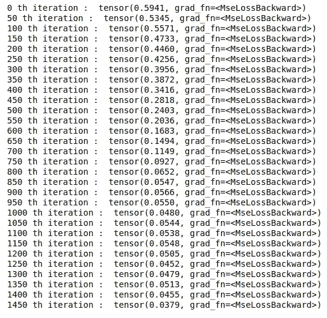

# 深度学习的 PyTorch 序列数据的 LSTM

> 原文：<https://medium.com/analytics-vidhya/pytorch-for-deep-learning-lstm-for-sequence-data-d0708fdf5717?source=collection_archive---------0----------------------->


# 注意

抱歉拼错了 network，lol。所有的代码文件都可以在:[https://github.com/ashwinhprasad/PyTorch-For-DeepLearning](https://github.com/ashwinhprasad/PyTorch-For-DeepLearning)获得

# 什么是 rnn 和 LSTMs？

递归神经网络非常适合序列数据和时间序列数据。长短期记忆是一种用于深度学习领域的人工递归神经网络架构。LSTMs 和 rnn 用于序列数据，可以更好地处理时间序列问题。

“LSTM”是“RNN”的高级版本，LSTM 可以通过在普通的“RNN”上添加“门”来记住之前学到的东西。LSTM 和 RNN 在 PyTorch 的工作是相似的。因此，一旦我们编写了 Lstm 部分，RNNs 也将更容易理解。
在这本笔记本中，我们将尝试用递归神经网络预测正弦波。

RNNs 和 LSTMs 的理论不在本文讨论范围之内。这只适用于 rnn 和 lstm 的 pytorch 实现。

# 跳到代码:

1.  **导入库**

```
*#importing the libraries*
import numpy as np 
import torch
import matplotlib.pyplot as plt
```

**2。数据预处理**

我正在创建一个正弦波，正如我已经说过的，lstm 接受序列输入。因此，输入如下:
**输入:[点 1，点 2，点 3…..，点 n]预测:[点 n+1]。**
我们需要许多这样的行来创建数据集。

```
*#creating the dataset*
x = np.arange(1,721,1)
y = np.sin(x*np.pi/180)  + np.random.randn(720)*0.05
plt.plot(y)
```


```
*# structuring the data* 
X = [] 
Y = [] 
**for** i **in** range(0,710):
     list1 = []
     **for** j **in** range(i,i+10):
         list1.append(y[j])
     X.append(list1)
     Y.append(y[j+1])
```

为了以这样一种方式安排数据，将它发送到一个递归神经网络，我们这样做，并以这种形式安排准备数据集。
**输入:【点 1，点 2，点 3…..，点 n]预测:[点 n+1]。**

**3。列车试运行**

```
*#train test split*
X = np.array(X)
Y = np.array(Y)
x_train = X[:360]
x_test = X[360:]
y_train = Y[:360]
y_test = Y[360:]
```

这是不言自明的

**4。数据集和数据加载器**

```
*#dataset*
**from** **torch.utils.data** **import** Dataset

**class** **timeseries**(Dataset):
    **def** __init__(self,x,y):
        self.x = torch.tensor(x,dtype=torch.float32)
        self.y = torch.tensor(y,dtype=torch.float32)
        self.len = x.shape[0]

    **def** __getitem__(self,idx):
        **return** self.x[idx],self.y[idx]

    **def** __len__(self):
        **return** self.len

dataset = timeseries(x_train,y_train)#dataloader
**from** **torch.utils.data** **import** DataLoader 
train_loader = DataLoader(dataset,shuffle=**True**,batch_size=256)
```

Pytorch 的数据集和数据加载器类有助于简化数据访问和小批量梯度下降

**5。递归神经网络**

这类似于用 pytorch 创建的所有其他神经网络。但是，第一层是 lstm 层，它将接受作为序列的输入

```
*#neural network*
**from** **torch** **import** nn

**class** **neural_network**(nn.Module):
    **def** __init__(self):
        super(neural_network,self).__init__()
        self.lstm = nn.LSTM(input_size=1,hidden_size=5,num_layers=1,batch_first=**True**)
        self.fc1 = nn.Linear(in_features=5,out_features=1)

    **def** forward(self,x):
        output,_status = self.lstm(x)
        output = output[:,-1,:]
        output = self.fc1(torch.relu(output))
        **return** output

model = neural_network()
```

**输入尺寸:**输入到层的一个 lstm 单元的尺寸。在我们的例子中，这是一个，因为在每个时间步，我们都要输入一个标量数。

**隐藏大小:**这是我们可以选择的，权重矩阵将根据这一点进行自我调整，这也将是每个时间步长的输出向量的维度。

num_layers : 如果它大于 1，让我们将 rnn 层堆叠在彼此之上。在我们的例子中，一层就足够了。所以，我选择了 1

6。损失、优化器、时期

```
*# optimizer , loss*
criterion = torch.nn.MSELoss()
optimizer = torch.optim.Adam(model.parameters(),lr=0.0001)
epochs = 1500
```

7。训练循环(向前传球和向后传球)

计算相对于所有参数的损耗梯度，并执行梯度下降

```
*#training loop*
**for** i **in** range(epochs):
    **for** j,data **in** enumerate(train_loader):
        y_pred = model(data[:][0].view(-1,10,1)).reshape(-1)
        loss = criterion(y_pred,data[:][1])
        loss.backward()
        optimizer.step()
    **if** i%50 == 0:
        print(i,"th iteration : ",loss)
```



**8。神经网络预测**

```
*#test set actual vs predicted*
test_set = timeseries(x_test,y_test)
test_pred = model(test_set[:][0].view(-1,10,1)).view(-1)
plt.plot(test_pred.detach().numpy(),label='predicted')
plt.plot(test_set[:][1].view(-1),label='original')
plt.legend()
```


# 结论

正如我们所见，LSTM 非常强大，而处理序列数据是自然语言处理中非常重要的一部分。在上面的预测中，我们可以看到模型已经很好地预测了正弦波。

## 谢谢你