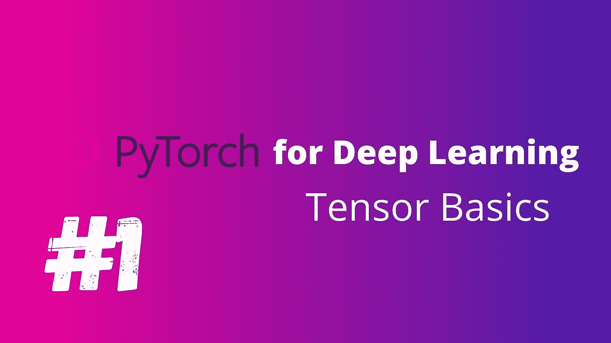

# 深度学习的 PyTorch 张量基础

> 原文：<https://medium.com/analytics-vidhya/pytorch-for-deep-learning-part-1-1324a45b0af3?source=collection_archive---------18----------------------->

# Pytorch 是什么？

Pytorch 是由脸书开发的深度学习库。它可以用于各种目的，如自然语言处理、计算机视觉等

# 先决条件

Python，Numpy，Pandas 和 Matplotlib

# 张量基础