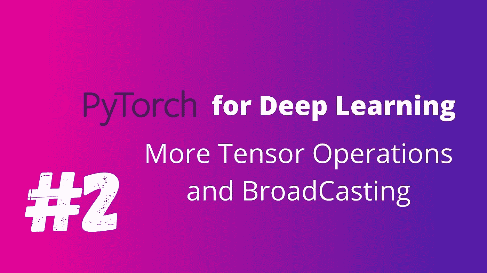
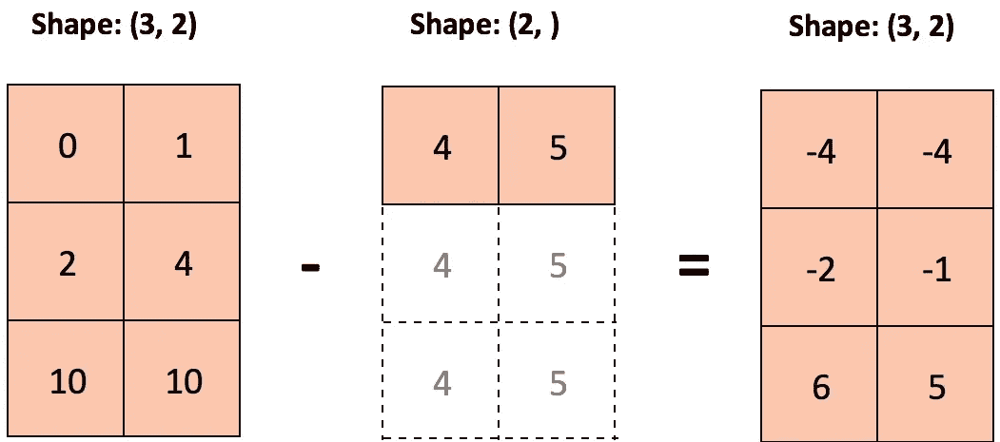

# 深度学习的 PyTorch 张量广播

> 原文：<https://medium.com/analytics-vidhya/pytorch-for-deep-learning-part-2-bc0cfa12e74?source=collection_archive---------16----------------------->



# PyTorch 中的更多张量运算

在继续之前，让我们导入所需的库

```
#importing the librariesimport numpy as np
import torch
```

让我们创建两个张量，以便对它们执行一些操作

```
t1 = torch.tensor([[1,2],[3,4]])
t2 = torch.tensor([[5,6],[7,8]])
```

# **元素式操作**

抱歉格式混乱

```
print("Tensor addition : {}\nTensor Subtraction : {}\nTensor Multiplication : {}\nTensor Division : {}".format(t1+t2,
t1-t2,t1*t2,t1//t2))**Output:** Tensor addition : tensor([[ 6,  8],         
                          [10, 12]])

Tensor Subtraction : tensor([[-4, -4],         
                             [-4, -4]])

Tensor Multiplication : tensor([[ 5, 12],         
                                [21, 32]])

Tensor Division : tensor([[0, 0],         
                          [0, 0]])
```

# 广播

广播是一种允许我们对不同大小的张量执行算术运算的功能
在下面的例子中，标量“2”被转换为 t1 形状的张量，然后执行加法和减法。

```
#broadcasting with scalarsprint("{}\n{}".format(t1 + 2,t1 - 2))**output:**tensor([[3, 4],         
        [5, 6]]) tensor([[-1,  0],         
        [ 1,  2]])
```

再来看看广播除了 2 个张量
广播也可以在多个张量上进行。
在下面的示例中，将一行附加到 t5，其值与第一行的值相同。然后，执行加法

```
#broadcasting tensorst3 = torch.tensor([[1,2],[3,4]])
t5 = torch.tensor([5,5])
print(t3+t5)**output:**tensor([[6, 7],         
        [8, 9]])
```



广播如何工作

广播一开始可能会令人困惑。但是，经过足够的练习，它会变得容易

# 归约操作

归约运算是在执行时减小张量大小的运算

```
#reduction operationsprint(t1)
print("Some of the reduction operations are:\nadd:{}\nmax:{}\nproduct:{}".format(t1.sum(),t1.max(),t1.prod()))**output:**tensor([[1, 2],
        [3, 4]])Some of the reduction operations are: 
add:10 
max:4 
product:24
```

Argmax 函数:返回张量最大元素的索引

```
#argmax functionprint(t1,"\nindex of the largest element is : ",t1.argmax())**output:**tensor([[1, 2],         
        [3, 4]])

index of the largest element is :  tensor(3)
```

# 张量到 Python 数据类型

就像 numpy 数组可以转换成 torch 张量一样，张量也可以转换成 numpy 数组或常规 python 数据类型。
如果是标量，。item()会将张量转换成 python 整数
如果是向量，。tolist()将张量转换成 python 列表

```
#tensor to python datatypesprint(t1.max().item(),"\n{}".format(t1.flatten().tolist()))**output:**4  
[1, 2, 3, 4]
```

# 结论

一些更多的张量运算和广播显示在这个职位。

## 谢谢你