# Pytorch 实现从无到有的单类语义切分。

> 原文：<https://medium.com/analytics-vidhya/pytorch-implementation-of-semantic-segmentation-for-single-class-from-scratch-81f96643c98c?source=collection_archive---------1----------------------->


图片由 MIDHUN GEORGE 通过 unsplash 拍摄

## 介绍

语义分割可以被认为是像素级的分类，更准确地说，它是指将图像中的每个像素链接到类别标签的过程。我们在这里试图回答**什么&图像中的位置**，语义分割不同于实例分割，在实例分割中，相同类别的对象将具有不同的标签，如 car1、car2 中的不同颜色。

在语义分割以非常复杂的形式用于多类的情况下，有许多可用的存储库。**通过这个博客，我试图为一个类从头开始实现语义分割，经过一些调整后，同样的方法应该适用于多个类**。

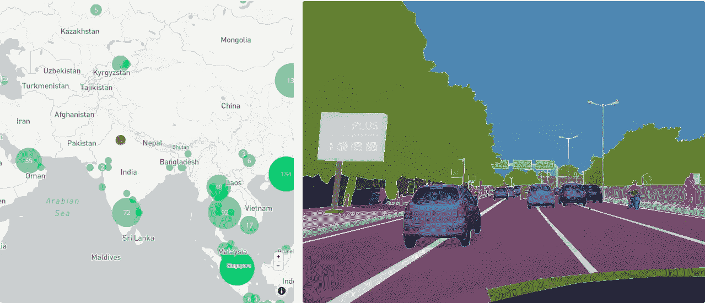

自动驾驶[图片来源](https://www.mapillary.com/dataset/vistas?pKey=-3WWvMk6i1YgKC9ECG2HEA&lat=26.38900088674862&lng=82.67520964428127&z=2.4745541932089794)

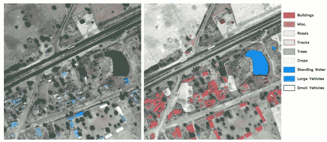

空中成像[图像](https://deepsense.ai/deep-learning-for-satellite-imagery-via-image-segmentation/)来源

> 它的一些主要应用是在**自动驾驶**、**医学图像诊断、航空成像**、**照片编辑/创意工具以及更多**。

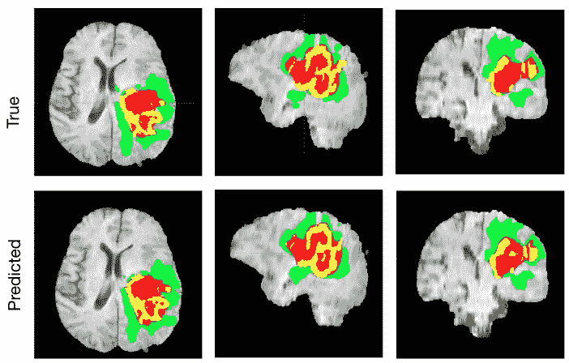

脑肿瘤预测[图片](https://news.developer.nvidia.com/automatically-segmenting-brain-tumors-with-ai/)来源

## 涵盖主题的路线图

1.  [***概述***](#2f8a)
2.  [***关于我们将要使用的数据和框架的简要描述。***](#6188)
3.  [***代码实现为单个类。***](#e8e0) ***a .***[**数据预处理管道**](#1a68) **b .**[**Dataloders 管道**](#d7c8) **c .**[**分数管道**](#d15b) **d .**[***培训***](#652e)
4.  [***推论***](#f693)

## 语义图像分割综述

给定一幅灰度(H，W，1)或 RGB(H，W，3)图像，我们希望生成一个与图像维数相同的分割掩码，它由从 1 到 N 的分类值组成(N 是类的数量)。

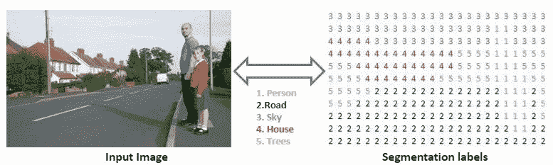

输入图像到分割标签[信用](http://self)

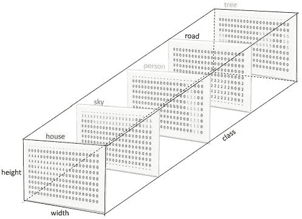

分类到一个热编码标签信用

由分类值组成的语义标签也可以被热编码，如左图所示。

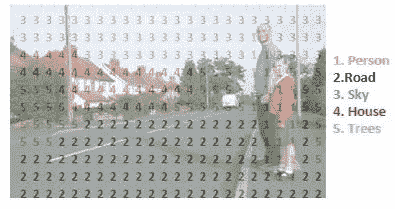

原始图像和语义标签的重叠

在取 argmax 并与原始图像重叠后，我们将在左侧得到一个图像。

## 数据集和框架

我们将使用 kaggle 提供的 [carvana](https://www.kaggle.com/c/carvana-image-masking-challenge) 数据集，它包含了大量的汽车图像。每辆车正好有 16 张照片，每张都是从不同的角度拍摄的。

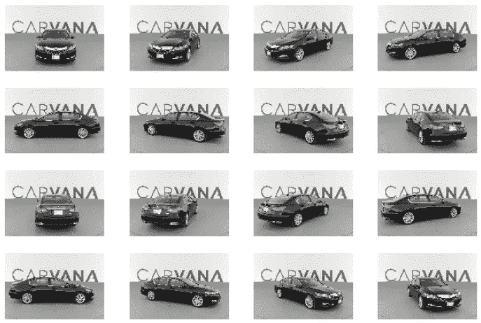

单车图像的 16 个方向

> **文件描述**

*   train —此文件夹包含训练集图像(。jpg) [1280，1918]
*   测试—该文件夹包含测试集图像(jpg)[1280，1918]
*   train_masks —此文件夹包含训练集掩码(。gif) [1280，1918]
*   train_masks.csv —该文件提供了训练掩码的游程编码版本。
*   metadata.csv 包含所有汽车的基本信息。

作为框架，我们将主要使用 **Pytorch 和 sklearn** (用于 train/val 分割)。

# 单个类的实现

实施细分为 4 个管道

1.  **数据预处理管道-** 将 train_mask 图像从。gif 到。png，然后我们将转换列车和列车掩码图像(。png)从它们的原始维度到新维度[128，128]。出于所有培训目的，我们将使用这 128，128 幅图像。
2.  **数据加载器管道-** 这里我们将批量获取图像，对其应用变换&，然后返回用于训练和验证阶段的数据加载器。
3.  **分数管道**——计算所需分数的管道(在我们的例子中是 kaggle 提到的骰子分数)。
4.  **训练管道** -开始训练的最终管道，计算损失&更新参数。

> **入门！！！**

对于这篇博客中的所有代码片段，我都尽量在需要的地方做了注释。我们将开始导入所有需要的库。

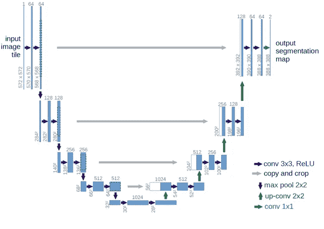

我们将使用 Unet 架构，因为我们将使用由[segmentation _ models . py torch](https://github.com/qubvel/segmentation_models.pytorch)提供的高级 API

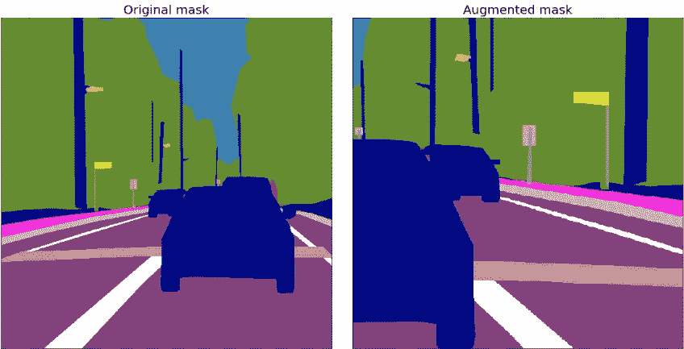

对于图像和遮罩增强，我们将使用由[albuminations](https://github.com/albumentations-team/albumentations)提供的 API。

1.  **数据预处理流水线**

首先，我们将转换火车面具从。gif 到。png，然后我们将调整火车的大小，并将图像遮罩为[128，128]。这里我们将使用 ThreadPoolExecutor 进行并行操作。

数据预处理

现在，我们将在 dataframe 中加载 train_masks.csv，以便获取图像名称。我不会使用这个 csv 中提供的训练掩码的游程编码版本，而是直接使用刚刚生成的掩码图像。

```
df=pd.read_csv('/home/arun/Shashank/carvana/train_masks.csv')# location of original and mask image
img_fol='/media/shashank/New Volume/carvana/train-128'
mask_fol='/media/shashank/New Volume/carvana/train_masks-128'# imagenet mean/std will be used as the resnet backbone is trained on imagenet stats
mean, std=(0.485, 0.456, 0.406),(0.229, 0.224, 0.225)
```

由于我们将使用在 imagnet 上训练的 resnet 后端，因此我们将设置 imagenet 数据的平均值和标准偏差以用于转换目的。

2.**数据加载器管道**

在本节中，我们将实现自定义转换、数据集和数据加载器。
从取决于相位的变换开始，如果是“训练”,那么我们将使用水平翻转以及规格化和传感器。如果“val ”,那么我们将只使用 Normalize 和 ToTensor。

应用变换

在转换之后，我们将创建一个名为 CarDataset 的自定义数据集类，在这里，我们使用 dataloader 中的索引 id 获取原始图像和遮罩，然后在其上应用转换。这个类的输出是形状的图像张量[3，128，128]和遮罩张量[1，128，128]。对于掩模张量，我们只有一个通道，因为我们只训练一个类。

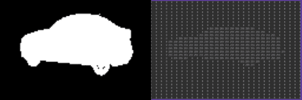

屏蔽单通道表示[1，128，128]。

自定义数据集

现在使用 CarDataloader 函数，我们将输入数据帧分成训练数据帧和有效数据帧(仅为了命名)。使用这些数据框架，我们创建用于训练和验证的数据加载器。

数据加载器

**3。分数管道**

为了解决类别不平衡的问题，我们使用**软骰子得分**而不是使用**像素交叉熵损失**。为了计算每个类别的 SDS，我们乘以(预测分数*目标分数)并除以(预测分数+目标分数)的总和。

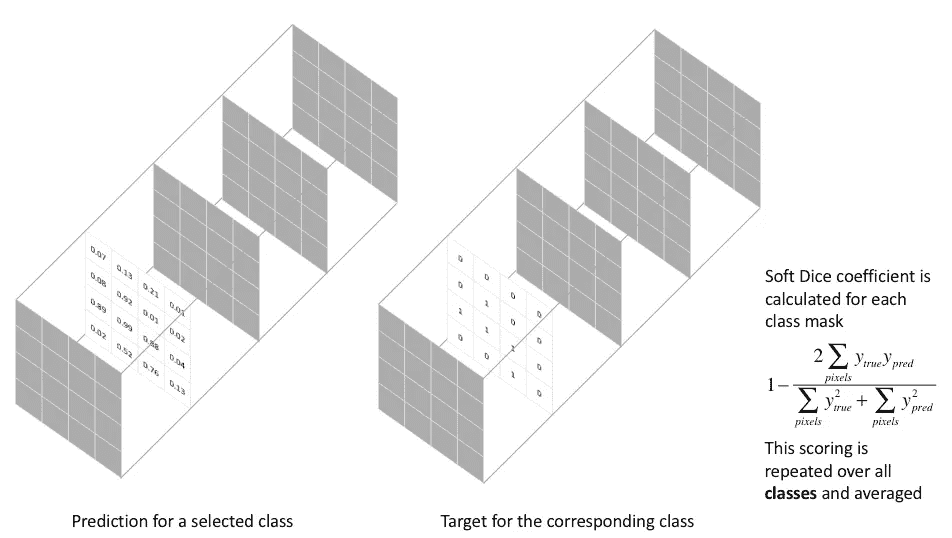

[图像](https://www.jeremyjordan.me/semantic-segmentation/)

在所有批次的每个时期内，我们计算骰子点数并添加到一个空列表中。在时期结束时，我们计算骰子点数的平均值，其代表该特定时期的骰子点数。

在 epoch 结束时，我们使用 epoch_log 函数记录骰子值。

**4。培训渠道**

在最后一个管道中，我们通过初始化大多数值来创建一个训练器类。

培训师课程

在每个时期的**开始方法**中，我们将首先调用迭代方法进行训练，然后调用迭代方法进行验证&，然后调用**学习速率调度**。如果当前验证损失小于前一个，则我们保存模型参数。

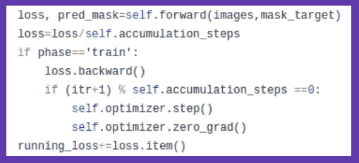

在**迭代方法**中，我们调用向前方法来计算损耗，然后除以累加步长&加到运行损耗上。同时，我们继续存储损耗梯度，直到 loss.grad 中的累积步骤。

之后，我们进行优化步骤，一旦达到累积步骤，就将梯度归零。最后，我们将有纪元损失，骰子得分&将清除 cuda 缓存内存。

在正向方法中，我们将原始图像和目标遮罩发送到 GPU，创建一个正向过程来获得预测遮罩。使用损失函数，我们计算损失。

# 从 smp 加载架构

现在是从 smp 加载 UNet 架构的时候了，使用 resnet18 作为主干。对于类的数量，我们使用 1 作为我们的掩码维数是[1，128，128]。

```
model = smp.Unet("resnet18", encoder_weights="imagenet", classes=1, activation=None)
```

让魔法开始吧！！！！！！！！！！！！！！！

```
model_trainer = Trainer(model)
model_trainer.start()Starting epoch: 0 | phase:train | 🙊':02:02:11
Loss: 0.1084 |dice: 0.9460
Starting epoch: 0 | phase:val | 🙊':02:02:48
Loss: 0.0358 |dice: 0.9783
******** New optimal found, saving state ********

Starting epoch: 1 | phase:train | 🙊':02:02:55
Loss: 0.0288 |dice: 0.9800
Starting epoch: 1 | phase:val | 🙊':02:03:29
Loss: 0.0239 |dice: 0.9815
******** New optimal found, saving state ********

Starting epoch: 2 | phase:train | 🙊':02:03:36
Loss: 0.0205 |dice: 0.9836
Starting epoch: 2 | phase:val | 🙊':02:04:11
Loss: 0.0185 |dice: 0.9844
******** New optimal found, saving state ********

Starting epoch: 3 | phase:train | 🙊':02:04:18
Loss: 0.0172 |dice: 0.9854
Starting epoch: 3 | phase:val | 🙊':02:04:53
Loss: 0.0167 |dice: 0.9853
******** New optimal found, saving state ********

Starting epoch: 4 | phase:train | 🙊':02:04:59
Loss: 0.0155 |dice: 0.9863
Starting epoch: 4 | phase:val | 🙊':02:05:34
Loss: 0.0154 |dice: 0.9860
******** New optimal found, saving state ********

Starting epoch: 5 | phase:train | 🙊':02:05:40
Loss: 0.0149 |dice: 0.9864
Starting epoch: 5 | phase:val | 🙊':02:06:14
Loss: 0.0158 |dice: 0.9850

Starting epoch: 6 | phase:train | 🙊':02:06:20
Loss: 0.0142 |dice: 0.9869
Starting epoch: 6 | phase:val | 🙊':02:06:55
Loss: 0.0158 |dice: 0.9848

Starting epoch: 7 | phase:train | 🙊':02:07:00
Loss: 0.0132 |dice: 0.9877
Starting epoch: 7 | phase:val | 🙊':02:07:35
Loss: 0.0145 |dice: 0.9863
******** New optimal found, saving state ********

Starting epoch: 8 | phase:train | 🙊':02:07:41
Loss: 0.0127 |dice: 0.9881
Starting epoch: 8 | phase:val | 🙊':02:08:15
Loss: 0.0151 |dice: 0.9855

Starting epoch: 9 | phase:train | 🙊':02:08:21
Loss: 0.0125 |dice: 0.9882
Starting epoch: 9 | phase:val | 🙊':02:08:57
Loss: 0.0136 |dice: 0.9869
******** New optimal found, saving state ********
```

# 推理

在大约 6 分钟内，我们达到了令人印象深刻的 98.7 的骰子得分，使用节省下来的权重，我们将使用下面的片段对我们的验证数据进行推断。

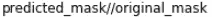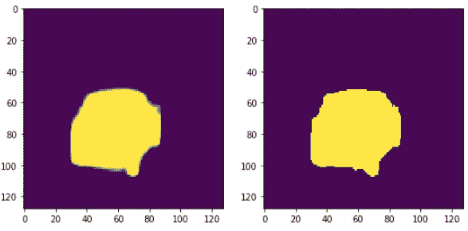

左为预测遮罩，右为目标遮罩。

# **结论**

这可能不是 SOTA 的结果，但是通过使用仅仅 200 行代码，我们清楚地了解了语义分割是如何工作的。通过调整几行代码，可以对多类标签做同样的事情。请**分享，如有评论请**留下。