# Pytorch 在成长，Tensorflow 没有。

> 原文：<https://medium.com/analytics-vidhya/pytorch-is-growing-tensorflow-is-not-6986c5e52d6f?source=collection_archive---------6----------------------->

## 数据科学的趋势有利于 Pytorch。用图表解释。

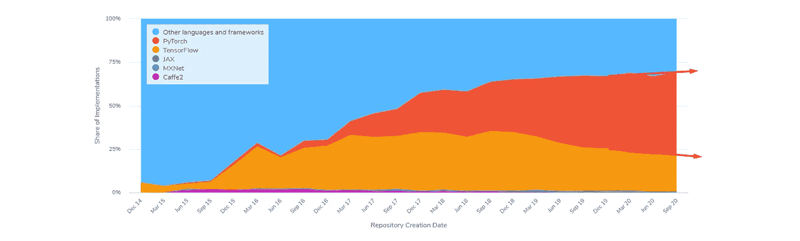

(2014 年至 2020 年[)来源](https://paperswithcode.com/trends)

衡量框架采用情况的一种方法是统计有多少论文在每个框架上写了代码。网站 [PapersWhitCode](https://paperswithcode.com/) [只统计](https://paperswithcode.com/trends)那些在知识库中有代码实现的论文。因此，澄清一下，我们可以说这种趋势是开放研究。该图按所用框架的百分比显示了过去 5 年的趋势。从去年开始，Pytorch 明显在增长，而 Tensorflow 却没有。要回顾这一趋势，我们需要仔细观察。

2019–01–01 年，TensorFlow (32%)的参与比例与 Pytorch (32%)持平。然而，在 2020-09-30 年，Tensorflow 的参与率为 47 %, py torch 为 20%。

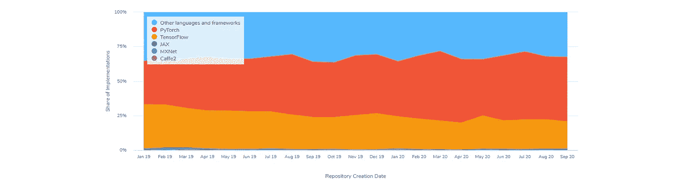

(2019–01 至 2020–09[来源](https://paperswithcode.com/trends)

# 但是，如果我们检查另一个来源呢？什么显示了谷歌的趋势？

Google Trends 绘制了关于人们兴趣的图表，测量他们网站上的搜索量。这个数据是可信的，因为谷歌在过去的 5 年里已经拥有超过 85%的全球市场份额。

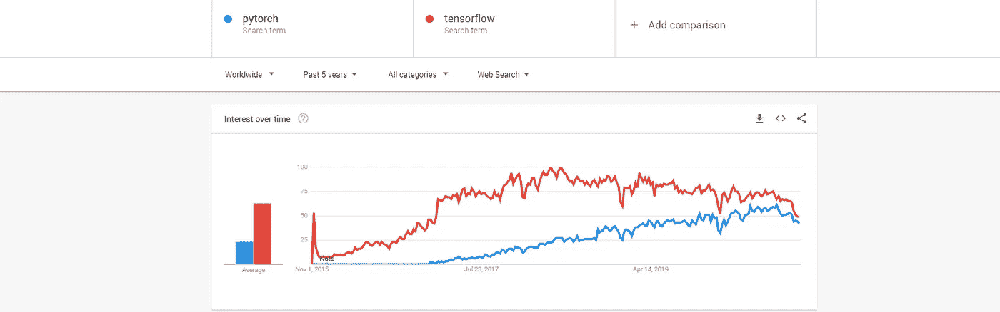

[来源](https://trends.google.com/trends/explore?q=pytorch,tensorflow)

如果我们看一下过去 5 年的全球趋势，我们可以确认对 Pytorch ( *blue* )的兴趣越来越大，而对 Tensorflow 的兴趣大约从 2018-05 年开始下降，届时 TensorFlow 将发布 **r1.8** 版本，并在 2019-03 年恢复发布 **r1.13** 。这并不意味着发行版创造了那个变种。

> 在疫情，这两种趋势都受到了影响。

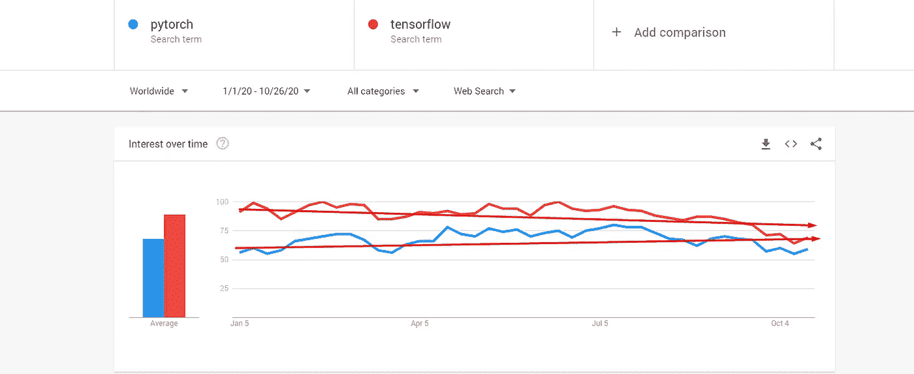

[来源](https://trends.google.com/trends/explore?q=pytorch,tensorflow)

## 在过去 12 个月中，与其他框架相比，哪些国家对每个框架最感兴趣？

以色列对 Pytorch 的兴趣最大，该国有 54%的人对 py torch 感兴趣，但在哥伦比亚，人们更喜欢学习 Tensorflow (84%)。*相反的颜色表示另一个框架。

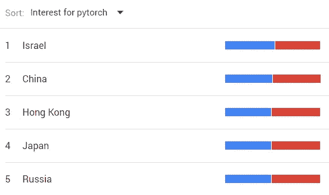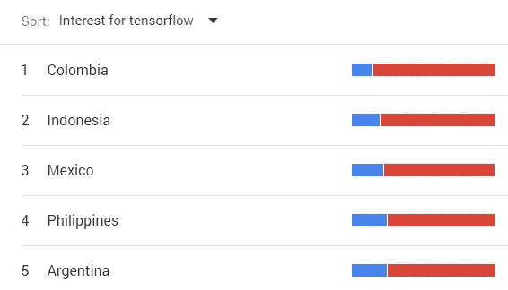

# 背后的历史呢？

年度视图可以分享更多发生的事情。到目前为止，我们可以回顾的它们的公共开发的主要区别是 Github 上的公共存储库:

*   Tensorflow 于 2015 年发布了第一个版本，Pytorch 于 2016 年发布。
*   在 Github 上，Tensorflow 有大约+90 000 次提交，Pytorch 有+30 000 次提交。

# 2015

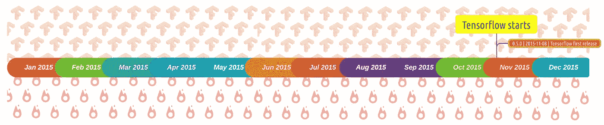

*   “TensorFlow 由谷歌大脑团队开发，供谷歌内部使用。它于 2015 年在 Apache License 2.0 下发布。”[ [S](https://www.wired.com/2015/11/google-open-sources-its-artificial-intelligence-engine/)

# 2016

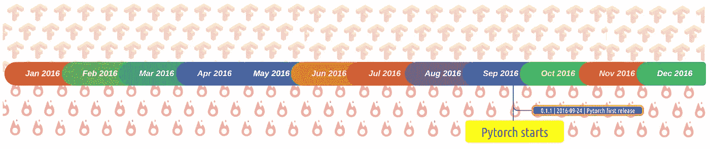

*   " Pytorch 由脸书团队于 2016 年发布了第一个版本."[ [S](https://github.com/pytorch/pytorch/releases/tag/v0.1.1)
*   基于 [Torch](https://github.com/torch/torch7) 库，PyTorch 被开发成用 Python 编写，寻找一种使用 GPU 的快速易读的编码。

# 2017

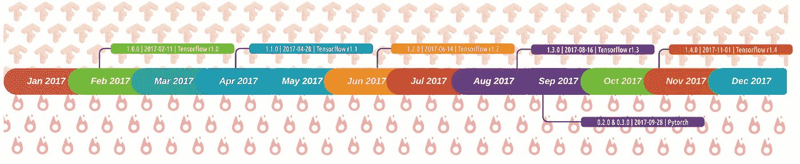

*   2017 年，Tensorflow 发布第一个非 alpha 版本( **r1.0** ) [ [S](https://en.wikipedia.org/wiki/TensorFlow#cite_note-14) ]
*   Tensorflow 启动并完成了对多个 GPU 和 CPU 的支持。[ [S](https://www.wired.com/2015/11/googles-open-source-ai-tensorflow-signals-fast-changing-hardware-world/)
*   Tensorflow 发布了一个用于移动设备的精简版 Tensorflow。[ [S](https://www.theverge.com/2017/5/17/15645908/google-ai-tensorflowlite-machine-learning-announcement-io-2017)
*   12 月，Tensorflow 被包括在 Kubernetes 部署中，因此，此时，整个云已经可以使用 Tensorflow。[S]
*   在 Pytorch 的例子中，脸书创建了 ONNX，一个在框架间转换模型的工具。 [S](/@Synced/caffe2-merges-with-pytorch-a89c70ad9eb7)

# 2018

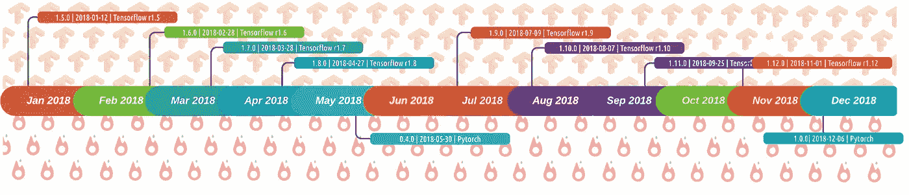

*   Tensorflow 的黄金时代，所有版本和实现的快速发布开始公开发布。
*   Tensorflow 在 Javascript 上发布了他们版本。 [S](/tensorflow/introducing-tensorflow-js-machine-learning-in-javascript-bf3eab376db)
*   谷歌发布了 Edge TPU，这是一款为移动设备设计的运行 TensorFlow Lite 的芯片。 [S](https://beebom.com/google-announces-edge-tpu-cloud-iot-edge-at-cloud-next-2018/)
*   谷歌正式发布了第一个介绍 Tensorflow 的课程。为谷歌的雇主设计，但决定公开发布。 [S](https://developers.google.com/machine-learning/crash-course/)
*   谷歌开始 Tensorflow 研讨会。 [S](https://developers.google.com/machine-learning/crash-course/)
*   对于 Pytorch，Caffe(脸书管理的另一个机器学习框架)被合并到 Python 中。[ [S](/@Synced/caffe2-merges-with-pytorch-a89c70ad9eb7)
*   Pytorch 在 1.0.0 版正式推出 Torchvision 库。
*   多朵云开始支持 Pytorch。

# 2019

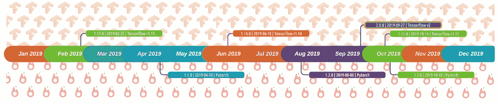

*   Tensorflow 2.0 宣布发布。[ [S](/tensorflow/tensorflow-2-0-is-now-available-57d706c2a9ab)
*   Google 宣布并发布 Tensorflow Graphics，专门做深度学习。[ [S](/tensorflow/introducing-tensorflow-graphics-computer-graphics-meets-deep-learning-c8e3877b7668)
*   谷歌宣布 Tensorflow Lite Micro 和 ARM Tensor 将针对微控制器进行合并。[ [S](https://os.mbed.com/blog/entry/uTensor-and-Tensor-Flow-Announcement/)
*   Pytorch 发布了它们在移动设备中的使用示例。[ [S](https://github.com/pytorch/android-demo-app) ]

# 2020 年(疫情版)

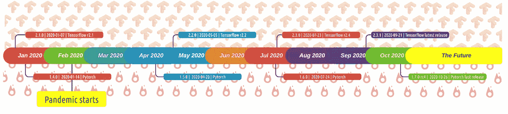

*   基于人工智能的投资急剧增加。
*   现在，Pytorch 加快了发布速度。但是，Tensorflow 正在准备其他东西，不得而知。

# 为什么人们更喜欢 Pytorch 而不是其他框架？

根据[这条](https://www.infoworld.com/article/3528780/5-reasons-to-choose-pytorch-for-deep-learning.html)，原因基本上是:

*   **PyTorch 是 Python:** 易于读写。
*   **PyTorch 现成可用:**“只需一行代码就可以得到一个预先训练好的 ResNet-50 模型。”

```
model = torch.hub.load('pytorch/vision', 'resnet50', pretrained=**True**)
```

*   **PyTorch 规则研究:**在研究中使用最多，如本帖第一图所示。
*   **PyTorch 让学习深度学习变得简单:** [fast.ai](http://fast.ai) ，一家使用深度学习的知名网站，从 Keras 切换到 PyTorch，并基于 Pytorch 开设免费课程。
*   PyTorch 有一个很棒的社区:一个有据可查的框架写起来令人满意。

> Tensorflow 是时候转向易于编写的模型了吗？