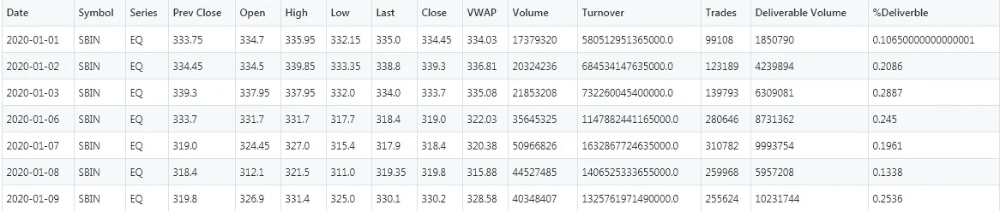
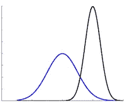
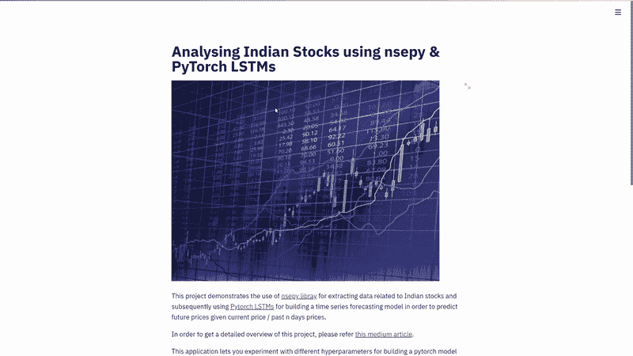
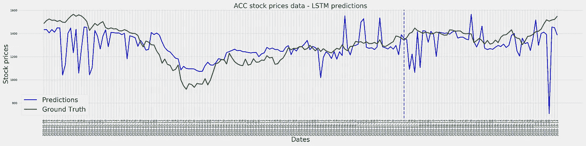
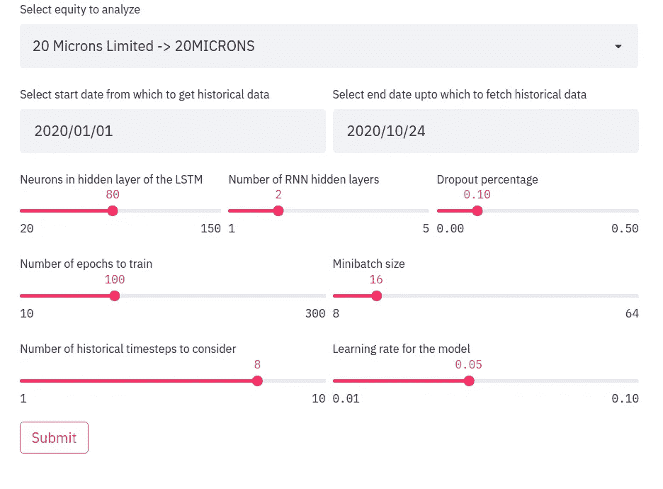

# PyTorch LSTMs 用于印度股票的时间序列预测

> 原文：<https://medium.com/analytics-vidhya/pytorch-lstms-for-time-series-forecasting-of-indian-stocks-8a49157da8b9?source=collection_archive---------0----------------------->

## 使用深度学习交互式预测股票轨迹


照片由来自 [Pexels](https://www.pexels.com/photo/black-and-white-business-chart-computer-241544/?utm_content=attributionCopyText&utm_medium=referral&utm_source=pexels) 的 [Lorenzo](https://www.pexels.com/@lorenzocafaro?utm_content=attributionCopyText&utm_medium=referral&utm_source=pexels) 拍摄

这篇文章的目录如下，点击任何一个项目符号就可以切换到相应的部分

*   [简介](#5730)
*   [使用 nsepy 提取股票历史数据](#a42b)
*   [管理数据，将其传递给 LSTM 模型](#b052)
*   [定义 LSTM 模型架构](#da88)
*   [训练模型](#20f8)
*   [对看不见的数据进行预测](#4f34)
*   [结论](#dc4d)
*   [参考文献](#85f9)

# 介绍

时间序列数据已经存在了很长一段时间，许多人对它们进行了研究，并提出了分析数据的方法，以找到有意义的见解，并随后使用它来对该序列在未来将如何发展做出可靠的预测。股票市场投资者利用这些信息来衡量股票的表现，从而做出明智的投资决策。传统的时间序列算法，如 ARIMA，萨里玛，霍尔特-温特的方法等。做好时间序列的建模工作；然而，最近，随着深度学习的出现，递归神经网络在建模序列数据方面越来越受欢迎。

由于时间序列基本上是一个序列，rnn(特别是 LSTMs)已被证明是有用的建模。在本帖中，我们将使用 streamlit 构建一个仪表板，使用 PyTorch 中的 LSTMs 分析印度股票市场的股票。股票数据将使用 nsepy——一个由 T21 开发和维护的开源 python 库。

事不宜迟，让我们直入主题吧。

# 使用 nsepy 提取股票历史数据

截至目前，印度股市(股票)由 1655 只上市股票组成，该数据可从这里获得[。借助于从该站点提取的 csv 文件中的 ticker 列，我们可以使用 nsepy 获得任何上市股票的历史信息，方法是使用包中预定义的`get_history`函数。可以这样做。](https://www1.nseindia.com/corporates/content/securities_info.htm)

用户只需提供股票代码信息，以及他们需要该代码的历史数据的起始日期和截止日期。提取的数据是作为 pandas dataframe 获得的，为了便于我们的分析，我们对其中的 date 和 close 列感兴趣。

默认情况下，该函数返回股票历史数据，您也可以通过传递期权类型、执行价格和合同到期日来获得相应股票的期权数据。或者您可以将 futures 参数传递给 true，并传递到期日期来获取期货数据。

> nsepy 库是一个方便的库，具有编写良好的函数，对任何想要对股票数据进行分析的人都有帮助。这里有更多关于[的信息](https://nsepy.xyz)。

# 管理数据并将其传递给 LSTM 模型

一旦我们从网站上获得数据，它看起来就像这样。



SBI 股票数据

我们将使用上表中的日期和收盘字段，即我们将建立一个 LSTM 模型，该模型预测给定前 n 天的收盘值，当天的收盘值是多少。我们过去所看到的级数通常被称为滞后数或简称为滞后数。我们将把它作为用户的输入，这样他们就可以用它做实验，自己去看。

您需要遵循一系列步骤来将这些数据转换成可以在 pytorch 模型中加载的格式。这是按时间顺序排列的。

*   从上面显示的数据帧中提取感兴趣的列。(关闭和日期列)。
*   将数据帧下移滞后次数，并删除第一批滞后行。这将为我们提供列格式的输入输出对。然后，可以将它转换为输入的元组列表和股票价格输出值的浮点数列表。其逻辑在下面的函数中定义。

*   为了向 pytorch 中的模型提供数据，我们需要创建一个 dataloader，它可以生成成批的输入和输出。Pytorch 支持构建我们自己的定制数据类，并在其上包装一个数据加载器，以便按照我们的意愿向模型提供数据。
    因此，我们将扩展 Dataset 类并定义我们自己的类，如下所示。

*   上面的关键函数是 get item 函数，它提供输入和输出。因为 pytorch 模型只接受数据类型为 pytorch 张量的数据，所以我们将它们从列表中包装成 torch 张量。由于价格是十进制数字，我们小心翼翼地将数据包装成浮点张量。

> 在任何机器学习算法中，在以前看不见的数据上验证我们的数据集是很重要的，以确保我们建立的模型没有记住训练数据，这将导致我们错误地认为我们的模型表现得非常好，而事实上它并不是这样(过度拟合)。

*   为了解决上述事实，我们使用训练集中的 70%数据和验证集中的 30%数据来执行训练验证分割。
*   另一个非常重要的方面，尤其是从深度学习的角度来看，是避免协变量的变化。



图片由 Vinayak 提供

当我们在一个预测模型中有一个以上的特征时，可能或者更确切地说，大多数情况下，它们具有不同的分布，并且处于完全不同的尺度上。正因为如此，随着损失分布趋于不均匀，神经网络试图优化的成本函数变得更加困难。相反，如果我们将这两个分布带到一个均匀的尺度，误差分布变得均匀，这有助于神经网络更好地优化成本函数。实现这一点的一种方法是输入数据的标准化，原则上，将所有输入参数转换为平均值为 0，标准偏差为 1。在网络的不同层内部，使用批量标准化来避免协变量移位问题。因此，以下功能根据输入(即列车分布)对数据进行标准化。

*   在将数据分成训练和验证数据集并随后对其进行标准化之后，我们将创建 pytorch 数据加载器，以便加载数据并在稍后将其提供给 pytorch 模型。

既然我们已经以必要的格式准备好了所有的数据，我们将切换到定义一个预测股票价格的 LSTM 模型。

# 定义 LSTM 模型架构

LSTM 或长期短期记忆的缩写是一种递归神经网络，用于模拟涉及序列的问题。序列问题可能有几种输入输出用例，如一对一(单词翻译)、一对多(图像字幕生成)、多对多(语言翻译)；但是我们的情况是多对一的，即给定一个输入列表，我们预测一个输出。

对于长度相当短的序列(每条记录少于 15-20 个单位)，LSTMs 在解码相关性并捕获它们以建立一个稳健的模型方面做得很好，但是由于消失梯度问题，它们不能捕获长期相关性；当我们回顾模型预测时，我们将再次讨论这个问题。

现在，让我们专注于创建一个 LSTM pytorch 模型。

正如我们看到的，我们的模型由一个 LSTM 层和两个完全连接的线性层组成。

LSTM 层需要一个三维输入的形式

```
*(seq_len, batch, input_size)*
```

批处理大小是一个可以在训练时设置的训练超参数，seq_len 和输入大小是我们需要从数据加载器中了解的两个参数。因为我们要查看 n_lags 历史股票价格，我们的 seq_len 是 3，我们只查看一个特征，即股票价格，所以我们的 input_features 只有 1。

我们的隐藏和单元状态也被定义为全零(它们也可以在训练开始时被定义为随机数)。

forward 方法包含通过网络向前传播的逻辑。我们通过 LSTM 层传递输入，然后通过完全连接的层；随后是一个批量标准化层，以防止内部协变量偏移和非线性 ReLU 激活层。最后，我们将它传递给输出估计层，它给出了预测的股票价格。

predict 方法只是实现了正向传递，但由于我们只需要预测，而不想进行任何反向传播，因此关闭了梯度跟踪功能。

这只是一个基本的架构，可以根据问题的需要进行调整和修改。随意添加或减去完全连接的层，改变隐藏的尺寸和 LSTM 层内隐藏层的数量，并使用更多你认为合适的脱落层。

# 训练模型

我们现在已经到了训练模型的关键部分。在开始训练之前，我们必须定义许多超参数，在这里，我们将使用 streamlit 来允许用户交互式地定义这些超参数。其中一些是批量大小、学习速率、优化器、隐藏层的数量、隐藏层中的神经元等。

一旦选择了这些，您就可以点击提交按钮来查看运行中的模型火车。这里有一个这样的例子。



运行中的简化应用

我们将训练生成器中的数据循环 n _ epochs 次来训练模型。

在每个时代，

*   我们在上面创建的训练生成器中循环数据，并使用均方误差(MSE 损失函数)来优化模型，以适当地预测股票价格。
*   我们循环验证生成器，以评估到目前为止训练的模型的性能，并计算其损失。
*   我们存储损失，以便稍后向用户显示，并用于内部审计目的。
*   每次向前传递后，都会计算损耗，当优化器向最小值方向迈出一步时，损耗会通过网络反向传播。在新批次的损失反向传播之前，我们必须谨慎地将梯度覆盖为零，然后计算该批次的平均损失。简而言之，这是大部分 pytorch 网络遵循的训练循环，这里或那里有一些变化。

# 根据看不见的数据做出预测

一旦我们有了一个训练好的模型，我们现在就可以对以前未见过的数据执行预测，这些数据是我们在训练开始时作为验证数据保留的。我们将这样做，并绘制它来分析该模型的性能。



ACC 股票的时间序列预测

这是一个模型的结果，该模型的数据对应于从 2020 年 1 月 1 日到 2020 年 10 月 15 日的 ACC 股票，滞后为 8，隐藏层为 100，使用 2 个隐藏 LSTM 层训练 100 个时期。我们可以看到，该模型已经获得了股票价格的整体趋势，但它非常不稳定，即它大大高估了价格的变化。此外，如果你很敏锐，你可以观察到，在某些情况下，预测滞后于实际事件，即如果今天有一个突然的跳跃，预测将显示明天的跳跃，等等。

蓝线分隔了训练和验证数据集；线的左侧是训练数据及其预测，线的右侧是验证数据及其各自的预测。我们可以看到，验证和训练预测在行为上非常相似，这是一个好迹象，因为它在可见和不可见数据的预测模式中是一致的。

这需要大量的超参数调整，人们可以通过强力/有组织的方式来查看哪种参数配置最适合哪种股票行情自动收录器。



股票预测应用程序的仪表板

这就是我使用 [streamlit](https://www.streamlit.io/) 构建交互式仪表盘的原因。它们为使用滑块、下拉菜单等构建交互式仪表盘提供了强大的支持。；所有这些都不需要知道任何 HTML，CSS 和 JavaScript，这是非常可怕的。点击这里查看他们的[媒体出版物，了解更多令人惊叹的可视化内容。](https://medium.com/streamlit)

# 结论

所以，这个帖子到此为止。在这篇文章中，我们学会了

*   使用 nsepy 提取与印度股票相关的股票代码信息。
*   在 pytorch 中创建一个 LSTM，并使用它构建一个包含一个变量的基本预测模型。
*   使用 streamlit 以交互方式试验模型的超参数，以使其变得更好。

希望你喜欢这篇文章，并从中学到一些东西。如果你想更深入地研究，请参阅参考资料部分，获取更多关于本文主题的文章。这篇文章的所有代码也可以在参考资料部分找到。

# 参考

1.  [LSTMs——零到英雄由 FloydHub](https://blog.floydhub.com/long-short-term-memory-from-zero-to-hero-with-pytorch/)
2.  [nsepy 官方文档](https://nsepy.xyz/)
3.  [该帖子的 Github 代码](https://github.com/ElisonSherton/TimeSeriesForecastingNN)
4.  [如何通过机器学习掌握开发用于时间序列预测的 LSTM](https://machinelearningmastery.com/how-to-develop-lstm-models-for-time-series-forecasting/)