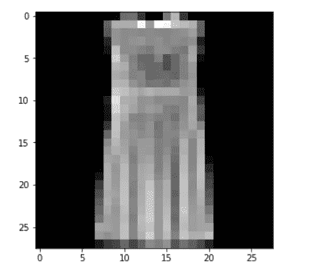

# PYTORCH

> 原文：<https://medium.com/analytics-vidhya/pytorch-part1-9a63a063de31?source=collection_archive---------20----------------------->


金色火炬

PyTorch 在深度学习框架的列表中。它有助于通过提高计算速度和降低成本来加速深度学习模型的研究

在 NumPy 库中，我们有多维数组，而在 PyTorch 中，我们有张量。

使用 Python 在 PyTorch 中训练模型，然后通过 **TorchScript** 将模型导出到 Python 不可用的生产环境中。

PyTorch 支持**多种类型的张量**，包括:

浮点处理器:32 位浮点

DoubleTensor: 64 位浮点数

半张量:16 位浮点型

IntTensor: 32 位 int

long tenser:64 位整数

```
import torch
import numpy as npa=np.array(1)
b=torch.tensor(1)

a,b,type(a),type(b)(array(1), tensor(1), numpy.ndarray, torch.Tensor)
```

**Numpy 操作**

```
a=np.array(2)
b=np.array(1)

# addition
print(a+b)

# subtraction
print(b-a)

# multiplication
print(a*b)

# division
print(a/b)3
-1
2
2.0
```

**Pytorch**

```
a=torch.tensor(2)
b=torch.tensor(1)

# addition
print(a+b)

# subtraction
print(b-a)

# multiplication
print(a*b)

# division
print(a/b)tensor(3)
tensor(-1)
tensor(2)
tensor(2)

..\aten\src\ATen\native\BinaryOps.cpp:81: UserWarning: Integer division of tensors using div or / is deprecated, and in a future release div will perform true division as in Python 3\. Use true_divide or floor_divide (// in Python) instead.
```

**矩阵初始化**

```
# matrix of zeros
a = np.ones((3,3))
print(a)
print(a.shape)[[1\. 1\. 1.]
 [1\. 1\. 1.]
 [1\. 1\. 1.]]
(3, 3)# matrix of zeros
a = torch.ones((3,3))
print(a)
print(a.shape)tensor([[1., 1., 1.],
        [1., 1., 1.],
        [1., 1., 1.]])
torch.Size([3, 3])# setting the random seed for pytorch
torch.manual_seed(42)
# matrix of random numbers
a = torch.randn(3,3)
atensor([[ 0.3367,  0.1288,  0.2345],
        [ 0.2303, -1.1229, -0.1863],
        [ 2.2082, -0.6380,  0.4617]])# setting the random seed for pytorch and initializing two tensors
torch.manual_seed(42)
a = torch.randn(3,3)
b = torch.randn(3,3)# matrix addition
print(torch.add(a,b), '\n')

# matrix subtraction
print(torch.sub(a,b), '\n')

# matrix multiplication
print(torch.mm(a,b), '\n')

# matrix division
print(torch.div(a,b), '\n')

# original matrix
print(a, '\n')

# matrix transpose
torch.t(a)tensor([[7., 7.],
        [7., 7.]], grad_fn=<AddBackward0>) 

tensor([[-5., -5.],
        [-5., -5.]], grad_fn=<SubBackward0>) 

tensor([[12., 12.],
        [12., 12.]], grad_fn=<MmBackward>) 

tensor([[0.1667, 0.1667],
        [0.1667, 0.1667]], grad_fn=<DivBackward0>) 

tensor([[1., 1.],
        [1., 1.]], requires_grad=True) 

tensor([[1., 1.],
        [1., 1.]], grad_fn=<TBackward>)#matrix mul
print(torch.matmul(a,b), '\n')

print(a@b, '\n')

print(torch.mm(a,b), '\n')tensor([[12., 12.],
        [12., 12.]], grad_fn=<MmBackward>) 

tensor([[12., 12.],
        [12., 12.]], grad_fn=<MmBackward>) 

tensor([[12., 12.],
        [12., 12.]], grad_fn=<MmBackward>)torch.dot(torch.tensor([2, 3]), torch.tensor([2, 1]))tensor(7)
```

**串联**

```
# initializing two tensors
a = torch.tensor([[1,2],[3,4]])
b = torch.tensor([[5,6],[7,8]])
print(a, '\n')
print(b, '\n')
print(torch.cat((a,b)))

print(torch.cat((a,b),dim=0))

print(torch.cat((a,b),dim=1))tensor([[1, 2],
        [3, 4]]) 

tensor([[5, 6],
        [7, 8]]) 

tensor([[1, 2],
        [3, 4],
        [5, 6],
        [7, 8]])
tensor([[1, 2],
        [3, 4],
        [5, 6],
        [7, 8]])
tensor([[1, 2, 5, 6],
        [3, 4, 7, 8]])
```

**重塑张量**

```
# setting the random seed for pytorch
torch.manual_seed(42)
# initializing tensor
a = torch.randn(2,4)
print(a)
a.shapetensor([[ 0.3367,  0.1288,  0.2345,  0.2303],
        [-1.1229, -0.1863,  2.2082, -0.6380]])

torch.Size([2, 4])# reshaping tensor
b = a.reshape(1,8)
print(b)
b.shapetensor([[ 0.3367,  0.1288,  0.2345,  0.2303, -1.1229, -0.1863,  2.2082, -0.6380]])

torch.Size([1, 8])
```

**Numpy 到张量的转换**

```
# initializing a numpy array
a = np.array([[1,2],[3,4]])
print(a, '\n')

# converting the numpy array to tensor
tensor = torch.from_numpy(a)
print(tensor)[[1 2]
 [3 4]] 

tensor([[1, 2],
        [3, 4]], dtype=torch.int32)
```

**张量到数字的转换**

```
numpy= tensor.numpy()
print(numpy)[[1 2]
 [3 4]]
```

除了 CharTensor 之外，CPU 上的所有张量都支持与 NumPy 相互转换。

**CUDA 张量**

可以使用将张量移动到任何设备上。方法。

```
# let us run this cell only if CUDA is available
# We will use ``torch.device`` objects to move tensors in and out of GPU
if torch.cuda.is_available():
    device = torch.device("cuda")          # a CUDA device object
    y = torch.ones_like(x, device=device)  # directly create a tensor on GPU
    x = x.to(device)                       # or just use strings ``.to("cuda")``
    z = x + y
    print(z)
    print(z.to("cpu", torch.double))       # ``.to`` can also change dtype together
else:
    print("No tensor operation using cuda")No tensor operation using cuda
```

PyTorch 使用了一种叫做**自动微分**的技术。它记录我们正在执行的所有操作，并回放它以计算梯度。这种技术有助于我们在每个历元上节省时间，因为我们正在计算向前传递本身的梯度

将 requires_grad 指定为 True 将确保每当我们对其执行一些操作时，梯度都被存储。

c =均值(b)=ψ(a+5)/4

```
# initializing a tensor
a = torch.ones((2,2), requires_grad=True)
atensor([[1., 1.],
        [1., 1.]], requires_grad=True)# performing operations on the tensor
b = a + 5
c = b.mean()
print(b,c)tensor([[6., 6.],
        [6., 6.]], grad_fn=<AddBackward0>) tensor(6., grad_fn=<MeanBackward0>)
```

现在，c w r t a 的导数是，因此梯度矩阵是 0.25。L

```
# back propagating
c.backward()

# computing gradients
print(a.grad)tensor([[0.2500, 0.2500],
        [0.2500, 0.2500]])
```

**自动签名的**模块帮助我们计算正向通道本身的梯度，这节省了一个历元的大量计算时间。

**Optim 模块:**py torch 中的 Optim 模块为构建神经网络时使用的大多数优化器预先编写了代码。我们只需要导入它们，然后就可以用它们来构建模型。

nn 模块 PyTorch 中的**自动签名模块**帮助我们在模型中继续定义计算图形。但是，当我们处理复杂的神经网络时，仅仅使用自动签名的模块可能是低级的。

在这些情况下，我们可以利用神经网络模块。这定义了一组函数，类似于神经网络的层，它从前一状态获取输入并产生输出。

**在 PyTorch 中从头开始构建神经网络**

```
#Input tensor
X = torch.Tensor([[1,0,1,0],[1,0,1,1],[0,1,0,1]])

#Output
y = torch.Tensor([[1],[1],[0]])

print(X, '\n')
print(y)tensor([[1., 0., 1., 0.],
        [1., 0., 1., 1.],
        [0., 1., 0., 1.]]) 

tensor([[1.],
        [1.],
        [0.]])
```

将作为激活函数的 **sigmoid 函数**和将在反向传播步骤中帮助我们的 sigmoid 函数的导数:

```
#Sigmoid Function
def sigmoid (x):
    return 1/(1 + torch.exp(-x))

#Derivative of Sigmoid Function/
def derivatives_sigmoid(x):
    return sigmoid(x) * (1 - sigmoid(x))#Variable initialization
epoch=1000 #Setting training iterations
lr=0.1 #Setting learning rate
inputlayer_neurons = X.shape[1] #number of features in data set
print(inputlayer_neurons,X)
hiddenlayer_neurons = 50 #number of hidden layer neurons
output_neurons = 1 #number of neurons in output layer4 tensor([[1., 0., 1., 0.],
        [1., 0., 1., 1.],
        [0., 1., 0., 1.]])#weight and bias initialization
wh=torch.randn(inputlayer_neurons, hiddenlayer_neurons).type(torch.FloatTensor)
bh=torch.randn(1, hiddenlayer_neurons).type(torch.FloatTensor)
wout=torch.randn(hiddenlayer_neurons, output_neurons)
bout=torch.randn(1, output_neurons)for i in range(epoch):
    #Forward Propogation
    #y=mx+c
    #Forward Propogation
    hidden_layer_input1 = torch.mm(X, wh)
    hidden_layer_input = hidden_layer_input1 + bh
    hidden_layer_activations = sigmoid(hidden_layer_input)

    output_layer_input1 = torch.mm(hidden_layer_activations, wout)
    output_layer_input = output_layer_input1 + bout
    output = sigmoid(output_layer_input)

    #calculate the slope
    #y-yhat
    E = y-output
    slope_output_layer = derivatives_sigmoid(output)
    slope_hidden_layer = derivatives_sigmoid(hidden_layer_activations)

    #Error
    d_output = E * slope_output_layer
    Error_at_hidden_layer = torch.mm(d_output, wout.t())
    d_hiddenlayer = Error_at_hidden_layer * slope_hidden_layer

    #Calculate weights an biases at outout
    wout += torch.mm(hidden_layer_activations.t(), d_output) *lr
    bout += d_output.sum() *lr

    #Update weights
    wh += torch.mm(X.t(), d_hiddenlayer) *lr
    bh += d_output.sum() *lr
```

我们正在计算输出，最后，在反向传播步骤中。

我们正在计算误差。然后，我们将使用该误差更新权重和偏差。

```
print('actual :\n', y, '\n')
print('predicted :\n', output)actual :
 tensor([[1.],
        [1.],
        [0.]]) 

predicted :
 tensor([[0.9992],
        [0.9913],
        [0.0087]])# importing the libraries
import pandas as pd
import numpy as np
from skimage.io import imread
import matplotlib.pyplot as plt
%matplotlib inline

from sklearn.model_selection import train_test_split
from sklearn.metrics import accuracy_score# loading dataset
train = pd.read_csv('train.csv')
test = pd.read_csv('test.csv')train.head()
```


```
# random number generator
seed = 128
rng = np.random.RandomState(seed)# print an image
img_name = rng.choice(train['id'])

filepath = 'train/' + str(img_name) + '.png'

img = imread(filepath, as_gray=True)
img = img.astype('float32')

plt.figure(figsize=(5,5))
plt.imshow(img, cmap='gray')<matplotlib.image.AxesImage at 0x203a40aecc8>
```



```
train_img = []
for img in train['id']:
    image_path = 'train/' + str(img_name) + '.png'
    img = imread(image_path, as_gray=True)
    img = img.astype('float32')
    train_img.append(img)

train_x = np.array(train_img)
train_x.shape(60000, 28, 28)#train dataset
train_x = train_x/train_x.max()
train_x = train_x.reshape(-1, 28*28).astype('float32')
train_x.shape(60000, 784)#test dataset
train_y = train['label'].values
train_yarray([9, 0, 0, ..., 3, 0, 5], dtype=int64)#train and validation dataset
train_x, val_x, train_y, val_y = train_test_split(train_x, train_y, test_size = 0.1, stratify = train_y)
(train_x.shape, train_y.shape), (val_x.shape, val_y.shape)(((54000, 784), (54000,)), ((6000, 784), (6000,)))import torch
from torch.autograd import Variable
from torch.nn import Linear, ReLU, CrossEntropyLoss, Sequential
from torch.optim import Adam# number of neurons in each layer
input_num_units = 28*28
hidden_num_units = 500
output_num_units = 10

# set remaining variables
epochs = 20
learning_rate = 0.0005# define model
model = Sequential(Linear(input_num_units, hidden_num_units),
                   ReLU(),
                   Linear(hidden_num_units, output_num_units))
# loss function
loss_fn = CrossEntropyLoss()

# define optimization algorithm
optimizer = Adam(model.parameters(), lr=learning_rate)train_losses = []
val_losses = []
for epoch in range(epochs):
    avg_cost = 0

    x, y = Variable(torch.from_numpy(train_x)), Variable(torch.from_numpy(train_y), requires_grad=False)
    x_val, y_val = Variable(torch.from_numpy(val_x)), Variable(torch.from_numpy(val_y), requires_grad=False)
    pred = model(x)
    pred_val = model(x_val)

    # get loss
    loss = loss_fn(pred, y)
    loss_val = loss_fn(pred_val, y_val)
    train_losses.append(loss)
    val_losses.append(loss_val)

    # perform backpropagation
    loss.backward()
    optimizer.step()
    avg_cost = avg_cost + loss.data

    if (epoch%2 != 0):
        print(epoch+1, avg_cost)2 tensor(2.3062)
4 tensor(2.3107)
6 tensor(2.3114)
8 tensor(2.3124)
10 tensor(2.3191)
12 tensor(2.3263)
14 tensor(2.3267)
16 tensor(2.3228)
18 tensor(2.3179)
20 tensor(2.3136)plt.plot(train_losses, label='Training loss')
plt.plot(val_losses, label='Validation loss')
plt.legend()
plt.show()
```


```
# get training accuracy
x, y = Variable(torch.from_numpy(train_x)), Variable(torch.from_numpy(train_y), requires_grad=False)
pred = model(x)

final_pred = np.argmax(pred.data.numpy(), axis=1)

accuracy_score(train_y, final_pred)0.1# get validation accuracy
x, y = Variable(torch.from_numpy(val_x)), Variable(torch.from_numpy(val_y), requires_grad=False)
pred = model(x)
final_pred = np.argmax(pred.data.numpy(), axis=1)

accuracy_score(val_y, final_pred)0.1# loading test images
test_img = []
for img_name in test['id']:
    image_path = 'test/' + str(img_name) + '.png'
    img = imread(image_path, as_gray=True)
    img = img.astype('float32')
    test_img.append(img)

test_x = np.array(test_img)
test_x.shape(10000, 28, 28)# converting the images to 1-D
test_x = test_x/train_x.max()
test_x = test_x.reshape(-1, 28*28).astype('float32')
test_x.shape(10000, 784)# getting the prediction for test images
prediction = np.argmax(model(torch.from_numpy(test_x)).data.numpy(), axis=1)predictionarray([2, 1, 7, ..., 1, 7, 2], dtype=int64)
```