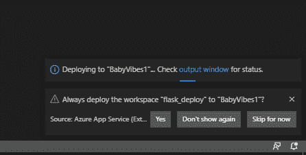

# PyTorch Web 服务部署使用 Azure 机器学习服务和来自 VS 代码的 Azure Web 应用程序

> 原文：<https://medium.com/analytics-vidhya/pytorch-web-service-deployment-using-azure-machine-learning-service-and-azure-web-apps-from-vs-code-a1ba75e43520?source=collection_archive---------8----------------------->

这篇博客主要关注于在 Linux 中使用 Azure 机器学习 SDK 和 VS 代码将 PyTorch fastai 深度学习图像分类模型部署到 Azure Web apps/Azure Web 服务。


瓦莱里娅·宗科尔在 [Unsplash](https://unsplash.com?utm_source=medium&utm_medium=referral) 上拍摄的照片

1.  Google Colab 中的数据收集和原型制作
2.  Azure 机器学习服务培训。
3.  在 Azure 容器实例中部署为 Azure Web 服务。
4.  从部署为 Python flask Azure web 应用程序的前端使用 Web 服务。

## **Google Colab 中的数据收集和原型制作:**

查看 fastai 的[构建你自己的数据集](https://docs.fast.ai/vision.data.html#Building-your-own-dataset)模块，它包含一些帮助函数，允许你为图像分类构建你自己的数据集。在这个项目中，我从 google images 下载了哭泣的婴儿和快乐的婴儿的图像，并在 google colab 中快速测试了它们的初始基线。查看我的 [Google colab 笔记本](https://github.com/SriramyaK/Baby_Vibes_Pytorch_Azure_Webservice/blob/master/Data_Collection_Google_Colab_prototyping.ipynb)。

## **关于 Azure 机器学习的培训:**

一旦我们的 dateset 和模型参数达到基线，我就选择 Microsoft Azure 作为 web 应用进行培训和部署。

先决条件-

使用以下扩展启用 VS 代码:

*   计算机编程语言
*   Azure 帐户
*   Azure CLI 工具-Azure CLI 提供管理 Azure 资源的命令。
*   Azure 机器学习 CLI 的机器学习扩展提供了使用 Azure 机器学习资源的命令。
*   Azure 应用服务
*   Azure 存储

**注意:**如果你是 VS 代码新手，[参考这个](https://code.visualstudio.com/docs/python/python-tutorial)。

*   Azure 订阅。如果你没有，试试 Azure 机器学习的免费或付费版本。
*   Git 本地

我们将使用 GitHub 库**[**Baby Vibes**](https://github.com/SriramyaK/Baby_Vibes_Pytorch_Azure_Webservice)**——图像分类器来检测哭泣的婴儿，并玩猫和老鼠来逗他们笑**。**

**我们开始吧-**

**打开 ubuntu shell 并键入:**

```
>> mkdir Baby_Vibes
>> cd Baby_Vibes
>> git clone h[ttps://github.com/SriramyaK/Baby_Vibes_Pytorch_Azure_Webservice](https://github.com/SriramyaK/Baby_Vibes_Pytorch_Azure_Webservice)
>> code .
```

**从 VS 代码中打开新终端并键入:**

```
>> conda env create -f myenv.yml
>> conda myenv/bin/activate
```

1.  **从 VS 代码机器学习空间登录 Azure:**
2.  **点击“创建工作空间”**

*   **输入 Azure ML 工作区名称的名称**
*   **选择 Azure 订阅**
*   **选择一个资源组，如果没有资源组，则创建一个新的资源组。**
*   **选择一个位置**
*   **选择一个工作区 sku“基本”**

**您还可以查看创建 [**工作区**](https://docs.microsoft.com/en-us/azure/machine-learning/how-to-manage-workspace) 的其他方式:**

**4.打开 [Baby_Vibes_train.ipynb](https://github.com/SriramyaK/Baby_Vibes_Pytorch_Azure_Webservice/blob/master/Baby_Vibes_train.ipynb) 。更新您的工作区名称、subscription-id 和资源组，并选择“运行所有单元”。**

**5.训练完成后，从“VS 代码>机器学习>工作空间>模型> Babies.pkl”中成功下载“Babies.pkl ”,并将其保存为项目文件夹中的“export.pkl”。**

**为什么只有“export.pkl ”?检查 [fast.ai](https://github.com/fastai/fastai/blob/9a32a5f666d28283184e4b5b30edebfcb8ddb5f3/fastai/basic_train.py#L615) 的文档**

**6.现在，您可以将机器学习计算从“VS 代码>机器学习>订阅名称>工作区名称>计算> gpu —计算”中分离出来，以节省资金并进入部署阶段。**

## ****使用 Azure 容器部署为 Azure Web 服务:****

1.  **打开**[**deploy . ipynb**](https://github.com/SriramyaK/Baby_Vibes_Pytorch_Azure_Webservice/blob/master/deploy.ipynb)**更新您的工作区名称、subscription-id 和资源组，并选择“运行所有单元”。******

********检查点:********

*   ****确保“export.pkl”和 score_and_track.py 都在当前项目文件夹中。****
*   ****我们正在使用下面的 azure 容器实例配置进行部署。查看 [deploy.ipynb](https://github.com/SriramyaK/Baby_Vibes_Pytorch_Azure_Webservice/blob/master/deploy.ipynb)****

```
**aciconfig = AciWebservice.deploy_configuration(cpu_cores=2, memory_gb=4,tags={‘data’: ‘Babies’, ‘method’:’transfer learning’, ‘framework’:’pytorch’},description=’Image classification of Baby Vibes’)**
```

****这意味着我们使用 2 个 CPU 和 4gb 内存来运行我们的模型推理。(记得我们在训练模型后移除了我们的 gpu 计算！！！)****

****记下您的 web 服务 uri，我们需要它来部署 Web 应用程序****

## ******从部署为 Python flask Azure web app 的前端使用 Web 服务:******

1.  ****Mkdir flask _ 部署****
2.  ****Cd 烧瓶 _ 部署****
3.  ****python3 -m venv 环境****
4.  ****源环境/媒体夹/激活****
5.  ****将以下文件移动到 flask_deploy 文件夹中，并确保您的文件夹结构如下所示:****

********

****6.在 VS 代码中点击 Azure App service 窗格，创建一个新的 Web App。****

********

****7.为新的 web 应用程序输入一个全局唯一的名称，在我们的示例中为“babyvibes1”。****

****8.为我们的 linux 应用程序选择运行时，即 python 3.6****

********

****一旦我们收到新的 web 应用程序“BabyVibes1”已创建的消息，我们就可以转到[**主页**](https://portal.azure.com/#home) > [**所有资源**](https://portal.azure.com/#blade/HubsExtension/BrowseAll)>[**appsvc _ Linux _ centr alus>应用程序**](https://portal.azure.com/#@sriramyalakkarajugmail.onmicrosoft.com/resource/subscriptions/d74ca76c-0758-4302-8894-12939776ca14/resourceGroups/appsvc_linux_centralus/providers/Microsoft.Web/serverFarms/appsvc_linux_centralus/apps)>[**baby vibes 1>配置>常规设置**](https://portal.azure.com/#@sriramyalakkarajugmail.onmicrosoft.com/resource/subscriptions/d74ca76c-0758-4302-8894-12939776ca14/resourceGroups/appsvc_linux_centralus/providers/Microsoft.Web/sites/BabyVibes1/configuration)****

********

****将保存在当前“flask-deploy”文件夹中的“startup.txt”中的文本复制到上面屏幕中显示的“Startup Command”字段中。****

****我们为什么要这样做？****

****原因是 App Service 使用 [Gunicorn WSGI HTTP Server](https://gunicorn.org/) 来运行一个 App，它寻找一个名为 application.py 或 app.py 的文件，由于我们的主模块在 app.py 文件中，我们必须定制启动命令，如下所示-****

****" guni corn-bind = 0 . 0 . 0 . 0-超时 600 app:app "****

****更多信息请阅读 [azure 文档](https://docs.microsoft.com/en-us/azure/python/tutorial-deploy-app-service-on-linux-04)****

****我们的目标是将我们的应用从本地 git 部署到我们创建的 Azure 应用服务。为此，我们首先必须配置一些部署设置。点击“部署中心”，选择“本地 Git”:****

********

****向下滚动以查看“本地 git”选项****

********

****在下一步中，选择“Kudu”作为构建服务器:****

********

****点击“继续”****

********

****单击“完成”，等待通知，您将得到如下所示的 *Git 克隆 Uri* :****

****[*https://babyvibes1.scm.azurewebsites.net:443/babyvibes1.git*](https://babyvibes1.scm.azurewebsites.net:443/babyvibes1.git)****

****此外，单击“部署凭据”查看您的应用凭据:****

****************

****在这里，您可以看到您的应用程序用户名和密码，您可以更改或创建用于部署目的的其他用户凭据。****

****现在我们已经为部署做好了准备。转到本地终端，将 Azure remote 添加到本地 Git 存储库中。将<deploymentlocalgiturl-from-create-step>替换为您在上一步中获得的 Git 遥控器的 URL，即[【https://babyvibes1.scm.azurewebsites.net:443/babyvibes1.git】T2](https://babyvibes1.scm.azurewebsites.net:443/babyvibes1.git)</deploymentlocalgiturl-from-create-step>****

******启动当前文件夹中的 git 库:******

```
**>> git init
>> git add .gitignore
>> git commit -m “.gitignore added”
>> git add .
>> git commit -m “Code files added”
>> git remote add azure-baby [https://babyvibes1.scm.azurewebsites.net:443/babyvibes1.git](https://babyvibes1.scm.azurewebsites.net:443/babyvibes1.git)**
```

****现在提交对本地 git 的任何更改:****

```
**>> git commit -a -m “first commit”**
```

****并使用以下命令推送至“azure-baby”遥控器以部署您的应用程序:****

```
**>> git push azure-baby master**
```

****当 Git 凭据管理器提示您输入凭据时，请确保您输入的是在配置部署用户中创建的凭据，而不是用于登录 Azure 门户的凭据。****

****运行此命令可能需要几分钟时间。我们可以在 VS 代码中检查 Web 应用程序“babyvibes1”的状态，并执行最后的“部署到 Web 应用程序”步骤-****

********

****选择要压缩和部署的文件夹，即我们的示例中的 flask_deploy****

****我们可以在左下角看到这样的弹出窗口:****

********

****接下来是成功的部署，比如-****

********

****如果部署成功，您可以看到下面的网站页面-****

********

****[https://babyvibes.azurewebsites.net/](https://babyvibes.azurewebsites.net/)****

****参考资料:****

1.  ****[https://medium . com/@ nikovrdoljak/deploy-your-flask-app-on-azure-in-3-easy-steps-B2 Fe 388 a 589 e](/@nikovrdoljak/deploy-your-flask-app-on-azure-in-3-easy-steps-b2fe388a589e)****
2.  ****[https://docs.microsoft.com/en-us/azure/python/](https://docs.microsoft.com/en-us/azure/python/)****
3.  ****[https://docs . Microsoft . com/en-us/azure/machine-learning/how-to-training-py torch](https://docs.microsoft.com/en-us/azure/machine-learning/how-to-train-pytorch)****