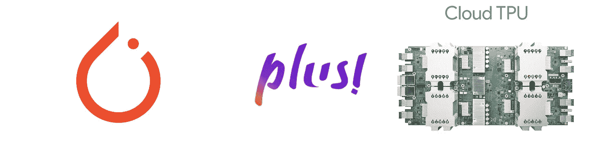
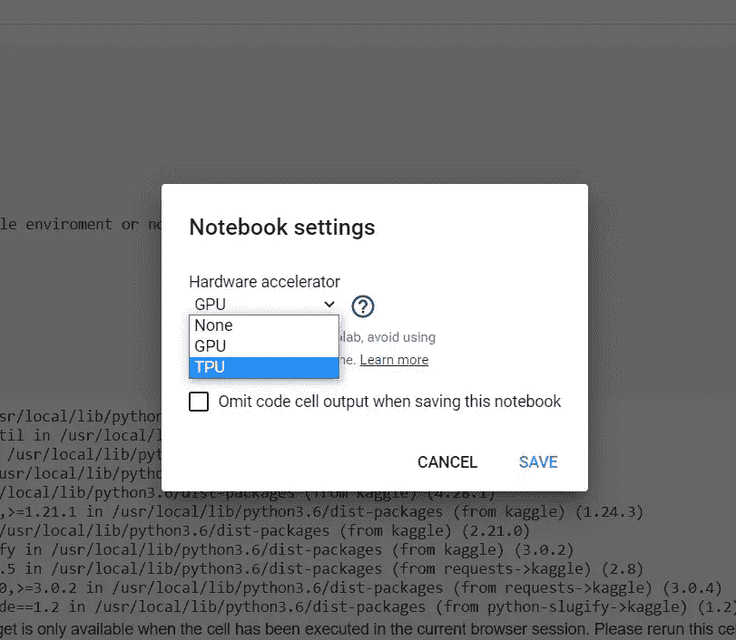
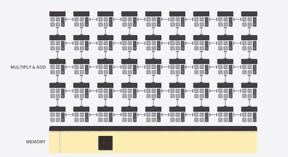

# TPUs 被黑的 Pytorch！！！

> 原文：<https://medium.com/analytics-vidhya/pytorch-with-tpus-hacked-dc860d2df7e?source=collection_archive---------15----------------------->



我们大多数人都用过带 GPU 的 **Google Colab，但有多少人用过 Colab 中的 **TPU(张量处理单元)？？？****



今天，我将帮助我的读者了解我们如何在使用 Pytorch 的同时，轻松地使用 TPU 来更快地训练我们的深度学习模型。只要坚持遵循给定的步骤，你就能轻松掌握它。

1.  首先更改你的笔记本设置 TPU。
2.  然后运行以下命令安装到 **pytorch-xla** (一个集成 pytorch 和 TPU 的框架)夜间版本。

```
!curl [https://raw.githubusercontent.com/pytorch/xla/master/contrib/scripts/env-setup.py](https://raw.githubusercontent.com/pytorch/xla/master/contrib/scripts/env-setup.py) -o pytorch-xla-env-setup.py!python pytorch-xla-env-setup.py — apt-packages libomp5 libopenblas-dev
```

3.然后导入以下库

```
import torch_xla
import torch_xla.distributed.parallel_loader as pl
import torch_xla.core.xla_model as xm
import torch_xla.distributed.xla_multiprocessing as xmp
```

4.然后为训练和验证数据集创建分布式采样器

```
train_sampler = torch.utils.data.distributed.DistributedSampler(
          **your_train_dataset**,
          num_replicas=xm.xrt_world_size(),
          rank=xm.get_ordinal(),
          shuffle=True)

valid_sampler = torch.utils.data.distributed.DistributedSampler(
          **your_val_dataset**,
          num_replicas=xm.xrt_world_size(),
          rank=xm.get_ordinal(),
          shuffle=False)
```

5.在您的数据加载器中，传递上面在 sampler 参数中创建的这些分布式采样器

```
training_dataloader = torch.utils.data.DataLoader(
                        CutMix_train_dataloader,
                        num_workers=4,
                        batch_size=TRAIN_BATCH_SIZE,
                        **sampler=train_sampler**,
                        drop_last=True
                       )

val_dataloader = torch.utils.data.DataLoader(
                        val_dataset,
                        num_workers=4,
                        batch_size=TRAIN_BATCH_SIZE,
                        **sampler=valid_sampler**,
                        drop_last=False
                       )
```

6.然后创建一个 xla_model 类的对象来集成 torch-xla 和 tpu

```
device = xm.xla_device()
```

7.然后将创建的深度学习模型与 xla_model 的实例集成

```
model = model.to(device)
```

8.将输入和标签与创建的设备实例集成。

```
for inputs,labels in **your_data_loader**:
    inputs = inputs.to(**device**, dtype=torch.float)
    labels = labels.to(**device**, dtype=torch.float)
```

9.然后在 **epoch** 循环中使用 **ParallelLoader**

```
train_loader = pl.ParallelLoader(**your_train_dataloader**, [device])
**train_func_loop**(train_loader.per_device_loader(device), model, optimizer, device, scheduler=scheduler)

val_loader = pl.ParallelLoader(**your_val_dataloader**, [device])
**val_func_loop**(para_loader.per_device_loader(device), model, device)
```

10.最后初始化模型的训练&应用多重处理，使得图像在卡格尔-tpu 的不同内核中得到并行训练

```
def _mp_fn(rank, flags):
    torch.set_default_tensor_type('torch.FloatTensor')
    a = **epochLoop**()

*# applying multiprocessing so that images get trained different on      # cores of kaggle-tpu*FLAGS={}
xmp.spawn(_mp_fn, args=(FLAGS,), nprocs=1, start_method='fork')
```

更多信息，请查看这些 Kaggle 笔记本

1.  [使用 TPU 增强 Cutmix 数据](https://www.kaggle.com/soumochatterjee/cutmix-flower-classification)
2.  [用 TPU 增强混合数据](https://www.kaggle.com/soumochatterjee/mixup-tpu)



[https://cloud . Google . com/images/products/TPU/try-the-demo . gif](https://cloud.google.com/images/products/tpu/try-the-demo.gif)

最终你会得到


如果您有任何问题、意见或担忧，请在下面的评论区告诉我，或者您可以在这里张贴出来[，直到享受学习的乐趣。](https://github.com/pytorch/xla/issues)

更多与数据科学相关的博客文章，请查看 medium 上的顶级数据科学博客。

*   拉胡尔·阿加瓦尔
*   威尔·科尔森
*   卡西·科济尔科夫
*   丽贝卡·维克里
*   [Tony Yiu(T1)](https://medium.com/u/840a3210fbe7?source=post_page-----dc860d2df7e--------------------------------)
*   丹尼尔·伯克(Daniel Bourke)
*   埃里克·莱文森(Eryk Lewinson)
*   本杰明·奥比·塔约(Benjamin Obi Tayo)博士
*   [Moez Ali(T9)](https://medium.com/u/fba05660b60f?source=post_page-----dc860d2df7e--------------------------------)
*   拉瓦尔(Siraj Raval) (T11)