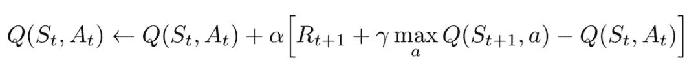
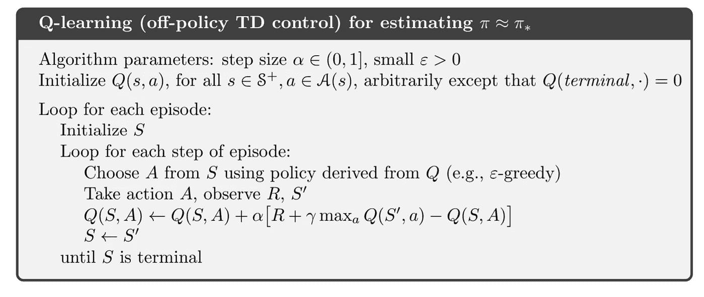
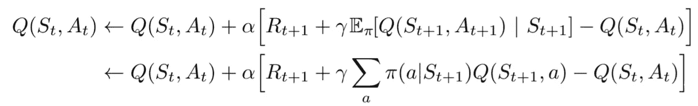
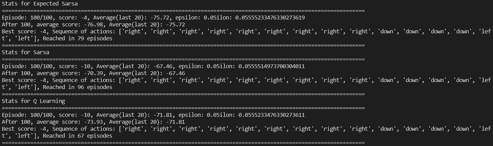
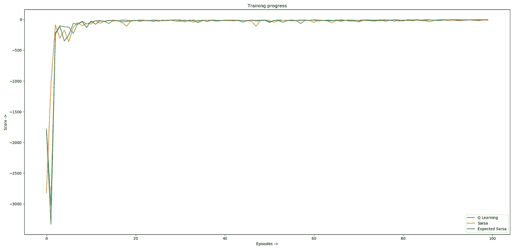

# q 学习、期望 Sarsa 和 TD 学习算法的比较

> 原文：<https://medium.com/analytics-vidhya/q-learning-expected-sarsa-and-comparison-of-td-learning-algorithms-e4612064de97?source=collection_archive---------2----------------------->

本文延续了上一篇文章中的内容，在那篇文章中，我谈到了 TD 学习并演示了 SARSA 算法的工作原理。在此基础上，让我们来谈谈另外两个基于 TD 的算法: **Q-Learning** 和 **Expected Sarsa**

# q 学习

RL 的早期突破之一是开发了称为 Q-Learning 的非策略 TD 控制算法，定义如下:

q-学习更新方程。(来源:强化学习:萨顿和巴尔托的介绍)

与 Sarsa 算法不同，Q 学习更新方程对下一个状态使用贪婪动作选择来计算 TD 误差。这有助于该算法的非策略性质，因为不管所遵循的策略(ϵ-greedy 等。)，TD 误差将总是使用下一状态的最大 Q 值对。

这是 Q 学习算法。除了更新方程式的微小变化，其他都和 Sarsa 一样。

# Python 中的 q-学习

使用与上一篇文章相同的 Gridworld 环境，我实现了 Q-Learning 算法。我做的一个小改动是，现在动作选择策略是 **ϵ-greedy** ，而不是使用固定的 **ϵ** 。以下是 Q-Learning 代理:

在展示 Q 学习算法的一些结果之前，让我们看另一个算法。然后，我将执行所有 3 个算法，并比较它们。

# 预期 Sarsa

它不是在下一个状态-动作对上取最大值，而是使用期望值，考虑每个动作在当前策略下的可能性。

预期的 Sarsa 更新等式。

给定下一个状态 **Sₜ₊₁** ，该算法确定性地在与预期中 Sarsa 移动*相同的方向上移动，因此，它被称为**预期 Sarsa** 。它在计算上比 Sarsa 更复杂，但反过来，它消除了由于随机选择 **Aₜ₊₁** 而产生的方差。*

# 比较 Sarsa、Q-Learning 和 Expected Sarsa

我对 Sarsa 实现做了一点小小的改动，使用了ϵ-greedy 策略，然后实现了所有 3 种算法，并使用它们的训练进度和平均分数对它们进行了比较。以下是所有 3 种算法中使用的参数:

*   **剧集数量** :100
*   **random_seed** : 10(这使得在测试各种参数时随机动作一致)
*   **伽玛**(折扣系数):0.99
*   **alpha** (更新大小):0.6
*   **初始ε**:1
*   **ε衰减因子** : 0.9(每一集之后，ε减少到前一个ε的 0.9 倍)
*   **ε最小值**:0.1(ε永远不会减少到小于 0.1，以便即使在后面的情节中也有利于最小探索)

下面是 python 脚本，其中所有 3 种算法都在 Gridworld 环境中执行并进行比较:

## 结果呢

请注意，epsilon 值后面的额外字符是一些问题，因为在训练时打印在同一行上。系统基本上会覆盖每一行，在后面的剧集中，分数会降低，平均字符数也会减少，最终会产生一些额外的字符

我用 10 种不同的种子值进行了测试，在所有测试中，我观察到以下情况:

*   Expected Sarsa 在 10 集的 6 集中给出了最高的平均分，在其他 4 集中，在平均分方面处于第二位。
*   Q-Learning 在平均分数方面排名第二，并且始终是最快到达最佳路径的。
*   在我的测试中，与其他两个相比，Sarsa 既不是最快的，也不是最好的。此外，在 10 次测试中，有 2 次甚至找不到最佳路径。

这张图表讲述了一个非常有趣的故事。它告诉我们，即使预期的 Sarsa 有一个糟糕的开始(开始时绿线的急剧下降)，它也是最快稳定下来的。我们看到，大约在 10ᵗʰ事件和 20ᵗʰ事件之间，预期的 Sarsa 开始给出稳定的结果，而其他两个事件仍在经历一些下降。后来，在 Q-Learning 或 Sarsa 的台词中也有 2-3 个下降的例子。

这种稳定性可能是由于在计算 TD 误差时，预期的 Sarsa 用动作发生的概率来加权每个状态-动作对的 Q 值。

看起来 Expected Sarsa 是上述 3 种算法中最好的算法，但是请记住，在某些情况下，Q-learning 和 Sarsa 都处于领先地位。此外，它也严重依赖于参数的选择。

这一次到此为止。下一集见。继续摇摆！