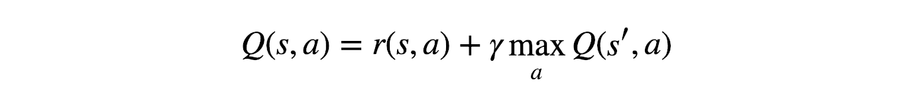
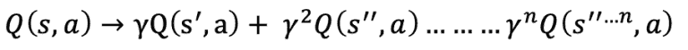
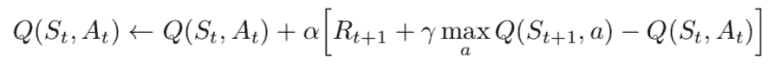
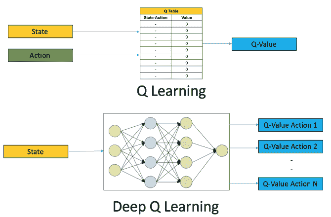
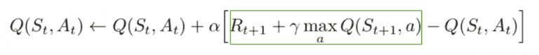

# q-网络强化学习模型

> 原文：<https://medium.com/analytics-vidhya/q-network-reinforcement-learning-model-fe3f8d982aec?source=collection_archive---------17----------------------->

亚历山大·安德鲁斯在 [Unsplash](https://unsplash.com/s/photos/q?utm_source=unsplash&utm_medium=referral&utm_content=creditCopyText) 上拍摄的照片

Q-learning 是一种非策略强化学习算法，它试图找出给定状态下需要的最简单的动作，因此它是一种贪婪的方法。它被认为是不符合策略的，因为 q-learning 函数从这个策略之外的动作中学习，比如采取随机动作，因此不需要策略。更具体地说，q-learning 寻求找出一个使整体回报最大化的策略。让我们继续努力，制定我们的第一个策略。

# 什么是 Q-learning？

Q-learning 可以是一种无模型的强化学习算法，用于找出动作的质量，告诉代理在什么情况下需要什么动作。它不需要环境的模型(因此有“无模型”的含义)，它可以处理随机转换和奖励的问题，而不需要适应。

对于任何有限的马尔可夫决策过程(FMDP)，Q-learning 从当前状态开始，在任何和每一个连续的步骤中，在最大化整体回报的第一时刻的意义上找到最优策略。在给定无限的探索时间和部分随机策略的情况下，Q-learning 可以识别任意给定 FMDP 的最优行动选择策略。“Q”是算法计算出的在特定状态下采取行动的最大预期回报的函数。

Q-learning 是一种非策略强化学习算法，它寻求在给定的当前状态下需要采取的最有效的行动。它被认为是不符合策略的，因为 q-learning 函数从这个策略之外的动作中学习，比如采取随机动作，因此不需要策略。更具体地说，q-learning 寻求被告知最大化全部回报的政策。

# 什么是 Q？

q-learning 中的“q”代表质量。在这种情况下，质量代表了一个给定的行为在获得未来回报方面的有用程度。

现在，考虑最好的情况:假设我们已经知道每一步的每一个行动的预期回报是什么。在这种情况下，我们将如何决定行动？很简单——我们将选择最终可能产生最佳回报的行动顺序。我们将获得的这种累积奖励通常被称为 Q 值(质量值的缩写)，我们可以用数学方法将我们的策略形式化为:

上面的等式表明，处于状态 s 并选择动作 a 产生的 Q 值是收到的即时奖励 r(s，a)，加上状态 s 可能的最佳 Q 值(这是我们从状态 s 采取动作 a 后的最终状态)。通过选择最大化 Q 值的动作，我们将从 s '得到最佳 Q 值。我们还引入了γ，通常称为贴现因子，它控制着长期回报相对于眼前回报的重要性。

这个方程被认为是因为贝尔曼方程，(贝尔曼等人)和(彭等人)对其数学推导提供了全面的解释。这个优雅的等式非常强大，对我们非常有用，因为它有两个重要的特征:

1.  虽然我们仍然保留马尔可夫状态假设，但是贝尔曼方程的递归性质允许来自未来状态的回报传播到遥远的过去状态。
2.  在我们开始之后，没有必要真的知道什么是真理 Q 值；因为它是递归的，我们会猜测一些东西，它最终会收敛到重要的值。

假设我们都知道每一步每一个行动的预期回报。这可能实质上是代理的一种备忘单！我们的代理会准确地知道该执行哪个操作。

它将执行一系列的行动，最终可能产生最大的总回报。这一总回报也称为 Q 值，我们将我们的战略正式化为:

上面的等式表明，处于状态 s 并执行动作 a 所产生的 Q 值是直接回报 r(s，a)加上来自后续状态 s '的可能的最佳 Q 值。这里的 Gamma 是贴现因子，它控制未来奖励的贡献。

Q(s’，a)再次依赖于 Q(s”，a)，于是 Q(s”，a)可以具有伽马平方的系数。因此，Q 值取决于未来状态的 Q 值，如下所示:

调整 gamma 值将减少或增加未来奖励的贡献。

由于这可能是一个递归方程，我们将从对所有 q 值进行任意假设开始。有了经验，它会收敛到最优策略。在实际情况下，这可以作为更新来实现:

其中α是学习速率或步长。这仅仅决定了新获得的信息覆盖旧信息的程度。

在深度 Q 学习中，我们使用神经网络来逼近 Q 值函数。给出状态是因为输入以及所有可能动作的 Q 值是因为输出而产生的。Q-learning 和深度 Q-learning 之间的比较如下图所示:

因此，使用深度 Q 学习网络(dqn)进行强化学习的步骤如下:

1.  所有过去的经验都由用户存储在存储器中
2.  下一步行动由 Q 网络的最大输出决定
3.  这里的损失函数是预期 Q 值和目标 Q 值的均方误差— Q*。这基本上可以说是一个回归问题。然而，我们不知道这里的目标或实际值，因为我们正在处理一个强化学习问题。回到从贝尔曼方程导出的 Q 值更新方程。我们有:

4.绿色部分代表目标。我们会说它是在预测自己的值，但由于 R 是无偏的真实回报，网络会使用反向传播来更新其梯度，最终收敛。