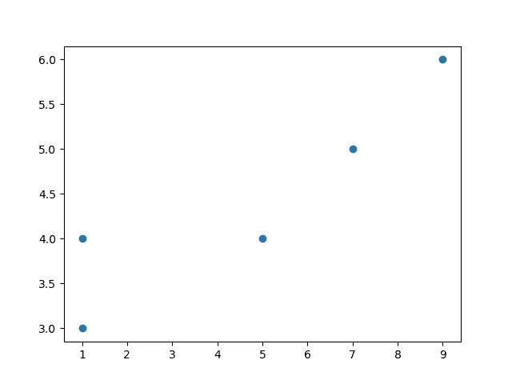
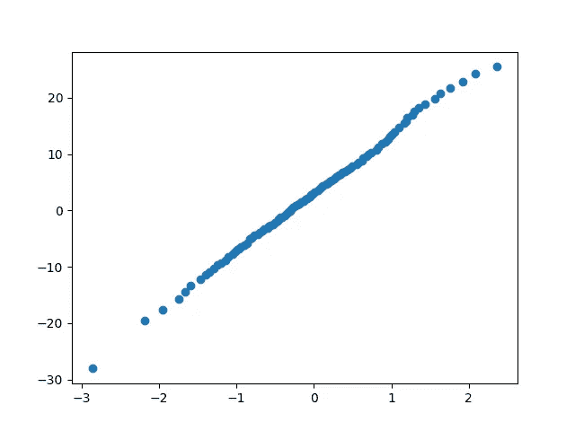
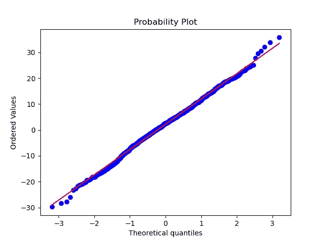
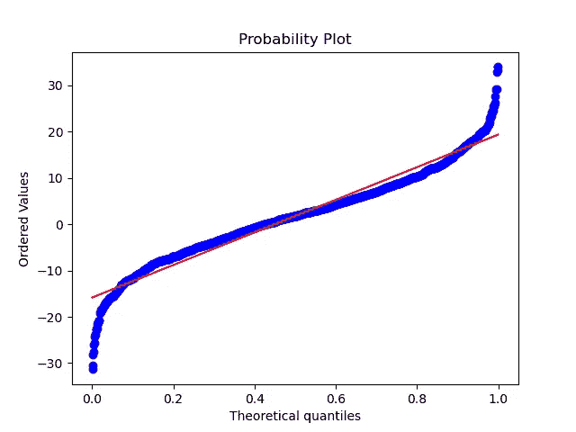

# Q-Q 图

> 原文：<https://medium.com/analytics-vidhya/q-q-plot-9a76b8ba1459?source=collection_archive---------24----------------------->


斯蒂芬·道森在 [Unsplash](https://unsplash.com?utm_source=medium&utm_medium=referral) 上拍摄的照片

# 内容

1.  Q-Q 图的定义
2.  Q-Q 图解释
3.  Python 中的 Q-Q 图
4.  结论

## Q-Q 图的定义

Q-Q 图是一种图形方法，用于检查两组不同的数据是否与相同的理论分布相关。这里两组数据中的一组是我们生成的，也就是我们知道它的分布类型。我们根据我们生成的已知分布的数据来检查其他的分布。

在我们使用两个数据集绘制散点图后，如果该图形成直线，那么我们可以说两个数据属于同一分布或不属于同一分布。这些点不需要恰好形成一条直线，有时几乎也考虑。

## Q-Q 图解释

最初在 Q-Q 图中，我们假设分布的类型，然后我们生成该分布的一组数据样本。稍后，我们从两个数据集中选择几个合理的分位数。之后，两者按非降序排序。现在假设一个数据是 x 坐标，另一个是 y 坐标，并绘制散点图。如果这些点几乎形成直线，那么我们可以说它们属于同一分布。如果不是，我们的假设是错误的，我们需要重建我们的假设，并遵循递归方式，直到我们的假设是真的。

比如:我有数据点 data=[9，4，9，1，7，5，9，5，1，1]。现在，我需要知道数据的分布。所以，现在我做一个假设，因为数据是正态分布。现在，我生成 10 个数据点的平均值=5，正常数据假设=[4，5，7，6，3，4，4，5，4，6]

现在，对这两个数据进行排序并假设。排序数据=[1，1，1，4，5，5，7，9，9，9]后，假设= [3，4，4，4，5，5，6，6，7]。

这里数据的长度和假设是相同的，所以我们不需要找到分位数。当我们的数据很大或假设数据和数据不在同一长度时，我们找到分位数。我们不需要绘制所有的数据，我们可以在数据集和绘图中获得几个分位数。

因此，在我们的例子中，选择 5 个分位数 1，3，5，7，9。数据=[1，1，5，7，9]。假设=[3，4，4，5，6]。使用(1，3)(1，4)(5，4)(7，5)(9，6)绘制图表



我们的点看起来不像在一条直线上。所以我们对数据的假设是正态分布的，这是真的。在这里，我用很小的数据来绘制。所以你可能不清楚这一点，但接下来你会更明白。

## Python 中的 Q-Q 图

```
import matplotlib.pyplot as plt
import numpy as np
from scipy import stats# our data is generated
X=[]
for i in range(1000):
 X.append(np.random.normal(2,10)) # Generate assume data
li=[]
for i in range(1000):
 li.append(np.random.normal(0,1)) # find 100 quantiles of data and plot 
quantile_li=[]
quantile_x=[]
for i in range(100):
 quantile_li.append(np.percentile(li,i))
 quantile_x.append(np.percentile(X,i))plt.scatter(quantile_li,quantile_x)
plot.show()
```



在这里，为了便于您的理解，我将数据和假设数据都视为正态分布数据。在上图中，点看起来像一条直线意味着数据属于相同的分布。

我们的源代码可以使用以下代码来简化:

```
# our data is generated
X=[]
for i in range(1000):
 X.append(np.random.normal(2,10))prob=stats.probplot(X,dist=stats.norm,plot=plt)
plt.show()
```



因为两者相同，所以点在同一直线上

让我们用不同的分布来绘图:

```
X=[]
for i in range(1000):
 X.append(np.random.normal(2,10))prob=stats.probplot(X,dist=stats.uniform,plot=plt)
plt.show()
```



在上图中，点形成了一个曲线形状，因为两者是不同的分布。

## 结论

Q-Q 图是数据的图形表示，不管数据是否属于同一分布。如果数据属于相同的理论分布，它几乎形成一条直线。