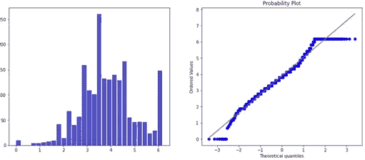

# Q-Q 图:引导你获得更好的结果

> 原文：<https://medium.com/analytics-vidhya/q-q-plots-guiding-you-to-better-results-b0db247d5872?source=collection_archive---------14----------------------->

读者们好。在我之前的一篇博客中，我试图展示如何有效地对回归问题建模。那篇文章很大，关心的是有多少特性应该是你的模型的一部分。然而，这篇文章关注的是**使用**特征工程**改进一个特征**，使其更好地符合**回归假设**。

线性或逻辑回归所基于的几个假设——无多重共线性、无异方差等，其中之一是独立变量的**正态性**。分布越正态，回归模型的结果越好。不太清楚这些假设背后的原因的读者需要浏览一遍。:-)为了实际说明我通过 Q-Q 图可视化的概念，我下载了 Kaggle- DataAnalyst 数据集，并对其应用了一些变换，以尽可能地正常化。然而，在深入研究之前，让我们看看 Q-Q 图实际演示了什么。

什么是阿 q 情节？

*Q-Q 图，或分位数-分位数图，是一个* ***图形工具*** *帮助我们评估一组数据是否似乎来自某种理论分布，如正态分布或指数分布。例如，如果我们运行一个统计分析，假设我们的因变量是正态分布的，我们可以使用一个正态 Q-Q 图来检查这个假设。这只是一个* ***的目测*** *，而不是一个* ***的气密*** *的证明，所以多少有些主观。但它让我们一眼就能看出我们的假设是否合理，如果不合理，假设是如何被违反的，以及哪些数据点促成了违反。Q-Q 图是通过将两组* ***分位数*** *相对绘制而创建的* ***散点图*** *。如果两组* ***分位数*** *来自同一个分布，我们应该看到这些点形成一条大致笔直的线。*

这在很大程度上意味着——线上的点数越多，数据样本遵循上述分布的程度就越大——例如高斯分布、正态分布等。现在，我将应用一些变换，并绘制相邻的**直方图**和 **Q-Q** 图，以便读者决定哪个变换最适合**特征工程**。请记住这不是一个概念性的分析。这只是一个方法论演示。选择的功能是数据分析师的评分，等级为 1-5。

1.  无特征工程

直方图和相应的 Q-Q 图分别为正态分布。

2.使用 Box-Cox 变换特征

直方图和相应的 Q-Q 图分别为正态分布。

3.使用对数变换对特征进行变换。

直方图和相应的 Q-Q 图分别为正态分布。

在图中没有太大的差异，因为我无法选择适当的特征来体面地展示这一点。猜测真实世界数据集与分布的偏差太难了。然而，我建议读者在使用回归模型之前先尝试一下这个例子。祝你愉快。谢谢你。:-)