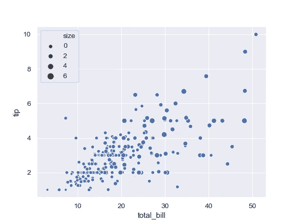
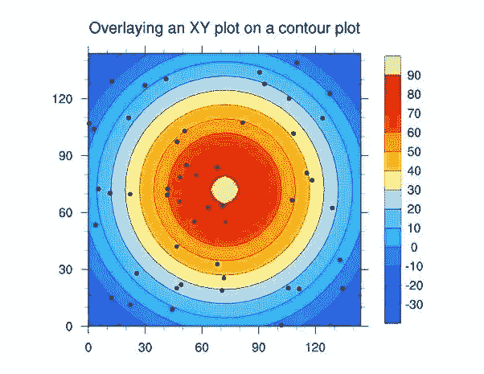
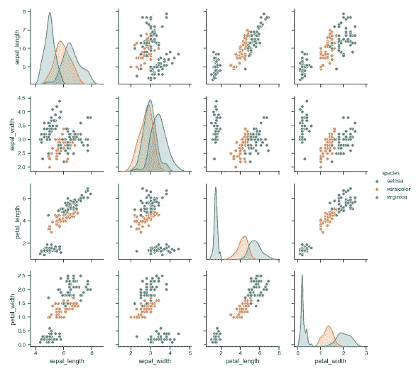
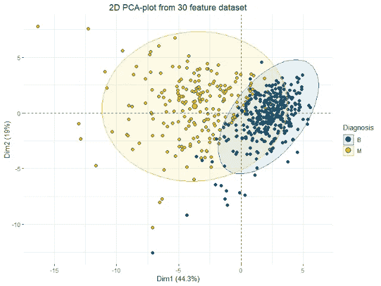
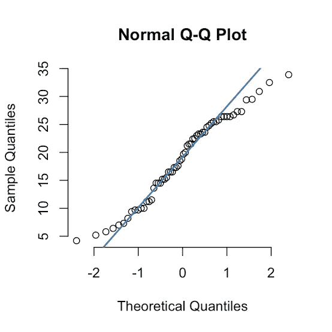
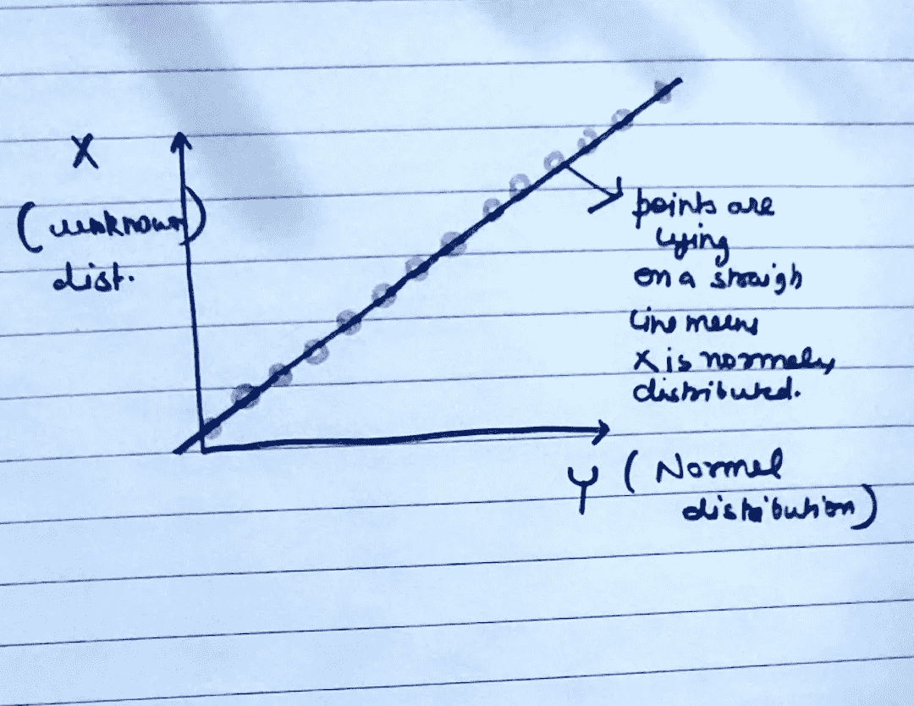

# Q-Q 图、散点图、配对图——在哪里使用？怎么用？

> 原文：<https://medium.com/analytics-vidhya/q-q-plots-scatter-plots-pair-plots-where-to-use-how-to-use-d16c682e33a2?source=collection_archive---------6----------------------->

作为数据科学家，数据可视化是解决问题的重要步骤之一。当我们直观地看到数据时，我们获得了对数据的深刻见解。无论是变量的相关性，变量的共线性数据可视化都是最重要的一步。

数据可视化简单地说就是绘制分布图，绘制分布图涉及不同的图。

基础，哼！

在这篇文章中我们会看到不同类型的情节，为什么我们需要它们？为什么没有一个图足以形象化的分布？是什么让科学家发现不同的情节？

# **剧情类型**

1.  散点图
2.  带状图
3.  配对图
4.  Q-Q 图

还有很多，但在本文中，我们将重点讨论这四个。

# **散点图**

这里使用笛卡尔坐标来显示一组数据的典型的两个变量的值。

**或**

目的是确定两个或多个定量变量之间的关系类型。

例如，假设一名医生想要了解一个人的屏气时间和其肺活量之间的关系(这里我们假设肺活量是作为一个实数来测量的)

这是 2D 散点图的一个例子。

**三维散点图**

Plotly 有惊人的内置库来绘制三维图，在一篇文章中告诉你关于 3D 图的一切并不容易，但对于那些有兴趣了解更多 3D 图的人可以搜索 Google **CONTOUR PLOTS。**

您将了解 3D 散点图。

**4D/5D/6D 散点图**

现在，想象一下在 4D 或 5D 可视化一些东西，我们将无法从图中检索任何信息，因为理解起来会非常复杂，正如我们所知，作为数据科学家，“模型可解释性”非常重要。

因此，为了解决这个问题，一些聪明人引入了**配对图**

# **什么是结对情节？**

与其定义，不如让我放一张图，你会很容易地联想到它，你会明白 pair plot 是如何解决更高维散点图的问题的。

没错。！！！Pair plot 是一种矩阵型分布，显示每对可能特征的数据点分布。

就我个人而言，我记得它是每对特征的散点图。

这意味着如果有 n 个维度或特征，Pair Plot 简单地给出了 n*n 大小的矩阵。

Seaborn 对于 Pairplots 有一个非常简单的单行代码

***将 seaborn 导入为 sns***

***sns.pairplot(data= " "，hue= "，size=3)***

很公平！！！！！

让我给你一个情况，假设你有 100 个特征，你想要它的配对图，现在 100*100 将是很多图

从头到尾看完每一个情节并从中理解是非常困难的。

**所以我们有一个问题，对！！！！**

因此，为了解决这个问题，我们有一种叫做降维的方法，当有高维数据集时，我们有一种叫做 PCA 和 T-SNE 的技术来可视化数据。

我不能在这里涵盖降维，因为它本身是一个非常大的话题，但我已经写了一篇关于主成分分析和 T-SNE 的[几何膨胀的文章。](https://link.medium.com/YaJORCJVT2)

读完之后，你会很容易把这些点联系起来。

现在只要记住一件简单的事情

**低维数据(最多 10 个特征)—使用配对图**

**高维数据(100 个特征或更多)——使用降维**

那么什么是 Q-Q 图，我们为什么需要它？？

它代表分位数图。

在继续之前，我假设你知道什么是高斯分布或正态分布，如果你不知道一些关于高斯分布的简单事实。

1.  均值、中位数和众数在这个分布中是相同的
2.  钟形，平均对称。
3.  平均值为“0”，标准偏差为“1”
4.  科学家已经广泛研究了这种分布，我们有足够的关于这种分布的信息来将我们的模型塑造成一个良好的机器学习模型。

因此，如果我们以某种方式知道我们的分布是高斯分布，我们就可以建立一个伟大的机器学习模型。

**但是如何确定一个分布是不是高斯分布呢？**

有两种方法可以确定:-

1.  **Q-Q 图**
2.  **K-S 测试**(我们稍后会研究这个)

所以我们明白了为什么我们需要 Q-Q 图。

**Q-Q 图如何确定？**

假设我们有一个随机变量 X，我们从中取出 500 个观察值，比如 x1，x2…..x500。

这里我们不知道 X 的分布，在 QQ 图的末尾我们应该知道它是否正态分布。

要遵循的步骤

## 1.按升序排列 xi，并找出百分位数

(如果你不知道如何找到百分位数，或者什么是百分位数，假设我有 100 个值，我把它们按升序排列。

X={x1，x2，x3…x100 }，这里 x1

In this set, lets say i am ranking each value from 1 to 100 so first value will get rank 1 and the last value will get rank 100.

I can say that below the value of x10 or below the value of 10th rank or 10th percentile, ***10%的值位于*** 和 X10 以上或第 10 百分位以上， **90%的值位于。**

这就是百分位数的含义。

所以我们将得到最初 500 个样本的 100%的值

x5，x10，x15，…. x500 {这些是百分位值}

**x5 是只有 1%的值位于其下的值(因为这里的样本大小是 500 而不是 100)**

**x10 是一个值，只有 2%的值低于该值**

**x25 是只有 5%的值位于其下的值**

## 2.第二步是创建一个随机变量 Y，它具有正态分布，均值=0，标准差=1。

我们将再次选取 500 个观察值，对它们进行分类并找出它们百分位数

假设我们有 y1，y2，y3…y100(和我们最初的分布 X 一样)

让我提醒你，我们不知道 X 的分布是什么，这就是为什么我们使用 Q-Q 检验来确定 X 的分布是否是高斯/正态分布。

## **3。第三步是在 X 和 Y 之间绘制 QQ 图**

所以我们有{x1，y1}，{x2，y2}，{x3，y3}……{x100，y100}

我们将绘图，如果所有点都在同一条线上，这意味着 X 是正态分布的，但不需要均值= 0 和标准差=1。

如果所有点不在同一条直线上，就意味着 X 不是正态分布的。

在下图中，点最终偏离，这意味着样本分位数不是正态分布的。

**码图**

scipy 有一个内置的工具来绘制 QQ 图

***导入 scipy.stats 为 stats***

***导入 pylab***

****pylab.show****

*在下一篇文章中，我们将讨论直方图和 pdf(概率密度函数)的必要性。，什么是核密度函数？，为什么 CDF(累积密度函数)是解决一个机器学习问题时最重要的情节。*

*感谢阅读…*

# *尼舍什·戈吉亚*

*   ****如果你喜欢这个，*** [***跟我来这里***](/@nishesh.kumar) ***了解更多****
*   ****有兴趣合作吗？下面就来连线一下***[***insta gram***](https://www.instagram.com/nishesh_gogia/)*