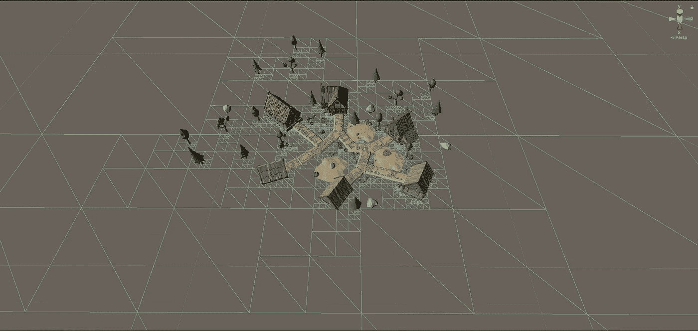
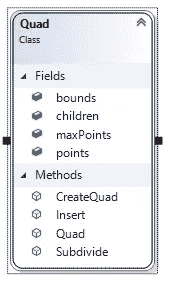

# Unity 中的四叉树

> 原文：<https://medium.com/analytics-vidhya/quad-tree-in-unity-794382cd74b4?source=collection_archive---------4----------------------->

在这篇文章中，我将分享如何在 unity 中创建四叉树。这可以用于各种目的。所以让我们开始吧。

# 为什么？

首先，我想分享一下我为什么要创建这样一棵树。我的目标非常简单:根据基于顶点数据的网格密度划分空间。一旦我知道在一个给定的区域中哪些是更密集的区域，我就可以对它有更多的控制。参考下图，该图显示了如何将特定场景划分为基于四边形的结构:

基于顶点的密度四叉树

展示实时分区的简单视频

# 四叉树结构和类

> 四叉树:**四叉树**是一种树形数据结构，其中每个内部节点正好有四个子节点。

现在我们有了一个起点，我们知道，如果我们从根节点开始，它将正好包含 4 个子节点。对于每个子节点，也将有 4 个子节点。

> 我n 无限节点？如果每个节点有 4 个子节点，那么是的，节点结构将是无限的。我们将在后面的章节中研究如何控制这种情况。

四叉树的伪结构可以像你在图像中看到的一样简单。这就是你创建一个有树枝和树叶的树结构所需要的全部。

为了更容易理解，我使用了类名“Quad”。让我们看看各种属性:

**界限:**四方形组成的区域。将检查每个点是否位于四边形的边界内。

**Children :** 如果一个特定四边形中的数据数量溢出，将导致该四边形被细分为更小的部分。如前所述，每个节点在“四叉树结构”中有 4 个子节点。

**MaxPoints :** 这是该节点可以保留的最大数据数量。如果超过，四边形将被细分。

**Points :** 实际数据或者只是一个简单的计数器来对照 MaxPoints 进行交叉检查。

虽然这是所有的属性，让我们看看方法:

**CreateQuad :** 通过将父对象的边界除以 4 来创建一个 Quad 对象或节点。对于您创建的每个象限，CreateQuad 方法将根据其自身的特定界限被调用。就像你在下图中看到的，最大的正方形被分成 4 个小正方形，其中 3 个是空的。1 然后被分成越来越小的四边形。

**插入:**对每个点调用该方法，检查该点是否位于特定的四边形中。如果该点位于四边形中或四边形的边界内，则数据被添加到特定节点。更详细地说，一旦点被添加到“点”属性，就执行检查“点”的数量是否小于“最大点”。基于该结果，四边形被进一步细分。

> 快速优化:总是首先检查点是否在四边形中，如果不是，执行早期返回。这将节省大量计算。

**Quad :** 这是类的构造函数。尽可能简单，如果需要，只需初始化类和属性。

**细分:**这是当“点数”超过“最大点数”计数时直接调用的函数。这将调用“CreateQuad”函数 4 次，通过将当前四边形的面积/边界细分为 4 个相等的部分来创建 4 个不同的四边形。

# 接下来呢？

一旦我们有了类，我们需要实现并开始填充数据。我们知道我们需要一个根节点。这里的用户可以选择用不同的方式来实现它。用户可以在运行时动态创建多个四叉树，或者标记整个区域并进行四叉树分区。为了使这非常简单，我已经采取了一个三维场景和相同的范围。然后我创建了一个“根节点”并提供了它的边界。

正如您在下图中看到的，我已经标记了根节点，并给出了 500x500 的边界。从我所拥有的 3d 数据来看，这是一个巨大的数字，但在这篇文章中，它变得更容易理解:

# 整理数据

对于本文，数据是网格。因此，对于场景中的每个顶点，我们将调用根节点的“插入”方法。如果根包含顶点位置，那么它将把该点添加到它的数据中，否则将忽略它(这里动态创建四边形将更有效)。

如果点的数量超过，根节点将被细分为 4 个部分，每个部分都将调用相同的“插入”方法。记住每个四边形都有插入功能！下图将帮助您理解所创建的四边形:

我特意留出了很多空闲空间，这样我们就可以看到，在没有数据或数据较少的地方，四边形的边界更大。这证明，如果数据溢出，那么只有在那时，四边形才会被细分。这里，我保持了每个四边形 250 个顶点的限制。我们可以清楚地看到，蓝色突出显示的区域有更多的顶点，因此它被进一步细分，而另一个区域有更大的四边形:

> 快速提示:在 unity 中，rectangle 类只接受 x 和 y 参数。因此，对于一个 3d 点，我们只能取 2 个轴。这里我取了 X 和 Z 轴。

# 结论

所以这里我们以四叉树数据结构的创建和实现来结束。我们也看到了实现和使用。除了我所讨论的，这可以用在很多地方。理想的地形生成是可以给出的最好的例子，基于玩家的距离，四边形被细分以呈现更高的细节。远离用户的那些将显示较少的数据。

希望这个简化版本能帮助你理解和实现你自己的四叉树结构。