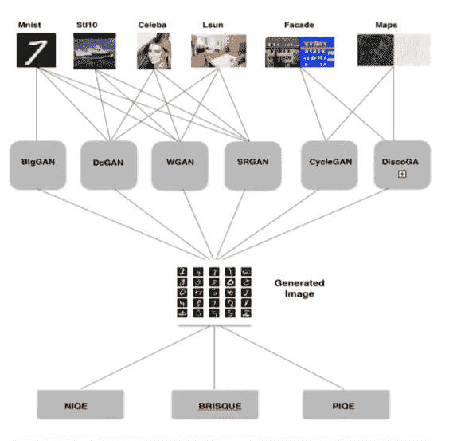
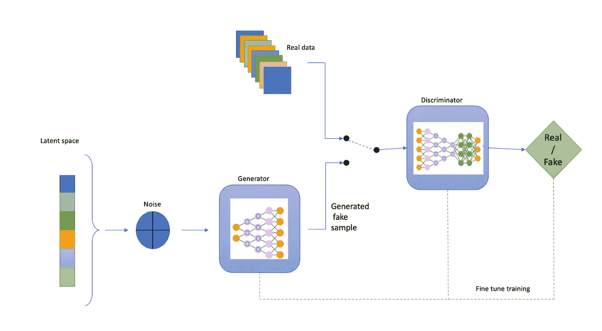
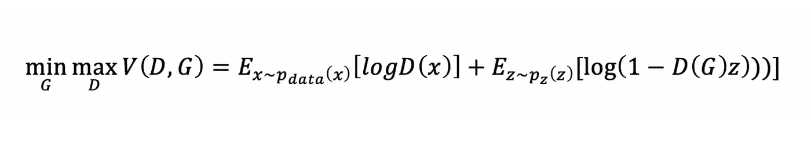

# 生成对抗网络的质量评估

> 原文：<https://medium.com/analytics-vidhya/quality-assessment-of-generative-adversarial-networks-369444a0259c?source=collection_archive---------10----------------------->

# 目标

目标是使用无参考图像质量评估度量(NR-IQA)找到性能最佳的 GAN。该项目的主要部分需要

(一)审查现有的基本原则并进行分类；

(ii)选择用于生成假图像的最佳 GANs

(iii)使用 IQA 测量生成图像的质量；最后

(iv)比较各种 IQA 以找到性能最佳的 GAN。

该报告的结果评估了哪种 GAN 使用 NR-IQ 产生更好的图像

# 介绍

近年来，生成性对抗网络(GANs)呈指数级增长。除了提供令人惊讶的似是而非的假图像之外，它们还在例如半监督学习、图像到图像的翻译和模拟图像细化等方面进行了创新。不管有多少 GAN 模型可用，为了找到更好的 GAN，我们需要评估生成的图像。然而，它们的评估仍然主要是主观的，并且经常反映了对生成图像的视觉保真度的人工检查

图像质量是评估视频和图像处理方案效率的关键指标。因此，图像质量的评价非常重要。对图像进行评估的最简单的方法是向熟练的人类观察者展示它。然而，对于每个人，人类的感知可能不同。这个问题可以通过从不同的人那里获取不同的意见并对结果进行统计处理来解决；这叫做*主观质量评估*。然而，这是一个漫长且不准确的质量评估过程。以同样的方式选择参与者，他们所有的信息，技能，可及性，偏见，解释都是主观的和定性的。由于主观评估的内在约束，GANs 的发展需要适当的量化措施来规范更好模型的结构。

与参考图像和重建图像都可用的许多图像分析任务(例如图像压缩)相反，由 GANs 生成的图像可能没有任何参考图像。因此，为了找到更好的 GAN，需要一种用于对 GAN 图像进行无参考定量评估的自动化系统。这个问题因此可以表示为*对甘*的客观质量评价。

# 1.科学总结

由于该项目的目标是找到能够生成最佳伪图像的 GAN，这是通过 NR-IQA 度量对这些图像进行质量评估来完成的。在该项目中，6 个 gan 使用 6 个数据库来生成图像，然后使用 3 个无参考图像质量评估指标来评估图像，如图 1 所示。

6 数据库包括:6 数据库包括-

*   MNIST:一个数字数据库，包括 60，000 个样本的训练集和 10，000 个样本的测试集。
*   CelebA:超过 20 万张著名图片的大规模面部数据收集，每张图片有 40 个特征。
*   Stl10:具有 10 个类别和 10000 个未标记图像的图像识别数据集。10 类包括飞机、鸟、汽车、猫、鹿、狗、马、猴子、船和卡车。
*   Lsun:它包含了 10 个场景类别和 20 个物体类别的大约 100 万张标记图像。该数据集包含自行车、鸟、卧室、公共汽车、椅子、汽车、桌子图像等等。
*   地图:由卫星和普通视图中的 1000 幅土地图像组成的数据集。
*   立面:它包括来自不同来源的 606 个立面校正图像的立面图像数据集。

使用这些数据集的六个 gan 是(更多细节将在第 2.2 节提供) :

*   DcGAN —顾名思义，深度卷积 GAN 使用卷积层代替全连接和最大池层。
*   WGAN — Wasserstein GAN [23]使用 Wasserstein 距离来估计模型和目标分布之间的方差。
*   BigGAN -[27]它使用具有非常大批量和大量模型参数的深度神经网络来产生高分辨率图像。
*   SrGAN —超分辨率 GAN 使用深度网络结合对手网络来生成超分辨率图像。
*   DiscoGAN -Discovery GAN 使用深度卷积网络执行跨域图像到图像的转换。
*   CycleGAN-CycleconsistentGAN 使用循环一致的对抗网络执行不成对的图像到图像翻译。

IQA 的应用范围很广，可以分为三类:全参考 IQA (FR-IQA) (FR-IQA)[，无参考 IQA (NR- IQA)和简化参考 IQA (RR-IQA)此外，本研究中使用的三种无参考图像质量评估指标是:

*   PIQE——基于感知的图像质量评估器(PIQE) [29]是一种不知道观点且不受监督的指标。PIQE 测量可感知的失真块的局部可变性，并评估块失真。
*   NIQE —自然图像质量评估器(NIQE) [28]模型已经在原始图像数据库上进行了训练，用于测量具有渐变失真的图像质量。
*   bris que-Blind/ReferencelessImageSpatialQualityEvaluator(bris que)[30]在具有明显失真的图像数据库上运行，测量具有相同失真类型的图像质量。

# 2.方法学

## 2.1 —理论

> 氮化镓

深度学习用于发现丰富的渐进模型，这些模型显示了自然语言处理、波形形式的语音和主要在人工智能中体验的自然图像等数据的概率分布。2014 年，Ian Goodfellow 和他的同事提出了一个基于深度学习的生成模型。生成建模是机器学习中的一项无监督学习任务，涉及对输入数据的规律性或模式的自动检测和学习，以便可以生成或产生新的示例，这些新示例可以从原始数据集中获取。

GANs 是一种训练生成模型的智能方法，通过将问题分成两个子模型作为监督学习问题:我们训练以产生新示例的生成器模型，以及尝试将实例分类为真实(来自领域)或虚假(生成)的鉴别器模型。

首先，GAN 中的生成模型与一个敌人对抗:一个判别模型，它决定一个实例是来自数据样本还是模型。GANs 的基本思想是在两个玩家之间建立游戏。一个叫做发电机。生成器生成旨在与训练数据进行比较的样本。歧视者是另一个玩家。鉴别者检查测试以确定它们是真的还是假的。鉴别者希望使用传统的受控学习方法，将贡献分成两类(真的或假的)。生成器愿意欺骗鉴别器。

生成模型可以被认为是像一群伪造者，试图提供和使用未经识别的伪造资金，而辨别模型几乎像警察，寻求识别伪造的现金。在这场比赛中，竞争导致两组都加强他们的策略，直到假货与认证数据无法区分。

*   生成器——生成器本质上是一个可微分函数 *G* ,由带参数 *g* 的多层感知器表示。首先，输入噪声 *z* 根据一些基本的先验分布进行测试， *G(z)* 产生输出 *x* 。深度神经网络的第一层的输入不需要与函数 *G* 的输入相同。
*   鉴别器——还有第二个多层感知器 *D* 提供单一标量输出。 *D(x)* 表示 x 来自生成器或数据的概率。
*   训练过程——在训练中，鉴别者 *D* 和生成者 *G* 都用价值函数 *V(G，D)* 在双人游戏中进行极大极小游戏。为了最大化对从 *G* 和训练样本生成的样本的准确标记，我们训练 *D* ，同时训练 *G* 以减少 *log(1-D(G(z)))* 。

在学习阶段开始时， *G* 很差，因此 *D* 非常确定要剔除样本

因为它们显然不如训练数据好。所以我们可以因为训练位置 G 处的 *log(1-D(G(z))* 而增加 *logD(G(z)* ，以减少 *log(1-D(G(z)))* 。该功能提供了与 *G* 和 *D* 动力学相同的设定目标，但使学习的开始变得更加有力。

其中 *D* 为鉴频器， *G* 为发电机， *z* 为输入噪声， *x* 为发电机输出。尽管 GANs 在真实图像生成方面取得了一些成绩，但这种训练是不稳定和缓慢的。许多 GAN 模型存在以下主要问题:

1.  纳什均衡——甘是非合作零和博弈。一个模型试图赢得我最大化自己的行动，另一个模型的行动是减少他们。在博弈论中，当鉴别器和生成器达到纳什均衡时，GAN 模型收敛。纳什均衡是一个模型不会改变，不管另一个模型做什么。
2.  消失渐变—如果鉴别器行为不好，则发生器没有精确的反馈或真实性，损失函数无法表示它。如果鉴别器操作令人钦佩，损失函数率下降到接近于零，学习太温和，甚至卡住。
3.  模式崩溃——在训练期间，发生器可能会陷入某个位置，在该位置，它通常会产生相同的输出。对于一般被称为模式崩溃的 GANs 来说，这是一个典型的失望情况。尽管生成器很可能误导相关的鉴别器，但是它不理解来自真实地球仪的复杂信息是如何被表示的，因为它们位于具有非常低变化的小区域中。
4.  没有合适的评估标准——没有合适的评估标准，就像是默默无闻地工作。甘没有提供好的标志，建议什么时候停下来，什么时候看各种车型的表现。

随着 gan 的改进，gan 的数量呈指数级增长，可分为 4 大类-

1.  单/多类生成-它们是生成性对抗网络的类型，在单个或多个域中接收噪声并从中生成图像
2.  域内—在域内翻译图像的 GANs 类型。
3.  域间-将图像从一个域转换到另一个域的 GANs 类型。
4.  超分辨率——有一些 gan 可以实现超分辨率。

> 2.1.2 无参考图像质量指标

图像噪声含量的估计及其随后的去除是一个非常重要的研究领域。这些年来，人类的智能一直被认为是唯一能够感知信号图像噪声的工具。评估图像质量的最简单方法是将图像展示给专业的人类观察者。但是，对于每个人，人类的理解可能是截然不同的。

这个问题可以通过采纳不同的意见并对不同人的结果进行统计处理来解决。这被称为图像质量的主观评价。然而，这是一个漫长而不准确的质量评估方法。事实上，一切都是主观的，从参与者的选择，他们的知识，专长，可达性，严重性偏见，解释质量。因此，需要一种自动化系统来进行定量图像评估。

可以使用简化且有效的客观评估方案，根据主观人类质量评估给出图像的质量等级。客观图像质量评估(IQA)是指自动预测变形图像的感知质量的挑战性任务。客观图像质量评估可以通过三种方式完成-

1.  完全参考图像质量评估(FR-IQA) —这是通过将失真图像的质量与被认为未失真的初始图像版本进行比较来评估图像。通过测量失真图像与参考图像的差异，计算失真量。测量图像质量最简单的方法是计算峰值信噪比(PSNR)，但 PSNR 并不总是与人类视觉感知和图像质量相关[31]。为解决 PSNR 度量的限制，提出了附加参数。结构相似性指数(SSIM) [32]，视觉保真度(VIF) [39]，快速 SSIM (FSIM) [33]，多尺度结构相似性(M-SSIM)，加权四分量结构相似性[35]是与人类感知密切相关的参数。这些参数给出了失真图像与参考图像的偏差程度。对质量评估参考图像的要求限制了以下用于质量评估的参数和算法的使用。
2.  简化的参考图像质量评估(RR-IQA)-在 RR-IQA 中，算法仅使用参考图像的受限特征来评估质量，而不是完整图像。FR-IQA 的限制保留在 RR-IQA，这意味着需要使用从参考图像获得的特征进行质量评估。尽管有 RR-IQA 技术的种种限制，卫星和遥感图像质量评估仍被普遍使用。
3.  无参考图像质量评估(NR-IQA)-这些算法在不需要参考或其特征的情况下给出图像质量，这是使用 NR-IQA 评估 GANs 生成的图像的主要原因。NR-IQA 问题比上面提到的两个问题更严重。由于缺少参考图像，有必要对参考图像统计、人类视觉系统的性质以及未监控图像统计中失真的影响进行建模。在缺少参考图像的情况下，对具有某种失真图像的质量测量的有效性也很难评估。无参考算法使用输入图像的统计特征来评估图像质量。因为对于由 GANs 产生的伪图像没有参考图像，所以无参考质量度量是唯一可用的选项。这些无参考算法包括:

*   盲/无参考图像空间质量评估器(BRISQUE)
*   自然图像质量评估器(NIQE)
*   基于感知的图像质量评价器(PIQE)

 [## 生成对抗网络的质量评估(下)

### 方法

medium.com](/@gaganjotsingh_30429/quality-assessment-of-generative-adversarial-networks-part-ii-6f8eea050e57)