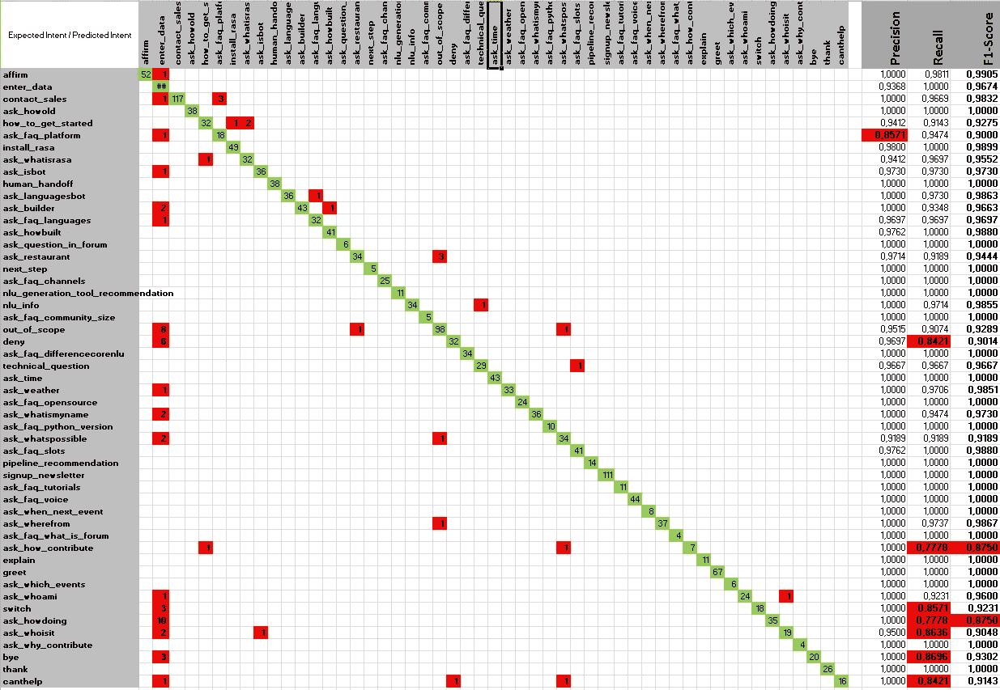
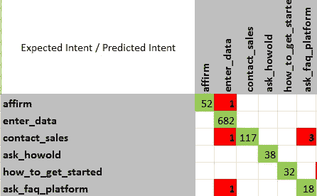
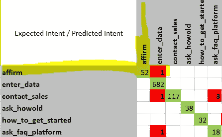
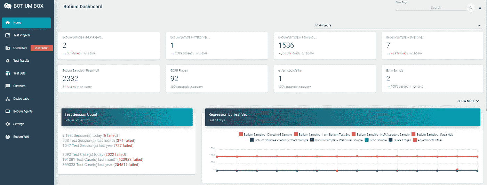
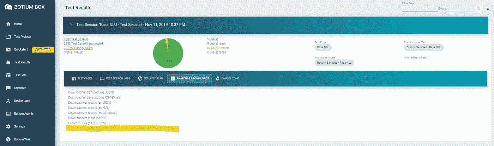
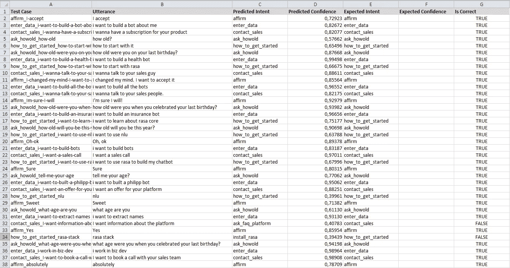

# NLU/聊天机器人训练数据的质量度量/第 1 部分:混淆矩阵

> 原文：<https://medium.com/analytics-vidhya/quality-metrics-for-nlu-chatbot-training-data-part-1-confusion-matrix-91ac71b90270?source=collection_archive---------3----------------------->

**更新 2020/11/01:** Botium 的免费计划上线了！使用 Botium Box Mini，您将能够:

*   使用多种聊天机器人技术
*   在几分钟内设置测试自动化
*   享受全新改进的用户界面
*   获得托管的免费服务的优势

[试驾一下](https://www.botium.ai/pricing/)

*什么是混淆矩阵？如何生成和读取混淆矩阵？如何计算你的 NLU 引擎的精确度、召回率和 F1 分数？*

本系列文章介绍了 NLU 引擎和聊天机器人训练数据的重要质量指标。我们将关注引入的指标的实际应用，而不是数学和统计背景——为此，我将添加其他文章的链接。

这是 NLU/聊天机器人训练数据系列文章*的第 1 部分。*

*   [第 1 部分:混淆矩阵](/@floriantreml/quality-metrics-for-nlu-chatbot-training-data-part-1-confusion-matrix-91ac71b90270)
*   [第 2 部分:嵌入](/@floriantreml/quality-metrics-for-nlu-chatbot-training-data-part-2-embeddings-57aa341d81fa)

> 对于本系列文章，您应该了解什么是 NLU 和自然语言处理，以及[涉及的词汇](https://chatbotsmagazine.com/chatbot-vocabulary-10-chatbot-terms-you-need-to-know-3911b1ef31b4)(意图、实体、话语)和概念(意图解析、意图置信度、用户示例)。

# 为什么质量指标对 NLU 很重要？

为聊天机器人训练 NLU 引擎总是遵循相同的方法:

1.  您已经标记了可用的训练数据(*标记的*表示:您知道一个话语需要解决什么意图)
2.  你把训练数据输入你的 NLU 引擎
3.  您验证培训结果
4.  改进训练数据并重复，直到满意为止

对于第 2 步，选择的工具是 [Botium](/@floriantreml/botium-in-a-nutshell-part-1-overview-f8d0ceaf8fb4) 来自动化训练过程。

 [## 简而言之，第 1 部分:概述

### 这是果壳中的肉毒杆菌系列文章的第 1 部分。

medium.com](/@floriantreml/botium-in-a-nutshell-part-1-overview-f8d0ceaf8fb4) 

对于第 3 步，一种方法是使用不用于训练的特殊测试集对 NLU 引擎进行一些手动或自动测试。**基本问题是:第 4 步，训练数据的细化，对 NLU 的表现有正面还是负面的影响？在解析意图时，它让我的 NLU 变得更好还是更差？**

> 你可能会问为什么训练数据的细化会有负面影响？因为改变意图的用户示例能够并且将会对具有相似用户示例的意图的意图解析和信心产生影响。

即使在处理一个有 30 个意图和每个意图 70 个用户示例的中小型聊天机器人项目时，也有数千个测试结果需要验证并与之前的训练周期进行比较——如果依赖快速反馈周期，这是不可能的。我们需要的是相当少量的可比数字(或*指标*)——最好的情况下只有一个数字——来告诉我们**在 NLU 的总体表现**，以及其他一些告诉我们需要关注的**热点**的数字。一句话:

> 质量指标使 NLU 培训周期具有可比性，并指出感兴趣的领域。

# 混乱矩阵

混淆矩阵显示了**预测意图与**预期意图的概述。它回答类似“当发送用户示例 X 时，我期望 NLU 预测意图 Y，它实际上预测了什么？”。

预期意向显示为行，预测意向显示为列。用户示例被发送到 NLU 引擎，预期意图行和预测意图列的单元值增加 1。因此，每当预测和预期的意图匹配时，对角线中的单元格值就会增加——这些是我们的**成功测试案例**。不在对角线上的所有其他单元格值是我们的**失败测试案例**。

## 例子

以下是为 Rasa 演示机器人 Sara 计算的大型混淆矩阵中的一小部分:

这个矩阵可以推导出如下语句:

*   *确认*意图有 53 (52 + 1)个用户示例。但是对于其中一个，NLU 反而预测了 *enter_data* 的意图。
*   NLU 预测了 21 (18 + 3)个用户示例的 *ask_faq_platform* 意图，但只在其中 18 个示例中有预期意图，其余 3 个示例的预期意图是 *contact_sales* ，因此预测是错误的。
*   对于 *ask_faq_platform* 意图，有 19 (18 + 1)个用户示例，但其中只有 18 个被 NLU 认可。
*   对于 38 个用户示例， *ask_howold* 意图是预期的，并且 NLU 准确地预测了这 38 个用户示例。

从这些陈述中，可以得出几个结论:

*   *询问多长时间*和*如何开始*意图训练完美
*   有 3 个用户示例，其中 NLU 预测了 *ask_faq_platform* ，但是测试数据预期了意图*contact _ sales*——找出这 3 个用户示例并为它们提炼训练数据
*   *enter_data* 预测了 3 (1 + 1 + 1)个用户示例的意向，其中预期了另一个意向。另一方面，有 682 个用户示例被正确识别为 *enter_data* ，因此这种意图的折衷是可以接受的

# 精确度、召回率和 F1 分数

上面的陈述在逻辑上无懈可击，但并不完全直观。

*   如何决定一个意向或意向对是否需要**细化和额外培训**？
*   实际上如何**将 NLU 的总体表现**与之前的训练周期进行比较？
*   如何将**最重要意图**的表现与之前的培训周期进行比较？
*   如何决定训练数据**是否足够好**用于生产用途？

这就是精确度和召回率的统计概念发挥作用的地方，F1 分数代表了两者之间的权衡。

你可以在维基百科上找到[细节，这篇文章只会给出一个大概的概述。](https://en.wikipedia.org/wiki/Precision_and_recall)

## 精确

在上面的例子中，NLU 识别了 21 (18 + 3)个用户示例的意图 *ask_faq_platform* 。对于其中的 3 个，预期意图是另一个意图，所以 21 个预测中有 3 个是错误的。精度约为 0.85 (18 / 21)，意向 *ask_faq_platform* 的正确预测数除以意向 *ask_faq_platform 的预测总数。*

> 精准率回答的问题是:一个意图的预测有多少是正确的？

## 回忆/敏感度

在上面的例子中，我们有 121 (1 + 117 + 3)个用户示例，因为我们期望意向*联系人 _ 销售*。NLU 仅针对 117 个用户示例预测了意向*联系人 _ 销售*。召回率约为 0.97 (117 / 121)，对意向 *contact_sales* 的正确预测数除以对意向 *contact_sales* 的预期总数。

> 召回率回答的问题是:有多少意图被正确预测？

## 精确度与召回率— F1 分数

虽然这两个听起来差不多，但它们不是。事实上，仅仅用这两个指标中的一个来评估 NLU 的性能是不可能的。

同样，根据上面的例子:

*   *contact_sales* 意图已经被预测了 117 次，其中 117 次预测是正确的。**准确率 1.0，完美**。
*   还有 4 个用户示例，NLU 预测了它们的另一个意图。**召回率~0.97，相当不错，但不完美。**

理论上，通过使**对一个意图的预测**数量非常少(例如，通过将*置信度*设置得非常高)，可以获得完美的精确率。但在这种情况下，召回率将大幅下降，因为 NLU 在许多情况下不会做出预测(或做出错误的预测)。

另一方面，通过**将每个用户实例解析到这个意图**，有可能获得一个意图的完美召回率。精度会非常低。

召回率和准确率的权衡称为 [F1-Score](https://en.wikipedia.org/wiki/F1_score) ，是两个之间的**调和平均值。最重要的是，F1 分数是衡量 NLU 培训效果的可比指标。经验法则(除了一些例外)是:**

> 在你的测试数据中，提高 F1 分数意味着提高 NLU 性能，降低 F1 分数意味着降低 NLU 性能。

0.95 的 F1 分数通常是一个很好的值，这意味着 NLU 引擎在你的测试数据上工作得很好。

> F1 的 1.0 分意味着你所有的测试数据都被你的 NLU 完美地解决了，完美的 NLU 表现。这对于回归测试来说可能是令人愉快的，但是典型的**是过度拟合**的标志——这是另一篇文章的主题。

# 自动计算精确度/召回率/F1 分数并生成混淆矩阵

[Botium](http://www.botium.at/start.html) 是聊天机器人的 Selenium，是自动训练和测试任何[支持的 NLU 引擎](https://botium.atlassian.net/wiki/spaces/BOTIUM/pages/360553/Botium+Connectors)的完美选择:

*   IBM 沃森
*   谷歌对话流
*   微软路易斯
*   亚马逊 Lex
*   SAP 对话式人工智能
*   Wit.ai
*   罗砂
*   机器人新闻
*   自定义 HTTP/JSON 端点
*   [还有更多……](https://wiki.botiumbox.com/technical-reference/botium-connectors/)

Botium Box 记录所有测试数据，并为您计算重要的 NLP 分析。

除了混淆矩阵，包括召回率、精确度和 F1 分数(见本文截图)，您还可以获得一个完整的测试结果列表，在一个普通的 Excel 列表中显示您所有的预期和预测的意图和信心。

[今天就试用 Botium Box](https://www.botium.ai/pricing/)—从免费的迷你版开始，如果您觉得有用，我们很高兴收到您的来信！

# 寻找贡献者

请加入 Botium 社区，让聊天机器人向前发展！您的贡献有助于提高全球聊天机器人的质量，从而提高最终用户的接受度，这将再次推动您自己的聊天机器人向前发展！从这里开始:

https://github.com/codeforequity-at/botium-core