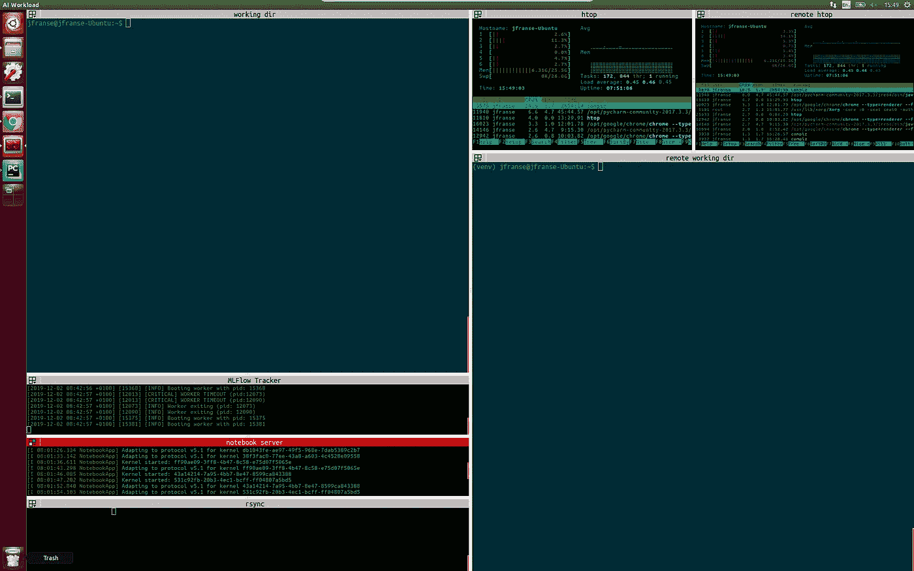

# 使用终端多路复用启动脚本的编码质量

> 原文：<https://medium.com/analytics-vidhya/quality-of-coding-life-with-a-terminal-multiplexing-startup-script-cd8dd7abf18e?source=collection_archive---------15----------------------->

## 使用终端、屏幕和 ssh，每次我(重新)启动或远程登录到一台机器时都节省了几分钟。

对于我的各种工作(学术和商业)，我花了很多时间在电脑后面做与代码相关的事情。我已经经历过很多次(实际上，我应该说一直都是，在我开始做下面将要描述的事情之前)打开很多窗口的情况；具体来说就是一堆终端，编辑器窗口(当然还有浏览器)。太多了。不同的终端有不同的用途，并被分组和命名，这样我可以很容易地找到它们；我会在不同的工作区同时从事多个项目；一些终端可以远程登录到其他机器上。因此，每次我不得不重启(或失去连接)时，我都必须返回并打开所有窗口，再次启动所有进程，重命名所有终端，并将它们放回原处(因为我已经习惯了所有东西都放在某个地方)。

这可能要花很多时间。我的猜测是每次最多 15 分钟，虽然我从来没有计时过。我花了太长时间才最终实现了这一切的自动化，但最终我做到了。也许我的一些发现对那些每次重启电脑时都有轻度焦虑的人有用。

我现在使用终端复用终端。仅仅

```
apt-get install terminator
```

重要的是，您可以配置各种布局，并使每个终端窗口在启动时执行预定义的命令。

对于布局，启动 terminator，开始创建窗口并根据您的喜好调整其大小。这很容易。然后通过右键单击任何终端窗口>首选项>布局>添加来保存此布局，然后为其命名并点击保存。

在编辑器中打开配置文件(应该在~/中)。config/terminator/config ),然后为每个终端手动设置以下所有内容

```
directory = /home/me/projects/someproject
# which directory to start in, obviouslyprofile = default   
# the visual profile: colors, fonts, etc. You can create these from the terminator settings.title = jupyter notebook  # the name of this terminal window# here is the important bit
command = '''bash --rcfile <(cat ${HOME}/.bashrc; echo 'export PROMPT_COMMAND="source activate my_env; jupyter notebook; unset PROMPT_COMMAND"') -i'''
```

这个布局有一个名称(您之前在首选项窗口中设置了它)，但是您也可以在配置文件中编辑布局名称。如果你编辑名为‘default’的布局，这将是当你不带任何选项启动 terminator 时默认加载的布局(名字里有什么，嗯？).暂且称之为 mylayout 吧。所以在(重新)启动我的系统后，我只是:

```
terminator --layout=mylayout
```

然后，举例来说，我会自动将我的 jupyter 笔记本服务器安装在正确的 virtualenv、pycharm、运行 htop 的窗口、用于将代码推送到远程的连续 rsync 进程，以及其他任何东西中。



我创业后的终结者

我将解释一下这个命令，因为它有点复杂。首先，terminator 只能执行一个命令，所以我们必须将我们希望发生的所有事情都打包到一个命令中:` bash`。支持[这个](https://stackoverflow.com/questions/31524527/using-python-virtual-environments-with-terminator) stackoverflow 答案。下面的解释大部分是从 SO 答案复制粘贴的，但我会添加一些我自己的注释。命令又来了:

```
command = '''bash --rcfile <(cat ${HOME}/.bashrc; echo 'export PROMPT_COMMAND="source activate my_env; jupyter notebook; unset PROMPT_COMMAND"') -i'''
```

*   我们在交互(-i)模式下执行 bash。所以 bash 会话在最后保持开放。
*   我们从自定义命令文件(— rcfile)而不是. bashrc 中执行命令。
*   这个文件是用。bashrc 再加一个命令。
*   这个额外的命令导出 PROMPT_COMMAND，其值为“我们想要执行的任何内容”。
*   PROMPT_COMMAND 是一个 bash 内置命令，每隔个新的提示行就会在*执行一次。*
*   因此，PROMPT_COMMAND 必须在第一次执行后立即取消设置，以避免在每次与 shell 交互后多次执行。
*   在 PROMPT_COMMAND 中，我几乎可以将所有我想要的命令链接在一起。在这个例子中，我激活了我的虚拟环境，并在其中启动了我的 jupyter 笔记本服务器。

再比如；启动某个应用程序，但让它在后台运行，这样我们可以在以后使用终端窗口做其他事情:

```
command = '''bash --rcfile <(cat ${HOME}/.bashrc; echo 'export PROMPT_COMMAND="unset PROMPT_COMMAND; pycharm &"') -i'''
```

要在后台运行，通常要在命令的末尾添加' & '，但是如果您想在命令后面使用分号链接另一个命令，这显然是行不通的。幸运的是，我们可以交换命令，这样' & '就在末尾，并且' PROMPT_COMMAND '的取消设置不会干扰它本身的执行。

另一个非常相关的问题是通过 ssh 在远程机器上做事情。我们有和上面一样的问题，每次重启我们自己的系统都要重新设置 ssh 连接。但是在使用 ssh 时还有两个缺点(当然，经验丰富的 ssh 用户已经知道了解决方案):如果您失去了与远程机器上的进程的连接，该进程将退出，如果远程机器重新启动，您显然还必须重新启动您在那里运行的所有东西。我最复杂的 terminator 启动命令同时解决了这三个问题。

对于连接丢失/客户端机器重启，我们将使用旧屏幕。基本的入门知识是这样的:键入 screen，按 enter，您就开始了一个新的终端会话，但它有点像后台进程。您当前连接到它，它实际上与您通常在终端中工作时没有什么区别。但是，如果您关闭窗口或按 CTRL-A CTRL-D，此会话将被分离。这意味着它仍在运行，只是不再连接到用户 I/O。要重新连接，只需做 Screen-r。Screen 可以做更多的事情，我现在不会深入讨论。

为了方便起见，我没有将整个命令写到 PROMPT_COMMAND 中，而是用它做了一个别名。因此

```
# in my terminator config file
command = '''bash --rcfile <(cat ${HOME}/.bashrc; echo 'export PROMPT_COMMAND="unset PROMPT_COMMAND; remote_tensorboard &"') -i'''# and in my ~/.bash_aliases:remote_tensorboard () { SCRIPT='bash --rcfile <(cat ${HOME}/.bashrc; echo "source activate tf_env; cd project/output; tensorboard --logdir=runs")' ssh -t myremote "screen -RR -q -S tensorboard bash -c '${SCRIPT}'"}
```

该命令将:

*   ssh 到我的远程机器(` my remote '是我的~/中定义的 ssh 别名。ssh/config，定义用户名、ssh-key 位置、端口转发等)
*   在这台远程机器上执行命令(-t 选项)
*   该屏幕将获得一个名称(在本例中为-S tensorboard ),并且不会显示标准屏幕的欢迎屏幕(使用-q)
*   如果已经有一个同名的屏幕会话，我们将附加到那个屏幕会话，而不运行 bash 命令(-RR)
*   使用 bash -c 在这个屏幕会话中运行一个“单个”bash 命令(c 告诉 bash 从一个字符串中执行一个命令)
*   如果在这个 bash 命令中我们想要一些复杂的东西，我们可以像以前一样使用相同的— rcfile 技巧。在这种情况下，我们从虚拟环境和特定目录启动 tensorboard。

诚实的免责声明:在 bash 中，我总是不得不处理引号和字符串转义之类的东西，所以可能有更好的方法来编写所有这些，但至少它是有效的！

设置好所有这些东西让我非常高兴，每次重启/重新连接时，可能节省了我 5 到 15 分钟(取决于项目),更不用说那些烦人的事情了！

我当然是在 linux 系统上。我估计 macOS 可能也有类似的东西。我用的是 terminator 和 screen，但我认为 tmux 结合了功能，我相信 byobu 也是如此。我还没有试过，但是它们看起来不错，我以后可能会试试。