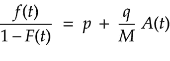
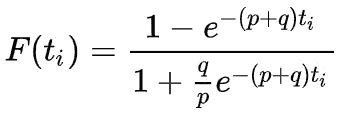
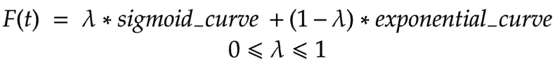
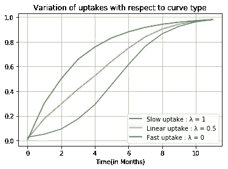
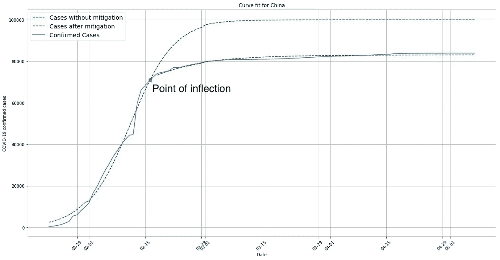
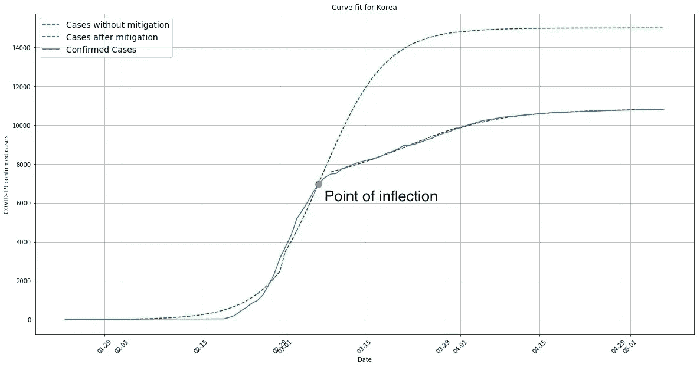

# 量化各国的 COVID 缓解努力

> 原文：<https://medium.com/analytics-vidhya/quantifying-covid-mitigation-efforts-by-countries-4b6e909f8162?source=collection_archive---------35----------------------->

冠状病毒是这一代人中肆虐的疫情，迄今已感染了 100 多万人。全球多个国家在危机期间的不同时间点采取了不同的缓解措施。有的起步晚，有的起步早，有的严，有的宽。在这里，我们尝试使用 Bass 模型扩散曲线来量化世界各地不同国家的 COVID 缓解工作。COVID 病例的实时统计数据可在此处找到:

 [## 冠状病毒病例:

### 追踪确诊病例、康复患者、检测和死亡人数的实时统计数据和冠状病毒新闻…

www.worldometers.info](https://www.worldometers.info/coronavirus/) 

# **低音模式**

Bass 模型是创新者和模仿者的数学表示，源自影响市场中产品销售的口碑战略。它是这样的:

> *“那些尚未采纳的人采纳的概率是那些先前采纳的人的线性函数。”——巴斯教授，*一辆*仿制品*模型， *1963。*

> 不幸的是，在我们的案例中，市场上采用的产品是冠状病毒。

等式是:

等式 1

F(t)—M 在时间 t
时采用的部分 F(t)—M 在时间 t
时已经采用的部分 A(t)—t
t 时产品的累计采用者(或采用者)数—从产品推出开始经过的时间
M —潜在市场(最终采用者数)
p —创新系数
q —模仿系数

等式 2

等式 2 对等式 1 的推导可以在这个[环节](http://www.bassbasement.org/BassModel/BassMath.aspx)中找到。

你可以看到等式 2 看起来足够复杂。因此，为了更简单，我们将 F (t)表示为等式 2 的线性组合，在 p=0 的极限情况下，它简化为逻辑函数，在 q=0 的极限情况下，它简化为指数函数。

我们使用参数 **λ** 在**快速摄取**曲线即**指数曲线**和**慢速摄取**曲线即**s 形曲线**之间进行调谐。

等式 1

公式 3 中 F(t)w . r . t .λ的变化

# 目标

在这篇博客中，我们使用 Bass 模型来评估:

1.  缓解措施如何在人群中扩散以抑制冠状病毒的传播？
2.  采用新的缓解技术预测 COVID 病例的下降率
3.  在不同国家之间进行比较，以评估谁做得更好？

# Python 实现

我找到了约翰霍普金斯大学追踪的数据。

 [## ncov - CSSE

### 参考资料:董鄂，杜洪，加德纳 l。一个基于网络的交互式仪表盘，可实时跟踪新冠肺炎。柳叶刀感染…

systems.jhu.edu](https://systems.jhu.edu/research/public-health/ncov/) 

p=0 的情况；定义一条 S 形曲线。

q=0 的情况；指数曲线，又称快速曲线

这种情况下，我们有一个 sigmoid 和指数的线性组合，即过渡曲线

在这篇博文中，我选择了两个国家:中国和韩国，来探讨和比较他们所做的减排努力的影响。由于这是一个事后分析，我选择了已经达到稳定状态的国家。

中国新冠肺炎确诊病例的曲线拟合

新冠肺炎确诊病例的曲线拟合-朝鲜

你可以从上面两个图中看到，与中国相比，韩国在缓解措施方面是多么成功。尽管是新冠肺炎的第一个热点，中国可以在传播的后期阶段遏制它。而韩国采取了先发制人的缓解措施，这有助于遏制病毒。现在，让我们借助 Bass 模型扩散曲线参数对三个图形进行量化。

> **注意:快速曲线的曲线类型= 10；慢速曲线的曲线类型= 0**

> 缓解措施有助于更快地拉平曲线。

# **关键要点**

由于缺乏足够的数据，我们必须对预计的受影响人口峰值持保留态度。但我们可以观察到以下趋势:

1.  缓解后确诊病例的预计峰值总是低于未缓解的病例
2.  曲线类型显示了我们向峰值前进的速度，在中国和韩国，我们看到具有缓解的曲线具有更高的曲线类型值，这意味着它们以更快的速度向峰值前进。因此，他们的缓解努力有助于更快地拉平曲线。
3.  我们还可以看到，在缓解的帮助下，**达到峰值的时间**似乎增加了，与没有缓解的曲线相比，的峰值感染数量**减少了。这也是一个好消息，因为这给了这些国家更多的时间来处理受感染的病人。**

该项目的代码可以在这里找到[ [Github](https://github.com/saminens/covid-analysis) ]

# 参考

弗兰克·m·巴斯，1963 年。“市场份额和销售行为的动态模型”，Frank M. Bass，伊利诺伊州芝加哥美国营销协会冬季会议论文集(Bass 模型部分从 269 页开始)。

[2]: [斯里尼瓦桑、v .西努和夏洛特·梅森。1986.新产品扩散模型的非线性最小二乘估计。*市场营销科学*，5 (2)，169–178 页。](http://www.jstor.org/pss/183671)

# 未来的工作

1.  死亡可以用类似的方式来模拟。
2.  可以探索其他参数化曲线来代替 Bass 模型扩散曲线。