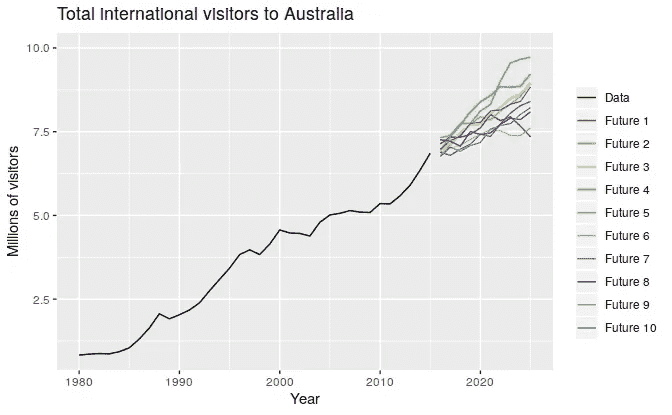
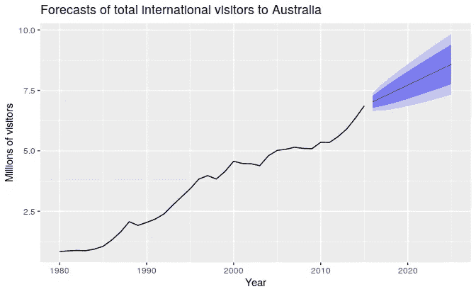
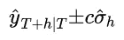
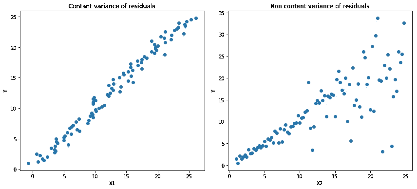
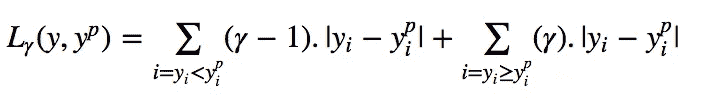
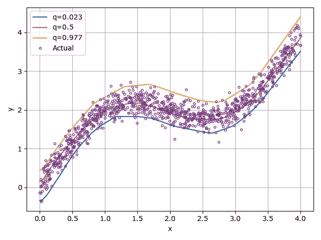

# 分位数回归和预测区间

> 原文：<https://medium.com/analytics-vidhya/quantile-regression-and-prediction-intervals-e4a6a33634b4?source=collection_archive---------3----------------------->

# **预测区间**

通常对于回归，我们最小化 RMSE 误差来得到一些相互依赖的变量的点估计。然而，我们很难衡量价值的确定性。让我们看一个例子。

图 1:多种可能的预测([来源](https://otexts.com/fpp2/perspective.html#perspective)

正如我们从上图中看到的，模型可以通过不同的方式学习参数，从而给出不同的未来值，也就是说，预测中会有一些变化。在大多数预测方案中，变化将随着预测期的延长而增加。这意味着我们预测的未来越远，我们就越不确定。

为了量化预测的不确定性，我们使用**预测区间**。因此，不仅仅是一个单一的值，我们现在也有一个如图 2 所示的区间，我们可以在一定程度上确信原始值位于其中。预测间隔通常是我们拥有多少数据、这些数据中有多少变化、我们预测多远以及使用哪种预测方法的函数。从下图我们可以看出，如果我们想要更自信，那么我们就会有更大的区间。这是在价值和范围之间的权衡。

图二。10 年预测的 80%(深色)和 95%(浅色)预测区间

对于估计了标准差σₕ的 *h* 步预测和输出变量 *y* ，预测区间可以计算为:

常数 *c* 取决于覆盖概率。这些值在列表[。](https://otexts.com/fpp2/prediction-intervals.html)

# **分位数回归**

生成预测区间的另一种方法是通过分位数回归。与线性回归相反，线性回归在给定预测变量的某些值的情况下估计响应变量的条件均值，分位数回归旨在估计响应变量的条件分位数(通常是中值)。

最小二乘回归基于残差(y-y’)在独立变量值之间具有恒定方差的假设。我们不能相信违背这一假设的线性回归模型及其预测区间。由于基于分位数损失的回归提供了合理的预测区间，即使残差具有非常数方差或非正态分布，分位数回归也能派上用场。

左:线性关系 b/w X1 和 y。残差方差恒定。右图:X2 和 Y 呈线性关系，但 Y 的方差随着 X2 的增加而增加。(异方差)[3]

正如回归最小化平方误差损失函数来预测单点估计值一样，分位数回归在预测某个分位数时最小化*分位数损失*。分位数损失定义为:

其中，γ是所需的分位数，取值范围为(0，1)。

现在，如果我们为中位数(即第 50 个分位数)训练模型，分位数损失就是*绝对*误差的总和。为了创建预测区间，我们现在可以使用其他分位数值。例如，在下图中，我们有 0.977 和 0.023 个百分点。这给出了在其边界内具有 0.95 概率的真值的预测区间。

分位数 0.023、0.5 和 0.977 的预测值和实际值(测试实例)。[5]

# **结论**

回归模型的输出值受到不确定性的影响，这种不确定性可以通过预测区间来建模。此外，线性回归模型不能用于残差具有非恒定方差或非正态分布的数据集。分位数回归解决了这个问题。

**参考文献:**

1.  [预测:原理与实践](https://otexts.com/fpp2/perspective.html#perspective)
2.  优步天气预报简介
3.  [https://heart beat . fritz . ai/5-regression-loss-functions-all-machine-learners-should-know-4fb 140 e 9 D4 b 0](https://heartbeat.fritz.ai/5-regression-loss-functions-all-machine-learners-should-know-4fb140e9d4b0)
4.  [https://www . wiki wand . com/en/Quantile _ regression #/Conditional _ Quantile _ and _ Quantile _ regression](https://www.wikiwand.com/en/Quantile_regression#/Conditional_quantile_and_quantile_regression)
5.  [https://www . evergreenwinnovations . co/blog-quantile-loss-function-for-machine-learning/](https://www.evergreeninnovations.co/blog-quantile-loss-function-for-machine-learning/)