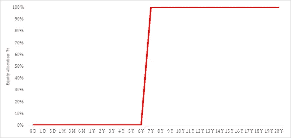

# 基于目标的量化资产配置

> 原文：<https://medium.com/analytics-vidhya/quantitative-goal-based-financial-advice-9dffa633e9d9?source=collection_archive---------25----------------------->

基于目标的财务建议通常基于投资者的风险规避和当前市场条件(由基本面和市场参数假设)。资产分配模型使用这些参数在股票和其他资产类别之间切换。这种方法错过了目标的时间范围要素。一个投资者，尽管是风险友好型的，也不能通过在股票市场上承担风险来实现他的短期财务目标。根据 c [*【资本资产定价模型(CAPM)*](https://www.investopedia.com/terms/c/capm.asp) *，投资者应该为她现在承担的风险敞口(beta)获得长期风险溢价，因此时间范围的概念很重要。*

*本文通过将时间范围元素纳入模型，全面地探讨了基于目标的咨询问题。这些咨询模型基于依赖于期限的回报分布，并给予下行风险更大的权重，以迎合资本保护。*

*此外，本文为股票资产类别的投资组合管理奠定了基础。*

# 介绍

如果你曾经请人给你的财富和财务规划提建议，你一定很可能遇到过标准的“风险评估”问卷。该问卷通常用于定义各种资产(大多数情况下为债务和股权)的更广泛的分配限额。这些限额通过“动态分配”框架进一步细化，该框架通常捕捉资产类别的相对估值。

这个框架的问题如下:

1.风险评估问卷只关注投资者的风险承担能力，却忽略了投资者的目标时间表。投资者在行为上可能是一个风险承担者，但不会通过购买更高风险的资产来实现短期目标。换句话说，赔钱的可能性在短期内更大，因此无论投资者如何冒险，如果她的目标是短期目标，如果我们忽略资产配置模型中的时间范围因素，她将无法实现她的目标

2.资产分配模型有两个宽泛的层次——战略资产分配(宽泛地定义了限制)和动态资产分配(宽泛地迎合了当前的市场形势)。行业中的一个常见做法是使用估值比率，通常是市净率、市盈率等。一个广泛的市场指数，以评估股票资产类别的廉价或昂贵。在此评估的基础上，动态分配模型将资本分配到不同的资产类别。这种方法的基本问题是在尾部事件(金融危机、流行病等)的情况下。)每一个资产类别都将表现不佳，尽管在那个时期有低/高估值

3.在所有的资产配置模型中，一个重要的考虑因素是，它们没有考虑提款模式。投资者的退出模式是目标类型和投资者行为的函数。像买房子这样的目标(所有的钱都要一次性取出)和像退休计划这样的目标完全不同。

4.最后，许多资产分配模型在建模时忽略了风险因素。他们假设世界围绕平均值旋转，但他们忽略了平均值周围的“分布”

通常，资产分配建议应由基础资产的坚实基础支持。想象一下，对于一个客户，你为一个目标提出了 60/40 的股权/债务资产配置。在股票配置中，你会列出一份分散投资的共同基金清单。从根本上说，这是一种正确的方法，但由于只做多的共同基金(或任何股票产品)的结构是不透明的，你不会对特定资产类别的风险和回报有太多控制。

这一点变得很重要，因为该行业的大多数建议都是基于诺贝尔奖得主马克维茨的均值-方差框架。Markowitz 框架中的重要考虑是预测不同资产类别的风险和回报。均值-方差优化技术对输入非常敏感，因此需要准确的预测，这对于共同基金这样的产品来说是很困难的。此外，利用共同基金产品实现再平衡将代价高昂。

鉴于上述问题，投资者应该拥有她可以控制的基础资产。在本文中，我们将讨论战略性资产配置部分，它根据投资者的目标大致设定了资产配置限额。

在后面的系列文章中，我们将讨论基于目标的咨询的其他元素，比如每个资产类别的投资组合管理。图 1 描述了整个流程图。对于任何目标，我们将从一个宽泛的分配限额开始(给予下行风险更大的权重)，然后通过考虑每个投资模型来进一步完善它。

***图 1:基于地平线的配置滑动边界:*** *配置滑动路径(HAGF)以投资者的目标为出发点，提出一个最优的基于风险的配置。元模型在不同的投资模型之间分配资本(IM)*

# 财务目标和投资范围

首先，让我们了解投资者如何评估他们的金融需求:

1.  投资者有目标

2.目标可以是短期的(比如假期)或长期的(比如退休计划)

3.目标应该是独立的(假期目标不应该对退休目标有任何影响)

4.投资者讨厌他们的目标没有实现

5.有时投资者对他们的目标一无所知

6.每个目标都有一个最终清算假设

7.投资者可以有他们的风险偏好

8.投资者几乎没有收入来源，因此他们优先考虑不同视野的目标(比如他们可以选择买车而不是去度假)

作为投资顾问，我们应该了解投资者的目标，看看他们如何在不拿自己的资本冒险的情况下实现目标。一旦我们有了目标，我们应该着眼于每个目标的投资范围和撤出模式，并为每个目标建立一个分配下滑路径。每个目标都是独立的，并且服务于不同的目的(尽管从统计上看，它们可能有很高的相关性)。因此，每个目标应该被不同地看待。图 2 解释了这个过程。

***图二:财务目标独立:*** 每个目标都是不同的，独立的。每个目标都有不同的分配下滑路径。分配给每个目标的资本应取决于投资者的目标优先顺序。分配的资本可以随着时间的推移而增加或减少，理想情况下应该是固定的比率。

像买房子这样的目标需要在期末突然提款，而像退休收入这样的目标将有一个交错的提款模式。表 2 总结了一些投资目标与他们的视野和撤出模式。

时间范围和提款模式取决于投资者的财务需求

有了时间范围和退出模式的信息，我们可以根据不同的可能结果确定给定时间范围内的最佳风险水平。定义风险级别的过程将在下一节中解释。

# 平衡风险和时间

让我们假设你有 100，000 卢比投资于一个目标，但在期末突然撤回。对于不同的时间范围，投资可能会有不同的结果。下图描绘了不同级别的结果(稍后我将讨论如何计算不同级别的结果)

***图 3A:不同百分位水平的股权投资价值:*** BSE Sensex 指数作为股权投资的代理。分析期间:1980 年 1 月 2 日至 2020 年 5 月 7 日

100%股权投资组合的 3 年预期价值为 1，38676 卢比(第 50 百分位)，但可能结果的范围从 3，18927 卢比(第 95 百分位，47% CAGR)到 87075 卢比(第 5 百分位，-5% CAGR)不等。这是一个很好的例子来解释为什么股票有巨大的上涨潜力，但同时也带有一些风险因素。

如果我们把它画到 10 年，它不太可能得到负回报。10 年后，即使是第 5 百分位也会产生 1，33113 卢比的投资组合价值(3% CAGR)。

***图 3B:不同百分位水平的股权投资价值:*** BSE Sensex 指数作为股权投资的代理。分析期间:1980 年 1 月 2 日至 2020 年 5 月 7 日

所有这些观察结果都符合各种资产定价模型，如资本资产定价模型(CAPM)。从长期来看，投资者可以从他们在短期内承担的风险中获得风险溢价。

***图 4:第 5 至第 50 百分位不同百分位级别的股权投资价值:*** BSE Sensex 指数作为股权投资的代理。

# 结果水平是如何得出的？

结果级别来自基础投资组合的预期回报分布。对于预期回报的代理，我们可以使用一个真正代表基础投资组合的指数。在本文中，我将 S&P BSE Sensex 指数(在本文的剩余部分，我将称之为 Sensex)和 CRISIL 综合债券基金指数作为我的代理，并研究了它们在一段时间内的回报分布，以计算结果水平。实际上，分布应该反映基础投资组合的风险和回报参数。

回到我的代理，股票市场价格数据是非常多样化的。收益分布的参数随着时间的变化而变化。图 5 比较了不同时期的收益分布。我们可以从中得出的一个观察结果是，与长期分布相比，短期分布具有更高的波动性(具有更宽的分布)。此外，长期分布更加平滑，接近正态分布(见图 6)。这很好地解释了风险和时间如何相互作用。

***图 5:不同时期的收益分布:*** 分析时期:1980 年 1 月 2 日至 2020 年 5 月 7 日

***图 6A:1 年期收益 Q-Q 曲线图***

***图 6:10 年期收益的 Q-Q 曲线图***

与固定收益产品相比，Sensex 的分布在任何时期都要宽得多。这解释了股票投资是有风险的，投资者因承担风险而获得风险溢价。

***图 7:债务和权益的 10 年收益分布***

# 构建基于时域的配置滑动边界(HAGF)

在上一节中，我们已经定义了回报、风险和时间之间的关系。现在我们知道不同的时间范围有不同的分布。我们可以使用这些分布来为股票和债券分配提出适当的建议。

对于给定的股票百分位数水平，我们将采用所有可能的股票分配(从 0%到 100%)。

为了解释这个概念，考虑下面的例子:

在这里，我们看到了 20 年投资期内每只股票分配的第 20 个百分位数的结果。我们将把第 20 个百分位数的结果视为“坏案例”。从更短的时间来看，你可以看到模型显示了 100%的债务分配。而从长远来看，100%股权分配是最佳选择。

现在我们来看看每个时期的最佳配置。它只不过是这个图表的顶部。我称之为百分位数下滑道。你可以看到 7 年后，在第 20 百分位的结果，100%的股权分配是可取的(因为这是可用的最佳选择)。同样，7 年以下的 100%债务分配是可取的。

***图 8:第 20 百分位权益和第 50 百分位债务的百分位下滑轨迹***

查看这一百分位下滑轨迹的另一种方法是将 y 轴的值从绝对值更改为股票分配%。此图将告诉您在“坏”情况下(我们将第 20 个百分位数视为“坏”情况)，分配在给定期间的表现如何。

***图 9:第 20 百分位权益和第 50 百分位债务在权益分配百分比方面的百分位下滑轨迹***

这就是我们采用 20%的股权结果和 50%的债务分配的情况。我们可以更加保守，也可以改变每个权益百分点的债务结果的百分点(从第 5 个百分点到第 50 个百分点)。如果我们这样做，我们将有 46 个不同的百分位数的下滑道。然后，我们可以取他们的平均值，得出一个百分比的公平结果的最终百分比下滑路径。这如图 10 所示

***图 10:第 20 百分位权益和第 5—50 百分位债务的百分位下滑轨迹，以权益分配百分比表示***

现在，我们可以使用相同的概念为所有百分位数制作**百分位数下滑路径**，从第 5 百分位数(接近最坏情况)到第 50 百分位数(预期结果)。请记住，任何超过第 50 个百分点的下滑轨迹将显示所有期间的 100%股权分配。我们的目标是为我们的投资者提供实现其目标的无缝体验。因此，与上行潜力相比，我们应该更加重视下行风险。为此，我们将从第 5 个百分位数到第 50 个百分位数取所有百分位数下滑轨迹的平均值(我们也可以根据不同的风险容忍度水平进行更改)。我们称之为“HAGF”(读作“hough”，是**基于地平线的分配滑动边界**的缩写)。

***图 11:* 基于地平线的配置下滑边界——平衡投资者**

可以看到，如果你的目标是长期目标，100%股权分配是可取的。当你接近目标日期时，HAGF 会减少你的股票配置，增加你的债务配置。

***图 12:* 基于地平线的配置下滑前沿——平衡投资者**

# 包括投资者的风险偏好

在上一节中，我们取了各种百分位数下滑道的平均值来得出 HAGH。我们也可以根据投资者的风险承受能力，取百分位数下滑路径的加权平均值。

***图 13A:权重* —激进投资者**

***图 13B:权重* —平衡投资者**

***图 13C:权重* —保守型投资者**

图 14 显示了不同风险偏好的不同百分位数下滑路径的权重。

***图 14:权重* —不同投资者基于期限的配置滑动边界**

这里需要注意的一点是，风险偏好还取决于目标的类型。例如，对于主要的购买目标，推荐的 HAGH 比推荐的退休目标 HAGH 更保守。这是因为我们预计投资者将在预定日期完全清算她的投资，并将需要全部余额。另一方面，退休会有交错的流动性偏好。

我们可以使用这个框架来决定不同风险偏好的合理偏差范围。

# 结束语

如果投资者不愿意在好市场和坏市场都进行投资，那么这种配置就不可能是最优的。在模型中包含时间范围的元素会列出投资的风险。请记住，100%的股权分配只有在投资者具有长远眼光的情况下才是可取的。为了确保投资者理解他们投资组合中的短期风险并对此感到放心，我们应该同时考虑非常好和非常差的回报情景