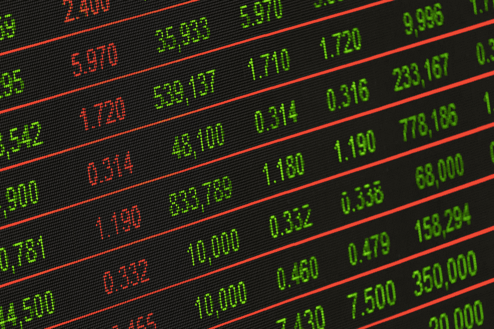

# 定量研究 101

> 原文：<https://medium.com/analytics-vidhya/quantitative-trading-101-e6e555ae2474?source=collection_archive---------8----------------------->

## 学习定量金融分析的基础

照片由[像素](https://www.pexels.com/)的[皮克斯拜](https://www.pexels.com/@pixabay)拍摄

# 摘要

*   任何人都可以学习量化交易。创建定量交易系统或进行定量研究，你不需要有量子天体物理学博士学位
*   确定一个合适的交易策略的过程和科学方法是一样的:它…