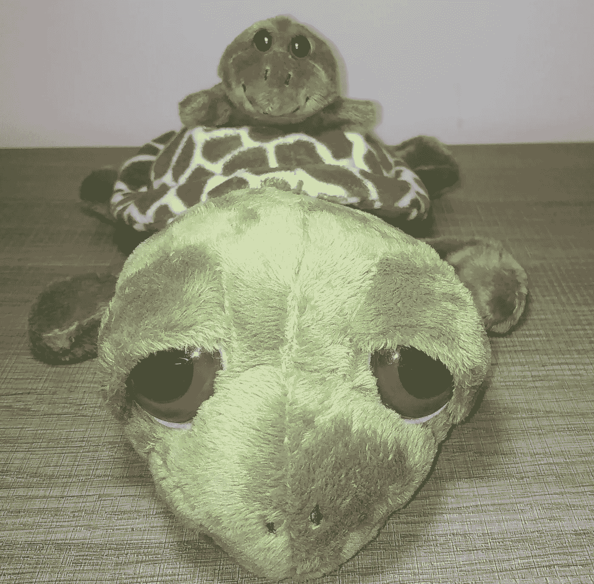
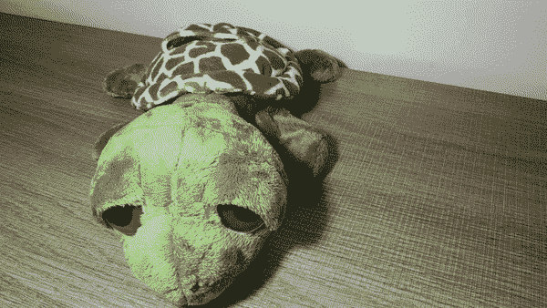
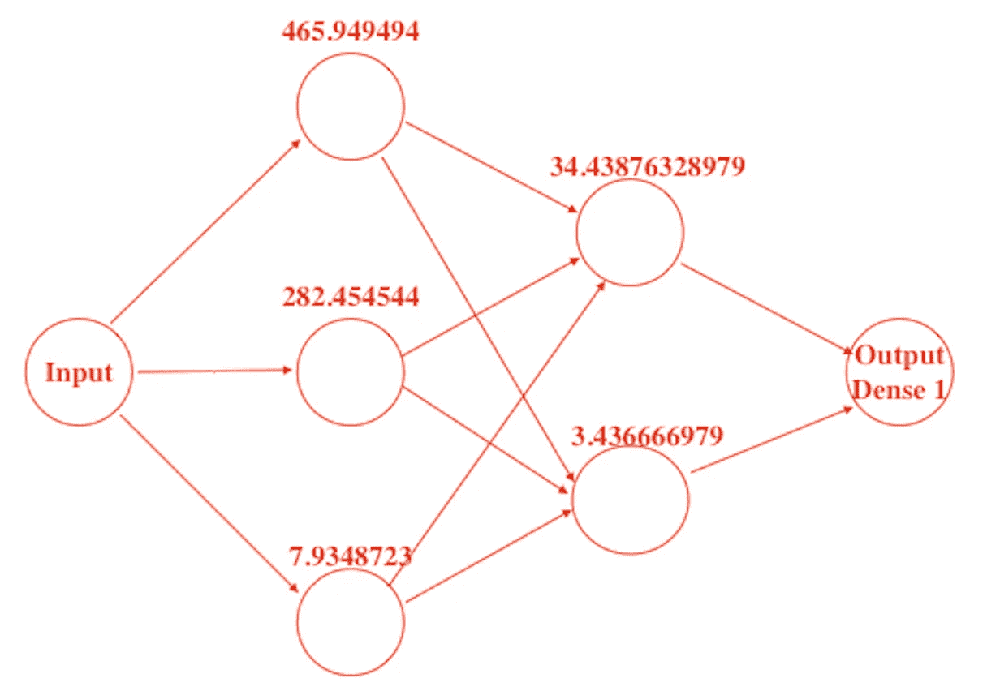
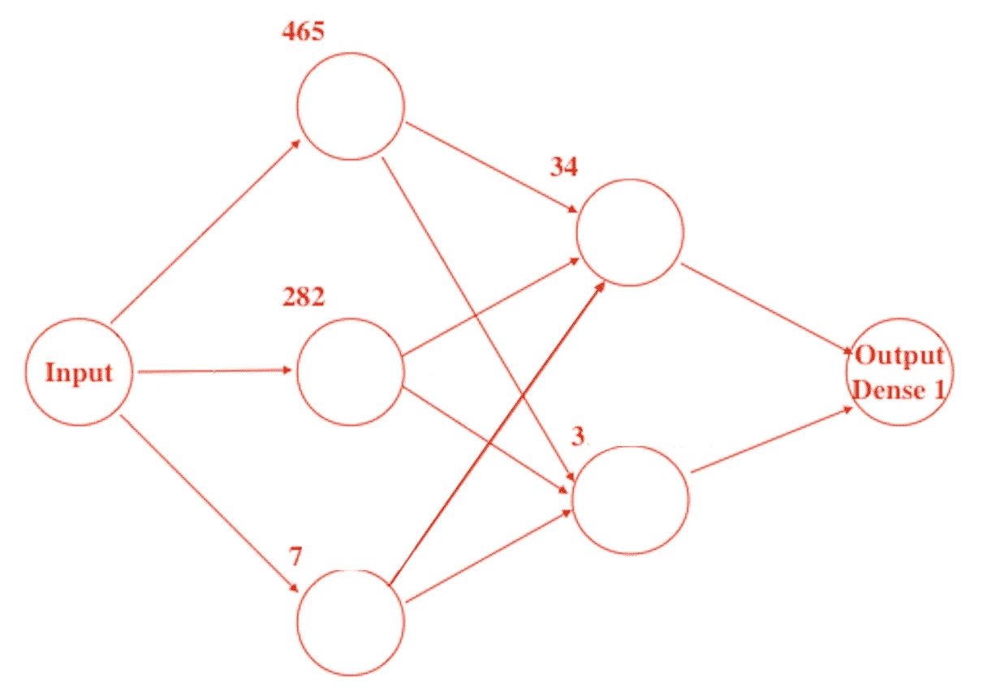
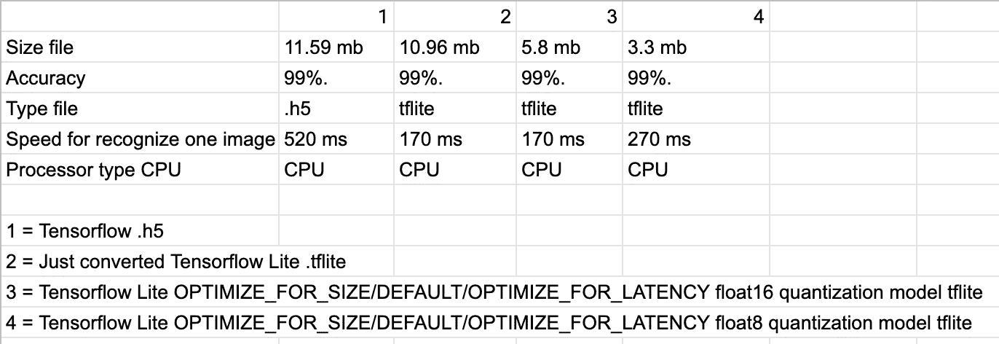

# 量化(训练后量化)您的(自定义 mobilenet_v2)模型. h5 或。使用 TensorFlow Lite 2.4 的 pb 模型

> 原文：<https://medium.com/analytics-vidhya/quantization-your-custom-mobilenet-v2-models-h5-models-using-tensorflow-lite-2-4-5e7046fa860e?source=collection_archive---------4----------------------->



使用 TensorFlow Lite 量化你的模型. h5 或 tflite(图片，作者 GIF)[https://github . com/oleks andr-g-rock/Quantization/blob/main/1 _ 8 Z4 ltcsfyead 87 ggsf 9 ipw . png](https://github.com/oleksandr-g-rock/Quantization/blob/main/1_8z4lTcSfyEad87GGsf9IPw.png)

# 简短摘要:

在本文中，我将解释什么是量化，目前存在哪些类型的量化，我将展示如何量化您的(自定义 mobilenet_v2)模型。pb 使用 TensorFlow Lite **只针对 CPU 树莓 Pi 4** 。

这篇文章的代码可以在[这里](https://github.com/oleksandr-g-rock/Quantization)找到。

> *开始前请注意:*

# 所以，我们开始吧:)

# 硬件准备:

# 软件准备:

# 1)张量流背景下的量子化模型是什么？

这是一个和标准模型做的一样的模型，但是:更快，更小，具有相似的精度。比如下面的 gif:)



使用 TensorFlow Lite 量化你的模型. h5 或 tflite(图片，作者 GIF)[https://github . com/oleks andr-g-rock/Quantization/blob/main/1 _-bmgkbqngwvkdjjjq 64 yvxq . GIF](https://github.com/oleksandr-g-rock/Quantization/blob/main/1_-bmgkbQNGwVkDJJq64yVxQ.gif)

或者这个:)


使用 TensorFlow Lite 量化你的模型. h5 或 tflite(图片，作者 GIF)[https://github . com/oleks andr-g-rock/Quantization/blob/main/1 _ 8 Z4 ltcsfyead 87 ggsf 9 ipw . png](https://github.com/oleksandr-g-rock/Quantization/blob/main/1_8z4lTcSfyEad87GGsf9IPw.png)

大乌龟就是简单的 CNN (.h5 或者。pb)型号。
小海龟是一个量化模型。
:)

**简单来说**，通常，我们使用具有下一个权重的模型(465.949494 等……)，这些权重通常是浮点数。
在下面的截图中，你可以看到这些用于权重的浮点数— **这只是一个例子。**



使用 TensorFlow Lite 量化你的模型. h5 或 tflite(图片，作者 GIF)[https://github . com/oleks andr-g-rock/Quantization/blob/main/1 _ kvhwa 5 eufyvtanzem 3 TJ 8 a . png](https://github.com/oleksandr-g-rock/Quantization/blob/main/1_KvHwa5eUfyVTaNzEm3TJ8A.png)

但是量化之后，这些权重可以改成…



使用 TensorFlow Lite 量化你的模型. h5 或 tflite(图片，作者 GIF)[https://github . com/oleks andr-g-rock/Quantization/blob/main/1 _ 3 by 4 jmpean 47 axlrdvva . png](https://github.com/oleksandr-g-rock/Quantization/blob/main/1_3bYW4pjMPEAN47aXLrDVvA.png)

这是一个关于量子化的粗略例子。

# 2)那么量化模型和 simple (.h5 或者。pb 或 etc …)？

## **1。正在减小模型尺寸**

> **例如:**
> 我们有. h5 或 tflite 等…简单的 CNN 模型(用于图像分类)文件，大小为 11.59 MB。
> 
> **量化模型后他将得到下一个结果:**
> 模型将是 3.15 MB。

## **2。识别一幅图像的延迟更少**

> **例如:**
> 我们有. h5 或 tflite 简单 CNN 模型(用于图像分类)和在 CPU 上识别一幅图像 300 毫秒的延迟。
> 
> **量化模型后他将下一个结果:**
> CPU 上 170ms

## **3。生产率损失高达 1%**

> **例如:**
> 我们有. h5 或 tflite 简单的 CNN 模型(用于图像分类),准确率为 99%
> 
> **量化模型后他将下一个结果:**
> 准确率将达到 99%

# 3)存在哪些类型的**量化？**

基本上存在两种类型的[量化](https://www.tensorflow.org/lite/performance/model_optimization?hl=en)
- [量化感知训练](http://www.tensorflow.org/model_optimization/guide/quantization/training)；
-采用 3 种不同方法的训练后量化([训练后动态范围量化](https://www.tensorflow.org/lite/performance/post_training_quant)、[训练后整数量化](https://www.tensorflow.org/lite/performance/post_training_integer_quant)、[训练后浮点量化](https://www.tensorflow.org/lite/performance/post_training_float16_quant))。

在这篇文章中，我将解释第二种方法。

# 4)我该如何做训练后的量化？

笔记本上有这些例子[这里有](https://github.com/oleksandr-g-rock/Quantization/blob/main/quantization.ipynb)。

1 如何将. h5 转换为量化模型 tflite ( 8 位/浮点 8):

1.0 使用**优化。默认**

```
import tensorflow as tfmodel = tf.keras.models.load_model("/content/test/mobilenetv2.h5")
converter = tf.lite.TFLiteConverter.from_keras_model(model)
converter.optimizations = [tf.lite.Optimize.DEFAULT]tflite_quant_model = converter.convert()#save converted quantization model to tflite format
open("/content/test/quantization_DEFAULT_8bit_model_h5_to_tflite.tflite", "wb").write(tflite_quant_model)
```

1.1 使用**优化。优化尺寸**

```
import tensorflow as tfmodel = tf.keras.models.load_model("/content/test/mobilenetv2.h5")
converter = tf.lite.TFLiteConverter.from_keras_model(model)
converter.optimizations = [tf.lite.Optimize.OPTIMIZE_FOR_SIZE]tflite_quant_model = converter.convert()#save converted quantization model to tflite format
open("/content/test/quantization_OPTIMIZE_FOR_SIZE_8bit_model_h5_to_tflite.tflite", "wb").write(tflite_quant_model)
```

1.2 使用**优化。优化延迟**

```
import tensorflow as tfmodel = tf.keras.models.load_model("/content/test/mobilenetv2.h5")
converter = tf.lite.TFLiteConverter.from_keras_model(model)
converter.optimizations = [tf.lite.Optimize.OPTIMIZE_FOR_LATENCY]tflite_quant_model = converter.convert()#save converted quantization model to tflite format
open("/content/test/quantization_OPTIMIZE_FOR_LATENCY_8bit_model_h5_to_tflite.tflite", "wb").write(tflite_quant_model)
```

2 如何将. h5 转换为量化模型 tflite ( 16 位/浮点 16):

2.0 使用**优化。默认**

```
import tensorflow as tfmodel = tf.keras.models.load_model("/content/test/mobilenetv2.h5")
converter = tf.lite.TFLiteConverter.from_keras_model(model)
converter.optimizations = [tf.lite.Optimize.DEFAULT]
converter.target_spec.supported_types = [tf.float16]tflite_quant_model = converter.convert()#save converted quantization model to tflite format
open("/content/test/quantization_DEFAULT_float16_model_h5_to_tflite.tflite", "wb").write(tflite_quant_model)
```

2.1 使用**优化。尺寸优化**

```
import tensorflow as tfmodel = tf.keras.models.load_model("/content/test/mobilenetv2.h5")
converter = tf.lite.TFLiteConverter.from_keras_model(model)
converter.optimizations = [tf.lite.Optimize.OPTIMIZE_FOR_SIZE]
converter.target_spec.supported_types = [tf.float16]tflite_quant_model = converter.convert()#save converted quantization model to tflite format
open("/content/test/quantization_OPTIMIZE_FOR_SIZE_float16_model_h5_to_tflite.tflite", "wb").write(tflite_quant_model)
```

2.2 使用**优化。优化延迟**

```
import tensorflow as tfmodel = tf.keras.models.load_model("/content/test/mobilenetv2.h5")
converter = tf.lite.TFLiteConverter.from_keras_model(model)
converter.optimizations = [tf.lite.Optimize.OPTIMIZE_FOR_LATENCY]
converter.target_spec.supported_types = [tf.float16]
tflite_quant_model = converter.convert()#save converted quantization model to tflite format
open("/content/test/quantization_OPTIMIZE_FOR_LATENCY_float16_model_h5_to_tflite.tflite", "wb").write(tflite_quant_model)
```

# 5)后训练量化模型 mobilenet_V2 后会是什么结果？

我创建了 8 个 python 脚本来测试在 Raspberry Pi 4 上识别 100 张图片的速度。要运行这些测试，您可以运行下面的命令，但只能按顺序运行。

```
#clone my repo
git clone [https://github.com/oleksandr-g-rock/Quantization.git](https://github.com/oleksandr-g-rock/Quantization.git)#go to directory
cd Quantization#run testspython3 test_h5.pypython3 test_tflite.pypython3 OPTIMIZE_FOR_SIZE_float16.pypython3 DEFAULT_float16.pypython3 OPTIMIZE_FOR_LATENCY_float16.pypython3 OPTIMIZE_FOR_SIZE_float8.pypython3 DEFAULT_float8.pypython3 OPTIMIZE_FOR_LATENCY_float8.py
```

这 8 个脚本将测试下一个模型:

*   Tensorflow .h5
*   刚转换的 Tensorflow Lite。tflite
*   tensor flow Lite OPTIMIZE _ FOR _ SIZE/DEFAULT/OPTIMIZE _ FOR _ LATENCY 浮点 16 量化模型 tflite
*   tensor flow Lite OPTIMIZE _ FOR _ SIZE/DEFAULT/OPTIMIZE _ FOR _ LATENCY 浮点 8 量化模型 tflite

下面是我测试后的结果，这里是:



使用 TensorFlow Lite 量化你的模型. h5 或 tflite(图片，作者 GIF)[https://github . com/oleks andr-g-rock/Quantization/blob/main/1 _ p6oenzouldqzcsdw 3 sznq . png](https://github.com/oleksandr-g-rock/Quantization/blob/main/1_P6oEnzouLdQzcsDZW3SZnQ.png)

# 结果:

**1 个关于调整模型大小的结果:**

*   将模型从. h5 转换为 tflite 后，模型大小从 **11.59** MB 变为 **10.96** MB
*   使用 tensor flow Lite OPTIMIZE _ FOR _ SIZE/DEFAULT/OPTIMIZE _ FOR _ LATENCY float 16 将模型从. h5 量化到 tflite 后，模型大小从 **10.96** MB 变为 **5.8** MB
*   使用 tensor flow Lite OPTIMIZE _ FOR _ SIZE/DEFAULT/OPTIMIZE _ FOR _ LATENCY float 8 将模型从. h5 量化到 tflite 后，模型大小从 **5.8** MB 变为 **3.3** MB

**所以我猜调整大小模型的结果是完美的。**

**2 个关于识别速度的结果，结果没有我想象的那么好，但是速度识别对于 Raspberry Pi 是最优的(因为它 99%)。**

这篇文章的代码可以在[这里](https://github.com/oleksandr-g-rock/Quantization)找到。