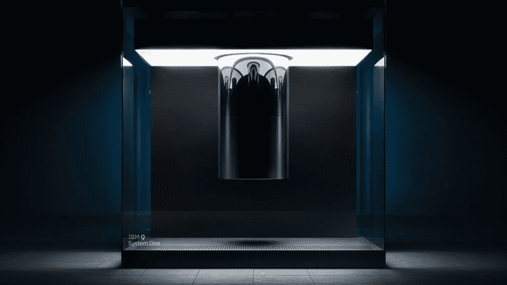

# 量子比特——一种观点

> 原文：<https://medium.com/analytics-vidhya/quantum-bits-a-perspective-7b2ec06c711d?source=collection_archive---------26----------------------->

> 当你改变看待事物的方式时，你看待的事物也会改变

马克斯·普朗克在理解量子水平上的粒子行为方面给出了一个很好的诗意的视角。

这篇文章旨在解释量子比特，试图解释它是从哪里开始的。但是首先，几个重要的术语:

叠加和量子纠缠

*   在最直观的形式中，一个处于叠加态的粒子表明它可以同时有多个状态。举个例子，当你旋转一枚硬币时，它在旋转状态下既有正面也有反面。
*   量子纠缠或爱因斯坦所说的超距幽灵作用意味着当一个粒子衰变为两个粒子时，改变其中一个粒子的自旋会“神秘地”改变另一个粒子的自旋，这就是非定域性。

在双缝实验中观察到，通过双缝一次发射一个光子会在后面的屏幕上形成条纹图案。看起来好像光子同时穿过两个狭缝，这意味着叠加，以便产生这样的图案。

然而，当我们在每个狭缝附近放置一个探测器时，条纹图案就消失了。这意味着叠加态丢失，量子特性坍缩到其中一个状态(退相干)。事实上，这里的现实是由我们是否在观察而形成的。这就好像光子知道它正在被观察，并通知所有其他光子放弃它们的模式形成。

这导致了一个结论，光子以某种方式相互交谈，以固定在观察到的位置。

任何非量子粒子(比如薛定谔的猫)都可以呈现叠加态，但是只有光子这样的量子粒子才有呈现纠缠态的能力。当我们窥视盒子时，猫的叠加态崩塌，猫取其中一种可能态。看量子退相干了解更多。

有趣的部分在于我们如何总结这一切，为引入量子计算机的概念留有余地。

以下是对上述“量子特性”形式化的基本解释，用量子比特来表示数据。

*   我们有电子作为支持叠加和纠缠的潜在候选者。
*   一个叠加态的电子同时拥有两种状态(上自旋和下自旋，暂且称之为 0 和 1)，它们作为持有信息的基础。这是一个单量子位。
*   当这种叠加态的量子位也纠缠在一起时，它们可以存储所有量子态的组合。
*   想象一个 2 电子系统一起代表 4 个状态(00，01，10，11)，“全部同时”，每个组合有不同的概率。
*   使用正确的算法，这样的系统允许我们基于不同的输入组合“并行地”计算不同的结果。
*   事实上，这种同时存在的不同组合为优化传统上使用较慢迭代解决方案的问题(如迷宫问题)提供了空间。

感谢阅读！