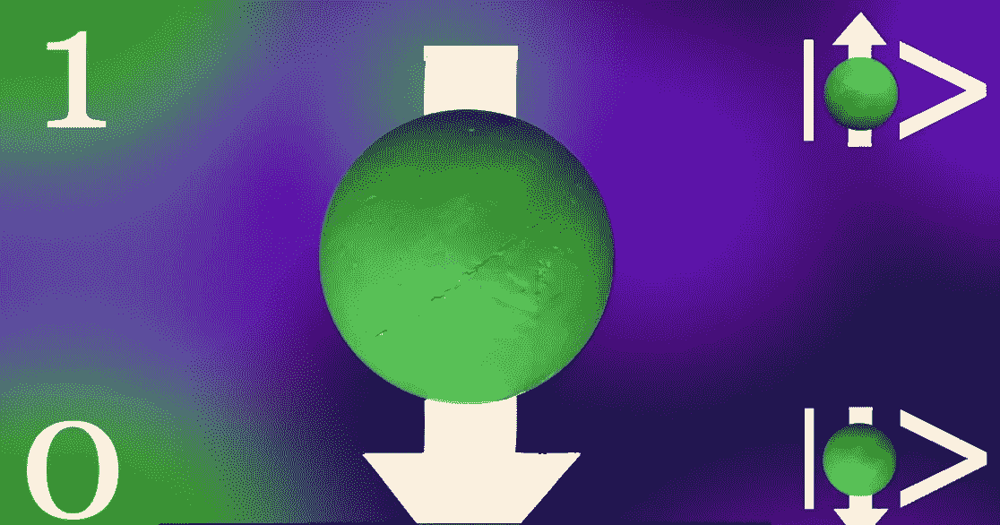
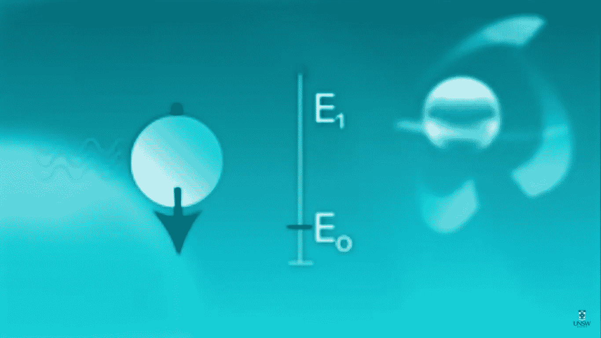
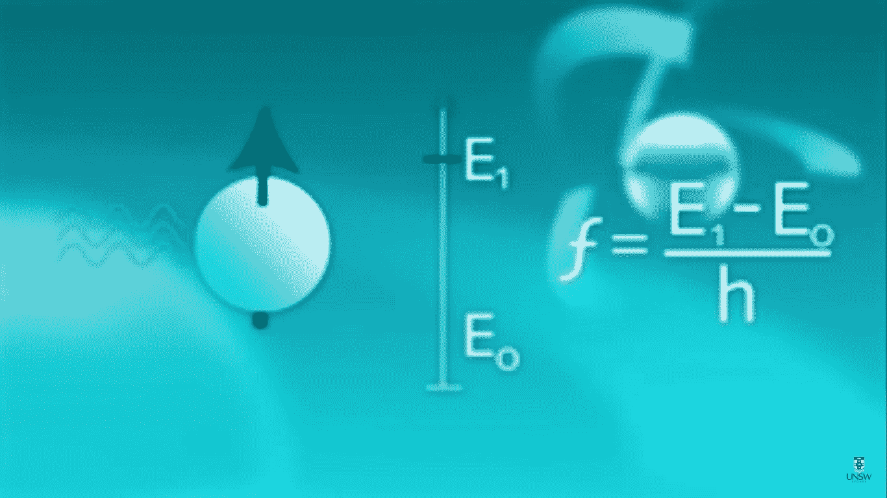
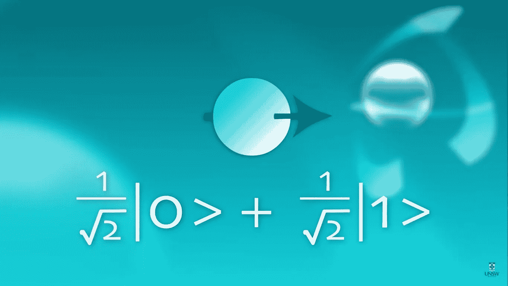
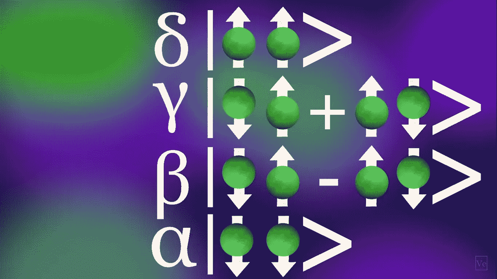
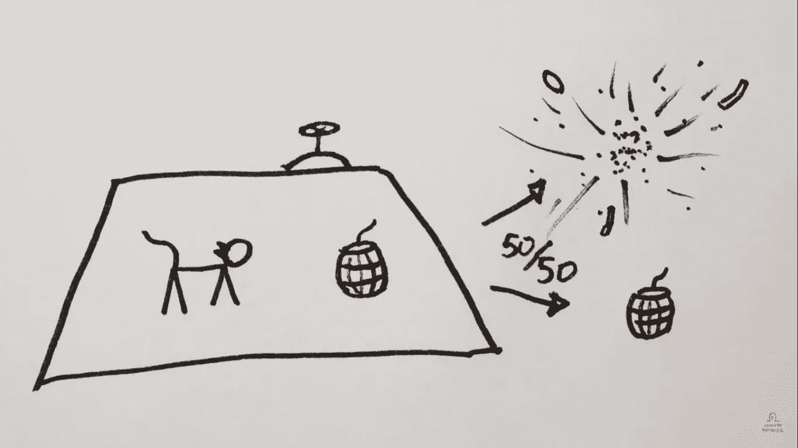
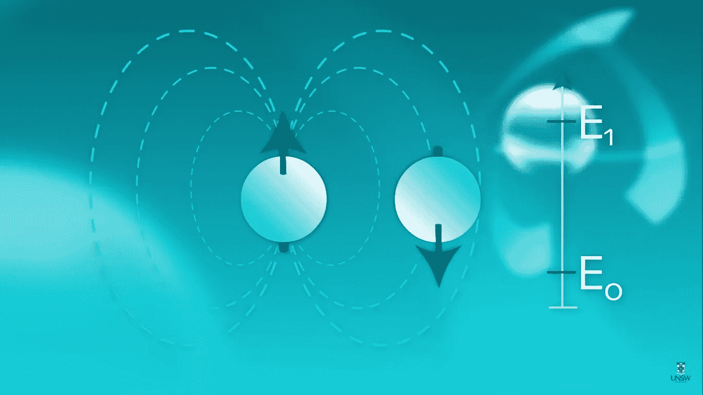
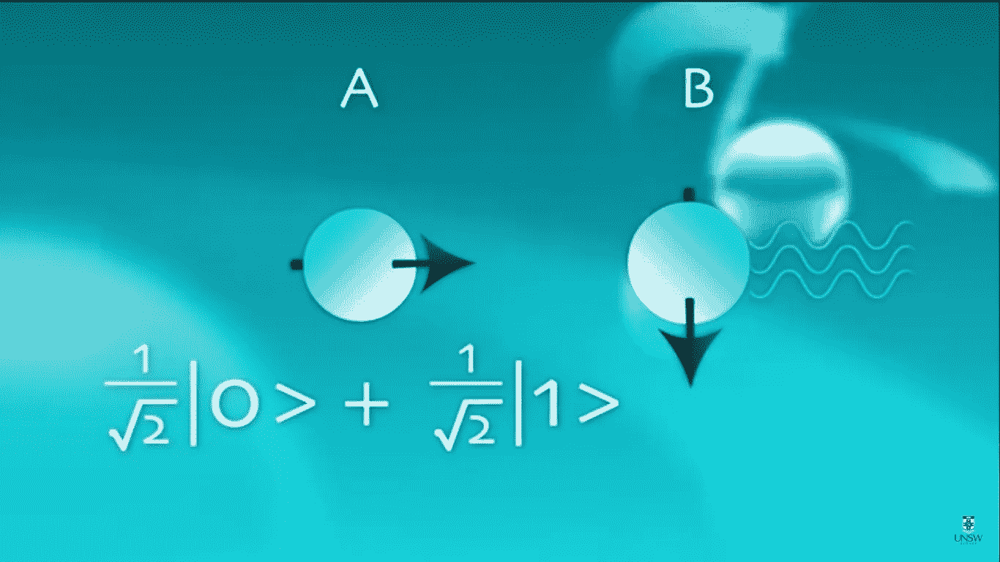
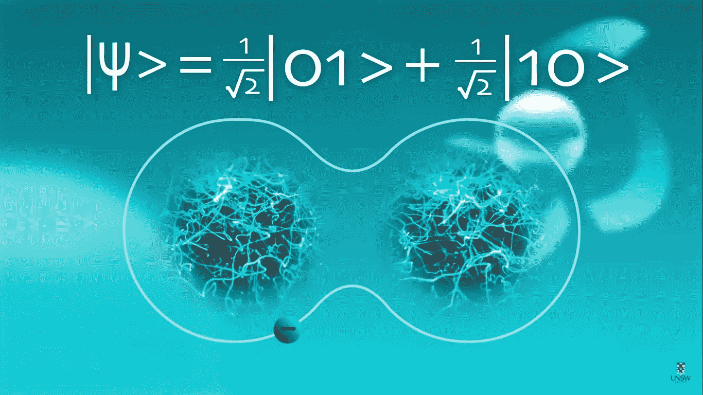
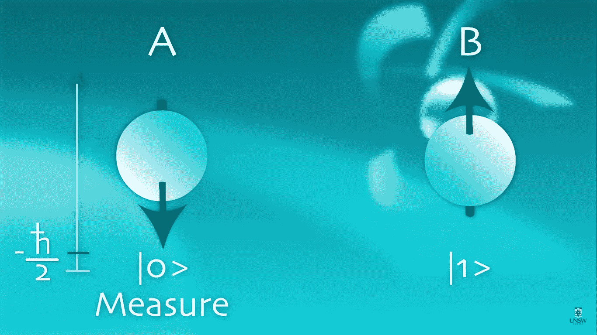

# 量子计算机——第三部分

> 原文：<https://medium.com/analytics-vidhya/quantum-computers-part-3-967a09f652e?source=collection_archive---------24----------------------->

玛拉基·布鲁克斯在 [Unsplash](https://unsplash.com?utm_source=medium&utm_medium=referral) 上拍摄的照片

对量子计算机研究得越多，就越想钻研。我最近在这个课题上的发现实际上帮助我理解了比特和量子比特之间的实际区别。它还帮助我理解了一些重要的概念，如叠加、纠缠和测量。下面让我来帮你浏览一下。

量子计算是对原子、离子、光子、电子等非常小的东西的研究。这些粒子有一种特殊的性质，即自旋。[量子位](/@arunikayadav/quantum-computers-part-2-6e8173d5dc73)倾向于由上述具有前述性质的粒子之一产生。

量子位可以用 ***bra-ket 符号来表示:*** |0 >或|1 >，分别读作‘ket 0’和‘ket 1’。

[来源](https://www.youtube.com/watch?v=g_IaVepNDT4&list=PLkahZjV5wKe_dajngssVLffaCh2gbq55_&index=3)

正如我们已经知道的，从我的前一篇文章[到](/@arunikayadav/quantum-computers-part-2-6e8173d5dc73)一个量子位可以有 0 和 1 两个值，因为叠加。

## **为什么要用自旋做量子位？**

自然界中最简单的量子比特叫做自旋，你已经从学生时代的原子结构中知道了。就像指南针一样，自旋与磁场一致。粒子的上自旋代表 ket 1，下自旋代表 ket 0。下图表示一个自旋向下的粒子。当我们用一个振荡磁场照射这个粒子时，这个磁场的频率正比于上自旋和下自旋之间的能量差，这个粒子被迫获得一个上自旋。因此，要翻转自旋状态，我们需要一个具有前述性质的振荡磁场。

[来源](https://www.youtube.com/watch?v=sjINVV2xOow&list=PLHSIfioizVW2uC27IFkHlSc-NgvZjBliZ)

获得上自旋后的粒子如下所示:

来源

因此，量子位元的两种状态可以利用微观粒子的自旋来很好地定义。当我们观察自旋以及当两个自旋靠得很近时会发生什么时，自旋和指南针磁针之间的区别是显而易见的。

上述情况导致两种现象发生:

1.  ***量子测量***
2.  ***量子纠缠***

每一个都将在下面详细描述。

# 量子测量

据说一个量子位可以同时存在于 0 和 1 状态，这是可能的，因为上自旋和下自旋是叠加的。

以下是状态 0 下的旋转:

来源

粒子在 0 和 1 状态下的叠加如下所示:

[来源](https://www.youtube.com/watch?v=EjdIMBOWCWo&list=PLHSIfioizVW2uC27IFkHlSc-NgvZjBliZ&index=6)

这是关于单个粒子自旋的叠加。

但是，当我们想要检查自旋时，它只能处于状态 0 或状态 1，而不能同时处于两种状态。这种使自旋状态坍缩为 0 或 1 的概念叫做量子测量。量子力学规定我们只能在向上或向下的位置找到自旋状态。因此，测量量子态的行为破坏了量子位的叠加，我们无法一次获得叠加态的所有系数。下面的α、β、γ和δ符号代表这些系数。这些系数决定了在状态(00，01，10 或 11)中找到量子位的概率(由系数的平方给出)。

[来源](https://www.youtube.com/results?search_query=veritasium)

因此，n 个量子位需要 2^N 系数来表示量子位的叠加。因此，由量子系统表示的解的搜索空间是指数的，因此它可以帮助表示和解决一些非常复杂的问题。

这也可以从薛定谔的猫实验中理解。当我们把一只猫放在一个有炸药的地堡里，然后关上它，那么有 50%的可能性炸药会爆炸，有 50%的可能性它不会爆炸，直到我们看地堡里面。但是当我们真的往地堡里面看的时候，那只猫要么死了，要么活着。因此，我们的好奇心杀死了那只猫，或者直到我们看了地堡，那只猫既死了又活了，处于一种叠加状态，但是我们看地堡内部的好奇心将导致其中一个事件发生，因此实相塌缩成一种状态。

[来源](https://www.youtube.com/watch?v=IOYyCHGWJq4)

# 量子纠缠

当旋转不止一次时会发生什么？

在存在另一个自旋的情况下，由于另一个自旋的自旋也存在一个微小的磁场。因此，这改变了另一个自旋的能量，并因此依赖于它附近的自旋，如果有的话。

[来源](https://www.youtube.com/watch?v=EjdIMBOWCWo&list=PLHSIfioizVW2uC27IFkHlSc-NgvZjBliZ&index=6)

假设自旋 A 最初处于 0 状态。然后，我们施加一个磁场，使自旋 A 的 0 和 1 态叠加，使其面向右(类似于矢量加法)，如下所示。当自旋 A 被设置成 0 和 1 的叠加态时，那么可以说它同时处于态 0 和态 1。现在场景中引入了一个旋转 B，它的状态为 0，面朝下，如下所示。正如上面解释的，这是能量的变化。现在，当我们施加一个与 0 和 1 态之间的能量差成正比的振荡磁场时，当自旋 A 处于 0 态时，那么自旋 B 既翻转到 1，又不翻转到 1。

[来源](https://www.youtube.com/watch?v=EjdIMBOWCWo&list=PLHSIfioizVW2uC27IFkHlSc-NgvZjBliZ&index=6)

因此，结果状态是 01(读作 01)和 10 的叠加。

[来源](https://www.youtube.com/watch?v=EjdIMBOWCWo&list=PLHSIfioizVW2uC27IFkHlSc-NgvZjBliZ&index=6)

这是一个非常特别的想法，我们不知道自旋指向哪里，但是我们知道它们存在于相反的方向。此外，在经典代码中模拟这一点非常困难，因为我们不能有两个位，它们没有任何值，但同时具有相反的值。这完全可以使用量子计算来完成，使用纠缠的概念，其中如上图所示的两个自旋是分开的，A 的自旋被测量，然后我们可以独立地得出结论，自旋 B 将是相反的自旋，甚至不用看自旋 B，不管自旋 A 和自旋 B 在宇宙中相距多远。这就是爱因斯坦所说的他的超距幽灵行动。

[来源](https://www.youtube.com/watch?v=EjdIMBOWCWo&list=PLHSIfioizVW2uC27IFkHlSc-NgvZjBliZ&index=6)

这些纠缠态是利用量子信息的关键，因为这些纠缠态随着量子比特的数量呈指数增长，这是量子领域的固有特性。但是这些纠缠态非常脆弱，会受到外界不必要干扰的影响，因此建造量子计算机需要大量的努力。

# 然后

在下一篇文章中，我们将深入探讨构建量子逻辑电路所需的各种逻辑门。

如果我错过了什么，请在评论中告诉我。如果你觉得这篇文章很有启发性，请随时反馈。