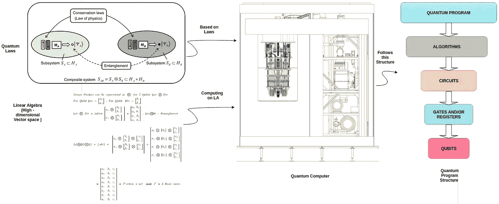

# 量子计算——量子编程的概念

> 原文：<https://medium.com/analytics-vidhya/quantum-computing-concepts-of-quantum-programming-b0318cc37cc4?source=collection_archive---------3----------------------->

**量子程序需要量子计算机、量子定律和计算工具(线性代数)**

**以简单的方式探索量子编程的概念。**

量子计算=量子物理(对于定律)+线性代数(计算)+计算机科学(编程)

在这篇博客中，我讨论了量子编程的概念，并通过数学的角度和与经典计算机的比较进行阐述，以便于理解。以下…