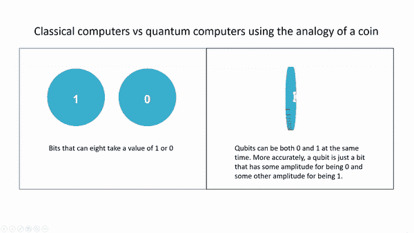
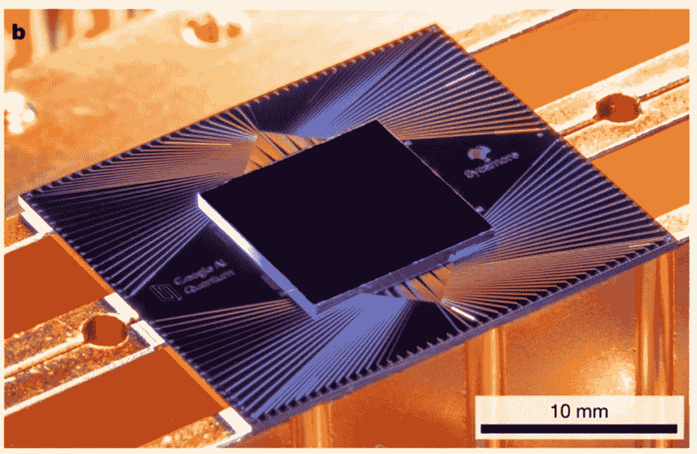
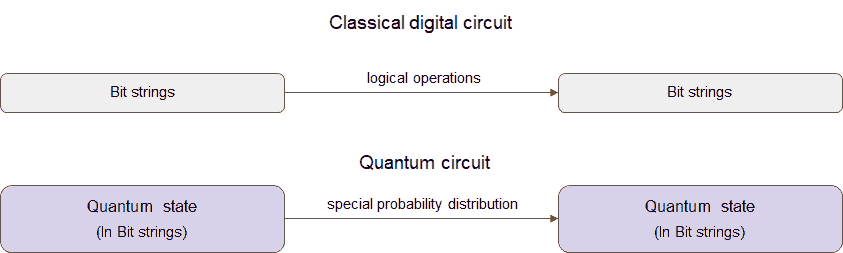
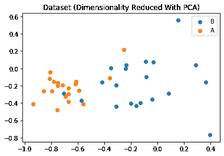
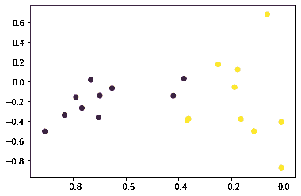
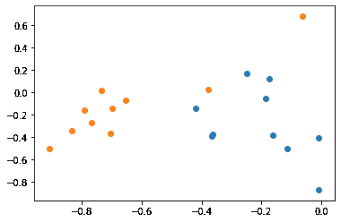

# 量子计算和机器学习

> 原文：<https://medium.com/analytics-vidhya/quantum-computing-machine-learning-a987957e885d?source=collection_archive---------11----------------------->

量子计算机预示着一个全新的计算时代，它有可能彻底改变许多行业，从制药药物发现到金融建模再到密码学。量子计算开始激励新一代科学家、研究人员和工程师改革我们所知的信息技术和计算。本文概述了 Google 最近对 Sycamore 处理器的实验，将量子计算应用于机器学习的一些新研究，最后是来自 IBM Qiskit 的 QSVM 分类器的示例实现。

**量子位的力量**

传统计算机通过处理信息的“位”来执行计算，每一位保存两个值中的一个:1 或 0。一个八位的集合——称为一个字节——可以存储一个字符，如字母 A。另一方面，量子计算机处理科学家构建的可以同时以 1 和 0 存在的位，或者说，量子位的状态在 1.0000 和 0.0000 之间振荡。更准确地说，量子位是一个位，它的某个振幅为 0，另一个振幅为 1。

这是量子位的优势之一:它们不必是二进制位的全有或全无 1 或 0，而是可以占据两者之间的状态。这种“叠加”的性质允许每个量子位同时执行一次以上的计算，以一种几乎不可思议的方式加快了计算速度。尽管量子位的最终读数是 1 或 0，但所有这些中间步骤的存在意味着经典计算机很难或不可能进行同样的计算。

**谷歌梧桐**

谷歌的工程师最近在一个 53 量子位的设备上展示了基于超导的量子计算的巨大进步，以及最先进的门保真度。在他们发表的 Sycamore 系统的发现中，该团队称赞了它在 200 秒内解决一个特别困难的问题的能力，根据他们的研究人员的说法，世界上目前最快的经典计算机——IBM 的 Summit——需要 10，000 年才能解决。该团队通过给 Sycamore 一个非常具体的问题来完成这一令人印象深刻的壮举，这个问题被称为随机电路采样问题。

Sycamore 处理器

量子计算机上随机量子电路的每次运行都会产生一个位串，例如 0000101。由于量子干涉，当我们多次重复实验时，有些位元串比其他位元串更容易出现。然而，随着量子位元数目(宽度)和闸周期数目(深度)的增加，在经典电脑上寻找随机量子电路最可能的位元串变得更加困难。随机性是计算机科学中的一个重要资源，具有可证明的量子随机性的量子电路是黄金标准，尤其是如果数字可以被自检(证明)为来自量子计算机。

**量子计算机的当前研究&机器学习**

量子机器学习算法将机器学习方法翻译成基于量子信息处理的构建块的算法。例如，用于 k-最近邻和聚类的量子算法基于振幅放大。支持向量机、高斯过程等量子核方法都是基于量子矩阵求逆或密度矩阵求幂的技术套路。

量子计算的当前发展可以被认为是一系列不同范例的集合，这些范例与基础物理学的距离有多远。这反过来可以转化为开发者或软件工程师更陡峭的学习曲线。离散可变门模型量子计算是最常见的范例，其中量子位取代位，逻辑变换由有限的一组酉门代替，可以近似任何任意的酉运算。

连续可变门模型量子计算是另一个更接近量子力学的物理思维方式的主要范例。它与量子光学共享其术语的重要部分。

GitHub 上有许多开源量子软件项目的精选列表，以及针对 Qiskit、Cirq、Strawberry Fields 等主要项目的蓬勃发展的开发人员社区。它们都提供了关于该工具所设计的软件和应用程序类型的全面文档。

**通过深度强化学习的量子控制**

在他们关于通过深度强化学习的[通用量子控制](https://arxiv.org/abs/1803.01857)的论文中，谷歌的研究人员提出，通过深度强化学习(RL)的量子控制可以用于更广泛的应用，如量子模拟、量子化学和量子里程碑测试。

当今量子计算中的一个重大挑战是为现实的量子控制过程开发物理模型，以便可以可靠地预测误差量。这很重要，因为在计算过程中丢失的量子信息量，也就是“泄漏”，不仅会导致丢失有用的量子信息的错误，而且最终会降低量子计算机的性能。为了解决这个问题，谷歌的团队引入了一个量子控制成本函数，涵盖泄漏错误、控制约束、总运行时间和门不忠，以确保泄漏的信息可以被准确评估。这使得强化学习技术能够优化这种软惩罚项，而不损害对系统的控制。

开发了一种有效的优化工具来利用新的量子控制成本函数。他们精心挑选了可信区域强化学习——一种基于策略的深度强化学习方法——来完成这项任务。在量子系统中，控制场景通常是高维的，并且不可避免地挤满了大量的非全局解，在这种情况下，基于策略的强化学习是有利的，因为它可以在控制轨迹中使用非局部特征。该方法在所有基准问题上表现出良好的性能和对样本噪声的鲁棒性。

谷歌看到了利用深度神经网络优化量子位控制的强化学习技术的巨大潜力。他们利用噪声控制轨迹的非局部规律和促进任务间迁移学习的能力启发了研究人员采用基于深度强化学习的控制方法。

**分类**

实验还集中在使用量子计算机本身作为鉴别器。训练数据被映射到量子状态，有点类似于将彩色图像变成 0 和 1。在这种情况下，输出是一束叠加的量子粒子。这些数据随后被送入一个短深度量子电路，该电路可以在计算结束前保持大部分量子特性。他们的量子变分法使用一组(可能是随机的)初始参数，然后在训练过程中进行优化。这有点类似于神经网络，它也使用参数化的量(权重)并从随机状态开始。由于它们的量子特性，驱动量子计算机的粒子抽象地存在于一个非常大的“量子态”中，充满了各种可能性。理论上，这使得分离特征比传统的计算机更容易和更快。

然而，众所周知，从云中的量子计算中收集有意义的数据非常困难，因为计算中存在大量的实验噪声。IBM 和麻省理工学院的研究人员使用两量子位量子计算系统向正确的方向迈出了一大步，表明即使在有噪声的情况下，也有可能对实验室生成的人造数据进行分类。目标是看看机器学习分类器是否可以在量子硬件内部实现。这就是为什么数据是人造的，可以 100%成功地进行分类，以验证该方法。即使有当代量子计算机的固有噪声，该团队也能够实现近乎完美的分类(你可以在这里玩演示)。

虽然神经网络目前非常流行，并且已经做出努力将极其简单的神经网络引入量子计算，但这两者并不十分适合。另一方面，更基本的技术，如 SVM，适应性更强。核方法的数学理论和量子力学有很多相似之处，而量子理论和神经网络的理论则非常不同——这种见解非常有用，因为量子计算可以帮助加快基于核的分类器。

量子计算机还可以用来计算最佳内核:也就是说，如何最好地将所有输入数据映射到高维空间，以有意义的方式帮助分离特征。在这里，经典的硅基计算机可以使用其量子伴侣的内核(洞察力),并学习每类特征的规则。

**实例实现**

我们将尝试实现 QSVM，这是来自[的一种变分量子算法。量子论中的变分法是寻找量子系统低能态的经典方法。这种方法的大致思想是，将试验波函数(ansatz)定义为一些参数的函数，然后找到这些参数的值，这些值使相对于这些参数的能量期望值最小化。](https://arxiv.org/pdf/1804.11326.pdf)

要获得目标函数的值:

1.  准备 ansatz 状态。
2.  进行从经典问题到最小化可观测值的期望值的量子问题的映射中采样的测量)。
3.  重复

人们总是需要重复测量来获得期望值的估计值。量子计算机可以为 ansatz 提供目标函数的估计，反过来，可以将其插入外部循环，以尝试获得目标函数最低值的参数。对于这些值，然后可以使用最佳 ansatz 来产生问题的解决方案的样本，该样本获得目标函数的最低可能值的有希望的良好近似。

**SVM**

在经典的 SVM 中，我们有一组点，或者在一个组中，或者在另一个组中，我们想要找到一条线来区分这两组。这条线可以是线性的，但也可以更复杂，这可以通过使用内核来实现。

在量子 SVM 的情况下，量子特征图用于将经典数据转化为量子状态，并从这些量子状态中构建 SVM 的内核。在量子计算机上计算出核矩阵后，我们可以像训练经典 SVM 一样训练量子 SVM。

首先，我们需要安装所需的库。我尝试了几个不同的库，发现 IBM 的 Qiskit 是最容易启动并运行机器学习实验的。我已经把完整的实验代码放在[这个笔记本](https://github.com/siddharthnarayanan/quantum-experiments/blob/master/QSVM.ipynb)里了。

Qiskit 量子电路可以在本地模拟器或使用 IBMQ 的真实量子计算机上执行。这段代码不使用 IBMQ，而是在本地 QASM 模拟器上执行。Qiskit aqua 提供了一个预定义的函数来训练整个 QSVM。我们只需提供特征图、训练和测试集，Qiskit 将为我们完成所有工作。

让我们绘制并观察原始数据集

成功率显示了 QSVM 预测标签的准确程度。在这个实验中，我们得到了 0.9 的测试成功率。让我们画出结果。第一个结果图显示了 QSVM 的标签预测

第二个图显示了测试标签。

我们可以使用 sklearn.datasets 中的 load_iris()、load_digits() & load_wine()在任何其他数据集上重复上述步骤，以观察结果如何变化。

请注意，除了寻找量子核，QSVM 算法只做经典优化。最后，除了内核来自量子分布之外，它与经典 SVM 没有什么不同。

**结论**

容错量子计算机承诺了许多有价值的应用，研究人员正在寻找将量子计算引入现实世界的有价值的方法。随着量子处理器的到来，合作者和学术研究人员以及大量公司可以为算法的发展做出贡献。

量子计算机应用的著名研究包括新材料的设计——汽车和飞机的轻质电池、可以更有效地生产肥料的新催化剂(这一过程今天产生了全球 2%以上的碳排放)，以及更有效的药物。此外，创造性的研究人员也是创新的重要资源，可以测试新的计算资源的限制和应用。为了让量子在不久的将来对社会产生积极的影响，量子社区必须专注于构建和制造可访问的、强大的可编程量子计算系统，这些系统可以实现并可靠地复制大量的量子演示、算法和程序。

**参考文献**

1.  https://youtu.be/1lIfbqfoGMo
2.  [关于“量子至上”| IBM 研究博客](https://www.ibm.com/blogs/research/2019/10/on-quantum-supremacy/)
3.  [什么是“量子至上”，为什么谷歌的突破如此重要？— Vox](https://www.vox.com/recode/2019/10/29/20937930/google-quantum-supremacy-computer-physics-reset-podcast)
4.  [谷歌量子计算机实践——科学美国人](https://www.scientificamerican.com/article/hands-on-with-googles-quantum-computer/)
5.  [谷歌人工智能博客:使用可编程超导处理器的量子优势](https://ai.googleblog.com/2019/10/quantum-supremacy-using-programmable.html)
6.  [谷歌用经典机器学习加速量子计算](/syncedreview/google-accelerates-quantum-computation-with-classical-machine-learning-ce30a43c30c2)
7.  [量子计算解释(仅仅几分钟！)—《纽约时报》](https://www.nytimes.com/2019/10/23/business/quantum-computing-google.html)
8.  [通过深度强化学习的通用量子控制](https://www.nature.com/articles/s41534-019-0141-3.pdf)
9.  [基于生成模型的量子机器学习算法|科学进展](https://advances.sciencemag.org/content/4/12/eaat9004)
10.  [IBM 人工智能 Q—IBM 研究](https://ibm-q4ai.mybluemix.net/?source=direct)
11.  [IBM 质疑谷歌的量子优势|科学|美国科学促进会](https://www.sciencemag.org/news/2019/10/ibm-casts-doubt-googles-claims-quantum-supremacy)
12.  [量子信息和人工智能——走向数据科学](https://towardsdatascience.com/quantum-computing-and-ai-789fc9c28c5b)
13.  [观点|为什么谷歌的量子霸权里程碑如此重要——纽约时报](https://www.nytimes.com/2019/10/30/opinion/google-quantum-computer-sycamore.html)
14.  [超越怪异:退相干、量子怪异和薛定谔的猫——大西洋](https://www.theatlantic.com/science/archive/2018/10/beyond-weird-decoherence-quantum-weirdness-schrodingers-cat/573448/)
15.  [最后，证明量子计算可以促进机器学习](https://singularityhub.com/2019/03/17/finally-proof-that-quantum-computing-can-boost-machine-learning/)
16.  [造反！科学家称他们厌倦了量子计算的大肆宣传](https://www.wired.com/story/revolt-scientists-say-theyre-sick-of-quantum-computings-hype/)
17.  [量子霸权来了。它不会改变世界|科技|卫报](https://www.theguardian.com/technology/2019/aug/02/quantum-supremacy-computers)
18.  [量子机器学习工具箱—量子机器学习工具箱 0.7.1 文档](https://qmlt.readthedocs.io/en/latest/)
19.  [量子计算中的开源软件](https://journals.plos.org/plosone/article/file?id=10.1371/journal.pone.0208561&type=printable)
20.  [探索量子编程从“你好世界”到“你好量子世界”——作者](https://hackernoon.com/exploring-quantum-programming-from-hello-world-to-hello-quantum-world-109add25305f)
21.  [1804.11326.pdf](https://arxiv.org/pdf/1804.11326.pdf)