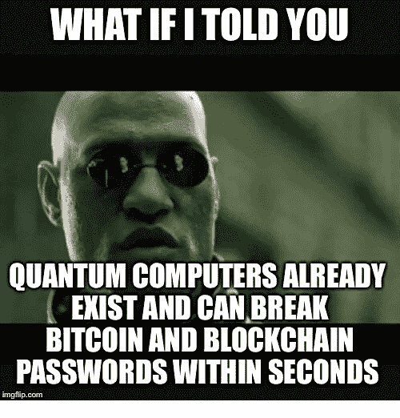
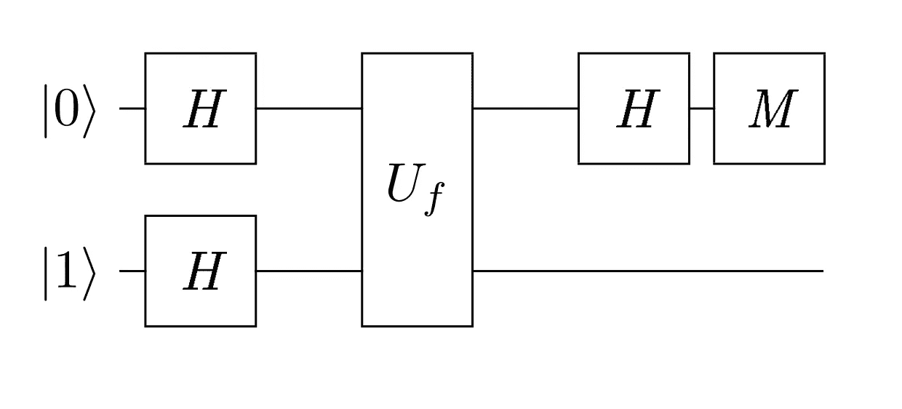
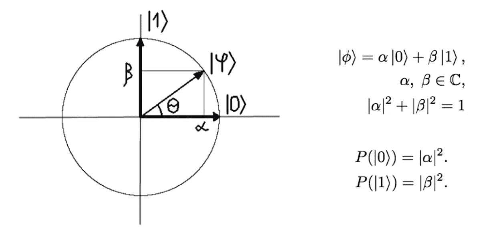
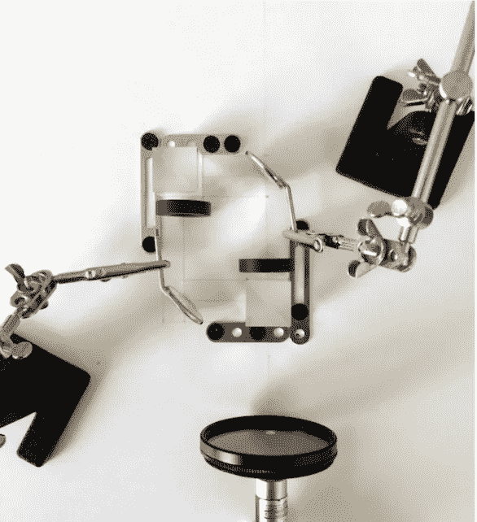
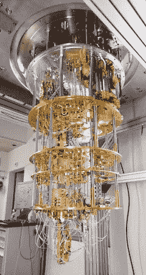
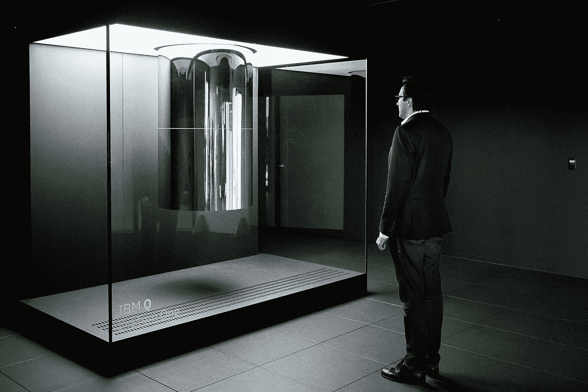
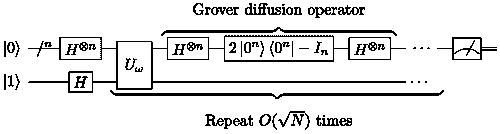

# 量子计算:变得简单

> 原文：<https://medium.com/analytics-vidhya/quantum-computing-made-simple-68b3376b44bf?source=collection_archive---------21----------------------->

如果我们能回到数字革命的开端，加入史蒂夫·乔布斯和比尔·盖茨的行列，永远改变我们对技术的看法，那该多好……也许现在我们又有了一次量子计算的机会？

量子计算会成为颠覆性的创新，打破计算能力的平衡，开启新的可能性吗？还是只是又一个像区块链一样被过度炒作的狭隘小众概念？

在我寻找答案的过程中，我开始寻找一份“执行摘要”，它将连贯地解释量子计算的基础知识，并让我的技术专家了解它在高层次上是什么以及事情的现状，足以确定这是否值得我现在深入研究。不幸的是，这样的总结无处可寻。我最终选择了一些关于量子计算的课程，这些课程很棒，但同时，比我需要或想要的要多得多。

下面你会看到一个 10 分钟的量子计算简介，不需要高深的数学知识，我希望它能帮助你理解基础知识。

# 什么是量子计算？神话和传说

现在你肯定已经听说过*一些关于量子计算或量子计算机的事情。这是关于小粒子和复杂的物理，量子位和纠缠，叠加和平行。概率，替代现实，时间旅行和更多！*

为了更好地理解量子计算，让我们来探索围绕它的三大神话。

1.  **量子计算机将取代普通计算机**。谷歌科学家已经实现了[“量子优势”](https://www.quantamagazine.org/john-preskill-explains-quantum-supremacy-20191002/)，在一项特别困难的任务中，量子计算机比普通计算机表现得更好。但是这个任务看起来是非常人为的，尽管量子计算机赢得了与经典超级计算机的竞赛，但实际意义却微乎其微。更有可能的是，未来是关于兼具经典和量子能力的混合系统。
2.  **量子计算机将破坏互联网安全。安全依赖于困难的问题，例如因式分解——找到两个必须相乘才能产生第三个的质数。使用传统计算机破解一个 2048 位的密钥需要几千年的时间。然而，拥有大约 10 万个量子比特的量子计算机可以在几秒钟内完成这项工作。这很有希望，但仍有很长的路要走。目前我们只能处理大约 50 个量子位，数学家们已经在研究新的加密方法，量子机器无法轻易破解。**
3.  量子通信将允许即时信息传输。量子粒子可以纠缠，意味着两个粒子的状态可以连接，而不管它们之间的距离。虽然量子隐形传态是一个[的东西](https://en.wikipedia.org/wiki/Quantum_teleportation)，它仍然依赖于不可能比光更快的经典通信。

# 天真的解释

普通计算机用*位*工作，它们操作 *n 个*位*串。更多的位允许它们存储更多的值，或者有更多不同的状态:例如，一个 n 位的字符串编码 2ⁿ不同的状态。但是不管有多少位，常规算法和计算机总是一次改变一种状态，使得某些计算问题难以解决。*

另一方面，量子计算机可以通过一种叫做叠加的东西同时处于多个状态。有了 *n* *量子比特*(比特的量子模拟)，我们可以处理所有这些状态，并实现 2ⁿ并行——一种指数级加速！

这种天真的解释显然过于简单化，但你会明白为什么许多机构、公司和个人都在量子计算机上下大赌注。现在让我们开始真正的(或者更准确地说，复杂的)东西。

# 真正的挑战(多伊奇的问题)

假设你有一个实现函数 *f* 的黑盒:{0，1} →{0，1}。

有四种不同的可能功能 *f:* 要么是*常量*(所有输出为 0 或所有输出为 1)要么是*平衡*(一半输入返回 1，另一半输入返回 0，即 *f=x* 或 *f=-x* )。

现在，给定一个黑盒，你能一步找出黑盒实现的函数是*常数*还是*平衡* **吗？**

对于经典算法，答案非常简单——你需要*两个*步骤，并测试两个输入，以找出黑盒实现了什么特定功能。然而，这也给了我们一个额外的*信息，这是我们没有要求的——实际的函数。如果我们只得到我们需要的，也许我们能做得比两步更好？有了量子计算机，是的，我们可以！这是算法的样子:*

量子计算导论，塞索耶夫

上面的描述是量子计算的一个常用电路模型——它是一个[量子电路](https://en.wikipedia.org/wiki/Quantum_circuit)，作用于一些输入量子位，并以一个测量值终止。量子电路由简单的*量子门*组成，作用于一个或多个量子位:

*   *H* 代表[哈达玛变换](https://en.wikipedia.org/wiki/Hadamard_transform)。对我们现在来说，它真正做什么并不重要，除了它以某种方式转换量子位；
*   𝒻是作为量子门实现的甲骨文功能，相当于我们的黑匣子。为了方便起见，它还接受一个额外的输入，这超出了本文的范围；
*   *M* 只是一个度量。

现在，诀窍就在这里——我们只需要测量第一个量子位。如果它是 1，那么函数是平衡的，如果它是 0，那么它是一个常数。*换句话说，我们有两个输入，做了几次转换，测量了一个输出，一步得到了答案-***。*怎么会呢？表面上，系统的量子态在 *U* 𝒻传达了一些关于函数*f*的附加信息之后*

# *那些量子位…*

*是时候让我们了解那些让魔法发生的*量子位*了。它们是什么？量子位是经典二进制位的量子版本。但是当一个比特总是 0 或 1 时，一个量子比特可以是*或*，并有一定的*概率*。如果你尝试测量一个量子位，你会看到|0〉(the“0”量子位或|1〉(the“1”量子位。*

*将这个数学模型形象化的一种方法是将量子位想象成二维空间中长度为 1 的向量，其基向量为|0〉and |1〉:*

**

*量子计算导论，塞索耶夫*

*一旦你开始把量子比特当成向量，变换就变成了矩阵，一切都变成了数学。兔子洞很深，但是我们今天不去那里。*

# *是真的吗？*

*如果我们不能找到一个量子位的物理实现，以上所有都没有什么价值。对我们来说幸运的是，量子位元可以由任何展现量子特性并具有两种不同状态的物理系统来实现。这可以是电子的自旋，或者光子的极化。例如，解决 Deutsch 问题的 D.I.Y .量子计算机可能看起来像这样:*

**

*量子计算导论，塞索耶夫*

*几个分束器、波片、手术镜、偏振器——我们已经准备好了干涉仪。它产生一个或另一个干涉图，告诉我们原来问题的答案。*

*上面的量子计算机当然相当不适合更复杂的任务。严肃的量子计算机更像这样:*

**

*或者这个:*

**

# *我们现在能破解所有的密码吗？*

*最基本的安全和隐私概念之一是[哈希](https://en.wikipedia.org/wiki/Hash_function)。许多系统将密码存储为哈希。计算任意输入的*散列值*非常容易，但是根据其散列值猜测输入是非常无效的，并且**很难用普通计算机完成**——你需要使用蛮力方法，并且在最坏的情况下尝试每一种可能的输入，如果可能性的数量很大，这将花费很长时间。*

*但是现在，有了这些强大的量子位，也许我们可以应对这一挑战，并在互联网上肆虐？真的，这能有多难？让我们看看:*

***1。**给定一个散列值，将散列验证表示为一个函数 *f* ,当我们正确猜测输入时给出 1，否则给出 0*

***2。**为我们的函数 *f* 定义量子预言符 *U* 𝒻*

***3。**用一些巧妙的变换实现一个量子电路(在我们的例子中实现 [Grover 的算法](https://en.wikipedia.org/wiki/Grover%27s_algorithm)*

**

***4。**衡量产量*

***5。** **盈利！！！！！***

**读到最后才发现现在庆祝有点早。**

# *量子计算机实际上是做什么的？*

*你可能仍然想知道如何解释量子电路中的这些“巧妙转换”。正如我们之前讨论的，量子位和量子位系统以叠加态存在，也就是说，它们可以以一定的概率处于任何可能的状态。当被测量时，量子位*会根据这个概率将*坍缩到一个特定的状态。*

*简而言之，量子算法正在转换系统的状态(通过那些量子门)，以增加对应于正确答案的状态的概率。所以这本来就是一个概率系统——有时候你可以完全确定地得到正确答案(我们看的第一个问题)，有时候——你得到的概率小于 1(格罗弗算法)。*

# *现实*

*尽管我们最初很兴奋，但现实总是比理论复杂一点。让我们看看量子计算的现状，以及为什么我们的密码是安全的...就目前而言，是这样。*

*量子计算是一个非常有前途的方向，正在快速发展:*

*   *奈文定律:量子计算机正以“双倍指数”的速度发展*
*   *目前最强大的量子计算机有 53 个量子位(谷歌)*
*   *量子计算机可以通过大型公司的云获得:IBM，Google，Amazon*
*   *[新的编程语言和对现有语言的绑定](/@quantum_wa/quantum-computing-languages-landscape-1bc6dedb2a35)*

*但是仍然有一些重要的限制:*

*   *可扩展性——我们需要更多的量子位来解决大规模问题*
*   *通过量子门表达逻辑是一项非常具有挑战性的任务*
*   *为量子计算机构建算法在很大程度上仍然是一门艺术，不适合胆小的人*
*   *通常量子算法不会给出精确的答案，而是给出一个确定的概率。正确的答案变得更加不确定，因为量子计算机会遭受现实世界的不完美所导致的各种物理现象——环境隔离、退相干等。*

# *进一步阅读*

*如果你敢的话，我推荐两套非常好的讲座:*

*   *U. Vazirani 在 [YouTube](https://www.youtube.com/watch?v=QTGw9Ojhee8&list=PLDAjb_zu5aoFazE31_8yT0OfzsTcmvAVg&index=1) 上的演讲*
*   *[Coursera](https://www.coursera.org/learn/quantum-computing-algorithms/) 上的量子计算入门*