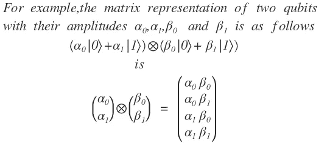

# 量子计算——必备的线性代数

> 原文：<https://medium.com/analytics-vidhya/quantum-computing-required-linear-algebra-f11c6b2a766f?source=collection_archive---------2----------------------->

**量子位使用线性代数概念进行计算**

对于量子计算，计算需要高维向量空间。在这篇文章中，讨论了量子计算的最先进的话题，如希尔伯特空间，指数矩阵，谱定理，张量积，施密特分解定理等。, .

基本的线性代数内容将在另一篇文章中介绍，链接将很快更新。本质上要求了解和理解量子计算所需的高级课题。

**向量空间**:简单来说，域(F)上的向量空间 V 就是满足标量加法和乘法的向量(对象)的集合。即，

向量空间定义

换句话说，V 在加法和标量乘法下是封闭的。

**狄拉克符号**:物理学家经常用狄拉克符号写他们的线性代数。这种符号在量子力学中经常使用。在这个符号中，行向量可以用符号|v >表示为“Ket ”,列向量可以用符号< v|表示为“Bra”。

内积将写为‘bra-kets’。

**内积空间**:是一个有内积的向量空间。内积与空间中的每一对向量相关联，其标量称为向量的内积。

**内积空间的定义**:内积空间是域 F 上的向量空间 V 连同内积，即一个映射

并且对于所有向量和所有标量满足以下三个性质。

**内积空间的性质**

内积允许我们测量向量的长度(称为范数)或两个向量之间的角度。

**不同间距的内积**:

**希尔伯特空间**:有内积的完备空间。

**前希尔伯特空间**:具有内积的(不完全)空间

**酉空间**:复数域上的内积空间。

内积的特殊情况是标量积或点积。

内积空间可应用于实数、欧几里得向量空间、复坐标空间、希尔伯特空间、随机变量、实矩阵和具有形式的向量空间。

**正交基**:它对于一个有限维的内积空间 V 是 V 的一个基，V 的向量是**正交的**，即它们都是单位向量并且相互正交。

**希尔伯特空间**:复数上的向量空间，并且是有限维的，这大大简化了我们需要的数学。这样的向量空间是一类称为**希尔伯特空间**的向量空间的成员。

向量空间 V 与内积的组合就是**希尔伯特空间**。用于量子计算的希尔伯特空间通常具有维度。

希尔伯特空间维数

**向量空间考虑的将是复数，并且是有限维的。**

**算子**:向量空间 H 上的线性算子是向量空间到自身的线性变换 T : H - > H(即它是将 H 中的向量映射到 H 中的向量的线性变换)。最好的例子是外部产品

**正交投影仪操作员**:

众所周知的运营商有

**线性算子**

请注意，这些算子在线性代数中是相同的，但是符号是不同的，这就是为什么我在更高级的书籍、教程、博客等中特别提到你要熟悉量子计算中的符号。,

**特征分解**应用于谱定理，指数矩阵。这里简单介绍一下特征分解。

对于维数为 n，n 的方阵 **A** ，当 **A** 应用于它们时，可能存在简单地由某个常数缩放的向量。我们说非零向量 **x** 是特征值对应的 **A** 的特征向量

因为 A0 = 0，所以零矢量不包括在这个定义中

设 **x** 是 **A** 的一个特征向量，具有对应的特征值。然后

特征分解

本征分解在量子计算中非常重要，我在一个单独的故事中涉及，链接将很快更新。

**谱定理**:对于任何埃尔米特矩阵或酉矩阵 M，存在一个酉矩阵 U，使得

对于某些对角矩阵 D，D 的对角元素将是 m 的特征值。

**光谱定理**

**指数矩阵**:指数矩阵也可以用指数函数的精确类比来定义。矩阵 A 的矩阵指数可以表示为

**矩阵指数**

矩阵指数是重要的，因为量子力学时间演化是由厄米矩阵 b 的形式 exp(iB)的酉矩阵描述的。由于这个原因，执行矩阵指数是量子计算的基本部分。

理解如何计算矩阵的指数的最简单的方法是通过矩阵的特征分解。

**指数矩阵**

计算矩阵指数有两种方法:

**矩阵指数法**

如果 B 既是酉的又是厄米的，

如果在上述矩阵指数展开中应用该规则，并将单位矩阵(I)和 B 项组合在一起，可以看出，对于任何实数值 **x** ，该单位将是

**张量积(量子计算中的主要规则)**:也称为大小为“mn”的 2 个矩阵的(克罗内克积)。它不应该与矩阵乘法运算混淆，它是完全不同的。这条规则是量子计算的核心。量子位与张量积相互作用。

这是量子位之间量子计算中应用的主要规则，这里给出了向量、矩阵和 N 重张量积的例子。

**张量积符号**

张量积是一种将空间、向量、矩阵或运算符结合在一起的方法。

**张量积可以应用于空间、向量或矩阵以及算子**

**张量积公理**:

**张量积公理**

**对于空格**:

**对于矢量或矩阵**:

**向量上的张量积**

**对于操作人员**:

**算子张量积**

在矩阵表示中，这翻译如下。

**矩阵间张量(或)Kronecker 积**

**注意，在这个规则中，第一个矩阵中的每个元素都乘以整个第二个矩阵。**

该矩阵有时可以更简洁地写成“块形式”，如下所示:

**张量积的块形式**

# **张量积的例子:**

**量子位的矩阵表示**

**矩阵形式量子位上的张量积**

示例 1:

示例 1:二维和三维向量之间的张量积示例。

示例 2:2 * 2 矩阵之间的张量积示例

**使用张量积的 N 重示例:**

使用张量积的向量和矩阵的 n 重示例

**施密特分解定理**:在这个分解中表示两个内积空间的张量积中的一个向量。

施密特分解可以应用于更复杂的二分向量空间，甚至在两个子空间具有不同维数的情况下。

施密特分解广泛应用于量子理论中的纠缠表征。

感谢您阅读这篇文章，并感谢您的评论或错误(如果有的话)。

**参考文献**:

牛津大学出版社——量子计算导论

剑桥大学出版社-量子计算和量子信息

[https://en.wikipedia.org/wiki/Inner_product_space](https://en.wikipedia.org/wiki/Inner_product_space)

https://en.wikipedia.org/wiki/Matrix_exponential

【https://en.wikipedia.org/wiki/Schmidt_decomposition 