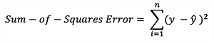

# 人工神经网络的量子达尔文主义

> 原文：<https://medium.com/analytics-vidhya/quantum-darwinism-to-artificial-neural-network-986200a33df?source=collection_archive---------19----------------------->

在 量子世界中，事物照例处于量子叠加状态。
著名的思想实验是薛定谔的猫，在这个实验中，猫既活又死，直到一部分致命的毒药在原子的放射性衰变中释放出来。

量子力学告诉我们，原子的波函数可以处于叠加态——同时衰变和不衰变。
那就是说猫的波函数也处于死与活的叠加状态？答案是肯定的，尽管这看起来很疯狂，也不可能。

叠加是量子力学的基础。如果有两个有效状态，那么这两个状态的总和也是一个有效状态。在量子世界中并不是这样，我们可以忽略这一点。因为，量子世界不在外星宇宙中，而是在我们自己内部，在物质构建的最基本层面。

这意味着无论我们看到什么，摸到什么，感觉到什么，都是量子物体及其相互作用的产物。经典世界或宏观世界中这种疯狂行为消失的过程是可能的，因为另一个过程叫做退相干——为了观察叠加，两个叠加态之间应该有可知的相位关系。这是一个不完整的答案，并没有解释为什么只有某些状态对宏观世界(我们的世界)是可见的。
答案是通过取另一个叫做量子纠缠的性质得到的。

纠缠是如此强大和重要，以至于我们认为基本的属性，如决定猫(或任何生物/非生物)是生是死的原子排列，并不是原子的属性！
更确切地说，定义经典性质的信息来源于这些单个量子系统及其环境之间的复杂纠缠网络。
对于刚接触量子系统的人来说，让我们从一个电子的自旋方向开始。这种量子自旋具有垂直方向或水平方向轴。

如上所述，由于叠加性质，轴方向同时在垂直和水平方向上。现在要测量旋转方向，我们必须选择测量方向，即垂直或水平。如果我们垂直测量，我们会发现轴在垂直方向(向上或向下)，如果我们水平测量，我们会发现轴在水平方向(向左或向右)。

量子叠加态中的粒子

奇怪的是，如果我们首先测量垂直方向的自旋，我们注意到方向，然后测量水平方向的自旋，我们仍然看到水平方向的自旋，而不是前面发现的垂直方向的自旋。这表明量子态的输出依赖于测量基础；每次都是。

现在这个状态如何穿越到经典世界，答案就是量子纠缠。它是由爱因斯坦、波多尔斯基和罗森早些时候提出的，被称为“幽灵般的超距作用”。这种“结合”或“幽灵般的超距作用”是如此之快，以至于如果两个物体纠缠在一起并被放置在宇宙的两端，它们可以立即交流。

当量子物体的波函数坍缩时，我们就看到了量子物体。几十年来，科学家们想观察量子物体的“真实”状态，但他们失败了，因为 sere 测量行为破坏了原始的量子状态。为了寻找这个原因，一位名叫 Wojciech Zurek 的科学家提出了一个名为“量子达尔文主义”的理论。它建立在查尔斯·达尔文进化论中“适者生存”原则的基础上。

当测量设备保持在量子系统附近以测量量子特性时，该设备与量子系统纠缠在一起，并成为纠缠网络的一部分。因此，如果一个人试图记录来自该装置的测量结果，他/她就破坏了现在包括该测量装置的整个量子系统的波函数。
随着越来越多的粒子/物体加入纠缠网络，关于量子态的信息在所有纠缠的物体中传播。根据 Zurek 的理论，最终，纠缠级联到达周围环境，不再是有界的，导致大多数量子信息被捕获和无法恢复。

但是有某些信息没有被混合并反映在周围的测量环境中。这些被称为“指针状态”，它们被复制并传播到测量设备。
通过 ein selection-environmental 诱导的超选择，像测量方向这样的基态变成了“适合”态，在整个纠缠网络中存活并复制。

在像这样的其他量子系统中，相互作用粒子的相对位置通过纠缠网络被可靠地共享和传播。因此，即使单个粒子没有明确定义的状态(例如位置)，但纠缠网络对这些位置有集体共识。
这就是像猫、狗或人类这样的较大物体具有明确位置的原因，因为它们的内部量子纠缠网络具有关于固有粒子相对位置的明确知识。

学习这个 ***传播指针状态*** 和量子纠缠我想到了一件事，那就是神经网络在计算机深度学习中的工作。
看到了吧，因为神经网络也是神经元的连接网络，所以和量子纠缠网络做比较也是顺理成章的。

输入层中的输入神经元类似于初始量子粒子，具有隐藏神经元的中间隐藏层类似于纠缠粒子。输出层的输出神经元就像测量装置。从一层中的一个神经元到另一层中的另一个神经元的连接可以被认为是纠缠。最后，层间连接的权重类似于 Wojciech 提出的指针状态。

其值被最小化的损失函数

神经网络学习一组理想的权重来表示损失函数并使损失最小化。对于我们来说，仅仅通过检查来计算权重并不简单，因此网络会自己找到合适的权重。每个神经元完成的操作很简单:

除了输入、输出、偏置、层和神经元之外，它还需要一个更重要的实体，称为激活函数。 ***激活*** *函数*对于人工神经网络学习和理解网络中发生的复杂操作以及输入和响应变量之间的非线性复杂函数映射是重要的。*他们* *将非线性属性引入我们的网络*。 ***它们的主要作用是将人工神经网络中某个节点的输入信号转换成输出信号。*** 该输出信号现在被用作堆栈中下一层的输入。

最流行的激活函数类型是 Sigmoid 或 Logistic、Tanh 双曲线正切和 ReLu -Rectified 线性单位。Sigmoid 函数看起来像:

Sigmoid 函数，下面是它的图形

在用测试数据训练神经网络之后，最终的输出由网络以一定的准确度传递。该网络用许多被称为历元的迭代来训练。

我试图传达的是量子纠缠和人工神经网络之间惊人的相似性，因此与人脑也是如此。那么，我们能通过这种方式证明我们的大脑是一台量子计算机吗？

# **参考资料:-**

 [## 什么是量子力学？

### 量子力学是物理学的一个分支，与非常小的物体有关。它会导致看起来非常…

www.livescience.com](https://www.livescience.com/33816-quantum-mechanics-explanation.html)  [## 量子达尔文主义，一个解释客观现实的想法，通过了第一次测试

### 量子物理学以怪异和违反直觉而闻名，这并不奇怪。我们生活的世界…

www.quantamagazine.org](https://www.quantamagazine.org/quantum-darwinism-an-idea-to-explain-objective-reality-passes-first-tests-20190722/)  [## 量子物理学可能比你想象的还要恐怖

### 这是量子力学的中心问题，没有人知道答案:在宇宙中到底发生了什么？

www.scientificamerican.com](https://www.scientificamerican.com/article/quantum-physics-may-be-even-spookier-than-you-think/)  [## 深度学习

### 深度学习是机器学习研究的一个新领域，其引入的目的是推动机器学习的发展

deeplearning.net](http://deeplearning.net/)  [## 介绍深度学习和神经网络——新手的深度学习(1)

### 在 Twitter 上关注我，了解更多关于深度学习创业公司的生活。

towardsdatascience.com](https://towardsdatascience.com/introducing-deep-learning-and-neural-networks-deep-learning-for-rookies-1-bd68f9cf5883)  [## 张量流-神经网络游乐场

### 这是一种构建从数据中学习的计算机程序的技术。它非常松散地基于我们如何思考…

游乐场.张量流. or](https://playground.tensorflow.org/#activation=tanh&batchSize=10&dataset=circle&regDataset=reg-plane&learningRate=0.03&regularizationRate=0&noise=0&networkShape=4,2&seed=0.22006&showTestData=false&discretize=false&percTrainData=50&x=true&y=true&xTimesY=false&xSquared=false&ySquared=false&cosX=false&sinX=false&cosY=false&sinY=false&collectStats=false&problem=classification&initZero=false&hideText=false)  [## TensorFlow:生物学通往深度学习的大门？

### TensorFlow 是谷歌最近发布的深度学习开源软件。它在…方面有什么应用

www.sciencedirect.com](https://www.sciencedirect.com/science/article/pii/S2405471216000107)