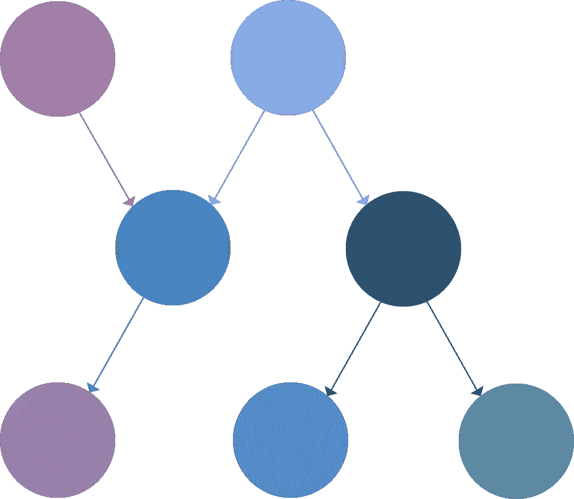

# 量子机器学习:贝叶斯网络上的推理

> 原文：<https://medium.com/analytics-vidhya/quantum-machine-learning-inference-on-bayesian-networks-351f242816e8?source=collection_archive---------0----------------------->

在过去的三个月里，我在概率图形模型上做了很多工作——这是一种以图形形式表达概率关系的方式。这些模型在应用于机器学习任务时非常有用，贝叶斯网络、隐马尔可夫模型和许多其他重要的学习模型直接实现了不同类型的概率图。

