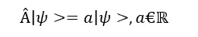
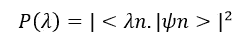
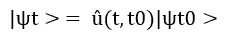
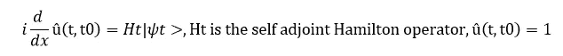
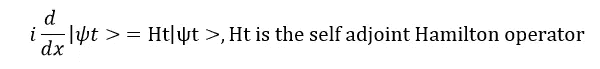
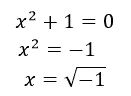
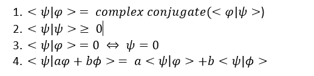
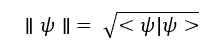

# 量子力学、希尔伯特空间和量子位

> 原文：<https://medium.com/analytics-vidhya/quantum-mechanics-hilbert-space-and-qubits-e411a9bfc6d2?source=collection_archive---------18----------------------->

# 介绍

随着量子计算在互联网上蓬勃发展，巨头们在量子人工智能上投入巨资，我们渴望了解更多。我确信在这个探索中，我们都遇到了量子力学、复数、希尔伯特空间、量子位等等。这里将会详细讨论这一点。

量子计算利用叠加和纠缠的量子力学现象来创建状态，从而有效地实现复杂的计算。

在下面的部分中，我已经详细介绍了数学元素，但是线性代数的知识将有助于理解量子计算。

让我们在第一部分从量子力学公设开始，后面的部分将遵循这些公设中使用的数学元素。

# 量子力学假设

公设是一种假设，即没有任何证据就被假定为真实的陈述或命题。

# 假设 1(国家)

量子力学系统的状态由复希尔伯特空间中的波函数来规定。波函数可以被认为是希尔伯特空间中的向量，用狄拉克符号表示为|ψ˃，称为 ket。波函数ψ(r，t)与一个机械系统在位置 r，时间 t 的状态概率有关。

例如:电子的自旋状态

# 假设 2(混合状态)

对于每一个可观测的经典可观测量，都存在一个正的，自伴的量子力学算符。这个算子称为密度算子，我们用 D(H)表示希尔伯特空间 H 上的密度算子集。

机械系统中可测量的物理量称为可观测的，如位置、动量、能量等。

# 假设 3(测量概率 1)

一个可观测的 A 的唯一可能的测量是它的算子的特征值β。

# 假设 4(测量概率 2)

获得算符本征值的概率由|ψn˃与其本征态λn 的内积的平方来定义。假设态是归一化的。

# 公设 5(投影公设)

如果可观测 A 的测量值为λn，则系统的状态为归一化本征态|λn >。这也被称为波包的崩溃

# 假设 6(时间演化)

在一个量子系统中，每一个不是由测量引起的状态随时间的变化都由时间演化算符(t，t0)描述。源自|ψt0 >的时间演化状态|ψt >由下式给出

时间演化算子是初值问题的解

并且也等价于薛定谔方程

哈密顿算符相当于一个系统中所有粒子的动能和势能之和。

# 叠加

叠加原理表明，任何状态的归一化线性组合都是一个状态。根据公设 1，物理状态对应于复希尔伯特空间中的矢量(波函数)，转换这意味着希尔伯特空间中的每个单位矢量对应于一个状态，因为希尔伯特空间是矢量空间，任何状态的线性组合也是一个状态。

如果复希尔伯特空间的|ψ>，|φ>是状态，则 a|ψ>+b|φ>，其中 a，bℂ€也属于复希尔伯特空间

# 纠缠

量子纠缠是两个或多个粒子的量子态相互纠缠的量子力学现象。

如果存在状态ρA j ∈ D(HA)和ρB j ∈ D(HB)，j ∈ I 和一个正实数 pj 满足，则复合系统 HA ⊗HB 中的状态ρ ∈ D (HA ⊗HB)是可分的，其中 HA HB 是子系统

∑ pj = 1，这样ρ = ∑ pj ρA j ⊗ρB j

否则ρ叫纠结。

⊗算子是 2 个向量空间的张量积，d()是公设 2 的自伴算子。

# 量子位

比特是经典计算中最小的信息单位，同样，量子比特或量子比特是量子力学中最小的单位。比特只有两个定义的状态 1 或 0，但是量子比特可以是两个状态的叠加。

# 复数

以下多项式方程的解是什么？让我们试着解决它

√(-1)在实数中没有根，因此需要虚数。√(-1) = i 已知为虚数。

由ℂ表示的复数采用 a+ib 的形式，其中 a 和 b 是实数。a 也称为实部，ib 也称为虚部。

因此，如果我们有复数，我们就有所有多项式方程的解。复数的这一性质被称为代数闭，广泛应用于包括量子力学在内的各个领域。

# 希尔伯特空间和狄拉克符号

希尔伯特空间是一个线性向量空间，它是完备的，并且具有由满足下面性质的表示的内积。对于所有ϕ，ψ，ϕ1，ϕ2 ∈ H 和 a，b ∈ C

这个内积也有一个范数，其中 H 是完备的。规范，由ǁ ǁ定义为

狄拉克符号或布拉克符号用于表示希尔伯特空间中的向量。向量称为 kets，用符号| >表示，向量空间上的线性泛函用< f|表示。

这些都是非常有趣的话题，你可以从《量子计算的数学》和《量子计算导论》这样的书中学到更多。谢谢你。