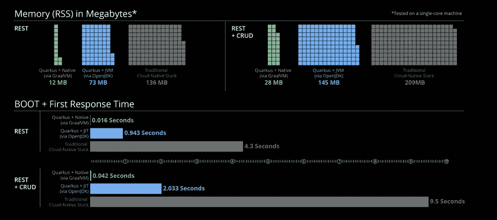
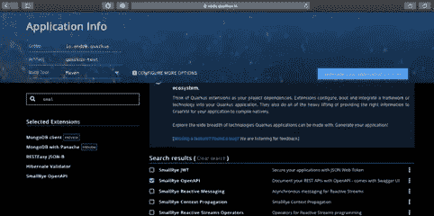
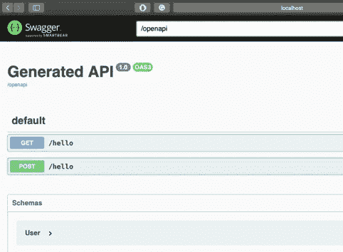

# 夸库斯什么？为什么？又是怎么做到的？

> 原文：<https://medium.com/analytics-vidhya/quarkus-what-why-and-how-114bce3cc46f?source=collection_archive---------6----------------------->

最后，我读了很多关于这个由 RedHat 创建的新框架的内容。我记得我第一次听说它的时候，我并不清楚使用另一个框架的必要性，然后 Spring，在那里几乎所有的东西都是神奇地制造出来的，但是从我开始深入这个框架的那一刻起，我发现在 Quarkus 中是微服务的一个极好的选择，甚至更适合使用 java 的无服务器。

什么是夸尔库斯？

Quarkus 是一个建立在最好的 java 库和模式之上的框架。主要 Quarkus 的目标是允许更快的开发和应用程序初始化，更小和消耗更少的机器资源。Quarkus 生来就有云原生的想法，用于微服务和无服务器项目。

第一个 0.0.1 版本是 2018 年 12 月 12 日，最新版本是 1.2.0。

Quarkus 是超音速、亚原子、热重装和容器优先的，这意味着它被定制为在容器中运行。



[https://quarkus.io](https://quarkus.io)

**为什么在你的项目中使用夸库？**

当你理解“是什么”这个问题时，这个答案就很容易了。如果您需要或希望使用 Docker 和/或 Serverless 在云上运行您的应用程序，Quarkus 是一个极好的选择，因为启动时间极快，内存消耗也得到优化。也就是说，如果你打算在一个云服务上使用几个容器，良好的内存管理对于省钱是必不可少的，除此之外，Quarkus 还有一个名为 Panache 的伟大特性，这是一个 ORM 框架，使用不同的方法直接从你的实体执行查询，这使我们可以更快地编写查询。最后但并非最不重要的是，Quarkus 具有热重装功能，还带来了开箱即用的可观察性工具。

**如何开始？**

像 Spring 框架一样，Quarkus 提供了以下网站 [https://code.quarkus.io](https://code.quarkus.io/) ，在这里它允许从基础创建一个包含所有必需依赖项的项目。

在本教程中，我们将使用 MongoDB 创建一个 Rest 应用程序。因此，让我们打开站点并创建我们的项目。



[https://code . quar kus . io](https://code.quarkus.io/)

在选择了我们项目所需的所有依赖项之后，点击*生成您的应用程序。*

要在没有任何配置的情况下运行您的新应用程序，您只需运行以下命令:

```
./mvnw compile quarkus:dev
```

通过 url 访问您的应用程序:

[http://localhost:8080](http://localhost:8080/)


如果你看到上面的页面，这是一个信号，表明我们在正确的道路上。

还有一个默认的 url API。

[http://localhost:8080/hello](http://localhost:8080/hello)


现在，是时候创建我们的 Rest API 了。至少对我来说，Quarkus 让我们可以用同样的代码创建像 Spring 一样的 Rest API，要做到这一点，我们只需要添加 spring-web 扩展。

```
./mvnw quarkus:add-extensions -Dextensions=spring-web
```

在编写一些代码之前，让我们设置我们环境，我将使用 MongoDB 和 docker，为了实现这一点，我们只需要 2 个命令:

```
docker pull mongodocker run -d -i -t -p 27017:27017 mongo
```

带有 Spring 注释的资源，使用扩展:

```
package io.andre.quarkus;import java.util.List;import javax.ws.rs.Consumes;import javax.ws.rs.GET;import javax.ws.rs.POST;import javax.ws.rs.Path;import javax.ws.rs.Produces;import javax.ws.rs.core.MediaType;@RestController@RequestMapping(“/hello”)public class ExampleResource {@GetMappingpublic List<User> findAll(){return User.findAll().list();}@PostMappingpublic void save(){User.persist(new User(1, “Andre”, 35));}}
```

Rest API 缺省资源，普通 java:

```
package io.andre.quarkus;import java.util.List;import javax.ws.rs.Consumes;import javax.ws.rs.GET;import javax.ws.rs.POST;import javax.ws.rs.Path;import javax.ws.rs.Produces;import javax.ws.rs.core.MediaType;@Path(“/hello”)@Produces(MediaType.APPLICATION_JSON)@Consumes(MediaType.APPLICATION_JSON)public class ExampleResource {@GETpublic List<User> findAll(){return User.findAll().list();}@POSTpublic void save(){User.persist(new User(1, “Andre”, 35));}}
```

第二个提供了开箱即用的测试我们的 API。

[http://localhost:8080/swagger-ui/](http://localhost:8080/swagger-ui/)



```
package io.andre.quarkus;import io.quarkus.mongodb.panache.PanacheMongoEntity;public class User extends PanacheMongoEntity{public Integer id;public String name;public Integer age;public User(Integer id, String name, Integer age) {this.id = id;this.name = name;this.age = age;}public User() {}}
```

*应用属性*

```
quarkus.mongodb.connection-string = mongodb://localhost:27017quarkus.mongodb.database = test
```

在本教程中，您可以看到使用 Quarkus 和 Mongodb 构建一个应用程序是多么容易和快速，还可以看到它与其他框架相比的优势，以便于您在下一个 ou 实际项目中进行选择。

我的 GitHub 中提供了所有代码:

[**https://github.com/gigandre/quarkus-test.git**](http://git)