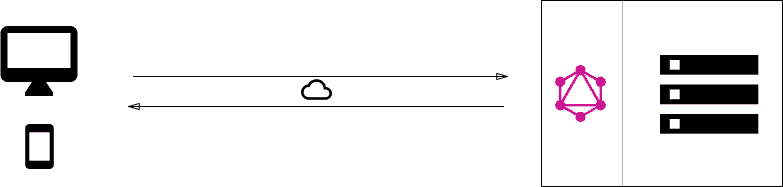
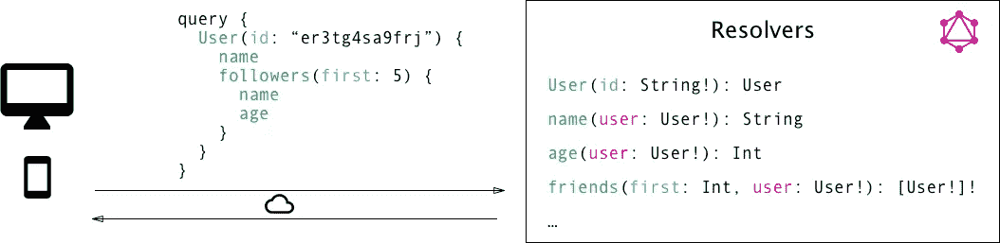
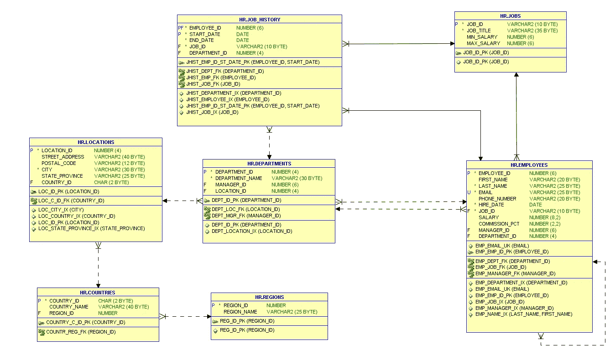
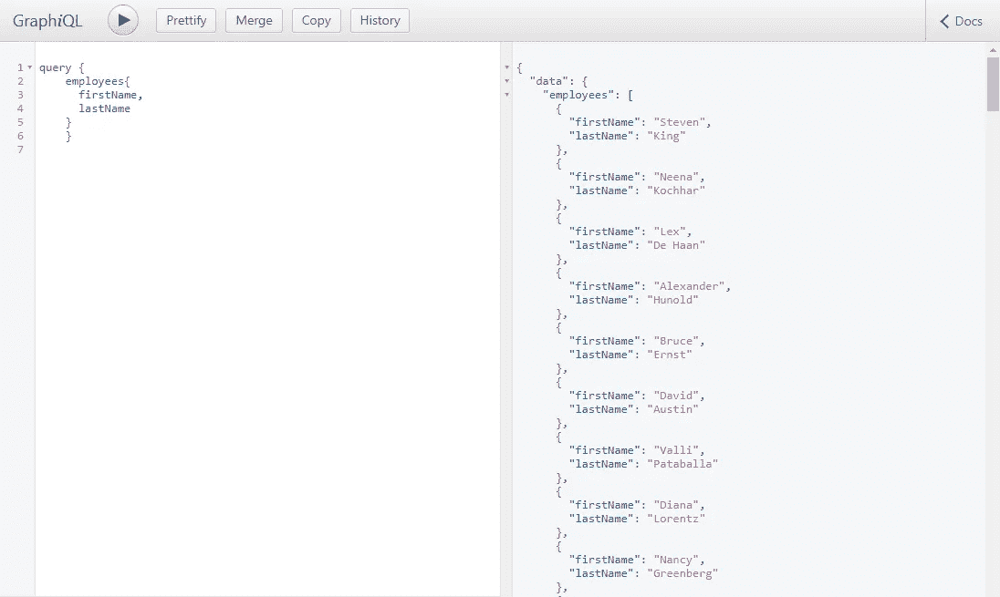
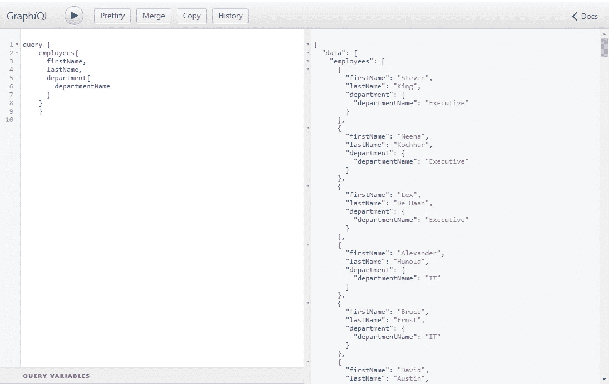

# 使用 GraphQL-Python 查询 ORACLE 数据库数据

> 原文：<https://medium.com/analytics-vidhya/query-oracle-database-data-using-graphql-python-2c504cc2d343?source=collection_archive---------3----------------------->

在本教程中，我们将使用 [python](https://www.python.org/) 实现 [GraphQL](https://graphql.org/) 服务器，从 [Oracle](https://www.oracle.com/database/) 数据库表中查询数据

# 什么是 GraphQL？

GraphQL 是 API 的一种查询语言，也是一种服务器端运行时，通过使用您为数据定义的类型系统来执行查询。GraphQL 不依赖于任何特定的数据库或存储引擎，而是由您现有的代码和数据提供支持。



GraphQL 架构



GraphQL 架构

# **为什么选择 GraphQL？？**

*   使用 GraphQL，您可以向 API 发送查询，并得到您所需要的信息，不多也不少
*   GraphQL 通过根据客户端应用程序的需求选择数据，最大限度地减少了传输的数据量。移动客户端可以获取更少的信息，因为与 web 应用程序的大屏幕相比，在小屏幕上可能不需要它。
*   通过订阅进行实时更新，因此当客户端订阅一个事件时，它将启动并保持与服务器的稳定连接。每当特定事件实际发生时，服务器就会将相应的数据推送到客户端。与遵循典型的“请求-响应-循环”的查询和变化不同，订阅表示发送到客户端的数据流

> 这是一个简单的概念概述，但它应该足以完成教程。你可以在这里[和](https://graphql.org/learn/)[阅读更多信息](https://www.howtographql.com/)

# GraphQL Python 服务器

GraphQL 支持多个库，如 Python、java、C#/。NET 还有[更](https://graphql.org/code/#server-libraries)。

在本文中，我们将使用 python 服务器。还有 [Graphene](http://graphene-python.org/) 和 [Graphene-Django](http://docs.graphene-python.org/projects/django/en/latest/) ，公开了一个简单而强大的用于创建 GraphQL 服务器的 API。

# 先决条件

*   Python 与 django、graphene-django、django-filter 和 django-graphql 库
*   Oracle 数据库中的 HR 示例模式



人力资源架构图

# 如何引导

## 在 django 中创建 graphoracle 项目

首先，我们需要创建 django 项目。我创建了名为 graphoracle 的项目

```
(base) D:\django-graphql>django-admin startproject graphoracle
```

该命令将创建所需的库并创建 django 项目。

项目创建后，我们可以运行 django 服务器

```
(base) D:\django-graphql>python manage.py runserver
```

为了测试，我们可以访问 [http://localhost:8000](http://localhost:8000) 地址。以下页面必须返回


> ***你可以在***[***github repo***](https://github.com/moha08/graporacle)中找到项目文件

## 修改 graphoracle 项目的 settings.py 文件

我们需要为项目添加以下设置:

*   添加 Oracle 数据库连接设置

我们在该设置中指定数据库服务器、端口、服务名、用户名和密码

*   添加石墨烯包和模式路径

我们必须将 graphene_django 添加到 INSTALLED_APPS 列表。此外，我们定义了我们将在石墨烯设置中使用的模式

## 在 graphoracle 项目中创建 hr 应用程序

下一步是在我们的项目中创建 hr 应用程序，它将包含我们的模型和模式

```
(base) D:\django-graphql\graphoracle>python manage.py startapp hr
(base) D:\django-graphql\graphoracle>cd hr
(base) D:\django-graphql\graphoracle\hr>dir
 Volume in drive D is DataDisk
 Volume Serial Number is 88F9-D7BDDirectory of D:\django-graphql\graphoracle\hr11/19/2019  09:49 AM    <DIR>          .
11/19/2019  09:49 AM    <DIR>          ..
11/19/2019  09:49 AM                66 admin.py
11/19/2019  09:49 AM                84 apps.py
11/19/2019  09:49 AM    <DIR>          migrations
11/19/2019  09:49 AM                60 models.py
11/19/2019  09:49 AM                63 tests.py
11/19/2019  09:49 AM                66 views.py
11/19/2019  09:49 AM                 0 __init__.py
               6 File(s)            339 bytes
               3 Dir(s)  23,212,933,120 bytes free
```

## 使用 [inspectdb](https://docs.djangoproject.com/en/2.2/howto/legacy-databases/) 工具检查数据库表

这是一个很棒的工具，可以从数据库中获取所有表格，为每个表格构建类，并为每个列定义字段。

```
(base) D:\django-graphql\graphoracle> python manage.py inspectdb > hr\models.py
```

检查完成后，我们必须检查创建的模型。有时我们需要根据我们的表进行更改

以下是 models.py 文件的示例

## 将 graphoracle 项目与数据库一起迁移

我们将运行两个 django 脚本:

*   makemigrations:这个脚本将生成需要在数据库中运行的 SQL 命令
*   迁移这将执行生成的 SQL 命令。当运行这个脚本时，django 将在数据库中创建一些表。这些表来自 django 项目

```
(base) D:\django-graphql\graphoracle>python manage.py makemigrations
No changes detected(base) D:\django-graphql\graphoracle>python manage.py migrate
Operations to perform:
  Apply all migrations: admin, auth, contenttypes, sessions
Running migrations:
  Applying contenttypes.0001_initial... OK
  Applying auth.0001_initial... OK
  Applying admin.0001_initial... OK
  Applying admin.0002_logentry_remove_auto_add... OK
  Applying admin.0003_logentry_add_action_flag_choices... OK
  Applying contenttypes.0002_remove_content_type_name... OK
  Applying auth.0002_alter_permission_name_max_length... OK
  Applying auth.0003_alter_user_email_max_length... OK
  Applying auth.0004_alter_user_username_opts... OK
  Applying auth.0005_alter_user_last_login_null... OK
  Applying auth.0006_require_contenttypes_0002... OK
  Applying auth.0007_alter_validators_add_error_messages... OK
  Applying auth.0008_alter_user_username_max_length... OK
  Applying auth.0009_alter_user_last_name_max_length... OK
  Applying auth.0010_alter_group_name_max_length... OK
  Applying auth.0011_update_proxy_permissions... OK
  Applying sessions.0001_initial... OK
```

## 将 hr 应用程序添加到 settings.py 文件

在这一步中，我们将在项目中添加人力资源应用程序。

> 在 GraphQL 中，*类型*是一个可能包含多个*字段*的对象。每个字段通过*解析器*计算，并返回一个值。类型的集合被称为*模式*。每个模式都有一个特殊的类型，叫做*查询*，用于从服务器获取数据。

## 创建 GraphQL 模式类

我们需要在 hr 应用程序目录中创建 schema.py 文件，然后为 models.py 中定义的每个数据库对象创建 Django object type(Graphene Django 中提供的自定义类型)

此外，我们需要为每个模式创建包含解析器方法的查询类。

以下是 schema.py 文件中的示例

## 在 graphoracle 项目中创建模式类

为什么要创建另一个包含查询类的模式类？这个类只是继承了之前定义的查询。通过这种方式，您可以在应用程序中隔离模式的每个部分。

以下是 schema.py 文件。

## 启用图形 QL

GraphQL 是一个交互式网络工具，用来测试和使用 graph QL。

为了在我们的项目中启用 graph QL，我们需要在 graphoracle 项目中的 url.py 文件中添加 graphiql url

# 使用 GraphQL 从 Oracle 表中查询数据

最后，我们可以使用 GraphQL 从 oracle 表中查询数据。我们使用 GraphiQL 工具来运行查询

*   获取员工表数据



*   获取具有部门名称的员工



# 参考

[](https://www.howtographql.com/) [## 如何使用 graph QL——graph QL 的完整教程

### 免费的开源教程，全面了解 GraphQL 从零到生产。第一场总共 42 分钟…

www.howtographql.com](https://www.howtographql.com/) [](https://graphql.org/) [## GraphQL:一种 API 查询语言。

### 学习准则社区规范行为准则基金会学习准则社区规范行为准则基金会类型项目…

graphql.org](https://graphql.org/) [](https://www.djangoproject.com/) [## 姜戈

### Django 是一个高级 Python Web 框架，它鼓励快速开发和干净、实用的设计。建造者…

www.djangoproject.com](https://www.djangoproject.com/)  [## Oracle 数据库快速版

### 未找到结果您的搜索没有匹配任何结果。我们建议您尝试以下方法来帮助找到您想要的…

www.oracle.com](https://www.oracle.com/database/technologies/appdev/xe.html)