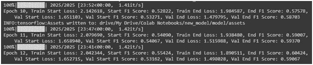

# 基于 SQuAD 数据集的双向注意力流问答系统

> 原文：<https://medium.com/analytics-vidhya/question-and-answering-system-using-bidirectional-attention-flow-on-squad-dataset-ff88b454af14?source=collection_archive---------10----------------------->


# **业务问题**

问题回答是自然语言处理领域中的一项任务，它涉及建立自动回答人类提出的问题的系统。

我们向系统提出一个问题以及包含该问题答案的摘录/文本片段，并且我们期望系统精确地提取作为该问题答案的那部分文本(也称为答案范围)。

> **举例:**

**语境:**尼古拉·特斯拉(塞尔维亚西里尔文:николатесла；1856 年 7 月 10 日-1943 年 1 月 7 日)是一位塞尔维亚裔美国发明家、电气工程师、机械工程师、物理学家和未来学家，他最著名的贡献是设计了现代交流供电系统。

问题:尼古拉·特斯拉是什么种族？

**回答:**塞尔维亚语

> **应用:**

然后，这可以扩展到其他应用程序，在这些应用程序中，您有大量数据需要回答一些问题。你可以简单地把数据输入系统，然后问一些问题，系统会为你解答。

推而广之，你也可以从网上刮下知识库(上下文)来回答你的问题。

应用是多种多样的。我们每天都在寻找问题的答案。下面我将列举其中的几个:

*   **医疗**:一个病人的所有医疗信息都可以汇编成一大段文字。然后，医生可以使用这种方法，他们可以简单地问一个问题(对虚拟助理类型的设置)，并且医生可以获得关于所请求的确切信息的相关细节。
*   **合同**:我们通常会忽略合同条款、申请等，但可能会有一些简单的问题。这个系统可以快速浏览大量的条款和条件，并为我们的查询提供答案。
*   **学术**:这个区域广阔。学生可以使用这种设置来快速获得任何和所有与他感兴趣的主题相关的问题的答案(给定对材料的访问)。
*   还有更多…

# **机器学习/深度学习的使用**

> **机器学习类型问题**:

多类分类

多输入多输出

**直觉**:上下文将有 n 个单词(n 类)，我们必须确定答案范围的开始和结束单词。这可以被视为预测 n 个类别中的一个类别以获得答案范围的开始和结束单词。

我们正在进行两种不同的预测，一种是对开始字的预测，另一种是对结束字的预测。问题/模型是多输入(问题、上下文)和多输出(开始字、结束字)的问题/模型。

> E **误差指标**:

F1 分数

**直觉**:

精度:在被确定为正的数字类中，有多少实际上是正的。

回忆:在实际为正的类的数量中，有多少被我们的模型正确分类。

直观地想一想:

对于上下文中作为答案一部分的单词，我们必须确定模型实际上提取了多少单词(回忆)，对于模型提取的单词，我们必须确定有多少单词实际上是答案的一部分(精确度)。

这有助于确定模型从给定问题的上下文中获取答案的能力。结合这两个指标(精确度和召回率)的度量是 F1 分数。

> B **业务约束**:

*   在给定问题和上下文(包含答案的文本)的情况下，提供答案所需的时间应该非常短，通常在几毫秒的范围内。没有人会等上几秒或几分钟。相反，他们会简单地自己阅读文章/上下文来得到答案。
*   除了确切答案之外，答案范围不应包含额外的填充词。

# **数据**

该模型的数据来自斯坦福问答数据集。

有两个版本:

1.  包含有问题、上下文和答案的记录。
2.  除了包含问题、上下文和答案的记录之外，它还具有包含不可回答的问题但在上下文中有似是而非的错误答案的记录。这是为了迷惑系统。

这里，我正在处理问题陈述 1。

有关数据集的更多信息，请访问:

[](https://rajpurkar.github.io/SQuAD-explorer/) [## 斯坦福问答数据集

### 斯坦福问题回答数据集(SQuAD)是一个新的阅读理解数据集，由…

rajpurkar.github.io](https://rajpurkar.github.io/SQuAD-explorer/) 

> **数据概述:**

数据集以 JSON 文件的形式提供。

我用一小段代码将数据集中的信息提取到熊猫数据帧中。

被考虑用于建模的最终数据帧仅包括 3 列:

*   问题
*   语境
*   回答

# **现有方法**

解决这个问题的最有影响力的方法如下:

*   由收集小队数据集的团队构建的初始逻辑回归模型。
*   双向注意流模型。
*   基于 BERT 的模型。

这些方法有许多变体/副产品。但到目前为止，这些都是最有影响力的模型，以伯特为首。

我用过 BiDAF(双向注意力流模型)模型。

# 探索性数据分析

我对问题和上下文的句子/单词/字符长度进行了一些数据分析，这将有助于标记和填充输入。

> **句子长度**

```
Min:  1
Max:  5
Mean:  1.0026952004699323
Median:  1.0
25th percentile:  1.0
50th percentile:  1.0
75th percentile:  1.0
95th percentile:  1.0
99th percentile:  1.0
```


问题句子长度的 PDF 和方框图|图片由作者提供

如你所见，几乎所有的问题都是句子长度为 1 的，这是意料之中的。你通常用一句话问一个问题。

```
Min:  1
Max:  27
Mean:  5.105435320947697
Median:  5.0
25th percentile:  4.0
50th percentile:  5.0
75th percentile:  6.0
95th percentile:  9.0
99th percentile:  13.0
```


上下文句子长度的 PDF 和方框图|图片由作者提供

上下文中的句子数量从 1 到最多 27 不等。但是大多数上下文(99%)的句子长度只有 13 个。

> **字长**

```
Min:  1
Max:  60
Mean:  11.291853353451353
Median:  11.0
25th percentile:  9.0
50th percentile:  11.0
75th percentile:  13.0
95th percentile:  18.0
99th percentile:  23.0
```


问题单词长度的 PDF 和方框图|图片由作者提供

任何问题中的单词数都在 1 到 60 之间(极端的，可能的异常值)。大多数问题由不到 30 个单词组成。

```
Min:  22
Max:  766
Mean:  137.8945186072494
Median:  127.0
25th percentile:  102.0
50th percentile:  127.0
75th percentile:  164.0
95th percentile:  245.0
99th percentile:  325.0
```


上下文单词长度的 PDF 和方框图|图片由作者提供

上下文中的单词数在 325 的 22 到 99%之间，这意味着 99%的上下文由少于 325 个单词组成。

> **字符长度**

```
Min:  1
Max:  37
Mean:  4.606716632191931
Median:  4.0
25th percentile:  2.0
50th percentile:  4.0
75th percentile:  7.0
95th percentile:  10.0
99th percentile:  13.0
99th percentile:  16.0
```


单词字符长度的 PDF 和方框图|作者图片

出现在问题和上下文中的单词的字符长度的分布如上所述。它的范围从最常用的英文单词 1、2 和 3(如 I、is、the)到 16 的第 99.9 百分位(更复杂/更罕见的单词)。

继续进行必要的预处理。让我们从基础开始。

# **数据预处理:**

这个问题由字符串形式的输入(问题和上下文)组成。


输入|作者图片

但是机器学习只处理数字。所以我们必须通过标记化将这些字符串转换成数字。

我们在这里使用两种不同的标记化。单词级标记化和字符级标记化。至于我们为什么使用两种不同的标记化将在后面解释。

> **单词级标记化**

有许多单词分词器，它们之间的功能有所不同。这里，我们使用 PTBTokenizer(nltk . word _ token ize)。

这将输入字符串(问题和上下文)分割成单词和标点符号列表。

然后，我们将每个唯一的单词/标点符号编码成一个唯一的数字(令牌)。并且这个数字到单词/标点的映射被保存在字典中。


单词分词器代码|作者图片

此外，对于每个记录，我们找出包含答案范围的开始和结束单词的单词级标记的标记索引。

> **字符级标记化**

这也用数字列表对字符串进行编码，但是是在字符级别。

为此，我使用了 Keras 内置的标记器。

这里，所有的标记和它们各自的字符都保存在一个字典中。


字符标记器代码|作者图片

经过所有这些处理后，我们的数据帧如下:


输入令牌|作者图片

> **填充**

然后我们做一些分析，找出每个问题/上下文中有多少个单词，每个单词有多少个字符。

这用于确定对任何问题/上下文进行编码所需的最大字数，以及对任何单词进行编码所需的最大字符数。


问题字数|作者图片


上下文字数|作者图片


文字字符数|作者图片

因此，我们将每个问题编码为最多 32(J)个单词标记，如果问题短于 32 个单词，则填充 0(的单词标记)，如果问题长于 32 个单词，则截断。类似地，上下文的最大令牌数是 340(T)。

我们用来编码每个单词的最大字符数是 15(K ),因为 99.9%的单词接近这些字符。长于此长度的单词的字符将被截断，短于此长度的单词将用 0 填充(字符标记为)。

单词和字符级标记化问题和上下文的填充序列最终如下:


填充序列|作者图片

> **最终输入输出**

上述四个字段(问题和上下文的单词级和字符级标记)将作为模型的输入。


开始和结束标记|作者图片

模型的输出将仅仅是答案范围的开始和结束指数(或者更具体地，它们的概率分布)。

更具体地说，如果我们使用稀疏分类交叉熵损失，我们将使用这些指数作为输出。

如果我们使用 CategoricalCrossEntropy loss，我们将使用这些索引的一个热编码矢量(340 维)作为输出。

在我的模型中，我使用 CategoricalCrossEntropy 作为损失，因此对输出开始和结束索引进行了热编码。

现在我们已经有了模型的输入和输出，让我们继续讨论模型本身。

# **型号**

我很大程度上要归功于下面提到的博客。

[](https://towardsdatascience.com/the-definitive-guide-to-bi-directional-attention-flow-d0e96e9e666b) [## 双向注意力流动图解指南

### 这篇文章展示了 BiDAF 的工作原理，BiDAF 是一个 NLP 模型，它在问答中拓展了范围…

towardsdatascience.com](https://towardsdatascience.com/the-definitive-guide-to-bi-directional-attention-flow-d0e96e9e666b) 

这是一本精彩的读物。

这个模型可能看起来很复杂。但我会尽可能用最直观最简单的方式来解释。

模型中有多个层，每个层都有自己的功能。我们会一个一个来。

*   嵌入层(单词和字符)
*   公路层
*   上下文层
*   注意层
*   建模层
*   输出图层

注意:我已经使用单独的自定义类实现了每一层。

> **字嵌入层**

这一层将单词级标记序列转换成向量序列。

向量是预训练的手套字向量。他们在各种数据上接受训练([维基百科 2014](http://dumps.wikimedia.org/enwiki/20140102/) + [Gigaword 5](https://catalog.ldc.upenn.edu/LDC2011T07) 、普通抓取、Twitter)。此外，单词向量有各种尺寸(50、100、200 和 300)。

对于这个模型，我使用了在维基百科+ Gigaword5 上训练的 100 维单词向量。

你可以说问题/上下文中的每个单词/单词都被转换成了一个 d(在本例中为 100)维向量。

**输入**:单词记号的 T，J 维向量。

**输出** : dXT，dXJ 维矩阵。


文字嵌入层|作者图片

> **字符嵌入层**

这一层将字符级标记序列转换为向量序列。

这里，对应于每个字符的向量是相对于字符数的随机向量或一次向量。我用过 onehot vectors。

因此，每个单词的每个字符都被转换成 c+1(对于<unk>为+1，即数据集中没有遇到的任何未知字符)维向量(假设向量是一次性编码的)，其中 c 是数据集中唯一字符的数量。</unk>


字符嵌入|作者图片

**输入**:字符记号的 KXT，KXJ 矩阵(可以说是列表的列表)。

**输出** : KXTX(c+1)，KXJX(c+1)维矩阵。


字符嵌入层|作者图片

现在，为什么我们首先需要字符级嵌入？单词级嵌入还不够吗？

理想情况下，如果预训练的手套向量包含我们数据集中所有唯一单词的向量表示，那么很可能。

但是，通常数据集中的所有单词都不会被手套向量覆盖。为了涵盖这种词汇表外单词的表示，我们使用字符级嵌入。

在我们的例子中，在维基百科 2014 + Gigaword5 上训练的 100 维手套向量覆盖的单词百分比是:


覆盖单词的百分比|作者图片

使用不同版本的手套向量可以提高这个数字。

但是仅有字符级嵌入是不够的。它们只是代表一个单词的不同字符。但是要使用这样的字符嵌入获得单词级的表示，我们需要一个字符 CNN。

> **人物 CNN 图层**

字符嵌入层的输出通过字符 CNN 来获得单词级表示。

更具体地说，输入的每个时间步(单词)都通过字符 CNN 层。

字符 CNN 层只不过是一个一维卷积神经网络。

让我们假设我们的 1D 卷积层有 f 个核/滤波器，每个都具有任意宽度 w(这不必是常数，不同的核可以具有不同的宽度)和高度=输入的高度(这是常数，因为它是 1D 卷积，并且将等于输入的高度，即 c+1)。

因此，对于每个滤波器，输入中的每个 KX(c+1)矩阵将被变换为 K-w+1 维向量。

然后，我们对此进行最大化，为这些向量中的每一个向量获取 1 个值。将此扩展到 f 过滤器，我们得到一个 f 维向量。


人物 CNN 实现|作者图片

因此，最终在卷积和最大池化之后，每个 KX(c+1)矩阵被转换成 f 维向量。

为简单起见，我们固定 f = d = 100

**输入** : KXTX(c+1)，KXJX(c+1)维矩阵。

**输出** : dXT，dXJ 维矩阵。


人物 CNN 图层|作者图片

现在，我们有了每个单词的单词手套表示和每个单词的字符级表示。

接下来，我们将它们连接起来，得到分别代表上下文和问题的 2dXT，2dXJ 维向量。这些信息将作为输入输入到公路图层。

> H **高速公路层**

高速公路网络的作用是调整单词嵌入和字符嵌入步骤的相对贡献。

逻辑是，如果我们正在处理词汇之外的单词，我们会希望增加单词的 1D-CNN 表示的相对重要性，因为我们知道它的手套表示很可能是一些随机的胡言乱语或只是零。另一方面，当我们处理常见的和明确的英语单词时，我们可能希望从 GloVe 和 1D-CNN 获得更多的同等贡献。

简单地说，高速公路层只是一个有微小变化的前馈神经网络。

在给予网络的所有输入中，只有一小部分经历了权重相乘、偏置相加和激活。输入的剩余部分未经转换。这些分数的比率由变换门(t)和进位门(1-t)管理


高速公路图层实施|作者图片

**输入** : 2dXT，2dXJ 维矩阵

**输出** : 2dXT，2dXJ 维矩阵


公路图层|作者图片

现在我们有了问题和上下文中每个单词的单词表示。但是它们没有上下文信息。即来自他们周围的信息。

> **上下文层**

在英语或任何语言中，我们可以有把握地说，单词的意思也是由它周围的单词(它的上下文)决定的。

例如，银行可能是一个金融机构，也可能是一条河的两岸。这个词的实际意思可能是由它前面或后面的词表达出来的。

因此，我们的下一个任务是获得每个单词的上下文表示。

这一层正是这样做的。它获得每个单词的上下文表示，即关于单词本身的信息和关于它周围单词的可能信息(上下文)。

处理时间序列数据(我们的问题和背景是时间序列数据)的模型类型是递归神经网络家族(RNN、LSTM 和 GRU)。

LSTM/GRU 是一种可以记忆长期依赖关系的神经网络架构。当我们将输入序列(例如文本串)输入到正常的正向 LSTM/GRU 层中时，每个时间步长的输出序列将对来自该时间步长以及过去时间步长的信息进行编码。换句话说，每个单词的输出嵌入将包含来自之前单词的上下文信息。

在这里，我使用了 GRUs。还有，单词的意义是由它两边的单词决定的。为此，我们使用双向 GRU。

我将 GRU 的单元/隐藏单元/输出尺寸的数量设置为 d(为了简单起见)。因此，双向 GRU 的输出数量是 2d。

**输入** : 2dXT，2dXJ 维矩阵

**输出** : 2dXT(姑且称这个矩阵 H)，2dXJ 维矩阵(姑且称这个矩阵 U)


上下文嵌入层|作者图片

> **关注层**

这些注意力层构成了这个模型的核心。

注意力本身是一个巨大的概念。我试着用一个例子来解释一下——机器翻译。

最简单的机器翻译模型由编码器解码器架构组成。

编码器读取源语言中的输入序列(通常是一个句子),并将其转换为向量。解码器使用这个向量来生成翻译语言的句子。

直觉地想到这一点。如果你是翻译，你必须阅读需要翻译的内容，记住它，然后翻译成另一种语言。短句就可以了。但是对于较长的文本，这几乎是不可能的。想象一下这样翻译一整本书。你也许能翻译后记。仅此而已。当你读完的时候，你可能已经忘记了这本书的大部分内容。

现在让我们思考一下在现实生活中这个任务是如何完成的。译者阅读文本的一部分，翻译它。返回，阅读文本的下一部分，翻译它，等等。

换句话说，在翻译过程中，我们只关注原文的相关部分。这就是注意力。

关于注意力在这类翻译器中是如何实现的，我就不赘述了。

将这一概念扩展到我们的任务，我们将集中在与问题相关的上下文中的那些单词和与上下文相关的那些正在讨论的单词上。这就是为什么它被称为双向注意力流。注意力是双向流动的，从问题到背景，从背景到问题。

我们在注意力层中有 3 个不同的步骤:

1.相似矩阵的形成

2.要查询(问题)注意的上下文

3.质疑(问题)对语境的关注

***相似度矩阵的形成***

相似性矩阵是捕获上下文和查询中的单词之间的关系的矩阵。

很明显，这是一个 TXJ 矩阵。

仅仅因为上下文单词和查询单词是相同的，并不一定意味着它们的向量表示非常相似。这是因为这些向量表示也包含了来自周围短语的信息。

这个 TXJ 矩阵的每个元素都是由它的代表字向量以下列方式连接而成的:

S(t，j)= W .[h；u；h*u]

其中 H，U 是矩阵 H，U *的列，表示逐元素乘法；表示串联，。是点积，W 是 6d 可训练权重向量。


相似矩阵的形成|作者的图像

S(t，j)的值表示对应于第 t 列的上下文中的单词与对应于第 j 列的查询中的单词有多接近。

**输入** : 2dXT，2dXJ 维矩阵(H，U)

**输出** : TXJ 维矩阵


相似矩阵|作者图片

***上下文查询关注***

这一步的目标是找到哪些查询单词与每个上下文单词最相关。

我们将具有维度 TXJ 的相似性矩阵作为输入，并且沿着上下文的维度取一个 softmax。

然后，我们用一个矩阵来表示哪些查询词与每个上下文词最相关。

然后我们取这个矩阵的每一行 1XJ，乘以矩阵 U(2dXJ)并对列求和(有点像标量乘法和加权和)。


查询关注度的上下文|按作者排序的图片

对一行这样做将得到一个 2dX1 向量。因此，在 T 行中，我们得到一个 2dXT 矩阵作为结果。

结果矩阵(u `)封装了关于每个查询单词与每个上下文单词的相关性的信息。

**输入** : TXJ 维矩阵

**输出** : 2dXT 维矩阵(u `)

***查询到上下文关注***

这里，我们的目标是找到哪些上下文单词与查询单词最相似，因此对于回答查询是至关重要的。

我们将具有维度 TXJ 的相似性矩阵作为输入，并且沿着查询的维度取最大值。我们得到一个 TX1 向量。然后我们在这个向量上应用 softmax。

然后，我们将这个向量 TX1 与矩阵 H(2dXT)的列相乘，并对这些列求和(有点像标量乘法和加权求和)。


对上下文关注|作者图片的查询

这样做可以得到一个 2dX1 向量。我们简单地将它平铺/复制 T 次。我们得到一个 2dXT 矩阵作为结果。

这个矩阵(h `)封装了关于查询的上下文中最重要的单词的信息。

**输入** : TXJ 维矩阵

**输出** : 2dXT 维矩阵(h `)


双向注意力|作者的图像

综上所述:

h:在上下文中有语义、句法和语境意义的词。

u `:封装每个查询词与每个上下文词的相关性。

h `:封装关于查询的上下文中最重要的单词的信息

我们现在合并所有 3 个矩阵 H(2dXT)，U`(2dXT)和 H`(2dXT ),以下列方式形成矩阵 G:

g =[h；uh * uh*h`]

其中 H，u `，H `是 H，u `和 H `的列，*表示逐元素乘法；表示串联。

现在，我们可以说 G(8dXT)的每个列向量是上下文单词的表示，该上下文单词完全知道其含义、上下文含义，知道查询及其与查询的相关性。

> **造型层**

建模层只是一系列的两个双向 gru，它使用信息丰富的矩阵 G 来决定哪些单词需要成为答案的一部分。

第一建模层的输出是 M1(2dXT)，第二建模层的输出是 M2(2dXT)。

**输入** : 8dXT 维矩阵(G)

**输出** : 2dXT，2dXT 维矩阵(M1，M2)


建模层|作者图像

> **输出层**

然后，输出层用于确定答案范围的开始和结束单词。

开始概率分布计算如下

start = soft max(W .[G；M1])

其中[G；M1]是一个(10dXT)矩阵。是点积，W 是 10d 可训练权重向量。

最终概率分布计算如下

end = soft max(W .[G；M2])

其中[G；M2]是一个(10dXT)矩阵。是点积，W 是 10d 可训练权重向量。

**输入**:10 个维度矩阵(GM1，GM2)

**输出** : 1XT，1XT 矢量(开始，结束)

这些概率分布告诉我们上下文中的每个单词作为答案范围的开始和结束的概率。

为了提取精确的开始和结束索引，简单地取对应于分布的最大值的索引，因为它指示该单词作为开始/结束的概率最高。

现在，您可以从开始索引到结束索引遍历上下文标记，以获得答案范围。

# **模型的直觉:**

让我们考虑一个新的学年开始了，一个班级的学生(上下文的单词)聚集在一起。

他们每个人都了解自己(单词嵌入、字符嵌入和高速公路层)。

接下来，他们相互交流，了解类中的其他人(上下文嵌入层)。

现在，来了一群来自不同系的教授，他们说他们需要一些学生来完成一项特定的任务。

现在，学生们如何知道他们中谁能完成这个任务？

因此，学生们与每位教授进行一对一的会谈，以了解任务，并了解他们如何融入到画面中(注意层)。

现在班上的每个学生都知道自己与手头任务的相关性。

但是，为了决定他们是否应该成为少数几个学生中的一员，所有的学生再次相互交流(建模层)。

现在，学生对自己的相关性以及班上其他学生的相关性有了一个概念，与完成任务(回答范围)最相关/最有能力的学生站出来完成任务。

> **模型结果:**

我使用了 Nadam 优化器(具有内斯特罗夫动量的 adam ),并运行了 12 个时期的模型，最小批量大小为 32，初始学习率为 0.0005，双向 gru 和密集层的退出率为 0.2。

该模型有近 180 万个可训练参数。

我在 Google Colab 上训练模型。使用特斯拉 T4 图形处理器，每个纪元需要将近 25 分钟。总训练时间接近 6 小时。



训练时期|作者图片

该模型在验证数据上获得了 0.561 的平均 F1 分数。

> **样本预测:**


样本预测|作者图片

# 结论

像这样的方法展示了将人类行为模仿成算法的重要性，以便我们可以将人类智能转化为人工智能。

# **未来工作**

*   尝试手套模型中的其他单词向量。
*   尝试字符嵌入层的随机矢量，而不是一个热点矢量。
*   使用最近的优化器，如 RADAM(修正亚当)。
*   尝试将脸书推论向量以某种方式整合到模型中。

# **参考文献**

*   [www.appliedaicourse.com](https://www.appliedaicourse.com/)
*   [https://arxiv.org/abs/1606.05250](https://arxiv.org/abs/1606.05250)
*   [https://rajpurkar.github.io/SQuAD-explorer/](https://rajpurkar.github.io/SQuAD-explorer/)
*   [https://arxiv.org/abs/1611.01603](https://arxiv.org/abs/1611.01603)
*   [https://towards data science . com/the-definitive-guide-to-bi-directional-attention-flow-d 0e 96 e 9e 666 b](https://towardsdatascience.com/the-definitive-guide-to-bi-directional-attention-flow-d0e96e9e666b)
*   [https://towards data science . com/character-level-CNN-with-keras-50391 C3 ADF 33](https://towardsdatascience.com/character-level-cnn-with-keras-50391c3adf33)
*   [https://udai . git book . io/practical-ml/nn/training-and-debugging-of-nn](https://udai.gitbook.io/practical-ml/nn/training-and-debugging-of-nn)
*   [https://towards data science . com/building-a-question-answering-system-part-1-9388 aad ff 507](https://towardsdatascience.com/building-a-question-answering-system-part-1-9388aadff507)
*   [https://towards data science . com/NLP-building-a-question-answering-model-ed 0529 a68c 54](https://towardsdatascience.com/nlp-building-a-question-answering-model-ed0529a68c54)
*   [https://arxiv.org/pdf/1506.03134.pdf](https://arxiv.org/pdf/1506.03134.pdf)

# **Github 库**

[](https://github.com/th3darkprince/BiDAF_SQUAD) [## th3 马克普林斯/BiDAF_SQUAD

### 面向小队数据集的问答系统双向注意流实现

github.com](https://github.com/th3darkprince/BiDAF_SQUAD) 

# **链接于**

[www.linkedin.com/in/yuvarajjanarthanan](http://www.linkedin.com/in/yuvarajjanarthanan)