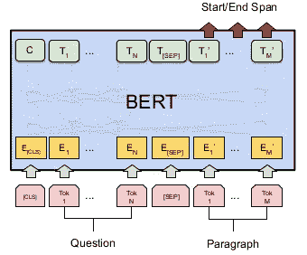
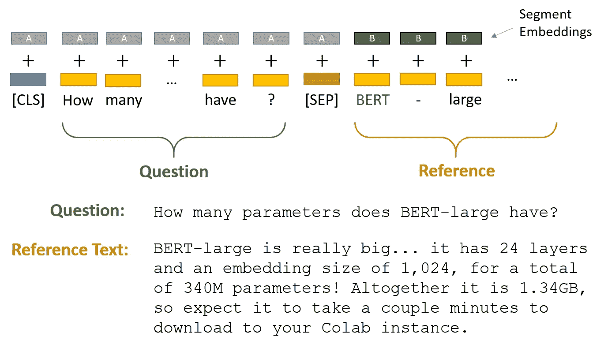
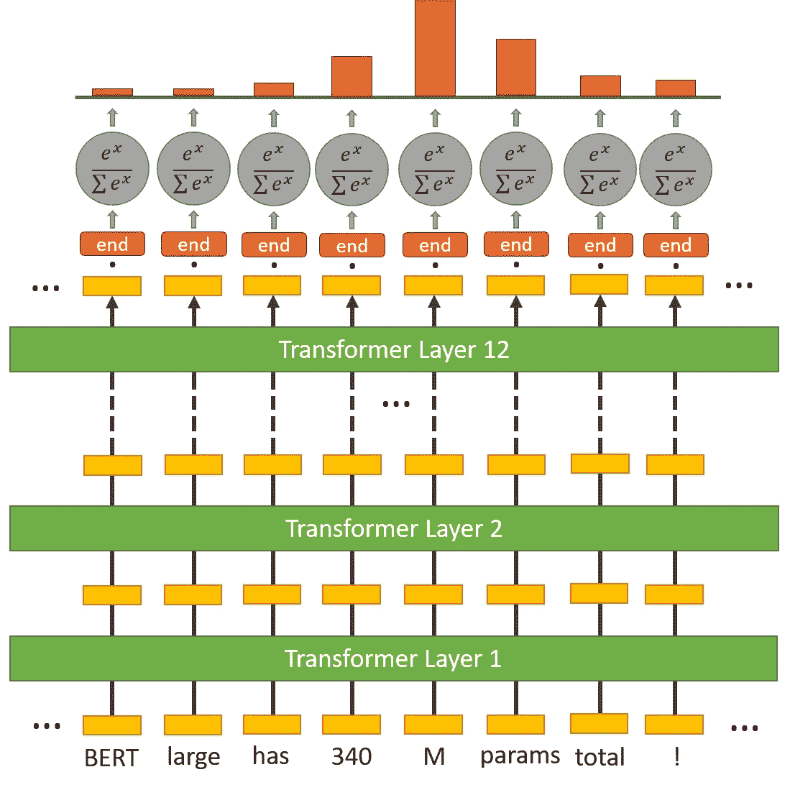

# 基于 BERT 的问答系统

> 原文：<https://medium.com/analytics-vidhya/question-answering-system-with-bert-ebe1130f8def?source=collection_archive---------0----------------------->

## 本文解释了什么是 BERT，BERT 的优点，以及如何使用微调的 BERT 创建 QA 系统。


谷歌伯特

# 伯特是什么？

B

它旨在通过联合调节左右上下文来预训练来自未标记文本的深度双向表示。因此，预训练的 BERT 模型可以通过一个额外的输出层进行微调，从而为各种 NLP 任务创建最先进的模型。

# 为什么是伯特？

**BERT** 可以更好地理解长期查询，从而呈现更合适的结果。 **BERT** 模型适用于有机搜索结果和特色片段。虽然您可以针对这些查询进行优化，但是您不能“针对 BERT 进行优化”

> **简而言之:** BERT 帮助搜索引擎理解所用关键词中“To”和“for”等转换词的意义。

# 使用 BERT 的问答系统



用 BERT 构建问答系统

对于问答系统，BERT 将两个参数，输入问题和段落作为一个打包序列。输入嵌入是记号嵌入和片段嵌入的总和。

1.  **记号嵌入:**在问题的开头将【CLS】记号添加到输入单词记号，并且在问题和段落的结尾都插入【SEP】记号。
2.  **片段嵌入:**向每个标记添加指示句子 A 或句子 B 的标记。这使得模型能够区分句子。在下面的例子中，所有标记为 A 的单词都属于问题，标记为 B 的单词属于段落。



这两段文本由特殊的`[SEP]`标记分隔。

BERT 使用“片段嵌入”来区分问题和参考文本。这只是 BERT 学习的两个嵌入(对于段“A”和“B”)，并且在将它们馈送到输入层之前，将它们添加到令牌嵌入中。

# 开始和结束标记分类器



寻找起始字和结束字的层的变换器结构

对于文本中的每个标记，我们将其最终嵌入到起始标记分类器中。开始标记分类器只有一组应用于每个单词的权重。

在获得输出嵌入和“开始”权重之间的点积之后，我们应用 softmax 激活来产生所有单词的概率分布。我们选择最有可能成为起始标记的单词。

# 让我们开始编码吧！


安装变压器库，

加载 **BertForQuestionAnswering** 模型和**分词器**。

创建一个 QA 示例，并使用函数 encode_plus()对该示例进行编码。encode_plus()函数返回一个包含 input _ id、token _ type _ id 和注意屏蔽的字典，但是我们只需要 input _ id 和 token _ type _ id 来完成 QA 任务。

通过加载的模型运行 QA 示例。

我们可以获得开始索引和结束索引，并使用这两个索引进行跨度预测。

我们可以恢复任何被分解成子词的单词，只需要多做一点工作。

## 输出:

```
The answer is : the scientific study of algorithms and statistical models
```

# 结论

我希望你现在已经理解了如何用微调过的 BERT 创建一个问答系统。感谢阅读！