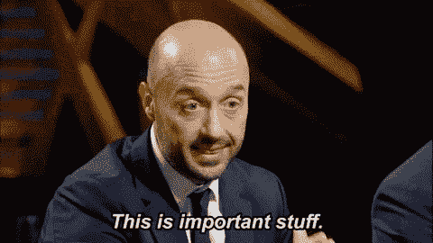

# 问题对相似度

> 原文：<https://medium.com/analytics-vidhya/question-pair-similarity-be19f3fee6a4?source=collection_archive---------10----------------------->


每月有超过 1 亿人访问 Quora，所以很多人问类似措辞的问题也就不足为奇了。具有相同意图的多个问题会导致搜索者花费更多的时间来寻找问题的最佳答案，并使作者感到他们需要回答同一问题的多个版本。这对于作者和搜索者来说都是一个糟糕的用户体验，因为答案在同一问题的不同版本中变得支离破碎。其实这是一个在 Stack Overflow 等其他社交问答平台上非常明显的问题。一个现实世界的问题，求人工智能解决:)

**问题陈述**

识别 Quora 上被问到的问题是已经被问过的问题的重复。

到目前为止，我们看到了业务问题陈述和约束，但是我们必须使用机器学习来解决问题，所以我们必须将业务问题陈述转换为机器学习问题陈述。所以我们想预测两个问题是否相似。

所以机器学习问题陈述如下:

> *“这是二元分类问题，对于给定的一对问题，我们需要用性能度量(对数损失)来预测它们是否重复”*


现在让我们开始研究问题陈述。

# 让我们开始吧。

# 探索性数据分析

这是任何机器学习问题的第一个重要部分。它让您对数据集有更深入的理解，并有助于根据问题陈述的要求添加一些新功能。

我们首先通过加载数据集来启动 EDA。

这里我们给出了最少数量的数据字段，包括:

*   id:看起来像一个简单的行 ID
*   qid{1，2}:问题对中每个问题的唯一 id
*   问题{1，2}:问题的实际文本内容。
*   is_duplicate:我们试图预测的标签—这两个问题是否彼此重复。

***输出类之间数据点的分布***


正如我们在上面看到的，大约 63%的问题对是不重复的，36%的问题对是重复的。

***每题出现次数***

单个问题最多出现 157 次。

# 文本预处理

1.  删除 html 标签
2.  删除标点符号
3.  执行词干分析
4.  删除停用词

停用词是指经常出现的词。为了删除停用词，我们使用 nltk 库。

词干化是指将句子中的单词转换成不变部分的过程。在上面的例子中，这个词干是 amus。


这种技术就像侦探夏洛克·霍姆斯。你必须成为一名侦探才能提取特征。有时领域专家会告诉你添加这些新特性，但是如果有新问题，那么你必须自己提取特性。对于这个问题，我参考了 kaggle 的观点，哪些特性是重要的，我将在下面解释。

定义:

令牌:你可以通过把句子分成一个空格得到一个令牌

Stop_Word:根据 NLTK 停止字。单词:不是停用词的标记



# 特点:

1.  CWC _ min:Q1 和 Q2 常用字数与最小字数长度之比。
2.  CWC _ max:Q1 和 Q2 的常用字数与最大字数的比值。
3.  csc_min:公共停靠点计数与 Q1 和 Q2 停靠点计数的最小长度之比。
4.  CSC _ max:common _ stop _ count 与 Q1 和 Q2 站点计数的最大长度之比。
5.  CTC _ min:common _ token _ count 与 Q1 和 Q2 令牌计数的最小长度之比。
6.  CTC _ max:common _ token _ count 与 Q1 和 Q2 令牌计数最大长度的比值。
7.  last_word_eq:检查两个问题的 lastword 是否相等。
8.  first_word_eq:检查两个问题的第一个单词是否相等。
9.  abs_len_diff : Abs。长度差。
10.  mean_len:两个问题的平均令牌长度
11.  longest_substr_ratio:最长公共子串的长度与 Q1 和 Q2 令牌计数的最小长度之比。
12.  FuzzyWuzzy 是一个 Python 库，用于字符串匹配。模糊字符串匹配是查找与给定模式匹配的字符串的过程。

**WordCloud**


如你所见，越大的单词意味着发生的次数越多。

**让我们绘制 pairplot，看看我们的特征如何表现。**


我们可以看到蓝色和橙色的点是分开的。有一些重叠，但我们可以认为这是一个很好的特征，并尝试随机模型，并提取重要的特征。

现在我们有 15 个特征。我们使用降维技术 T-SNE(**T**-分布式随机邻居嵌入)。

t-SNE ->它是一种用于探索高维数据的非线性降维算法。它将多维数据映射到适合人类观察的两个或多个维度。


正如我们所见，在某些部分，红点和蓝点是可以分开的。所以我们得出结论，我们构建的特性适合建模。为了获得更好的性能，我们可以根据需要添加更多功能。

## 用 TF-IDF 加权词向量表征文本数据

有多种技术可以将文本转换成矢量，如单词包、TF-IDF、avg w2v 等。这里我们使用 tfidf 加权 w2v。

现在让我解释一下 TF-IDF

**TF-IDF** 代表“项频率—逆数据频率”。

**词频(tf)** :给出这个词在语料库中每个文档中的出现频率。

**逆数据频率(idf):** 用于计算语料库中所有文档中稀有词的权重。

Word2vec 是一种用于产生单词的分布式表示的算法，我们所说的**指的是**单词类型；即词汇表中的任何给定单词，如 get 或 grab 或 go，都有其自己的单词向量，并且这些向量被有效地存储在查找表或字典中。


如你所见，语义词有接近的向量表示。

现在真正的乐趣开始了…


**机器学习模型**

首先，我们尝试随机模型，以获得最坏情况下的日志丢失。

```
predicted_y = np.zeros((test_len,2))
for i in range(test_len):
    rand_probs = np.random.rand(1,2)
    predicted_y[i] = ((rand_probs/sum(sum(rand_probs)))[0])
```

我们发现随机模型给出的对数损失为 0.88。现在，我们尝试各种线性模型，并试图实现远小于 0.88 的对数损失。

现在我们尝试用逻辑回归模型来解决分类问题


```
For values of alpha = 1e-05 The log loss is: 0.592800211149
For values of alpha = 0.0001 The log loss is: 0.532351700629
For values of alpha = 0.001 The log loss is: 0.527562275995
For values of alpha = 0.01 The log loss is: 0.534535408885
For values of alpha = 0.1 The log loss is: 0.525117052926
For values of alpha = 1 The log loss is: 0.520035530431
For values of alpha = 10 The log loss is: 0.521097925307
```

正如我们看到的，对于α= 1，对数损失较小。

所以我们选择阿尔法作为我们的[超参数](https://en.wikipedia.org/wiki/Hyperparameter_(machine_learning))。

```
For values of best alpha = 1 The train log loss is: 0.513842874233
For values of best alpha = 1 The test log loss is: 0.520035530431
```

你可以看到，从 0.88 对数损失到 0.52 对数损失。

现在我们将尝试线性支持向量机模型。它几乎表现类似，但损失是铰链线性 SVM。


```
For values of alpha = 1e-05 The log loss is: 0.657611721261
For values of alpha = 0.0001 The log loss is: 0.489669093534
For values of alpha = 0.001 The log loss is: 0.521829068562
For values of alpha = 0.01 The log loss is: 0.566295616914
For values of alpha = 0.1 The log loss is: 0.599957866217
For values of alpha = 1 The log loss is: 0.635059427016
For values of alpha = 10 The log loss is: 0.654159467907
```

对于α= 0.0001，我们得到最小对数损失。现在我们在这个 aplha 上建立模型。

我们得到的结果是:

```
For values of best alpha = 0.0001 The train log loss is: 0.478054677285
For values of best alpha = 0.0001 The test log loss is: 0.489669093534
```

现在我们建立一些复杂的模型，比如 GBDT。对于这些，我们将 xgboost 而不是 sklearn，因为 xgboost 的实现比 sklearn 更好。


随机模型— 0.88 对数损失

逻辑回归— 0.52 对数损失

线性 SVM-0.489 对数损耗

GBDT-0.357 对数损失。

结论

1.  我花了大部分时间分析和清理数据。当数据干净时，我们只需编写 5-6 行代码来尝试各种模型。
2.  通过检查性能指标或绘制 ROC 曲线，始终检查您的模型不会过拟合或欠拟合。

参考链接:

1.  [https://www.kaggle.com/c/quora-question-pairs](https://www.kaggle.com/c/quora-question-pairs)
2.  [https://www . ka ggle . com/anokas/data-analysis-xgboost-starter-0-35460-lb/comments](https://www.kaggle.com/anokas/data-analysis-xgboost-starter-0-35460-lb/comments)
3.  [https://engineering . quora . com/Semantic-Question-Matching-with-Deep-Learning](https://engineering.quora.com/Semantic-Question-Matching-with-Deep-Learning)
4.  [https://towards data science . com/identifying-duplicate-questions-on-quora-top-12-on-ka ggle-4c 1 cf 93 f1 c 30](https://towardsdatascience.com/identifying-duplicate-questions-on-quora-top-12-on-kaggle-4c1cf93f1c30)。

你可以在 Linkedin 上联系我:

https://www.linkedin.com/in/perul-jain-55845b154。

